---
output:
  html_document: default
  pdf_document: default
---

# (PART) Background mathematics and data organisation  {-}

# Week 1 Overview {-#Week1}

|                 |                                   |
|-----------------|-----------------------------------|
| **Dates**       | 22 January 2024 - 26 January 2024 |
| **Reading**     | **Required:** SCIU4T4 Workbook chapters 1-2  |
|                 | **Recommended:** None
|                 | **Suggested:** @Navarro2022 [Section 2.1](https://davidfoxcroft.github.io/lsj-book/02-A-brief-introduction-to-research-design.html) |
|                 | **Advanced:**  @Wickham2014 ([Download](https://www.jstatsoft.org/index.php/jss/article/view/v059i10/772)) |
| **Lectures**    | 1.0: Numbers and operations (17:48 min; [Video](https://stirling.cloud.panopto.eu/Panopto/Pages/Viewer.aspx?id=312d1106-6c5b-4c91-bf96-b0ed011ebb0a)) |
|                 | 1.1: Logarithms (6:06 min; [Video](https://stirling.cloud.panopto.eu/Panopto/Pages/Viewer.aspx?id=dea2046f-2c4d-4dc4-b947-b0ed011ee555))       |
|                 | 1.2: Order of Operations (7:00 min; [Video](https://stirling.cloud.panopto.eu/Panopto/Pages/Viewer.aspx?id=e1f12776-00ef-4028-9d6f-b0ed011f0630))     |
|                 | 1.3: Tidy data (13:39 min; [Video](https://stirling.cloud.panopto.eu/Panopto/Pages/Viewer.aspx?id=bf8aec9b-e527-4a1b-92ef-b0ed011f1387))  |
|                 | 1.4: Data files (12:15 min; [Video](https://stirling.cloud.panopto.eu/Panopto/Pages/Viewer.aspx?id=8357610b-7e17-4e21-8f72-b0ed011f4872))    |
| **Practical**   | Preparing data ([Chapter 3](#Chapter_3))  |
|                 |   Room: Cottrell 2A17         |
|                 |   Group A: 24 JAN 2024 (WED) 09:05-11:55 |
|                 |   Group B: 25 JAN 2024 (THU) 12:05-14:55 |
| **Help hours**  | Brad Duthie                     |
|                 |   Room: Cottrell 2A21           |
|                 |   26 JAN 2024 (FRI) 15:05-17:55 |
| **Assessments** | [Week 1 Practice quiz](https://canvas.stir.ac.uk/courses/14932/quizzes/35442) on Canvas  |
|                 |                                 |


Week 1 focuses on background mathematics and data organisation.

[Chapter 1](#Chapter_1) will review some background mathematics that is relevant to the statistical techniques that you will learn in this module.
This information might not be new to you, but it is important to review some fundamental mathematical concepts that will be used throughout the module.
Specific topics include numbers and operations, logarithms, and the order of operations.

[Chapter 2](#Chapter_2) will focus on data organisation.
Before actually doing any statistics, it is important to be able to organise data in a way that can be understood by other researchers and interpreted by statistical software.
This chapter will focus on what to do first after data have been collected in the field or laboratory.

[Chapter 3](#Chapter_3) guides you through the week 1 practical, which focuses on organising datasets and preparing them for statistical analysis.
The aim of this practical is for you to learn how to take data recorded in the field, laboratory, or some other source and put it into a format that can be used in statistical programs such as jamovi or R.


# Background mathematics {#Chapter_1}

There are at least two types of mathematical challenges that come with first learning statistics.
The first challenge is simply knowing the background mathematics upon which many statistical tools rely.
Fortunately, while the *theory* underlying statistical techniques does rely on some quite advanced mathematics [e.g., see @Mclean1991; @Rencher2000; @Miller2004], the *application* of standard statistical tools to data usually does not.
This module focuses on the application of statistical techniques, so all that is required is a background in some fundamental mathematical concepts such as mathematical operations (addition, subtraction, multiplication, division, and exponents), simple algebra, and probability.
This chapter will review these operations and the mathematical symbols used to communicate them.

The second mathematical challenge that students face when learning statistics for the first time is a bit more subtle.
Students with no statistical background sometimes have an expectation that statistics will be similar to previously learned mathematical topics such as algebra, geometry, or trigonometry.
In some ways, this is true, but in a lot of ways statistics is a much different way of thinking than any of these topics.
A lot of mathematical subjects focus on questions that have very clear right or wrong answers (or, at least, this is how they are often taught).
If, for example, we are given the lengths of two sides of a right triangle, then we might be asked to calculate the hypotenuse of the triangle using Pythagorean theorem ($a^{2} + b^{2} = c^{2}$, where c is the hypotenuse).
If we know the length of the two sides, then the length of the hypotenuse has a clear correct answer (at least, on a Euclidean plane).
In statistics, answers are not always so clear cut.
Statistics, by its very nature, deals with uncertainty.
While all of the standard rules of mathematics still apply, statistical questions such as, "Can I use this statistical test on my data?", "Do I have a large enough sample size?", or even "Is my hypothesis well-supported?" often do not have unequivocal 'correct' answers.
Being a good statistician often means making well-informed, but ultimately at least somewhat subjective, judgements about how to make inferences from data.

For the purpose of assessments in this module (tests and exams), please note that we will only ask questions that **do** have clear and correct answers.
This is to keep the module assessment fair and transparent.
For example, we will not ask you questions like, "Can I use this statistical test on my data" unless the answer is a very clear yes or no.
And we will not ask you questions like, "Is my hypothesis well-supported", but specify what we mean instead by asking questions such as, "should you reject the null hypothesis at the $\alpha = 0.05$ level of Type I error" (we will worry about what this means later).
We will give practice questions, a practice test, and a practice exam, so that the nature of assessment questions is clear before you are actually assessed for a grade.

For now, we will move on to looking at numbers and operations, logarithms, and order of operations.
These topics will be relevant throughout the semester, so it is important to understand them and be able to apply them when doing calculations.


## Numbers and operations

Calculating statistics and reading statistical output requires some knowledge of numbers and basic mathematical operations.
This section is a summary of the basic mathematical tools that will be used in introductory statistics.
Much of this section is inspired by @Courant1996 and chapter 2 of @Pastor2008.
This section will be abridged to focus on only the numbers and mathematical operations relevant to this book.
The objective here is to present some very well-known ideas in an interesting way, and to intermix them with bits of information that might be new and interesting.
For doing statistics, what you really *need* to know here are the operations and the notation; that is, how operations such as addition, multiplication, and exponents are calculated and represented mathematically.

We can start with the *natural* numbers, which are the kinds of numbers that can be counted using fingers, toothpicks, pebbles, or any discrete sets of objects.


$$1, 2, 3, 4, 5, 6, 7, 8, ...$$


There are an infinite number of natural numbers (we can represent the set of all of them using the symbol $\mathbb{N}$).
For any given natural number, we can always find a higher natural number using the operation of addition.
For example, a number higher than 5 can be obtained by simply adding 1 to it,

$$5 + 1 = 6.$$

This is probably not that much of a revelation, but it highlights why the natural numbers are countably infinite (for any number you can think of, $N$, there is always a higher number $N + 1$).
It also leads to a reminder about two other important mathematical symbols for this module (in addition to $+$, which indicates addition), greater than ($>$) and less than ($<$).
We know that the number 6 is greater than 5, and express this mathematically as the **inequality**, $6 > 5$.
Note that the large end of the inequality faces the higher number, while the pointy end (i.e., the smaller end) faces the lower number.
Inequalities are used regularly in statistics, e.g., to indicate when a probability of something is less than a given value (e.g., $P < 0.05$, which can be read 'P is less than 0.05').
We might also use the symbols $\geq$ or $\leq$ to indicate when something is greater than or equal to ($\geq$) or less than or equal to ($\leq$) a particular value.
For example, $x \geq 10$ indicates that some number $x$ has a value of 10 or higher.

Whenever we add one natural number to another natural number, the result is another natural number, a sum (e.g., $5 + 1 = 6$).
If we want to go back from the sum to one of the values being summed (i.e., get from $6$ to $5$), then we need to subtract,

$$6 - 1 = 5.$$

This operation is elementary mathematics, but a subtle point that is often missed is that the introduction of subtraction creates the need for a broader set of numbers than the natural numbers.
We call this broader set of numbers the *integers* (we can represent these using the symbol $\mathbb{Z}$).
If, for example, we want to subtract 5, from 1, we get a number that cannot be represented on our fingers,

$$1 - 5 = -4.$$

The value $-4$ is an integer (but *not* a natural number). 
Integers include 0 and all negative whole numbers,

$$..., -4, -3, -2, -1, 0, 1, 2, 3, 4,  ...$$

Whenever we add or subtract integers, the result is always another integer.

Now, suppose we wanted to add the same value up multiple times.
For example,

$$2 + 2 + 2 + 2 + 2 + 2 = 12.$$

The number 2 is being added 6 times in the equation above to get a value of 12.
But we can represent this sum more easily using the operation of multiplication,

$$2 \times 6 = 12.$$
The 6 in the equation just represents the number of times that 2 is being added up.
The equation can also be written as $2(6) = 12$, or sometimes, `2*6 = 12` (i.e., the asterisk is sometimes used to indicate multiplication).
Parentheses indicate multiplication when no other symbol separates them from a number.
This rule also applies to numbers that come immediately before variables.
For example, $2x$ can be interpreted as *two times x*.
When multiplying integers, we always get another integer.
Multiplying two positive numbers always equals another positive number (e.g., $2 \times 6 = 12$).
Multiplying a positive and a negative number equals a negative number (e.g., $-2 \times 6 = -12$).
And multiplying two negative numbers equals a positive number (e.g., $-2 \times -6 = 12$).
There are multiple ways of thinking about why this last one is true [see, e.g., @Askey1999 for one explanation], but for now we can take it as a given.

As with addition and subtraction, we need an operation that can go back from multiplied values (the product) to the numbers being multiplied.
In other words, if we multiply to get $2 \times 6 = 12$ (where 12 is the product), then we need something that goes back from 12 to 2.
Division allows us to do this, such that $12 \div 6 = 2$.
In statistics, the symbol $\div$ is rarely used, and we would more often express the calculation as either $12/6 = 2$ or,

$$\frac{12}{6} = 2.$$

As with subtraction, there is a subtle point that the introduction of division requires a new set of numbers.
If instead of dividing 6 into 12, we divided 12 into 6,

$$\frac{6}{12} = \frac{1}{2} = 0.5.$$

We now have a number that is not an integer.
We therefore need a new broader set of numbers, the *rational* numbers (we can represent these using the symbol $\mathbb{Q}$).
The rationals include all numbers that can be expressed as a *ratio* of integers.
That is, $p / q$, where both $p$ and $q$ are in the set $\mathbb{Z}$.

We have one more set of operations relevant for introductory statistics.
Recall that we introduced $2 \times 6$ as a way to represent $2 + 2 + 2 + 2 + 2 + 2$.
We can apply the same logic to multiplying a number multiple times.
For example, we might want to multiply the number 2 by itself 4 times,

$$2 \times 2 \times 2 \times 2 = 16.$$

We can represent this more compactly using an **exponent**, which is written as a superscript,

$$2^{4} = 16.$$

The 4 in the equation above indicates that the 2 should be multiplied 4 times to get 16.
Sometimes this is also represented by a carrot in writing or code, such that 2^4 = 16.
Very occasionally, some authors will use two asterisks in a row, 2**4 = 16, probably because this is how exponents are represented in some statistical software and programming languages.
One quick note that can be confusing at first is that a negative in the exponent indicates a reciprocal.
For example, 

$$2^{-4} = \frac{1}{16}.$$

This can sometimes be useful for representing the reciprocal of a number or unit in a more compact way than using a fraction (we will come back to this in [Chapter 6](#Chapter_6)).

As with addition and subtraction, and multiplication and division, we also need an operation to get back from the exponentiated value to the original number.
That is, for $2^{4} = 16$, there should be an operation that gets us back from 16 to 2.
We can do this using the **root** of an equation,

$$\sqrt[4]{16} = 2.$$

The number under the radical symbol $\sqrt{}$ (in this case 16) is the one that we are taking the root of, and the index (in this case 4) is the root that we are calculating.
When the index is absent, we assume that it is 2 (i.e., a square root),

$$\sqrt[2]{16} = \sqrt{16} = 4.$$

Note that $4^{2} = 16$ (i.e., 4 squared equals 16).


Instead of using the radical symbol, we could also use a fraction in the exponent.
That is, instead of writing $\sqrt[4]{16} = 2$, we could write $16^{1/4} = 2$ or $16^{1/2} = 4$.
In statistics, however, the $\sqrt{}$ is more often used.
Either way, this yet again creates the need for an even broader set of numbers.
This is because expressions such as $\sqrt{2}$ do not equal any rational number.
In other words, there are no integers $p$ and $q$ such that their *ratio*, $p/q = \sqrt{2}$ (the proof for why is very elegant!).
Consequently, we can say that $\sqrt{2}$ is *irrational* (not in the colloquial sense of being illogical or unreasonable, but in the technical sense that it cannot be represented as a ratio of two integers).
Irrational numbers cannot be represented as a ratio of integers, or with a finite or repeating decimal.
Remarkably, the set of irrational numbers is larger than the set of rational numbers (i.e., rational numbers are countably infinite, while irrational numbers are uncountably infinite, and there are more irrationals; you do not need to know this or even believe it, but it is true!).

Perhaps the most famous irrational number is $\pi$, which appears throughout science and mathematics and is most commonly introduced as the ratio of a circle's circumference to its diameter.
Its value is $\pi \approx 3.14159$, where the symbol $\approx$ means 'approximately'.
Actually, the decimal expansion of $\pi$ is infinite and non-repeating; the decimals go on forever and never repeat themselves in a predictable pattern.
As of 2019, over 31 trillion (i.e., 31000000000000) decimals of $\pi$ have been calculated [@Yee2019].


The rational and irrational numbers together comprise a set of numbers called *real* numbers (we can represent these with the symbol $\mathbb{R}$), and this is where we will stop.
This story of numbers and operations continues with imaginary and complex numbers [@Courant1996; @Pastor2008], but these are not necessary for introductory statistics.

## Logarithms

There is one more important mathematical operation to mention that is relevant to introductory statistics.
Logarithms are important functions, which will appear in multiple places (e.g., statistical transformations of variables).
A logarithm tells us the exponent to which a number needs to be raised to get another number.
For example,

$$10^{3} = 1000.$$

Verbally, 10 raised to the power of 3 equals 1000.
In other words, we need to raise 10 to the power of 3 to get a value of 1000.
We can express this using a logarithm,

$$\log_{10}\left(1000\right) = 3.$$

Again, the same relationship is expressed in $10^{3} = 1000$ and $\log_{10}(1000) = 3$.
For the latter, we might say that the base 10 logarithm of 1000 is 3.
This is actually extremely useful in mathematics and statistics.
Mathematically, logarithms have the very useful property,

$$log_{10}(ab) = log_{10}(a) + log_{10}(b).$$

Historically, this has been used to make calculations easier by converting multiplication to addition [@Stewart2008].
In statistics, and across the biological and environmental sciences, we often use logarithms when we want to represent something that changes exponentially on a more convenient scale.
For example, suppose that we wanted to illustrate the change in global CO$_{2}$ emissions over time [@Friedlingstein2022].
We could show year on the x-axis and emissions in billions of tonnes of CO$_{2}$ on the y-axis (Figure 1.1).

```{r, echo = FALSE, fig.alt = "A plot showing an exponential increase in global carbon dioxide emissions over time", fig.cap = "Global carbon dioxide emissions from 1750-2021.", out.width="100%"}
CO2_emissions   <- read.csv(file = "data/CO2_emissions.csv");
global_CO2      <- CO2_emissions[CO2_emissions[,1] == "World",];
tonnes_billion  <- global_CO2[,4] / 1000000000;
the_ylab        <- expression(Global~CO[2]~tonnes~(billions));
par(mar = c(5, 5, 1, 1));
plot(x = global_CO2[,3], y = tonnes_billion, type = "l", lwd = 2, 
     xlab = "Year", ylab = the_ylab, cex.axis = 1.25, cex.lab = 1.25);
```


We can see from Figure 1.1 that global CO$_{2}$ emissions go up exponentially over time, but this exponential relationship means that the y-axis has to cover a large range of values.
This makes it difficult to see what is actually happening in the first 100 years.
Are CO$_{2}$ emissions increasing from 1750-1850, or do they stay about the same?
If instead of plotting billions of tonnes of CO$_{2}$ on the y-axis, we plotted the logarithm of these values, then the pattern in the first 100 years becomes a bit more clear (Figure 1.2).

```{r, echo = FALSE, fig.alt = "A plot showing linear increase in global carbon dioxide emissions over time, with emissions plotted on a natural log scale.", fig.cap = "Natural logarithm of global carbon dioxide emissions from 1750-2021.", out.width="100%"}
CO2_emissions   <- read.csv(file = "data/CO2_emissions.csv");
global_CO2      <- CO2_emissions[CO2_emissions[,1] == "World",];
tonnes_billion  <- global_CO2[,4] / 1000000000;
the_ylab        <- expression(Log~Global~CO[2]~tonnes~(billions));
par(mar = c(5, 5, 1, 1));
plot(x = global_CO2[,3], y = log(tonnes_billion), type = "l", lwd = 2, 
     xlab = "Year", ylab = the_ylab, cex.axis = 1.25, cex.lab = 1.25);
```


It appears from the logged data in Figure 1.2 that global CO$_{2}$ emissions were indeed increasing from 1750-1850.
Note that Figure 1.2 presents the *natural logarithm* of CO$_{2}$ emissions on the y-axis.
The natural logarithm uses Euler's number, $e \approx 2.718282$, as a base.
Euler's number $e$ is an irrational number (like $\pi$), which corresponds to the intrinsic rate of increase of a population's size in ecology [@Gotelli2001], or, in banking, interest compounded continually (like $\pi$, $e$ actually shows up in a lot of different places throughout science and mathematics).
We probably could have just as easily used 10 as a base, but $e$ is usually the default base to use in science (bases 10 or 2 are also often used).
Note that we can convert back to the non-logged scale by raising numbers to the power of $e$.
For example, $e^{-4} \approx 0.018$, $e^{-2} \approx 0.135$, $e^{0} = 1$, and $e^{2} = 7.390$.


## Order of operations

Every once in a while, a maths problem like the one below seems to go viral online,

$$x = 8 \div 2\left(2+2\right).$$

Depending on the order in which calculations are made, some people will conclude that $x = 16$, while others conclude that $x = 1$ [@Chernoff2022].
The confusion is not caused by the above calculation being difficult, but by peoples' differences in interpreting the rules for what order calculations should be carried out.
If we first divide 8/2 to get 4, then multiply by (2 + 2), we get 16.
If we first multiply 2 by (2 + 2) to get 8, then divide, we get 1.
The truth is that even if there is a 'right' answer here [@Chernoff2022], the equation could be written more clearly.
We might, for example, rewrite the above to more clearly express the intended order of operations,

$$x = \frac{8}{2}\left(2 + 2\right) = 16.$$

We could write it a different way to express a different intended order of operations,

$$x = \frac{8}{2(2+2)} = 1.$$

The key point is that the order in which operations are calculated matters, so it is important to write equations clearly, and to know the order of operations to calculate an answer correctly.
By convention, there are some rules for the order in which calculations should proceed.

1. Anything within parentheses should always be calculated first.
2. Exponents and radicals should be applied second
3. Multiplication and division should be applied third
4. Addition and subtraction should be done last

These conventions are not really rooted in anything fundamental about numbers or operations (i.e., we made these rules up), but there is a logic to them.
First, parentheses are a useful tool for being unequivocal about the order of operations.
We could, for example, always be completely clear about the order to calculate by writing something like $(8/2) \times (2+2)$ or $8 / (2(2 + 2))$, although this can get a bit messy.
Second, rules 2-4 are ordered by the magnitude of operation effects; for example, exponents have a bigger effect than multiplication, which has a bigger effect than addition.
In general, however, these are just standard conventions that need to be known for reading and writing mathematical expressions.
In this module, you will not see something ambiguous like $x = 8 \div 2\left(2+2\right)$, but you should be able to correctly calculate something like this,

$$x = 3^{2} + 2\left(1 + 3\right)^{2} - 6 \times 0.$$

First, remember that parentheses come first, so we can rewrite the above,

$$x = 3^{2} + 2\left(4\right)^{2} - 6 \times 0.$$

Exponents come next, so we can calculate those,

$$x = 9 + 2\left(16\right) - 6 \times 0.$$

Next comes multiplication and division, 

$$x = 9 + 32 -  0.$$

Lastly, we calculate addition and subtraction,

$$x = 41.$$

In this module, you will very rarely need to calculate something with this many different steps.
But you will often need to calculate equations like the one below,

$$x = 20 + 1.96 \times 2.1.$$

It is important to remember to multiply $1.96 \times 2.1$ *before* adding 20.
Getting the order of operations wrong will usually result in the calculation being completely off.

One last note is that when operations are above or below a fraction, or below a radical, then parentheses are implied.
For example, we might have something like the fraction below,

$$x = \frac{2^{2} + 1}{3^{2} +2}.$$

Although rules 2-4 still apply, it is implied that there are parentheses around both the top (numerator) and bottom (denominator), so you can always read the above equation like this,

$$x = \frac{\left(2^{2} + 1\right)}{\left(3^{2} + 2\right)} = \frac{\left(4 + 1\right)}{\left(9 + 2\right)} = \frac{5}{11}.$$

Similarly, anything under the $\sqrt{}$ can be interpreted as being within parentheses.
For example,

$$x = \sqrt{3 + 4^{2}} = \sqrt{\left(3 + 4^{2} \right)} \approx 4.47.$$

This can take some getting used to, but with practice, it will become second nature to read equations with the correct order of operations.


# Data organisation {#Chapter_2}

In the field or the lab, data collection can be messy.
Often data need to be recorded with a pencil and paper, and in a format that is easiest for writing in adverse weather or a tightly controlled laboratory.
Sometimes data from a particular sample, such as a bird nest (Figure 2.1), cannot all be collected in one place.

```{r, echo = FALSE, fig.alt = "Two panels are shown, the first with a woman handling a bird nest in a field setting, and the second with the same woman handling nest components over a tray in the lab.", fig.cap = "Dr Becky Boulton collects data from nest boxes in the field (A), then processes nest material in the lab (B).", out.width="100%"}
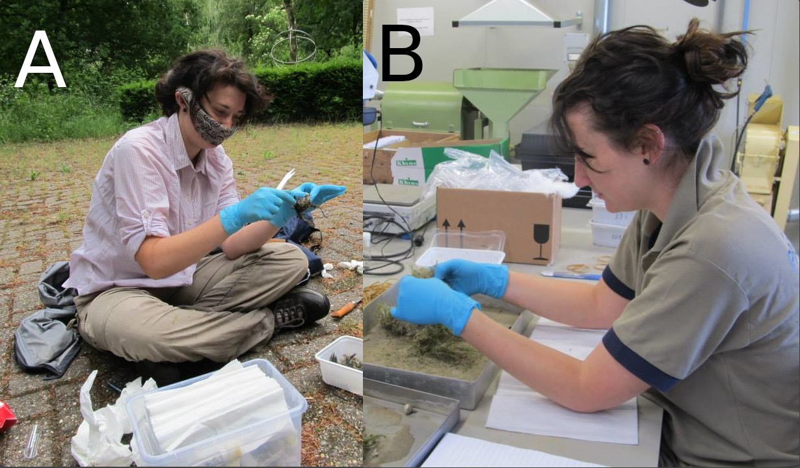
```

Data are sometimes missing due to circumstances outwith the researcher's control, and data are usually not collected in a format that is immediately ready for statistical analysis (e.g., Figure 2.2).
Consequently, we often need to reorganise data from a lab or field book to a spreadsheet on the computer.

```{r, echo = FALSE, fig.alt = "A zoomed-in portion of a lab notebook is shown, which includes handwritten data in pencil observations of mature fig fruits, including date, species, site, tree, and fruit dimensions.", fig.cap = "A portion of a lab notebook used to record measurements of fig fruits from different trees in Baja, Mexico, in 2010.", out.width="100%"}
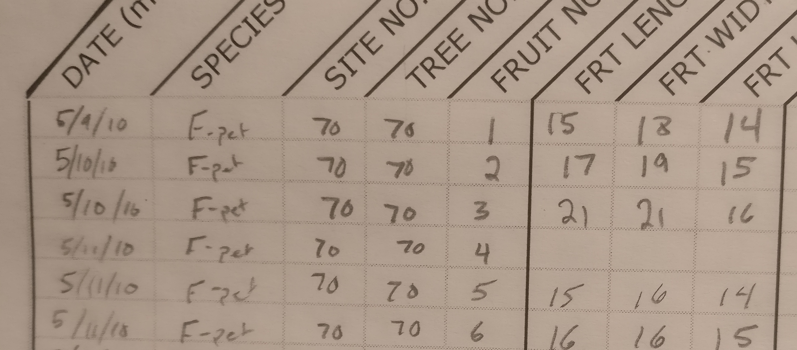
```

Fortunately, there are some generally agreed upon guidelines for formatting data for statistical analysis.
This chapter introduces the tidy format [@Wickham2014], which can be used for structuring data files for statistical software.
This chapter will provide an example of how to put data into a tidy format, and how to save a dataset into a file that can be read and used in statistical software such as jamovi or R [@Jamovi2022; @Rproject].


## Tidy data

After data are collected, they need to be stored digitally (i.e., in a computer file, such as a spreadsheet).
This should happen as soon as possible so that back up copies of the data can be made.
Nevertheless, retaining field and lab notes as a record of the originally collected data is also a good idea.
Sometimes it is necessary to return to these notes, even years after data collection.
Often we will want to double-check to make sure that we copied a value or observation correctly from handwritten notes to a spreadsheet.
Note that sometimes data can be input directly into a spreadsheet or mobile application, bypassing handwritten notes altogether, but it is usually helpful to have a physical copy of collected data.

Most biological and environmental scientists store data digitally in the form of a spreadsheet.
Spreadsheets enable data input, manipulation, and calculation in a highly flexible way.
Most spreadsheet programs even have some capacity for data visualisation and statistical analysis.
For the purposes of statistical analysis, spreadsheets are probably most often used for inputting data in a way that can be used by more powerful statistical software.
Commonly used spreadsheet programs are MS Excel, Google Sheets, LibreOffice Calc.
The interface and functions of these programs are very similar, nearly identical for most purposes.
They can all open and save the same file types (e.g., XLSX, ODS, CSV), and they all have the same overall look, feel, and functionality for data input, so the program used is mostly a matter of personal preference. 
In this text, we will use LibreOffice because it is completely free and open source, and easily available to [download](https://www.libreoffice.org/download/download-libreoffice/) at [http://libreoffice.org](http://libreoffice.org).
Excel and [Google Sheets](https://docs.google.com/spreadsheets) are also completely fine to use.

```{r, echo = FALSE, fig.alt = "A spreadsheet is shown with data collected from different trees being presented with different observations spanning columns and rows.", fig.cap = "A LibreOffice spreadsheet showing data from fig fruits collected in 2010. Each row is a unique sample (fruit), and columns record properties of the fruit.", out.width="100%"}
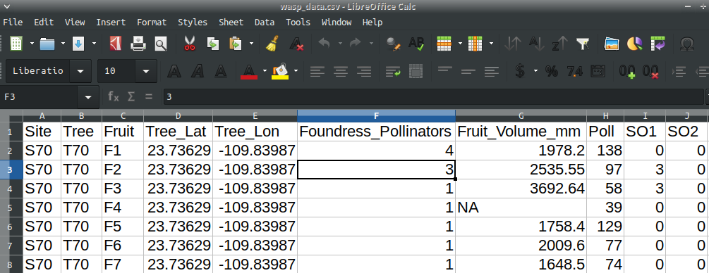
```

Spreadsheets are separated into individual rectangular cells, which are identified by a specific column and row (Figure 2.3).
Columns are indicated by letters, and rows are indicated by numbers.
We can refer to a specific cell by its letter and number combination.
For example, the active cell in Figure 2.3 is F3, which has a value of '3' indicating the value recorded in that specific measurement (in this case, foundress pollinators in the fig fruit).
We will look more at how to interact with the spreadsheet in the [Chapter 3](#Chapter_3) lab practical, but for now we will focus on how the data are organised.

There are a lot of potential ways that data could be organised in a spreadsheet.
For good statistical analysis, there are a few principles that are helpful to follow.
Whenever we collect data, we record observations about different units.
For example, we might make one or more measurements on a tree, a patch of land, or a sample of soil. 
In this case, trees, land patches, or soil samples are our units of **observation**.
Each attribute of a unit that we are measuring is a **variable**.
These variables might include tree heights and leaf lengths, forest cover in a patch of land, or carbon and nitrogen content of a soil sample.
Tidy datasets that can be used in statistical analysis programs are defined by three characteristics [@Wickham2014].

1. Each variable gets its own column.
2. Each observation gets its own row.
3. Different units of observation require different data files.

If, for example, we were to measure the heights and leaf lengths for 4 trees, we might organise the data as in Table 2.1.

| Tree  |  Species     |  Height (m)  |  Leaf length (cm)   |
|-------|--------------|--------------|---------------------|
| 1     |  Oak         |  20.3        |  8.1                | 
| 2     |  Oak         |  25.4        |  9.4                |
| 3     |  Maple       |  18.2        |  12.5               |
| 4     |  Maple       |  16.7        |  11.3               |

Table: Hypothetical tidy dataset in which each column of data is a variable and each row of data is an observational unit (tree).

By convention [@Wickham2014], variables tend to be in the left-most columns if they are known in advance or fixed in some way by the data collection or experiment (e.g., tree number or species in Table 2.1).
In contrast, variables that are actually measured tend to be in the right-most columns (e.g., tree height or leaf length).
This is more for readability of the data; statistical software such as jamovi will not care about the order of data columns.


## Data files

Data can be saved using many different file types.
File type is typically indicated by an extension following the name of a file and a full stop.
For example, "photo.png" would indicate a PNG image file named "photo".
A peer-reviewed journal article might be saved as a PDF, e.g., "Wickham2014.pdf".
A file's type affects what programs can be used to open it.
One relevant distinction to make is between text files and binary files.

**Text files** are generally very simple.
They only allow information to be stored as plain text; no colour, bold, italic, or anything else is encoded.
All of the information is just made up of characters on one or more lines.
This sounds so simple as to be almost obsolete; what is the point of not allowing anything besides plain text?
The point is that text files are generally much more secure for long-term storage.
The plain text format makes data easier to recover if a file is corrupted, readable by a wider range of software, and more amenable to version control ([version control](https://bradduthie.github.io/version_control/vc_notes.html) is a tool that essentially saves the whole history of folder, and potentially different versions of it in parallel; it is not necessary for introductory statistics, but is often critical for big collaborative projects).
There are many types of text files with extensions such as TXT, CSV, HTML, R, CPP, or MD.
For data storage, we will use comma separated value (CSV) files.
As the name implies, CSV files include plain text separated by commas.
Each line of the CSV file is a new row, and commas separate information into columns.
These CSV files can be opened in any text editor, but are also recognised by nearly all spreadsheet programs and statistical software.
The data shown in Figure 2.3 are from a CSV file called "wasp_data.csv".
Figure 2.4 shows the same data when opened with a text editor.

```{r, echo = FALSE, fig.alt = "A plain text file is shown with data collected from different trees being presented with different observations spanning columns and rows.", fig.cap = "A plain text comma-separated value (CSV) file showing data from fig fruits collected in 2010. Each line is a unique row and sample (fruit), and commas separate the data into columns in which the properties of fruit are recorded. The file has been opened in a program called 'Mousepad', but it could also be opened in any text editor such as gedit, Notepad, vim, or emacs. It could also be opened in spreadsheet programs such as LibreOffice Calc, MS Excel, or Google Sheets, or in any number of statistical programs.", out.width="100%"}
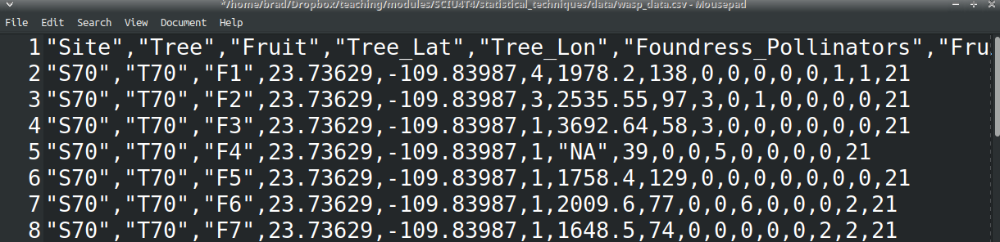
```

The data shown in Figure 2.4 are not easy to read or work with, but the format is highly effective for storage because all of the information is in plain text.
The information will therefore always look *exactly* the same, and can be easily recovered by any text editor, even after years pass and old software inevitably becomes obsolete.

**Binary files** are different from text files and contain information besides just plain text.
This information could include formatted text (e.g., bold, italic), images, sound, or video (basically, anything that can be stored in a file). 
The advantages of being able to store this kind of information are obvious, but the downside is that the information needs to be interpreted in a specific way, usually using a specific program.
Examples of binary files include those with extensions such as DOC, XLS, PNG, GIF, MP3, or PPT.
Some file types such as DOCX are not technically binary files, but a collection of zipped files (which, in the case of DOCX, include plain text files).
Overall, the important point is that saving data in a text file format such as CSV is generally more secure.


## Managing data files

Managing data files (or any files) effectively requires some understanding of how files are organised on a computer or cloud storage.
In mobile phone applications, file organisation is often hidden, so it is not obvious where a file actually goes when it is saved on a device.
Many people find files in these applications using a search function.
The ability to search for files like this, or at least the tendency to do so regularly, is actually a relatively new phenomenon.
And it is an approach to file organisation that does not work quite as well on non-mobile devices (i.e., anything that is not a phone or tablet), especially for big projects.
On laptop and desktop computers, it is really important to know *where* files are being saved, and to ideally have an organisational system that makes it easy to find specific files without having to use a search tool.

On a computer, files are stored in a series of nested folders.
You can think of the storage space on a computer, cloud, or network drive, as a big box.
The big box can contain other smaller boxes (folders, in this analogy), or it can contain items that you need (files, in this analogy).
Figure 2.5 shows the general idea.
On this computer, there is a folder called 'brad', which has inside it 5 other folders (Figure 2.5A). 
Each of the 5 inner folders is used to store more folders and files for a specific module from 2006.
Clicking on the 'Biostatistics' folder leads to the sub-folders inside it, and to files saved specifically for a biostatistics module (e.g., homework assignments, lecture notes, and an exam review document).
Files on a computer therefore have a location that we can find using a particular **path**.
We can write the path name using slashes to indicate nested folders.
For example, the file 'HW9.scx' in Figure 2.5B would have the path name '/home/brad/Spring_2006/Biostatistics/HW9.scx'.
Each folder is contained within slashes, and the file name itself is after the last slash.

```{r, echo = FALSE, fig.alt = "Screenshot showing a directory with five folders of various modules names on the left panel. In the right panel, there is a second screenshot showing the inside of one of the four folders with files and other folders.", fig.cap = "File directory of a computer showing (A) the file organisation of modules taken during spring 2006. Within one folder (B), there are multiple sub-folders and files associated with a biostatistics module.", out.width="100%"}
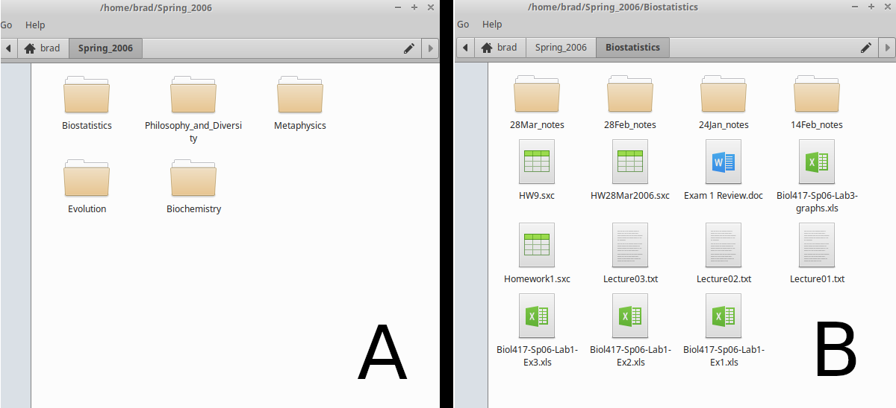
```

These path names might look slightly different depending on the computer operating system that you are using.
But the general idea of files nested within folders is the same. 
Figure 2.6 shows the same folder 'Spring_2006' saved in a different location, on OneDrive.

```{r, echo = FALSE, fig.alt = "Screenshot showing a OneDrive directory with five folders of various modules names on the left panel.", fig.cap = "OneDrive file directory showing the file organisation of modules taken during spring 2006.", out.width="100%"}
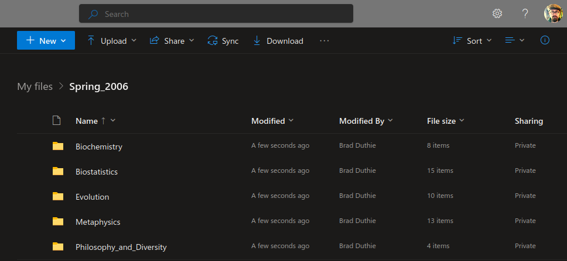
```

Windows has the same general file organisation (Figure 2.7).
Path names for storing files on the hard drive of a Windows computer look something like "C:\\Users\\MyName\\Desktop\\Spring_2006\\Biostatistics\\HW9.scx".
The 'C:\\' is the root directory of the hard drive; it is called 'C' for historical reasons ('A:\\' and 'B:\\' used to be for floppy disks; the 'A:\\' floppy disks had about 1.44 MB of storage, and 'B:\\' had even less, so these are basically obsolete).

```{r, echo = FALSE, fig.alt = "Screenshot showing a Windows directory with five folders of various modules names on the left panel.", fig.cap = "Windows file directory showing the file organisation of modules taken during spring 2006. In this case, the 'Spring\\_2006' folder is located on the desktop; the path to the folder is visible in the toolbar above the folders.", out.width="100%"}
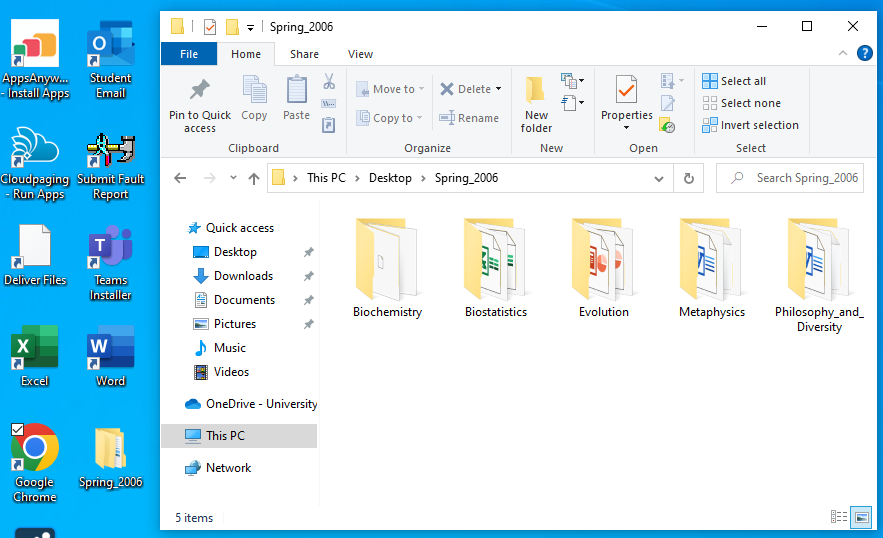
```

The details are not as important as the idea of organising files in a logical way that allows you to know roughly where to find important files on a computer or cloud drive.
It is usually a good idea to give every unique project or subject (e.g., a university module, a student group, holiday plans, health records) its own folder.
This makes it much easier to find related files such as datasets, lecture notes, or assignments when necessary.
It is usually possible to right click somewhere in a directory to create a new folder.
In Figure 2.7, there is even a 'New folder' button in the toolbar with a yellow folder icon above it.
It takes some time to organise files this way, and to get used to saving files in specific locations, but it is well worth it in the long-term.


# Practical: Preparing data {#Chapter_3}

In this practical, we will use a spreadsheet to organise datasets following the tidy approach explained in [Chapter 2](#Chapter_2), then save these datasets as CSV files to be opened in jamovi statistical software [@Jamovi2022].
The data organisation in this lab can be completed using [LibreOffice Calc](https://www.libreoffice.org/discover/calc/), MS Excel, or [Google Sheets](https://docs.google.com/spreadsheets/).
In the computer lab, MS Excel is probably the easiest program to use, either through AppsAnywhere or within a browser.
The screenshots below will mostly be of LibreOffice Calc, but the instructions provided will work on any of the three aforementioned spreadsheet programs.
You can download a DOCX of just the questions [here](https://bradduthie.github.io/SCIU4T4/practical_answers/Week1.docx).

There are 4 data exercises in this practical.
All of these exercises will focus on organising data into a tidy format.
Being able to do this will be essential for later practicals and assessments, and for future modules (especially fourth year dissertation work).
Exercise 1 uses handwritten field data that need to be entered into a spreadsheet in a tidy format.
These data include information shown in Figure 2.2, plus tallies of seed counts.
The goal is to get all of this information into a tidy format and save it as a CSV file.
Exercise 2 presents some data on the number of eggs produced by five different fig wasp species (more on these in [Chapter 8](#Chapter_8)).
The data are in an untidy format, so the goal is to reorganise them and save them as a tidy CSV file.
Exercise 3 presents counts of the same five fig wasp species as in Exercise 2, which need to be reorganised in a tidy format.
Exercise 4 presents data that are even more messy.
These are morphological measurements of the same five species of wasps, including lengths and widths of wasp heads, thoraxes, and abdomens.
The goal in this exercise is to tidy the data, then estimate total wasp volume from the morphological measurements using mathematical formulas, keeping in mind the order of operations from [Chapter 1](#Chapter_1).


## Exercise 1: Transferring data to a spreadsheet

Exercise 1 focuses on data collected from the fruits of fig trees collected from Baja, Mexico in 2010 [@Duthie2015b; @Duthie2016].
Due to the nature of the work, the data needed to be recorded in notebooks and collected in two different locations.
The first location was the field, where data were collected identifying tree locations and fruit dimensions.
Baja is hot and sunny; fruit measurements were made with a ruler and recorded in a field notebook.
These measurements are shown in Figure 2.2, which is reproduced again in Figure 3.1.

```{r, echo = FALSE, fig.alt = "A large tree is shown in the desert with a person dressed in tan clothes in the foreground", fig.cap = "A fully grown Sonoran Desert Rock Fig in the desert of Baja, Mexico.", out.width="100%"}

```


The second location was in a lab in Iowa, USA.
Fruits were dried and shipped to Iowa State University so that seeds could be counted under a microscope.
Counts were originally recorded as tallies in a lab notebook (Figure 3.2).
The goal of Exercise 1 is to get all of this information into a single tidy spreadsheet.

```{r, echo = FALSE, fig.alt = "A zoomed-in portion of a lab notebook is shown, which includes handwritten data in pencil observations of mature fig fruits, including date, species, site, tree, and fruit dimensions.", fig.cap = "A portion of a lab notebook used to record measurements of fig fruits from different trees in 2010.", out.width="100%"}

```

The best place to start is with an empty spreadsheet, so open a new one in LibreOffice Calc, MS Excel, or Google Sheets.
Remember that each row will be a unique observation; in this case, a unique fig fruit from which measurements were recorded. 
Each column will be a variable of that observation.
Fortunately, the data in Figure 3.2 are already looking quite tidy.
The information here can be put into the spreadsheet mostly as written in the notebook.
But there are a few points to keep in mind:

1. It is important to start in column A and row 1; do not leave any empty rows or columns because when we get to the statistical analysis in jamovi, jamovi will assume that these empty rows and columns signify missing data.
2. There is no need to include any formatting (e.g., bold, underline, colour) because it will not be saved in the CSV or recognised by jamovi.
3. Missing information, such as the empty boxes for the fruit dimensions in row 4 in the notebook (Figure 3.2) should be indicated with an '`NA`' (capital letters, but without the quotes). This will let jamovi know that these data are missing.
4. The date is written in an American style of month-day-year, which might get confusing. It might be better to have separate columns for year, month, and day, and to write out the full year (2010).

The column names in Figure 3.2 are (1) Date, (2) Species, (3) Site number, (4) Tree number, (5) Fruit length in mm, (6) Fruit width in mm, and (7) Fruit height in mm.
All of the species are *Ficus petiolaris*, which is abbreviated to "F-pet" in the field notebook.
How you choose to write some of this information down is up to you (e.g., the date format, capitalisation of column names), but when finished, the spreadsheet should be organised like the one in Figure 3.3.

```{r, echo = FALSE, fig.alt = "A screenshot of a spreadsheet with 7 columns and 6 rows of data on fig fruit dimensions.", fig.cap = "A spreadsheet with data organised in a tidy format and nearly ready for analysis.", out.width="100%"}
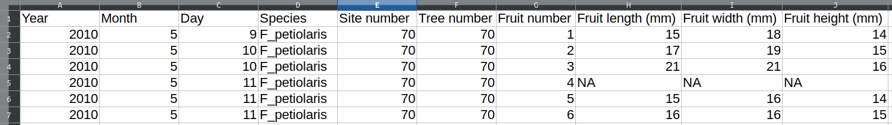
```

This leaves us with the data that had to be collected later in the lab.
Small seeds needed to be meticulously separated from other material in the fig fruit, then tallied under a microscope.
Tallies from this notebook are shown in Figures 3.4 and 3.5.

```{r, echo = FALSE, fig.alt = "A screenshot of a lab notebook with dates and tallies of seed counts from fig fruits 1-4.", fig.cap = "Tallies of seed counts collected from 4 fig fruits in Baja, Mexico in 2010.", out.width="100%"}
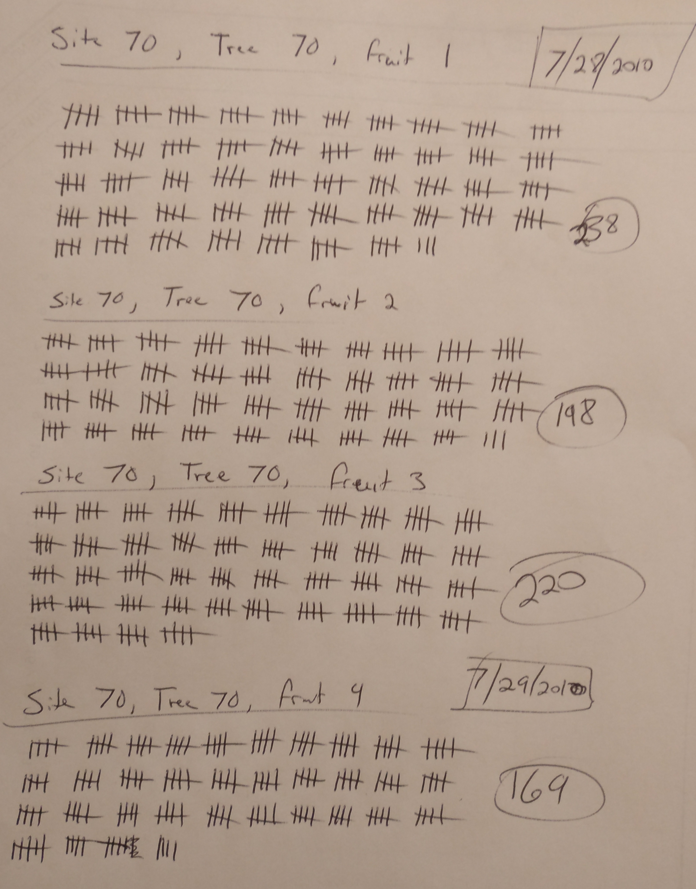
```


```{r, echo = FALSE, fig.alt = "A screenshot of a lab notebook with dates and tallies of seed counts from fig fruits 5-6.", fig.cap = "Tallies of seed counts collected from 2 fig fruits in Baja, Mexico in 2010.", out.width="100%"}
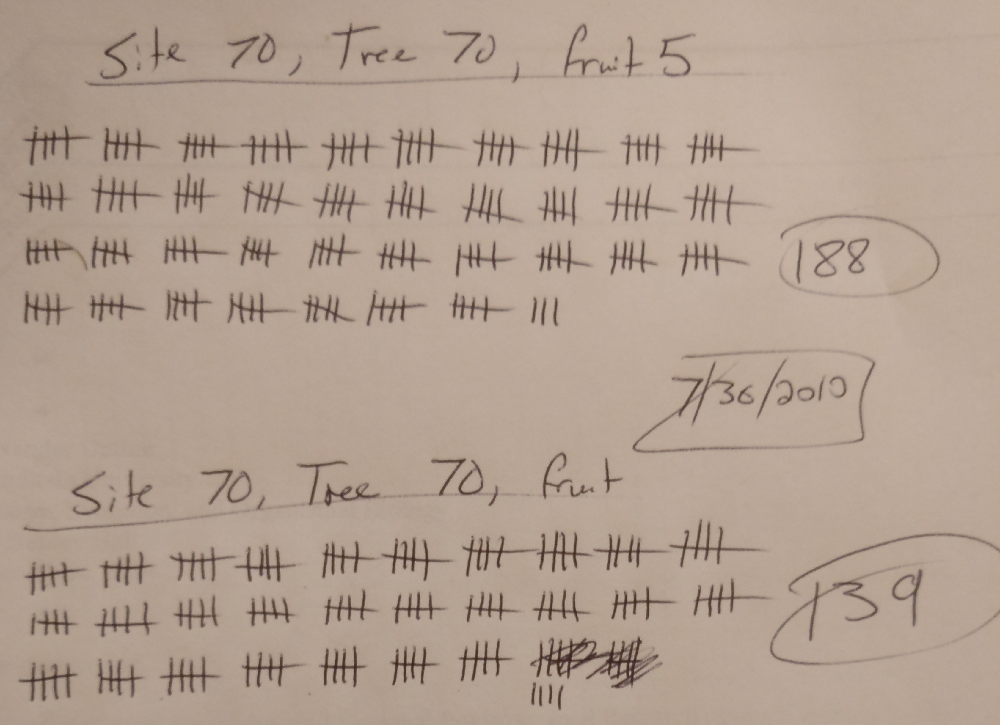
```

Fortunately, the summed tallies have been written and circled in the right margin of the notebook, which makes inputting them into a spreadsheet easier.
But it is important to also recognise this step as a potential source of human error in data collection.
It is possible that the tallies were counted inaccurately, meaning that the tallies on the left do not sum to the numbers in the right margins.
It is always good to be able to go back and check.
There are at least two other potential sources of human error in counting seeds and inputting them into the spreadsheet, one before, and one after counting the tallies.
Fill in 1 and 3 below with potential causes of error.

1. 
2. Tallies are not counted correctly in the lab notebook
3. 

Next, create a new column in the spreadsheet and call it "Seeds" (use column K).
Fill in the seed counts for each of the six rows.
The end result will be a tidy dataset that is ready to be saved as a CSV.

What you do next depends on the spreadsheet program that you are using and how you are using it.
If you are using LibreOffice Calc or MS Excel on a your computer, then you should be able to simply save your file as something like "Fig_fruits.csv", and the program will recognise that you intend to save as a CSV file (in MS Excel, you might need to find the pulldown box for 'Save as type:' under the 'File name:' box and choose 'CSV').
If you are using Google Sheets, you can navigate in the toolbar to `File > Download > Comma-separated values (.csv)`, which will start a download of your spreadsheet in CSV format.
If you are using MS Excel in a browser online, then it is a bit more tedious.
At the time of writing, the online version of MS Excel does not allow users to save or export to a CSV.
It will therefore be necessary to save as an XLSX, then convert to CSV later in another spreadsheet program (either a local version of MS Excel, LibreOffice Calc, or Google Sheets).

Save your file in a location where you know that you can find it again.
It might be a good idea to create a new folder on your computer or your cloud storage online for files in Statistical Techniques.
This will ensure that you always know where your data files are located and can access them easily.


## Exercise 2: Making spreadsheet data tidy

Exercise 2 is more self-guided than Exercise 1.
After reading [Chapter 2](#Chapter_2) and completing Exercise 1, you should have a bit more confidence in organising data in a tidy format.
Here we will work with a dataset that includes counts of the number of eggs collected from fig wasps, which are small species of insects that lay their eggs into the ovules of fig flowers [@Weiblen2002].
You can **download the dataset [here](https://github.com/bradduthie/SCIU4T4/blob/main/data/wasp_egg_loads_untidy.xlsx?raw=true)** (right click and "Save Link As..."), or recreate it from Figure 3.6.

```{r, echo = FALSE, fig.alt = "A screenshot of a spreadsheet that includes 5 columns of labels, below which there are integer numbers. Some text specifies that these numbers are wasp species egg loads.", fig.cap = "An untidy dataset of egg loads from fig wasps of five different species, including two unnamed species of the genus *Heterandrium* (Het1 and Het2) and three unnamed species of the genus *Idarnes* (LO1, SO1, and SO2).", out.width="100%"}
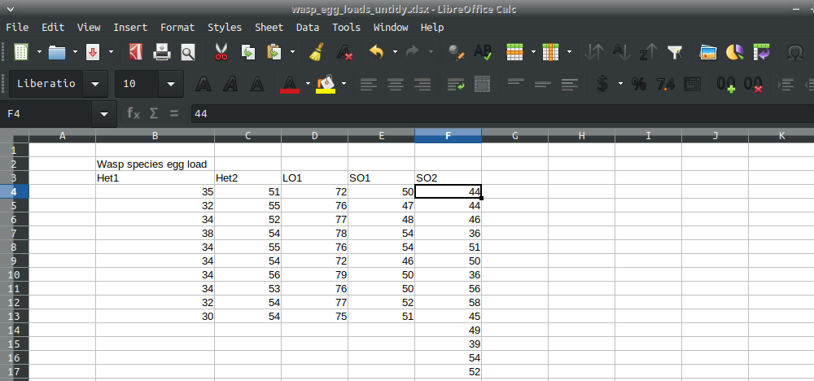;
```

Using what you have learned in [Chapter 2](#Chapter_2) and Exercise 1, create a tidy version of the wasp egg loads dataset.
For a helpful hint, it might be most efficient to open a new spreadsheet and copy and paste information from the old to the new.

How many columns did you need to create the new dataset? _________

Are there any missing data in this dataset? _________

Save the tidy dataset to a CSV file.
It might be a good idea to check with classmates and an instructor to confirm that the dataset is in the correct format.


## Exercise 3: Making data tidy again

Exercise 3, like Exercise 2, is self-guided.
The data are presented in a fairly common, but untidy, format, and the challenge is to reorganise them into a tidy dataset that is ready for statistical analysis.
Table 3.1 shows the number of different species of wasps counted in 5 different fig fruits.
Rows list all of the species and columns list the fruits, with the counts in the middle.
This is an efficient way to present the data so that they are all easy to see, but this will not work for running statistical analysis.


```{r, echo = FALSE}
wasps_cross_table <- read.csv("data/wasps_cross_table.csv");
knitr::kable(wasps_cross_table, format = "simple", table.envir = "table",
             caption = "An efficient but untidy way to present count data. Counts of different species of fig wasps (rows) are from 5 different fig fruits (columns). Data were originally collected from Baja, Mexico in 2010.");
```

This exercise might be a bit more challenging than Exercise 2.
The goal is to use the above information to create a tidy dataset.
Remember that each observation (wasp counts, in this case) should get its own row, and each variable should get its own column.
Try creating a tidy dataset from the information in Table 3.1, then save the dataset to a CSV file.
As with Exercise 2, it might be good to confer with classmates and an instructor to confirm that the dataset is in the correct format and will work for statistical analysis.


## Exercise 4: Tidy data and spreadsheet calculations

Exercise 4 requires some restructuring and calculations.
The dataset that will be used in this exercise includes morphological measurements from five species of fig wasps, the same species used in Exercise 2.
**Download this dataset from the file [wasp_morphology_untidy.xlsx](https://github.com/bradduthie/SCIU4T4/blob/main/data/wasp_morphology_untidy.xlsx?raw=true) (XLSX file) or [wasp_morphology_untidy.ods](https://github.com/bradduthie/SCIU4T4/blob/main/data/wasp_morphology_untidy.ods?raw=true) (ODS open-source file).**
Both files contain identical information, so which one you use is a matter of personal preference.
This dataset is about as untidy as it gets. 
First note that there are multiple sheets in the spreadsheet, which is not allowed in a tidy CSV file.
You can see these sheets by looking at the very bottom of the spreadsheet, which will have separating tabs called Het1, Het2, LO1, SO1, and SO2 (Figure 3.7).

```{r, echo = FALSE, fig.alt = "A screenshot the tabs found at the bottom of a spreadsheet.", fig.cap = "Spreadsheets can include multiple sheets. This image shows that the spreadsheet containing information for fig wasp morphology includes five separate sheets, one for each species.", out.width="100%"}
;
```

You can click on all of the different tabs to see the measurements of head length, head width, thorax length, thorax width, abdomen length, and abdomen width for wasps of each of the 5 species.
All of the measurements are collected in millimeters.
Note that the individual sheets contain text formatting (titles highlighted, and in bold), and there is a picture of each wasp in its respective sheet.
The formatting and pictures are a nice touch for providing some context, but they cannot be used in statistical analysis.
The first task is to create a tidy version of this dataset.
Probably the best way to do this is to create a new spreadsheet entirely and copy-paste information from the old.
It is good idea to think about how the tidy dataset will look before getting started.
What columns should this new dataset include? Write your answer below.

```


```

How many rows are needed? _________________


When you are ready, create the new dataset.
Your dataset should have all of the relevant information about wasp head, thorax, and abdomen measurements.
It should look something like Figure 3.8.

```{r, echo = FALSE, fig.alt = "A screenshot of a spreadsheet with wasp morphological measurements for 5 species.", fig.cap = "A tidy dataset of wasp morphological measurements from 5 species of fig wasps collected from Baja, Mexico in 2010.", out.width="100%"}
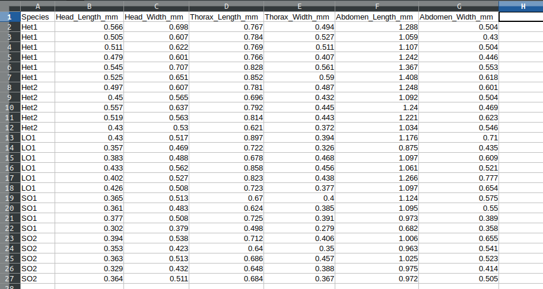;
```


Next comes a slightly more challenging part, which will make use of some of the background mathematics reviewed in [Chapter 1](#Chapter_1).
Suppose that we wanted our new dataset to include information about the volumes of each of the three wasp body segments, and wasp total volume.
To do this, let us assume that the wasp head is a sphere (it is not, exactly, but this is probably the best estimate that we can get under the circumstances).
Calculate the head volume of each wasp using the following formula,

$$V_{head} = \frac{4}{3}\pi \left(\frac{Head_L + Head_W}{4}\right)^{3}.$$

In the equation above, $Head_{L}$ is head length (mm) and $Head_{W}$ is head width (note, $(Head_L + Head_W)/4$ estimates the radius of the head).
You can replace $\pi$ with the approximation $\pi \approx 3.14$.
To make this calculation in your spreadsheet, find the cell in which you want to put the head volume.
By typing in the `=` sign, the spreadsheet will know to start a new calculation or function in that cell.
Try this with an empty cell by typing "`= 5 + 4`" in it (without quotes). 
When you hit 'Enter', the spreadsheet will make the calculation for you, and the number in the new cell will be 9.
To see the equation again, you just need to double-click on the cell.

To get an estimate of head volume into the dataset, we can create a new column of data.
To calculate $V_{head}$ for the first wasp in row 2 of Figure 3.8, we could select the spreadsheet cell H2 and type the code, `=(4/3)*(3.14)*((B2+C2)/4)^3`. 
Notice that the code recognises `B2` and `C2` as spreadsheet cells, and takes the values from these cells when doing these calculations.
If the values of `B2` or `C2` were to change, then so would the calculated value in H2.
Also notice that we are using parentheses to make sure that the order of operations is correct. 
We want to add head length and width before dividing by 4, so we type `((B2+C2)/4)` to ensure with the innermost parentheses that head length and width are added before dividing.
Once all of this is completed, we raise everything in parentheses to the third power using the `^3`, so `((B2+C2)/4)^3`.
Different mathematical operations can be carried out using the symbols in Table 3.2.

| Symbol   | Operation                  |
|----------|----------------------------|
| `+`      | Addition                   |
| `-`      | Subtraction                |
| `*`      | Multiplication             |
| `/`      | Division                   |
| `^`      | Exponent                   |
| `sqrt()` | Square-root                |

Table: List of mathematical operations available in a spreadsheet.

The last operation in Table 3.2 is a function that takes the square-root of anything within the parentheses.
Other functions are also available that can make calculations across cells (e.g., `=SUM` or `=AVERAGE`), but we will ignore these for now.

Once head volume is calculated for the first wasp in cell H2, it is very easy to do the rest.
One nice feature of a spreadsheet is that it can usually recognise when the cells need to change (B2 and C2, in this case).
To get the rest of the head volumes, we just need to select the bottom right of the H2 cell. 
There will be a very small square in this bottom right (see Figure 3.9), and if we drag it down, the spreadsheet will do the same calculation for each row (e.g., in H3, it will use B3 and C3 in the formula rather than B2 and C2).

```{r, echo = FALSE, fig.alt = "A screenshot of a spreadsheet with the H2 cell selected.", fig.cap = "A dataset of wasp morphological measurements from 5 species of fig wasps collected from Baja, Mexico in 2010. Head volume (column H) has been calculated for row 2, and to calculate it for the remaining rows, the small black square in the bottom right of the highlighted cell H2 can be clicked and dragged down to H27.", out.width="100%"}
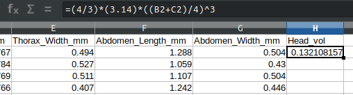;
```

Another way to achieve the same result is to copy (Ctrl + C) the contents of cell H2, highlight cells H3-H27, then paste (Ctrl + V).
However you do it, you should now have a new column of calculated head volume.

Next, suppose that we want to calculate thorax and abdomen volumes for all wasps.
Unlike wasp heads, wasp thoraxes and abdomens are clearly not spheres.
But it is perhaps not entirely unreasonable to model them as ellipses.
To calculate wasp thorax and abdomen volumes assuming an ellipse, we can use the formula,

$$V_{thorax} = \frac{4}{3}\pi \left(\frac{Thorax_{L}}{2}\right)\left(\frac{Thorax_{W}}{2}\right)^{2}.$$
In the equation above, $Thorax_{L}$ is thorax length (mm) and $Thorax_{W}$ is thorax width. 
Substitute $Abdomen_{L}$ and $Abdomen_{W}$ to instead calculate abdomen volume ($V_{abdomen}$).
What formula will you type into your empty spreadsheet cell to calculate $V_{thorax}$? Keep in mind the order of operations indicated in the equation above.

```


```


Now fill in the columns for thorax volume and abdomen volume.
You should now have 3 new columns of data from calculations of the volumes of the head, thorax, and abdomen of each wasp.
Lastly, add 1 final column of data for total volume, which is the sum of the 3 segments.

There are a lot of potential sources of error and uncertainty in these final volumes.
What are some reasons that we might want to be cautious about our calculated wasp volumes?
Explain in 2-3 sentences.

```


```

Save your wasp morphology file as a CSV.
This was the last exercise of the practical. 
You should now be comfortable formatting tidy datasets for use in statistical software.
Next week, we will begin using jamovi to do some descriptive statistics and plotting.

## Summary 

Completing this practical should give you the skills that you need to prepare datasets for statistical analysis.
There are many additional features of spreadsheets that were not introduced (mainly because we will do them in jamovi), but could be useful to learn.
For example, if we wanted to calculate the sum of all head lengths, we could use the function `=sum(B2:B27)` in any spreadsheet cell (where B2 is the head length of the first wasp, and B27 is the head length of the last wasp).
Other functions such as `=count()`, `=min()`, `=max()`, or `=average()` can be similarly used for calculations.
If you have time at the end of the lab, we recommend exploring the spreadsheet interface and seeing what you can do.


