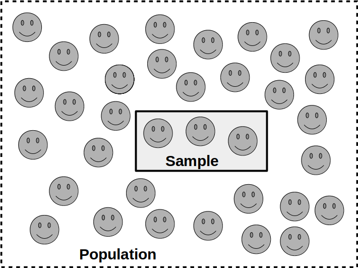
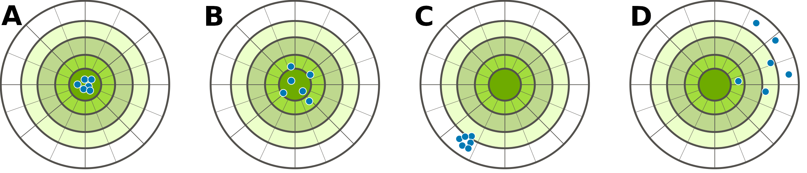
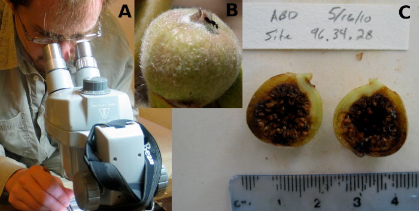
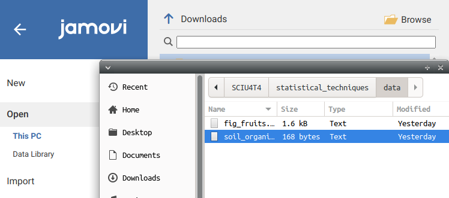
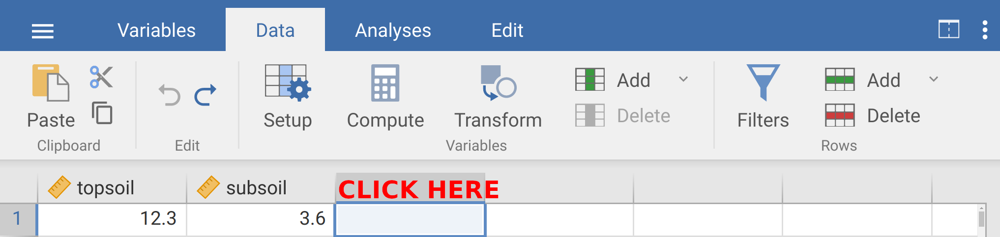
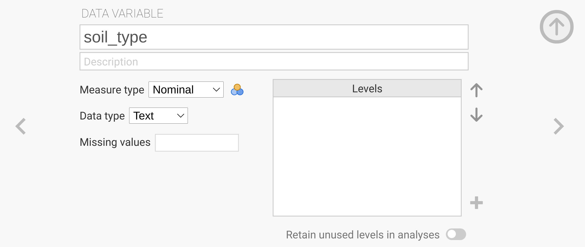
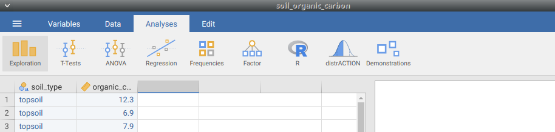
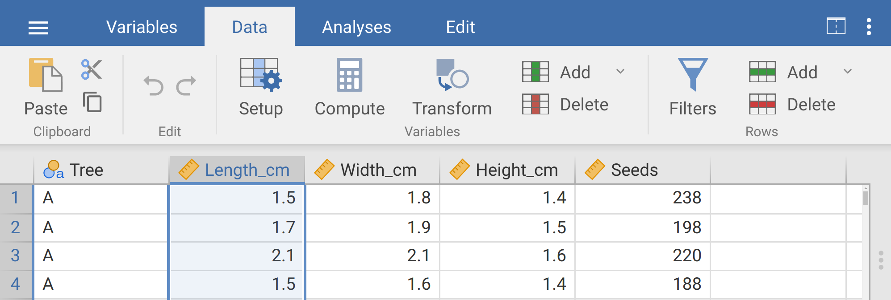
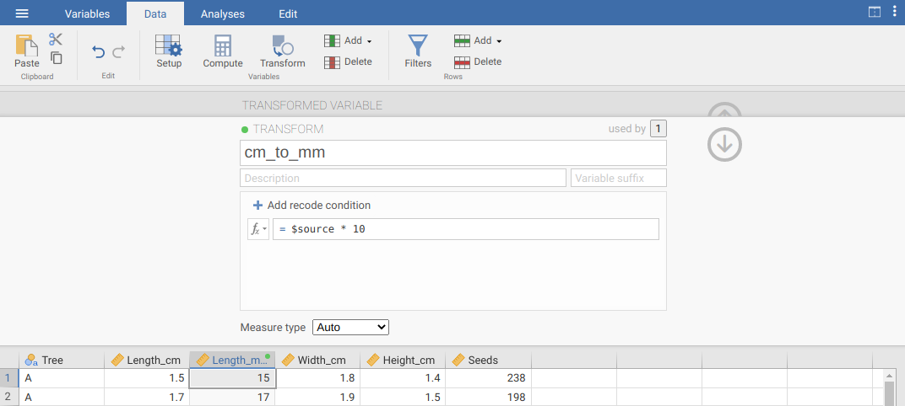
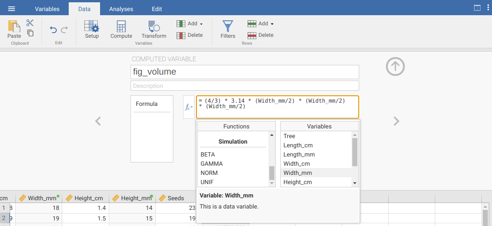

---
output:
  pdf_document: default
  html_document: default
---

# (PART) Statistical concepts {-}

# Week 2 Overview {-}

|                 |                                   |
|-----------------|-----------------------------------|
| **Dates**       | 30 January 2022 - 3 February 2022 |
| **Reading**     | **Required:** SCIU4T4 Workbook chapters 4-8  |
|                 | **Recommended:** @Navarro2022 [Section 3.3](https://davidfoxcroft.github.io/lsj-book/getting-started-with-jamovi.html#the-spreadsheet)-[3.9](https://davidfoxcroft.github.io/lsj-book/getting-started-with-jamovi.html#summary-1) |
|                 | **Optional:** @Rowntree2018 Chapter 2 |
|                 | **Advanced:** @Spiegelhalter2019 Chapters 1-3 |
| **Lectures**    | 2.0: Introduction to Week 1 (2 min.) |
|                 | 2.1: Why study statistics? (18 min.) |
|                 | 2.2: Populations and samples (7 min.) |
|                 | 2.3: Types of variables (11 min.) |
|                 | 2.4: Units, precision, and accuracy (9 min.) |
|                 | 2.5. Uncertainty propagation (11 min.) |
| **Practical**   | Introduction to Jamovi          |
| **Assessments** | Week 2 Practice quiz on Canvas  |

In [Chapter 4](#Chapter_4), we focus on key concepts that will be used throughout this module.
In particular, it is important to understand the difference between a **population** and a **sample**, and to recognise that there are many types of variables in statistics.

In [Chapter 5](#Chapter_5), we look at different variable types. Different types of variables have different characteristics, which will affect how these variables are best visualised in figures and analysed with statistical hypothesis tests introduced later in the semester.
Identifying variable types will therefore be important, both for module assessments and when working with new datasets.
A variable's type will rarely be stated explicitly when doing scientific research, and will not always be provided in assessments for this module.
Being able to infer variable type is therefore an importat skill.

[Chapter 6](#Chapter_6) focus on units of measurement, and how these units are communicated in text.
Units are essential in scientific measurement, and we will use them throughout the module to indicate the type and scale of data measurement.
We are not expecting you to memorise all scientific units, so a [table on units](#appendixA_units) is provided at the end of this workbook.

[Chapter 7](#Chapter_7) will introduce the propogation of measurement errors.
This is important to understand because no measurement is perfectly accurate, and predicting how errors in measurement combine is fundamental to understanding measurement accuracy.

Finally, [Chapter 8](#Chapter_8) guides you through the Week 2 practical, which is an introduction to Jamovi.
This aim of this practical is to become familiar with the Jamovi interface and comfortable importing data into Jamovi to collect some descriptive statistics.

# Populations and samples {#Chapter_4}

When we collect data, we are recording some kind of observation or measurement.
If we are working in a forest, for example, we might want to measure the heights of different trees, or measure the concentration of carbon in the soil.
The idea might be to use these measurements to make some kind of inference about the forest.
But as scientists, we are almost always limited in the amount of data that we can collect.
We cannot measure everything, so we need to collect a *sample* of data and use it to make inferences about the *population* of interest.
For example, while we probably cannot measure the height of every tree in a forest, nor can we measure the concentration of carbon at every possible location in the forest's soil, we can collect a smaller number of measurements and still make useful conclusions about overall forest trees and carbon concentration.

Statistics thereby allows us to approximate properties of entire populations from a limited number of samples.
This needs to be done with caution, but before getting into the details of how, it is important to understand the difference between a **population** and a **sample** to avoid confusing these two concepts. 
A **population** is the entire set of possible observations that could be collected.
Some examples will make it easier to understand:

* All of the genes in the human genome
* All individuals of voting age in Scotland
* All common pipistrelle bats in the United Kingdom

These populations might be important for a particular research question.
For example, we might want to know something about the feeding behaviours of pipistrelle bats in the UK.
But there is no way that we can find and observe the behaviour of every bat, so we need to take a subset of the population (a sample) instead.
Examples of samples include the following:

* A selection of 20 human genes
* A pub full of Scottish voters
* 40 caught common pipistrelle bats

It is important to recognise that the word "population" means something slightly different in statistics than it does in biology.
A biological population, for example, could be defined as all of the individuals of the same species in the same general location.
A statistical population, in contrast, refers to a set of observations (i.e., things that we can measure). 
@Sokal1995 provide a more technical definition for "population",

> In statistics, population always means the *totality of individual observations about which inferences are to be made, existing anywhere in the world or at least within a definitely specified sampling area limited in space and time* [p. 9, emphasis theirs].

They define a sample to be "a collection of individual observations selected by a specified procedure" [@Sokal1995].
For our purposes, it is not necessary to be able to recite the technical definitions, but it is important to understand the relationship between a population and a sample.
When we collect data, we are almost always taking a small sample of observations from a much larger number of possible observations in a population.

```{r, echo = FALSE, fig.alt = "A conceptual figure illustrating how a statistical population relates to a statistical sample. The population is represented by 35 smiling faces enclosed within a dashed box. The sample is represented by a solid box within the dashed box, within which there are 3 smiling faces. Hence, we have a sample of 3 measurements from the total population.", fig.cap = "A conceptual figure illustrating how a statistical population relates to a statistical sample. The population is represented by 35 smiling faces enclosed within a dashed box. The sample is represented by a solid box within the dashed box, within which there are 3 smiling faces. Hence, we have a sample of 3 measurements from the total population.", out.width="100%"}

```

# Types of variables {#Chapter_5}

A variable is any property that is measured in an observation [@Sokal1995]; i.e., anything that varies among things that we can measure [@Dytham2011].
We can summarise how these measurements vary with summary statistics, or visually with figures.
Often, we will want to predict one variable from a second variable.
In this case, the variable that we want to predict is called the **response variable**, also known as the **dependent variable** or **Y** variable ('dependent' because it *depends* on other variables, and 'Y' because this is the letter we often use to represent it).
The variable that we use to predict our response variable is the **explanatory variable**, also known as the **independent variable** or **X** variable ('independent' because it does not depend on other variables, and 'X' because this is the letter most often used to represent it).
There are several different types of variables:

* **Categorical** variables take on a fixed number of discrete values [@Spiegelhalter2019]. 
In other words, the measurement that we record will assign our data to a specific category. 
Examples of categorical variables include species (e.g., "Robin", "Nightingale", "Wren") or life history stage (e.g., "egg", "juvenile", "adult"). 
Categorical variables can be either nominal or ordinal.

  * **Nominal** variables do not have any inherent order (e.g., classifying land as "forest", "grassland", or "urban").
  * **Ordinal** variables do have an inherent order (e.g., "low", "medium", and "high" elevation).
  
* **Quantitative** variables are variables represented by numbers that reflect a magnitude.
That is, unlike categorical variables, we are collecting numbers that really mean something tangible (in contrast, while we might represent low, medium, and high elevations with the numbers 1, 2, and 3, respectively, this is just for convenience; a value of '2' does not always mean 'medium').
Categorical variables can be either discrete or continuous.

  * **Discrete** variables can take only certain values.
  For example, if we want to record the number of species in a forest, then our variable can only take discrete counts (i.e., integer values).
  There could conceivably be any whole number of species (1, 2, 3, etc.), but there could not be 2.51 different species in a forest; that does not make sense.
  
  * **Continuous** variables can take any real value within some range of values (i.e., any number that can be represented by a decimal).
  For example, we could measure height to as many decimals as our measuring device will allow, with a range of values from zero to the maximum possible height of whatever it is we are measuring.
  Similarly, we could measure temperature to any number of decimals, at least in theory, so temperature is a continuous variable.

The reason for organising variables into all of these different types is that different types of variables need to be handled in different ways.
For example, it would not make sense to visualise a nominal variable in the same way as a continuous variable.
Similarly, the choice of statistical test to apply to answer a statistical question will almost always depend on the types of variables involved.
If presented with a new data set, it is therefore very important to be able to interpret the different variables and apply the correct statistical techniques (this will be part of the assessment for this module).


# Accuracy, precision, and units {#Chapter_6}

The science of measurements is called "metrology", which, among other topics, focuses on measurement accuracy, precision, and units [@Rabinovich2013].
We will not discuss these topics in depth, but they are important for statistical techniques because measurement, in the broadest sense of the word, is the foundation of data collection.
When collecting data, we want measurements to be accurate, precise, and clearly defined.

## Accuracy

When we collect data, we are trying to obtain information about the world.
We might, for example, want to know the number of seedlings in an area of forest, them temperature of the soil at a location, or the mass of a particular animal in the field.
To get this information, we need to make measurements.
Some measurements can be collected by simple observation (e.g., counting seedlings), while others will require measuring devices such as a thermometer (for measuring temperature) or scale (for measuring mass).
All of these measurements are subject to error.
The *true* value of whatever it is that we are trying to measure (called the "measurand") can differ from what we record when collecting data.
This is true even for simple observations (e.g., we might miscount seedlings), so it is important to recognise that the data we collect comes with some uncertainty.
The **accuracy** of a measurement is defined by how close the measurement is to the *true* value of what we are trying to measure [@Rabinovich2013].

## Precision

The **precision** of a measurement is how consistent it will be if measurement is replicated multiple times.
In other words, precision describes how similar measurements are expected to be.
If, for example, a scale measures an object to be the exact same mass ever time it is weighed (regardless of whether the mass is accurate), then the measurement is highly precise.
If, however, the scale measures a different mass each time the object is weighed (for this hypothetical, assume that the true mass of the object does not change), then the measurement is not as precise.

One way to visualise the difference between accuracy and precision is to imagine a set of targets, with the centre of the target representing the true value of what we are trying to measure (Figure 6.1)[^1]. 

```{r, echo = FALSE, fig.alt = "Four targets, A, B, C, and D, are shown side-by-side, wach with five points scatter on top of them. Points in A are close together and near the centre, points in B are far apart but around the center, points in C are close together but away from the centre, and points in D are far apart and away from the centre.", fig.cap = "A conceptual figure illustrating the difference between accuracy and precision. Points in (A) are both accurate and precise, points in (B) are accurate, but not precise, points in (C) are precise but not accurate, and points in (D) are neither accurate nor precise.", out.width="100%"}

```

Note again that accuracy and precision are not necessarily the same. 
Measurement can be accurate but not precise (Figure 6.1B) or precise but not accurate (Figure 6.1C).

[^1]: This figure was released into the public domain by [Egon Willighagen](https://commons.wikimedia.org/wiki/File:Accuracy-vs-precision-nl.svg) on 8 March 2014.

## Systems of units

Scientific units are standardised with the Syst&egrave;me International D'Unit&eacute;s (SI).
Having standardised units of measurement is highly important to ensure measurement accuracy [@Quinn1995].
Originally, these units were often defined in terms of physical artefacts.
For example, the kilogram (kg) was once defined by physical cylinder metal housed in the Buereau International des Poids et Mesures (BIPM).
In other words, the mass of a metal sitting at the BIPM *defined* what a kg was, with the mass of every other measurement being based on this physical object [@Quinn1995].
This can potentially present a problem if the mass of that one object changes over time, thereby causing a change in how a kg is defined.
Where possible, it is therefore preferable to define units in terms of fundamental constants of nature.
In 2019, for example, the kg was redefined in terms of the Planck constant, a specific atomic transition frequency, and the speed of light [@Stock2019].
This ensures that measurements of mass remain accurate over time because what a kg represents in terms of mass cannot change.

We can separate units into base units and derived units.
Table 6.1 below lists some common base units for convenience [@Quinn1995].
You do not need to memorise these units, but it is good to be familiar with them.
We will use these units throughout the module.

| **Measured Quantity**       | **Name of SI unit** | Symbol   |
|-----------------------------|---------------------|----------|
| Mass                        | kilogram            | $kg$     |
| Length                      | metre               | $m$      |
| Time                        | second              | $s$      |
| Electric current            | ampere              | $A$      |
| Temperature                 | kelvin              | $K$      |
| Amount of a substance       | mole                | $mol$    |
| Luminous intensity          | candela             | $cd$     |

Table: Base units of SI measurements. For details see @Quinn1995. 

We can also define derived SI units from the base units of Table 6.1; examples of these derived SI units are provided in Table 6.2 below. 
Again, you do not need to memorise these units, but it is good to be aware of them.

| **Measured Quantity** | **Name of unit** | **Symbol** | **Definition in SI units** | **Alternative in derived units** |
|-----------------------|------------------|------------|----------------------------|----------------------------------|
| Energy        | Joule     | $J$  | $m^{2}$ $kg$ $s^{-2}$  | $N$ $m$      |
| Force         | Newton    | $N$  | $m$ $kg$ $s^{-2}$      | $J$ $m^{-1}$ |
| Pressure      | Pascal    | $Pa$ | $kg$ $m^{-1}$ $s^{-2}$ | $N$ $m^{-2}$ |
| Power         | Watt      | $W$  | $m^{-2}$ $kg$ $s^{-3}$ | $J$ $s^{-1}$ |
| Frequency     | Hertz     | $Hz$ | $s^{-1}$               |              |
| Radioactivity | Becquerel | $Bq$ | $s^{-1}$               |              |

Table: Examples of derived SI units.

When numbers are associated with units, it is important to recognise that the units must be carried through and combined when calculating equation.
As a very simple example, if want to know the speed at which an object is moving, and we find that it has moved 10 metres in 20 seconds, then we calculate the speed and report the correct units as below,

$$speed = \frac{10\:m}{20\:s} = 0.5\:m/s = 0.5\:m\:s^{-1}.$$
Notice that the final units are in metres per second, which can be written as $m/s$ or $m\:s^{-1}$ (remember that raising $s$ to the $-1$ power is the same as $1/s$; see below for a quick reminder about superscripts).
It is a common error to calculate just the numeric components of a calculation and ignore the associated units.
Often on assessments, we will ask you not to include units in your answer (this is just for convenience on the tests and exam), but recognising that units are also part of calculations is important.

## Other examples of units

Remember that an exponent (indicated by a superscript, e.g., the 3 in $m^{3}$) indicates the number of times to multiply a base by itself, so $m^{3} = m \times m \times m$.

### Units of density

Density ($\rho$) is calculated by,

$$\rho = \frac{mass}{volume} = \frac{kg}{m^{3}}.$$

The units of density are therefore mass per unit volume, $kg\:m^{-3}$.

### Mass of metal discharged from a catchment

The mass of metal carried by a stream per unit time ($M$) is given by multiplying the concentration of metal per unit volume ($C$) of water by the volume of water discharged per unit time ($V$),

$$M = C \times V.$$
This equation is useful in showing how units can cancel each other out.
If we calculate the above with just the units (ignoring numbers for $C$ and $V$),

$$M = \frac{mg}{l} \times \frac{l}{s} = \frac{mg}{s}.$$

Notice above how the $l$ units on the top and bottom of the equation cancel each other out, so we are left with just $mg/s$.

### Soil carbon inventories

For one final example, the inventory of carbon $I$ within a soil is given by the specific carbon concentration $C$ ($g$ of carbon per $kg$ of soil), multiplied by the depth of soil analysed ($D$, $m$), and by the density ($\rho$, $kg\:m^{-3}$),

$$I = C \times D \times \rho = \frac{g\times m \times kg}{kg \times m^{3}} = \frac{g}{m^{2}} = g\:m^{-2}.$$
Notice above how the $kg$ on the top and bottom of the fraction cancel each other out, and how one $m$ on the top cancels out one $m$ on the bottom, so that what we are left with is grams per metre squared ($g\:m^{-2}$).

# Uncertainty propogation {#Chapter_7}

Nothing can be measured with perfect accuracy, meaning that every measurement has some associated error.
The measurement error might be caused by random noise in the measuring environment, or by mistakes made by the person doing the measuring.
The measurement error might also be caused by limitations or imperfections associated with a measuring device.
The device might be limited in its measurement precision, or perhaps it is biased in its measurements due to improper calibration, manufacture, or damage from previous use.
All of this generates uncertainty with respect to individual measurements.

Recall from [Chapter 6](#Chapter_6) the difference between precision and accuracy.
We can evaluate the precision and accuracy of measurements in different ways.
Measurement precision can be estimated by replicating a measurement (i.e., taking the same measurement over and over again).
The more replicate measurements made, the more precisely a value can be estimated. 
For example, if we wanted to evaluate the precision with which the mass of an object is measured, then we might repeat the measurement with the same scale multiple times and see how much mass changes across different measurements.
To evaluate measurement accuracy, we might need to measure a value in multiple different ways (e.g., with different measuring devices).
For example, we might repeat the measurement of an object's mass with a different scale.

Sometimes it is necessary to combine different values.
For example, we might measure the mass of 2 different bird eggs in a nest, then calculate the total mass of all the 2 eggs combined.
The measurement of each egg will have its own error, and these errors will propagate to determine the error of the total egg mass for the nest.
How this error propagates differs depending on if they are being added or subtracted, or if they are being multiplied or divided.

## Adding or subtracting errors

In the case of our egg masses, we can assign the mass of the first egg to the variable $X$ and the mass of the second egg to the variable $Y$.
We can assign the total mass to the variable $Z$, where $Z = X + Y$.
The errors associated with the variables $X$, $Y$, and $Z$ can be indicated by $E_{X}$, $E_{Y}$, and $E_{Z}$, respectively.
In general, if the variable $Z$ is calculated by adding (or subtracting) 2 or more values together, then this is the formula for calculating $E_{Z}$, 

$$E_{Z} = \sqrt{E^{2}_{X} + E^{2}_{Y}}.$$

Hence, for the egg masses, the error of the combined masses () equals the square root of the error associated with the mass of egg 1 squared ($E^{2}_{X}$) plus the error associated with the mass of egg 2 squared ($E^{2}_{Y}$).
It often helps to provide a concrete example. 
If the error associated with the measurement of egg 1 is $E^{2}_{X} = 2$, and the error associated with the measurement of egg 2 is $E^{2}_{X} = 3$, then we can calculate,

$$E_{Z} = \sqrt{2^{2} + 3^{2}} \approx 3.61.$$

## Multiplying or dividing errors

Multiplying or dividing errors works a bit differently.
As an example, suppose that we need to measure the total area of a rectangular field.
If we measure the length ($L$) and width ($W$) of the field, then the total area is the product of these measurements, $A = L \times W$.
Again, there is going to be error associated with the measurement of both length ($E_{L}$) and width ($E_{W}$).
How the error of the total area ($E_{A}$) is propagated by $E_{L}$ and $E_{W}$ is determined by the formula,

$$E_{A} = A \sqrt{\left(\frac{E_{L}}{L} \right)^{2} + \left(\frac{E_{W}}{W} \right)^{2}}.$$
Notice that just knowing the error of each measurement ($E_{L}$ and $E_{W}$) is no longer sufficient to calculate the error associated with the measurement of the total area.
We also need to know $L$, $W$, and $A$.
If our field has a length of $L = 20$ m and width of $W = 10$, then $A = 20 \times 10 = 200$. 
If length and width measurements have associated errors of $E_{L} = 2$ m $E_{W} = 1$ m, then,

$$E_{A} = 200 \sqrt{\left(\frac{2}{20} \right)^{2} + \left(\frac{1}{10} \right)^{2}} \approx 28.3.$$
Of course, not every set of measurements with errors to be multiplied with be lengths and widths.
To avoid confusion, the general formula for multiplying or dividing errors is below, with the variables $L$, $W$, and $A$ replaced with $X$, $Y$, and $Z$, respectively, to match the case of addition and subtraction explained above,

$$E_{Z} = Z \sqrt{\left(\frac{E_{X}}{X} \right)^{2} + \left(\frac{E_{Y}}{Y} \right)^{2}}.$$

Note that the structure of the equation is the exact same, just with different letters used as variables.
**It is necessary to be able to apply these equations correctly to estimate combined error.**

## Applying formulas for combining errors

It is not necessary to understand why the equations for propagating different types of errors are different, but a derivation is provided in [Appendix B](#uncertainty_derivation) for the curious.


# _Practical_. Introduction to Jamovi {#Chapter_8}

This practical focuses on learning how to work with datasets in Jamovi.
Jamovi is available in the university laboratory computers through AppsAnywhere.
You can also [download it](https://www.jamovi.org/download.html) on your own computer for free or run it directly [from a browser](https://www.jamovi.org/cloud.html).
For an introduction to what Jamovi is and why we are using it in this module, see [Section 0.5](#intro_jamovi) of this workbook and [Sections 3.3](https://davidfoxcroft.github.io/lsj-book/getting-started-with-jamovi.html#the-spreadsheet)-[3.9](https://davidfoxcroft.github.io/lsj-book/getting-started-with-jamovi.html#summary-1) of @Navarro2022.
In this module, we will work with two datasets, both of which are based on real biological and environmental studies conducted by researchers at the University of Stirling.

The first dataset includes measurements of soil organic carbon (grams of Carbon per kg of soil) from the topsoil and subsoil collected in a national park in Gabon.
These data were collected by Dr Carmen Rosa Medina-Carmona in an effort to understand how [pyrogenic carbon](https://bg.copernicus.org/articles/3/397/2006/bg-3-397-2006.pdf) (i.e., carbon produced by the charring of biomass during a fire) is stored in different landscape areas [@Santin2016; @Preston2006].
**Download these data here: [soil_organic_carbon.csv](https://raw.githubusercontent.com/bradduthie/statistical_techniques/main/data/soil_organic_carbon.csv)**

The second dataset includes measurements of figs from trees of the Sonoran Desert Rock Fig (*Ficus petiolaris*) in Baja, Mexico.
These data were collected by Dr Brad Duthie in an effort to understand coexistence in a fig wasp community [@Duthie2015b; @Duthie2016].
Measurements include fig lengths, widths, and heights in centimeters from 4 different fig trees, and the number of seeds in each fruit.
**Download these data here: [fig_fruits.csv](https://raw.githubusercontent.com/bradduthie/statistical_techniques/main/data/fig_fruits.csv)**

```{r, echo = FALSE, fig.alt = "Three images showing the process of collecting data for the dimensions of figs from trees of the Sonoran Desert Rock Fig in Baja, Mexico. Panel A shows a person staring into a microscope in field attire, panel B shows a picture of a wild fig with a fig wasp sitting on top of it, and panel C shows a sliced open fig with seeds along the inside; below the fig is a ruler and above it is a pencil description of the site and date from which the fig was collected.", fig.cap = "Three images showing the process of collecting data for the dimensions of figs from trees of the Sonoran Desert Rock Fig in Baja, Mexico. (A) Processing fig fruits, which included measuring the diameter of figs along three diferent axes of length, width, and height, (B) a fig still attached to a tree with a fig wasp on top of it, and (C) a sliced open fig with seeds along the inside of it.", out.width="100%"}

```

This lab will use the [soil organic carbon](https://raw.githubusercontent.com/bradduthie/statistical_techniques/main/data/soil_organic_carbon.csv) dataset in [Exercise 8.1](#02_summary_statistics) for summary statistics.
The [fig fruits](https://raw.githubusercontent.com/bradduthie/statistical_techniques/main/data/fig_fruits.csv) will be used for [Exercise 8.2](#02_transforming_variables) on transforming variables and [Exercise 8.3](#02_computing_variables) on computing a variable.

```{r, echo = FALSE}
fig_fruits          <- read.csv(file = "data/fig_fruits.csv");
soil_organic_carbon <- read.csv(file = "data/soil_organic_carbon.csv");
```

## Exercise for summary statistics {#summary_statistics_02}

Download the [soil organic carbon](https://raw.githubusercontent.com/bradduthie/statistical_techniques/main/data/soil_organic_carbon.csv) dataset if you have not already done so, and save it in a location where you know you will be able to find it again, then open Jamovi.
Once Jamovi is open, you can import the dataset by clicking on the three lines in the upper left corner of the tool bar, then selecting 'Open' (Figure 8.2).

```{r, echo = FALSE, fig.alt = "The Jamovi toolbar including tabs for opening files represented by three horizontal lines, Variables, Data, Analyses, and Edit.", fig.cap = "The Jamovi toolbar including tabs for opening files, Variables, Data, Analyses, and Edit. To open a file, select the three horizontal lines in the upper right", out.width="100%"}

```

You might need to click 'Browse' in the upper right of Jamovi to find the file. 
Figure 8.3 below shows how this will look when you browse for a data file.

```{r, echo = FALSE, fig.alt = "The Jamovi interface for opening a file with the 'Import' tab selected, 'Downloads' and 'Browse' options at the top of the toolbar, and a separate window that includes two files that can be selected.", fig.cap = "The Jamovi interface for opening a file with the 'Import' tab selected. Options for browsing to a file on the computer are available in the upper right, which opens the window in the foreground.", out.width="100%"}

```

Once the data are imported, you should see two separate columns. 
The first column will show soil organic carbon values for topsoil samples, and the second column will show soil organic carbon values for subsoil samples.
Notice right away that these data are not formatted in a tidy way.
We need to fix this so that each row is a unique sample, and each column represents some property of the sample (see the previous chapter section on [data organisation](#data_organisation) for a reminder of why).
It might be easiest to reorganise the data in a spreadsheet such as LibreOffice Calc or Microsoft Excel.
But you can also edit the directly in Jamovi by clicking on the 'Data' tab in the toolbar (see Figure 8.2).
The best way to reorganise the data in Jamovi is to double-click on the third column of data next to 'subsoil' (see Figure 8.4).

```{r, echo = FALSE, fig.alt = "The Jamovi toolbar is shown with data columns for topsoil and subsoil. In the third column from the right, there is text that says 'Click Here' in red.", fig.cap = "The Jamovi toolbar is shown with the soil organic carbon dataset. In Jamovi, double-clicking above column three where it says 'CLICK HERE' will allow you to input a new variable.", out.width="100%"}

```

After double-clicking on the location shown in Figure 8.4, there will be three buttons visible.
You can click the 'New Data Variable' to insert a new variable named 'soil_type' in place of the default name 'C'.
Keep the 'Measure type' as 'Nominal', but change the 'Data type' to 'text'.
When you are done, click the `>` character to the right so that the variable is fixed (Figure 8.5).

```{r, echo = FALSE, fig.alt = "The Jamovi toolbar is shown with a box open to insert a new variable. The 'Data Variable' name is 'soil_type', and pulldown boxes indicate that 'Measure type' is set to 'Nominal' and 'Data type' is set to 'Text'. The mouse pointer is hovering over an arrow that says 'Next Variable'.", fig.cap = "The Jamovi toolbar is shown with the input for creating a new data variable. The new variable added is to indicate the soil type (topsoil or subsoil), so it needs to be a nominal variable with a data type of text.", out.width="100%"}

```

After typing in the new variable 'soil_type', add another variable called 'organic_carbon'.
The organic_carbon variable should have a measure type of 'Continuous' and a data type of 'Decimal'.
After both soil_type and organic_carbon variables have been set, you can click the up arrow with the upper right circle (Figure 8.5) to get the new variable window out of the way.

With the two new variables created, we can now rearrange the data in a tidy way.
The first 19 rows of soil_type should be 'topsoil', and the remaining 15 rows should be 'subsoil'.
To do this quickly, you can write 'topsoil' in the first row of soil_type and copy-paste into the remaining rows.
You can do the same to write 'subsoil' in the remaining rows 20-34.
Next, copy all of the topsoil values in column 1 into the first 19 rows of column 4, and copy all of the subsoil values in column 2 into the next 15 rows.
After doing all of this, you column 3 (soil_type) should have the word 'topsoil' in rows 1-19 and 'subsoil' in rows 20-34.
The values from columns 1 and 2 should now fill rows 1-34 of column 4.
You can now delete the first column of data by right clicking on the column name 'topsoil' and selecting 'Delete Variable'.
Do the same for the second column 'subsoil'.
Now you should have a tidy data set with two columns of data, one called 'soil_type' and one called 'organic_carbon'.
You are now ready to calculate some descriptive statistics from the data.

First, we can calculate the minimum, maximum, and mean of all of the organic carbon values.
To do this, select the 'Analyses' tab, then click on the left-most button called 'Exploration' in the toolbar (Figure 8.6).

```{r, echo = FALSE, fig.alt = "The Jamovi toolbar is shown with a tab called 'Analyses' selected. Underneath the Analyses tab, there are several buttons, and the 'Exploration' button is highlighted. Below the exploration button are the first three rows of soil organic carbon data.", fig.cap = "The Jamovi toolbar where the tab 'Analyses' can be selected at the very top. Below this tab, the button 'Exploration' can be clicked to calculate descriptive statistics.", out.width="100%"}

```

After clicking on 'Exploration', a pull-down box will appear with an option for 'Descriptives'.
Select this option, and you will see a new window with our two columns of data in the left-most box.
Click once on the 'organic_carbon' variable and use the right arrow to move it into the 'Variables' box.
In the right-most panel of Jamovi, a table called 'Descriptives' will appear, which will include values for the organic carbon mean, minimum, and maximum.
Write these values on the lines below, and remember to include units.

Mean:  ____________________________

Minimum:  ____________________________

Maximum:  ____________________________


These values might be useful, but recall that there are two different soil types that need to be considered, topsoil and subsoil.
The mean, minimum, and maximum above pools both of these soil types together, but we might instead want to know the mean, minimum, and maximum values for topsoil and subsoil separately.
Splitting organic carbon by soil types is straightforward in Jamovi.
To do it, go back to the Exploration $\to$ Descriptives option and again put 'organic_carbon' in the Variables box.
This time, however, notice the 'Split by' box below the Variables box.
Now, click on 'soil_type' in the descriptives and click on the lower right arrow to move soil type into the 'Split by' box.
The table of descriptives in the right window will now break down all of the summary statistics by soil type.
First, write the mean, minimum, and maximum topsoil values below.

Mean:  ____________________________

Minimum:  ____________________________

Maximum:  ____________________________

Next, do the same for the mean, minimum, and maximum subsoil values.

Mean:  ____________________________

Minimum:  ____________________________

Maximum:  ____________________________


From the values above, the mean of organic carbon sampled from the topsoil appears to be greater than the mean of organic carbon sampled from the subsoil.
Assuming that Jamovi has calculated the means correctly, we can be confident that the topsoil sample mean is higher.
But what about the *population* means?
Think back to concepts of populations versus samples from [Chapter 4](#Chapter_4).
Based on these samples in the dataset, can we really say for certain that the population mean of topsoil is higher than the population mean of subsoil?
Think about this, then write a sentence below about how confident we can be about concluding that topsoil organic carbon is greater than subsoil organic carbon.

```


```


What would make you more (or less) confident that topsoil and subsoil population means are different?
Think about this, then write another sentence below that answers the question.

```


```

Note that there is no right or wrong answer for the above two questions.
The entire point of the questions is to help you reflect on your own learning and better link the concepts of populations and samples to the real dataset in this practical.
Doing this will make the statistical hypothesis testing that comes later in the module more clear.


## Exercise on transforming variables {#transforming_variables_02}

In this next exercise, we will work with the [fig fruits](https://raw.githubusercontent.com/bradduthie/statistical_techniques/main/data/fig_fruits.csv) dataset.
Open this dataset into Jamovi.
Note that there are five columns of data, and all of the data appear to be in a tidy format.
Each row represents a separate fig fruit, while each column represents a measured variable associated with the fruit.
The first several rows should look like the below.

```{r, echo = FALSE}
print(head(fig_fruits));
```


The dataset includes the tree from which the fig was sampled in column 1 (A, B, C, and D), then the length, width, and heights of the fig in cm.
Finally, the last column shows how many seeds were counted within the fig.
Use the Descriptives option in Jamovi to find the overall (i.e., not split by Tree) mean length, width, and height of figs in the dataset.
Write these means down below (remember the units).

Mean length:  ____________________________

Mean height:  ____________________________

Mean width:  ____________________________


Now look at the different rows in the Descriptives table of Jamovi. 
Note that there is a row for 'Missing', and there appears to be one missing value for fig width and fig height.
This is very common in real datasets.
Sometimes practical limitations in the field prevent data from being collected, or something happens that causes data to be lost.
We therefore need to be able to work with datasets that have missing data.
For now, we will just note the missing data and find them in the actual data set.
Go back to the 'Data' tab in Jamovi and find the figs with a missing width and height value.
Report the rows of these missing values below.

Missing width row: ____________________________

Missing height row: ____________________________

Next, we will go back to working with the actual data.
Note that the length, width, and height variables are all recorded in cm to a single decimal place.
Suppose we want to transform these variables so that they are represented in mm instead of cm.
We will start by creating a new column 'Length_mm' by transforming the existing 'Length_cm' column.
To do this, click on the 'Data' tab at the top of the toolbar again, then click on the 'Length_cm' column name to highlight the entire column.
Your screen should look like the image in Figure 8.7.

```{r, echo = FALSE, fig.alt = "The Jamovi toolbar is shown with a tab called 'Data' selected. Underneath the Data tab, there are several buttons, including 'Setup', 'Compute', and 'Transform'. Below these buttons, four columns of data are shown, with the focal column length in cm highlighted.", fig.cap = "The Jamovi toolbar where the tab 'Data' is selected. The length (cm) column is highlighted and will be transformed by clicking on the Transform button in the toolbar above", out.width="100%"}

```

With the 'Length_cm' column highlighted, click on the 'Transform' button in the toolbar. 
Two things happen next.
First, a new column appears in the dataset that looks identical to 'Length_cm'; ignore this for now.
Second, a box appears below the toolbar allowing us to type in a new name for the transformed variable.
We can call this variable 'Length_mm'.
Below, note the first pulldown menu 'Source variable'. 
The source value should be 'Length_cm', so we can leave this alone.
The second pulldown menu 'using transform' will need to change.
To change the transform from 'None', click the arrow and select 'Create New Transform' from the pulldown.
A new box will pop up allowing us to name the transformation.
It does not matter what we call it (e.g., 'cm_to_mm' is fine).
Note that there are 10 mm in 1 cm, so to convert from cm to mm, we need to multiply the values of 'Length_cm' by 10.
We can do this by appending a `* 10` to the lower box of the transform window, so that it reads `= $source * 10` (Figure 8.8).

```{r, echo = FALSE, fig.alt = "The Jamovi toolbar is shown with a tab called 'Data' selected. Underneath is a box called 'Transform', where the name 'cm to mm' has been typed in. Underneath the box is the code to multiply the column by 10, and below the code is the fig fruits dataset.", fig.cap = "The Jamovi toolbar where the tab 'Data' is selected. The box below shows the transform, which has been named 'cm to mm'. The transformation occurs by multiplying the source (Length mm) by 10. The dataset underneath shows the first few rows with the transformed column highlighted (note that the new 'Length mm' column is 10 times the length column.", out.width="100%"}

```

When we are finished, we can click the down arrow inside the circle in the upper right to get rid of the transform window, then the up arrow inside the circle in the upper right to get rid of the transformed variable window. 
Now we have a new column called 'Length_mm', in which values are 10 times greater than they are in the adjacent 'Length_cm' column, and therefore represent fig length in mm.
If we want to, we can always change the transformation by double-clicking the 'Length_mm' column.
For now, apply the same transformation to fig width and height, so we have three new columns of length, width, and height all measured in mm (note, if you want to, you can use the saved transformation 'cm_to_mm' that you used to transform length, saving some time).
At the end of this, you should have eight columns of data, including three new columns that you just created by transforming the existing columns of Length_cm, Width_cm, and Height_cm into the new columns Length_mm, Width_mm, and Height_mm.
Find the means of these three new columns and write them below.

Mean length:  ____________________________

Mean height:  ____________________________

Mean width:  ____________________________

Compare these means to the means calculated above in cm. 
Do the differences between means in cm and the means in mm make sense?


## Exercise on computing variables {#computing_variables_02}

In this last exercise, we will compute a new variable 'fig_volume'.
Because of the way that the dimensions of the fig were measured in the field, we need to make some simplifying assumptions when calculating volume.
We will assume that fig fruits are perfect spheres, and that the radius of each fig is half of its measured width (i.e., 'Width_mm / 2').
This is obviously not ideal, but sometimes practical limitations in the field make it necessary to make these kinds of simplifying assumptions.
In this case, how might assuming that figs are perfectly spherical affect the accuracy of our estimated fig volume?
Write a sentence of reflection on this question below, drawing from what you have learned this week about accuracy and precision of measurements.

```


```

Now we are ready to make our calculation of fig volume.
The formula for the volume of a sphere ($V$) given its radius $r$ is,

$$V = \frac{4}{3} \pi r^{3}.$$

In words, sphere volume equals four thirds times $\pi$, times $r$ cubed (i.e., to the third power).
If this equation is confusing, remember that $\pi$ is approximately 3.14, and taking $r$ to the third power means that we are multiplying $r$ by itself 3 times. 
We could therefore rewrite the equation above,

$$V = \frac{4}{3} \times 3.14 \times r \times r \times r.$$

This is the formula that we can use to create our new column of data for fig volume.
To do this, click on the first empty column of the dataset, just to the right of the 'Seeds' column header.
You will see a pull down option in Jamovi with 3 options, one of which is 'NEW COMPUTED VARIABLE'.
This is the option that we want.
We need to name this new variable, so we can call it 'fig_volume'.
Next, we need to type in the formula for calculating volume. 
First, in the small box next to the $f_{x}$, type in the (4/3) multiplied by 3.14 as below.

```
= (4/3) * 3.14 *
```


Next, we need to multiply by the variable 'Width_mm' divided by 2 (to get the radius), three times. We can do this by clicking on the $f_{x}$ box to the left. 
Two new boxes will appear; the first is named 'Functions', and the second is named 'Variables'. 
Ignore the functions box for now, and find 'Width_mm' in the list of variables. 
Double click on this to put it into the formula, then divide it by 2. 
You can repeat this two more times to complete the computed variable as shown in Figure 8.9.

```{r, echo = FALSE, fig.alt = "The Jamovi toolbar is shown with a tab called 'Data' selected. Underneath is a box called 'COMPUTED VARIABLE', where the name 'fig volume' has been typed in. Underneath the box is the code for the volume of a sphere and below the code is the fig fruits dataset.", fig.cap = "The Jamovi toolbar where the tab 'Data' is selected. The box below shows the new computed variable 'fig volume', which has been created by calculating the product of 4/3, 3.14, and Width mm three times.", out.width="100%"}

```

Note that we can get the cube of 'Width_mm' more concisely by using the carrot character (`^`). 
That is, we would get the same answer shown in Figure 8.9 if we instead typed the below in the function box.

```
= (4/3) * 3.14 * (Width_mm/2)^3
```

Note that the order of operations is important here, which is why there are parentheses around `Width_mm/2`. This calculation needs to be done before taking the value to the power of 3. If we instead had written, `Width_mm/2^3`, the Jamovi would first take the cube of 2 $(2 \times 2 \times 2 = 8)$, then divided `Width_mm` by this value giving a different and incorrect answer. When in doubt, it is always useful to use parentheses to specify what calculations should be done first.

You now have the new column of data 'fig_volume'. 
Remember that the calculations underlying this new variable need to be done for the units. 
The width of the fig was calculated in mm, but we have taken width to the power of 3 when calculating the volume. 
In the spaces below, find the overall mean, minimum, and maximum volumes of figs and report them in the correct units.

Mean:  ____________________________

Minimum:  ____________________________

Maximum:  ____________________________


Finally, it would be good to plot these newly calculated fig volume data.
These data are continuous, so we can use a histogram to visualise the fig volume distribution. 
To make a histogram, go to the Exploration $\to$ Descriptives window in Jamovi (the same place where you found the mean, minimum, and maximum). 
Now, look on the lower left-hand side of the window and find the pulldown menu for 'Plots'. 
Click 'Plots', and you should see several different plotting options. 
Check the option for 'Histogram' and see the new histogram plotted in the window to the right. 
Draw a rough sketch of the histogram in the area below.

```


```


