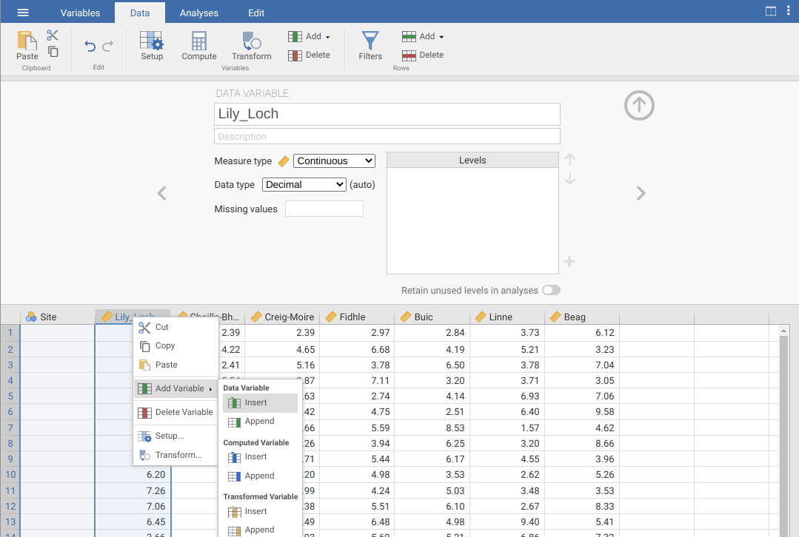
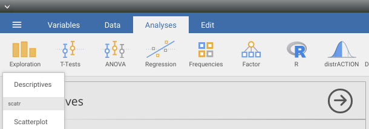
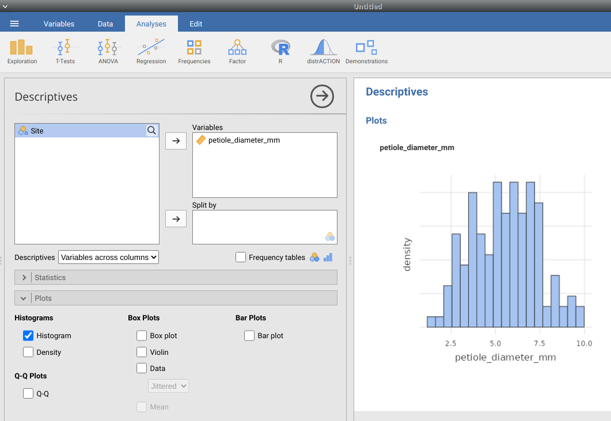
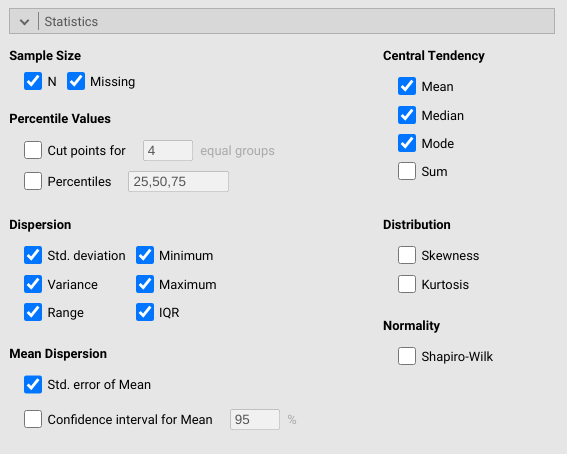

---
output:
  word_document: default
  html_document: default
---

# (PART) Summary statistics {-}

# Week 3 Overview {-#Week3}

|                 |                                   |
|-----------------|-----------------------------------|
| **Dates**       | 6 February 2023 - 10 February 2023 |
| **Reading**     | **Required:** SCIU4T4 Workbook chapters 9-12  |
|                 | **Recommended:** @Navarro2022 [Chapter 5](https://davidfoxcroft.github.io/lsj-book/05-Drawing-graphs.html) and [Chapter 4.1](https://davidfoxcroft.github.io/lsj-book/04-Descriptive-statistics.html#measures-of-central-tendency) |
|                 | **Suggested:** @Rowntree2018 Chapter 3 |
|                 | **Advanced:** None
| **Lectures**    | 3.0: Decimal places and significant figures part 1 (7:52 min; [Video](https://stirling.cloud.panopto.eu/Panopto/Pages/Viewer.aspx?id=05e7e5ee-65a5-4b78-bd46-af8200d9170b)) |
|                 | 3.1: Decimal places and significant figures part 2 (7:08 min; [Video](https://stirling.cloud.panopto.eu/Panopto/Pages/Viewer.aspx?id=f4513530-0bd2-4886-8338-af8200d91727)) |
|                 | 3.2: Graphs (10:29 min; [Video](https://stirling.cloud.panopto.eu/Panopto/Pages/Viewer.aspx?id=35638c1d-0ee7-404d-97fd-af8200d91874)) |
|                 | 3.3: Box-whisker plots (8:07 min; [Video](https://stirling.cloud.panopto.eu/Panopto/Pages/Viewer.aspx?id=6b8eb060-b936-42ad-a4db-af8200d91892)) |
|                 | 3.4: The mean (16:52 min; [Video](https://stirling.cloud.panopto.eu/Panopto/Pages/Viewer.aspx?id=f47d8358-b4b6-44ed-8352-af8200d9177c)) |
|                 | 3.5: The mode (6:54 min; [Video](https://stirling.cloud.panopto.eu/Panopto/Pages/Viewer.aspx?id=999ba5dd-0f42-45f3-9152-af8200d91795)) |
|                 | 3.6: The median and quantiles (8:04 min; [Video](https://stirling.cloud.panopto.eu/Panopto/Pages/Viewer.aspx?id=72ef44f4-0d1f-4f24-9d96-af8200d917eb)) |
|                 | 3.7: Mean, mode, median, and resistance (8:35 min; [Video](https://stirling.cloud.panopto.eu/Panopto/Pages/Viewer.aspx?id=a43b6799-040c-4699-9864-af8200d91809)) |
|                 | 3.8: The variance (9:40 min; [Video](https://stirling.cloud.panopto.eu/Panopto/Pages/Viewer.aspx?id=b7f26e80-a40d-45d4-b4ab-af8200d918fe)) |
|                 | 3.9: The standard deviation (6:17  min; [Video](https://stirling.cloud.panopto.eu/Panopto/Pages/Viewer.aspx?id=db70798b-16fa-4164-839b-af8200d91919)) |
|                 | 3.10: The standard deviation (7:46  min; [Video](https://stirling.cloud.panopto.eu/Panopto/Pages/Viewer.aspx?id=9aec6aa5-9e3a-40f6-92f4-af8200d91979)) |
|                 | 3.11: The standard deviation (13:23  min; [Video](https://stirling.cloud.panopto.eu/Panopto/Pages/Viewer.aspx?id=9c7a11df-7182-4f69-b986-af8200d91994)) |
| **Practical**   | Plotting and statistical summaries ([Chapter 13](#Chapter_13))       |
|                 |   Room: Cottrell 2A17         |
|                 |   Group A: 08 FEB 2023 (WED) 13:05-15:55 |
|                 |   Group B: 09 FEB 2023 (THU) 09:05-11:55 |
| **Help hours**  | Ian Jones                       |
|                 |   Room: Cottrell 1A13           |
|                 |   10 FEB 2023 (FRI) 15:05-17:55 |
| **Assessments** | [Week 3 Practice quiz](https://canvas.stir.ac.uk/courses/13075/quizzes/29674) on Canvas  |

Week 3 focuses on descriptive statistics, how to report them, interpret them, and communicate them with graphs.

[Chapter 9](#Chapter_9) focuses on how to report numbers with accuracy and precision.
In practice, this means reporting values with the correct number of digits (decimal places and significant figures), and rounding appropriately.

[Chapter 10](#Chapter_10) introduces different types of graphs for communicating data visually. 
The chapter focuses specifically on histograms, pie charts, barplots, and box-whisker plots.

[Chapter 11](#Chapter_11) introduces measures of central tendency.
These are measures that describe the centre of the data using a single number.
Measures of central tendency in this chapter include the mean, the mode, the median, and quantiles.

[Chapter 12](#Chapter_12) introduces on measures of spread.
In contrast to measures of central tendency, which focus on the centre of a dataset, measures of spread focus on how much the data are spread out.
Measures of spread in this chapter in clude the range, the inter-quartile range, the variance, the standard deviation, the coefficient of variation, and the standard error.

[Chapter 13](#Chapter_13) guides you through the week 3 practical. 
The aim of this practical is to learn how to use Jamovi to generate plots introduced in [Chapter 10](#Chapter_10), and to find measures of central tendency and spread introduced in [Chapter 11](#Chapter_11) and [Chapter 12](#Chapter_12), respectively, and report them accurately using the knowledge from [Chapter 9](#Chapter_9).


# Decimal places, significant figures, and rounding {#Chapter_9}

When making calculations, it is important that any numbers reported are communicated with [accuracy and precision](#Chapter_6). 
This means reporting numbers with the correct number of digits.
This chapter focuses on correctly interpreting the decimal places and significant figures of a number, and correctly rounding.
In your assessments, you will frequently be asked to report an answer to a specific number of decimal places or significant figures, and you will be expected to round numbers correctly.

## Decimal places and significant figures

A higher number of digits communicates a greater level of accuracy.
For example, the number 2.718 expresses a higher precision than 2.7 does.
Reporting 2.718 implies that we know the value is somewhere between 2.7175 and 2.1785, but reporting 2.7 only implies that we know the value is somewhere between 2.65 and 2.75 [@Sokal1995].
These numbers therefore have a different number of *decimal places* and a different number of *significant figures*.
Decimal places and significant figures are related, but not the same.

**Decimal places** are conceptually easier to understand. These are just the number of digits to the right of the decimal point. For example, 2.718 has 3 decimal places, and 2.7 has 1 decimal place.

**Significant figures** are a bit more challenging. 
These are the number of digits that you need to infer the accuracy of a value. 
For example, the number 2.718 has 4 significant figures and 2.7 has 2 significant figures. This sounds straightforward, but it can get confusing when numbers start or end with zeros. 
For example, the number 0.045 has only 2 significant figures because the first two zeros only serve as placeholders (note that if this were a measurement of 0.045 m, then we could express the exact same value as 45 mm, so the zeros are not really necessary to indicate measurement accuracy). 
In contrast, the measurement 0.045000 has 5 significant figures because the last 3 zeros indicate a higher degree of accuracy than just 0.045 would (i.e., we know the value is somewhere between 0.44995 and 0.45005, not just 0.0445 and 0.0455). 
Lastly, the measurement 4500 has only 2 significant figures because the last 2 zeros are only serving as a placeholder to indicate magnitude, not accuracy (if we wanted to represent 4500 with 4 significant figures, we could use scientific notation and express it as $4.500 \times 10^3$).

Here is a table with some examples of numbers, their decimal places, and their significant figures. 

| Number     |  Decimal places   |  Significant figures  |
|------------|-------------------|-----------------------|
| 3.14159    | 5                 | 6                     |
| 0.0333     | 4                 | 3                     |
| 1250       | 0                 | 3                     |
| 50000.0    | 1                 | 6                     |
| 0.12       | 2                 | 2                     |
| 1000000    | 0                 | 1                     |

Table: Numbers are presented in rows of the first column. Decimal places and significant figures for each row number are presented in the second and third column, respectively.

It is a good idea to double-check that the values in these tables make sense.
For assessments, make sure that you are confident that you can report your answer to a given number of decimal places or significant figures.

## Rounding

Often if you are asked to report a number to a specific number of decimals or significant figures, you will need to round the number. 
Rounding reduces the number of significant digits in a number, which might be necessary if a number that we calculate has more significant digits than we are justified in expressing.
There are different rules for rounding numbers, but in this module, we will follow @Sokal1995.
When rounding to the nearest decimal, the last decimal written should not be changed if the number that immediately follows is 0, 1, 2, 3, or 4. 
If the number that immediately follows is 5, 6, 7, 8, or 9, then the last decimal written should be increased by 1.

For example, if we wanted to round the number 3.141593 to 2 significant digits, then we would write it as 3.1 because the digit that immediately follows (i.e., the third digit) is 4.
If we wanted to round the number to 5 significant digits, then we would write it as 3.1416 because the digit that immediately follows is 9.
And if we wanted to round 3.141593 to 4 significant digits, then we would write it as 3.142 because the digit that immediately follows is 5. 
Note that this does not just apply for decimals.
If we wanted to round 1253 to 3 significant figures, then we would round by writing it as 1250.

Here is a table with some examples of numbers rounded to a given significant figure.

| Original number   | Significant figures  | Rounded number  |
|-------------------|----------------------|-----------------|
| 23.2439           | 4                    | 23.24           |
| 10.235            | 4                    | 10.24           |
| 102.39            | 2                    | 100             |
| 5.3955            | 3                    | 5.40            |
| 37.449            | 3                    | 37.4            |
| 0.00345           | 2                    | 0.0035          |

Table: Numbers to be rounded are presented in rows of the first column. The significant figures to which rounding is desired is in the second column, and the third column shows the correctly rounded number.

In this module, it will be necessary to round calculated values to a specified decimal or significant figure. 
It is therefore important to understand the rules for rounding and why the values in the table above are rounded correctly.

# Graphs {#Chapter_10}

Graphs are useful tools for visualising and communicating data. 
Graphs come in many different types, and different types of graphs are effective for different types of data.
This chapter focuses on 4 types of graphs: (1) histograms, (2) pie charts, (3) barplots, and (4) box-whisker plots.

After collecting or obtaining a new dataset, it is almost always a good idea to plot the data in some way.
Visualisation can often highlight important and obvious properties of a dataset more efficiently that inspecting raw data, calculating summary statistics, or running statistical tests.
When making graphs to communicate data visually, it is important to ensure that the person reading the graph has a clear understanding of what is being presented.
In practice, this means clearly labelling axes with meaningful descriptions and appropriate units, including a descriptive caption, and indicating what any graph symbols mean.
In general, it is also best to make the simplest graph possible for visualising the data, which means avoiding unnecessary colour, three-dimensional display, or unnecessary distractions from the information being conveyed [@Dytham2011; @Kelleher2011]. 
It is also important to ensure that graphs are as accessible as possible, e.g., by providing strong colour contrast and appropriate colour combinations [@Elavsky2022], and alternative text for images where possible.
As a guide, the histogram, pie chart, barplot, and box-whisker plot below illustrate good practice when making graphs. 

## Histograms

Histograms illustrate the distribution of [continuous data](#Chapter_5).
They are especially useful visualisation tools because it is often important to assess data at a glance and make a decision about how to proceed with a statistical analysis.
The histogram shown in Figure 10.1 provides an example using the [fig fruits](https://raw.githubusercontent.com/bradduthie/SCIU4T4/main/data/fig_fruits.csv) data set from the practical in [Chapter 8](#Chapter_8) (for a step-by-step demonstration of how a histogram is built, see [this interactive application](https://bradduthie.shinyapps.io/build_histogram/)[^2]).

```{r, echo = FALSE, fig.alt = "An example histogram is shown with a somewhat normal shape", fig.cap = "Example histogram fig fruit width (cm) using data from 78 fig fruits collected in 2010 from Baja, Mexico.", out.width="100%"}
fig_fruits  <- read.csv(file = "data/fig_fruits.csv");
hist(x = fig_fruits[["Width_cm"]], xlab = "Fig fruit width (cm)", 
     ylab = "Frequency", cex.lab = 1.25, col = "grey", main = "", 
     breaks = 5, xlim = c(0.8, 2.2));
```

The histogram in Figure 10.1 shows how many fruits there are for different intervals of width, i.e., the frequency with which fruits within some width interval occur in the data.
For example, there are 6 fruits with a width between 1.0 and 1.2, so for this interval on the x-axis, the bar is 6 units in height on the y-axis.
In contrast, there is only 1 fig fruit that has a width greater than 2.0 cm (the biggest is 2.1 cm), so we see that the height of the bar for the interval between 2.0 and 2.2 is only 1 unit in frequency.
The bars of the histogram touch each other, which reinforces the idea that the data are [continuous](#Chapter_5) [@Dytham2011; @Sokal1995].

> [Click here](https://bradduthie.shinyapps.io/build_histogram/) for an interactive application showing how histograms are built.

It is especially important to be able to read and understand information from a histogram because it is often necessary to determine if the data are consistent with the assumptions of a statistical test.
For example, the *shape* of the distribution of fig fruit widths might be important for performing a particular test.
For the purposes of this chapter, the *shape* of the distribution just means what the data look like when plotted like this in a histogram. 
In this case, there is a peak toward the centre of the distribution, with fewer low and high values (this kind of distribution is quite common).
Different distribution shapes will be discussed more in [Week 4](#Week4).

[^2]: Here is the full URL: https://bradduthie.shinyapps.io/build_histogram/

## Barplots and pie charts

While histograms are an effective way of visualising [continuous data](#Chapter_5), barplots (also known as 'bar charts' or 'bar graphs') and pie charts can be used to visualise [categorical data](#Chapter_5).
For example, in the [fig fruits](https://raw.githubusercontent.com/bradduthie/SCIU4T4/main/data/fig_fruits.csv) data set from [Chapter 8](#Chapter_8), `r dim(fig_fruits)[1]` fig fruits were collected from 4 different trees (A, B, C, and D). 
A barplot could be used to show how many samples were collected from each tree (see Figure 10.2).

```{r, echo = FALSE, fig.alt = "An example barplot shows the total number of fruits collected from four trees labelled A, B, C, and D.", fig.cap = "Example bar plot showing how many fruits were collected from each of 4 trees (78 collected in total) in 2010 from Baja, Mexico.", out.width="100%"}
fruits_per_tree <- table(fig_fruits[["Tree"]]);
barplot(fruits_per_tree, xlab = "Tree", ylab = "Fruits sampled", cex.lab = 1.25, 
        cex.axis = 1.25, col = "grey");
```

In Figure 10.2, each tree is represented by a separate bar on the x-axis.
Unlike a histogram, the bars do not touch each other, which reinforces the idea that different categories of data are being shown (in this case, different trees).
The height of a bar indicates how many fruits were sampled for each tree.
For example, `r as.numeric(fruits_per_tree[1])` fruits were sampled from tree A, and `r as.numeric(fruits_per_tree[2])` fruits were sampled from tree B.
At a glance, it is therefore possible to compare different trees and make inferences about how they differ in sampled fruits.

Pie charts are similar to barplots in that both present categorical data, but pie charts are more effective for visualising the relative quantity for each category.
That is, pie charts illustrate the percentage of measurements for each category.
For example, in the case of the fig fruits, it might be useful to visualise what percentage of fruits were sampled from each tree.
A pie chart could be used to evaluate this, with pie slices corresponding to different trees and the size of each slice reflecting the percentage of the total sampled fruits that came from each tree (Figure 10.3).

```{r, echo = FALSE, fig.alt = "An example pie chart shows the percentage of fruits collected from four trees labelled A, B, C, and D.", fig.cap = "Example pie plot showing the percentage of fruits that were collected from each of 4 trees (78 collected in total) in 2010 from Baja, Mexico.", out.width="100%"}
pie_fruits_labels <- c("Tree A", "Tree B", "Tree C", "Tree D");
pie(x = fruits_per_tree, labels = pie_fruits_labels,
    col = c("grey20", "grey80", "grey40", "grey60"), main = "");
```

Pie charts can be useful in some situations, but in the biological and environmental sciences, they are not used as often as barplots.
In contrast to pie charts, barplots present the absolute quantities (in Figure 10.2, e.g., the actual number of fruits sampled per tree), and it is still possible with barplots to infer the percentage each category contributes to the total from the relative sizes of the bars.
Pie charts, in contrast, only illustrate relative percentages unless numbers are used to indicate absolute quantities.
Unless percentage alone is important, barplots are often the preferred way to communicate count data.


## Box-whisker plots

Box-whisker plots (also called boxplots) can be used to visualise distributions in a different way than histograms.
Instead of presenting the full distribution, as in a histogram, a box-whisker plot shows where summary statistics are located (summary statistics are explained in [Chapter 11](#Chapter_11) and [Chapter 12](#Chapter_12)).
This allows the distribution of data to be represented in a more compact way, but does not show the full shape of a distribution.
Figure 10.4 compares a box-whisker plot of fig fruit widths (10.4a) with a histogram of fig fruit widths (10.4b).
In other words, both of the panels ('a' and 'b') in Figure 10.4 show the same information in two different ways (note that these are the same data as presented in Figure 10.1).

```{r, echo = FALSE, fig.alt = "Example of a simple boxplot shown to the left of a histogram, each showing the same information", fig.cap = "Boxplot (a) of fig fruit widths (cm) for 78 fig fruits collected in 2010 in Baja, Mexico. Panel (b) presents the same data as a histogram.", out.width="100%"}
par(mfrow = c(1, 2));
boxplot(x = fig_fruits[["Width_cm"]], ylab = "Fig fruit width (cm)", xlab = "All trees", cex.lab = 1.25, cex.axis = 1.25);
text(x = 0.6, y = 2.066, labels = "a", cex = 2.5);
hist(x = fig_fruits[["Width_cm"]], xlab = "Fig fruit width (cm)", 
     ylab = "Frequency", cex.lab = 1.25, col = "grey", main = "", 
     breaks = 5, xlim = c(0.8, 2.2));
sum_fig_fruits <- summary(fig_fruits[["Width_cm"]]);
text(x = 0.9, y = 27, labels = "b", cex = 2.5);
```

To show how the panels of Figure 10.4 correspond to one another more clearly, Figure 10.5 shows them again, but with points indicating where the summary statistics shown in the boxplot (Figure 10.5a) are located in the histogram (Figure 10.5b).
These summary statistics include the median (black circles of Figure 10.5), quartiles (red squares of Figure 10.5), and the limits of the distribution (i.e., the minimum and maximum values; blue triangles of Figure 10.5).
Note that in boxplots, if outliers exist, they are presented as separate points.


```{r, echo = FALSE, fig.alt = "Example of a simple boxplot shown to the left of a histogram, each showing the same information, with points showing how properties of the two panels match.", fig.cap = "Boxplot (a) of fig fruit widths (cm) for 78 fig fruits collected in 2010 in Baja, Mexico. Panel (b) presents the same data as a histogram. Points in the boxplot indicate the median (black circle), first and third quartiles (red squares), and the limits of the distribution (blue triangles). Corresponding locations are shown on the histogram in panel (b).", out.width="100%"}
par(mfrow = c(1, 2));
boxplot(x = fig_fruits[["Width_cm"]], ylab = "Fig fruit width (cm)", xlab = "All trees", cex.lab = 1.25, cex.axis = 1.25);
text(x = 0.6, y = 2.066, labels = "a", cex = 2.5);
points(y = as.numeric(sum_fig_fruits[3]), x = 1, pch = 16, cex = 2, 
       col = "black");
points(y = as.numeric(sum_fig_fruits[2]), x = 1, pch = 15, cex = 1.5, 
       col = "red");
points(y = as.numeric(sum_fig_fruits[5]), x = 1, pch = 15, cex = 1.5, 
       col = "red");
points(y = as.numeric(sum_fig_fruits[1]), x = 1, pch = 17, cex = 1.5, 
       col = "blue");
points(y = as.numeric(sum_fig_fruits[6]), x = 1, pch = 17, cex = 1.5, 
       col = "blue");
hist(x = fig_fruits[["Width_cm"]], xlab = "Fig fruit width (cm)",
     ylab = "Frequency", cex.lab = 1.25, col = "grey", main = "", 
     breaks = 5, xlim = c(0.8, 2.2));
sum_fig_fruits <- summary(fig_fruits[["Width_cm"]]);
points(x = as.numeric(sum_fig_fruits[3]), y = 0, pch = 16, cex = 2, 
       col = "black");
points(x = as.numeric(sum_fig_fruits[2]), y = 0, pch = 15, cex = 1.5, 
       col = "red");
points(x = as.numeric(sum_fig_fruits[5]), y = 0, pch = 15, cex = 1.5, 
       col = "red");
points(x = as.numeric(sum_fig_fruits[1]), y = 0, pch = 17, cex = 1.5, 
       col = "blue");
points(x = as.numeric(sum_fig_fruits[6]), y = 0, pch = 17, cex = 1.5, 
       col = "blue");
text(x = 0.9, y = 27, labels = "b", cex = 2.5);
par(mfrow = c(1, 1));
```

One benefit of a boxplot is that it is possible to show the distribution of multiple variables simultaneously.
For example, the distribution of fig fruit width can be shown for each of the four trees side by side on the same x-axis of a boxplot (Figure 10.6).
While it is possible to show histograms side by side, it will quickly take up a lot of space.

```{r, echo = FALSE, fig.alt = "Example of boxplot showing the distributions of fig fruit width for four different trees.", fig.cap = "Boxplot of fig fruit widths (cm) collected from 4 separate trees sampled in 2010 from Baja, Mexico.", out.width="100%"}
boxplot(formula = fig_fruits[["Width_cm"]]~fig_fruits[["Tree"]], ylab = "Fig fruit width (cm)", xlab = "Tree", cex.lab = 1.25, cex.axis = 1.25);
```

The boxplot in Figure 10.6 can be used to quickly compare the distribution of Trees A-D.
The point at the bottom of the distribution of Tree A shows an outlier.
This outlier is an especially low value of fig fruit width compared to the other fruits of Tree A.


# Measures of central tendency {#Chapter_11}

Summary statistics describe properties of data in a single number (e.g., the mean), or a set of numbers (e.g., quartiles).
This chapter focuses on summary statistics that describe the centre of a distribution.
It also introduces quantiles, which divide a distribution into different percentages of the data (e.g., the lowest 50\% or highest 75\%).
Throughout this section, verbal and mathematical explanations of summary statistics will be presented alongside histograms or boxplots that convey the same information.
The point of doing this is to help connect the two ways of summarising the data.
All of the summary statistics that follow describe calculations for a *sample* and are therefore estimates of the true values in a *population*.
Recall from [Chapter 4](#Chapter_4) the difference between a population and a sample.
This module focuses on statistical techniques, not statistical theory, so summary statistics will just focus on how to estimate statistics from sampled data instead of how statistics are defined mathematically[^3].

[^3]: If interested, a good textbook for learning about theoretical statistics and the mathematics underlying what we do in this module is @Miller2004.

##  The mean

The arithmetic mean (hereafter just *the mean*[^4]) of a sample is one of the most commonly reported statistics when communicating information about a dataset. 
The mean is a measure of central tendency, so it is located somewhere in the middle of a distribution.
Figure 11.1 shows the same histogram of fig fruit widths shown in Figure 10.1, but with an arrow indicating where the mean of the distribution is located

```{r, echo = FALSE, fig.alt = "An example histogram is shown with a somewhat normal shape. The mean of the distribution is indicated with an arrow.", fig.cap = "Example histogram fig fruit width (cm) using data from 78 fig fruits collected in 2010 from Baja, Mexico. The mean of the distribution is indicated with an arrow.", out.width="100%"}
fig_fruits  <- read.csv(file = "data/fig_fruits.csv");
hist(x = fig_fruits[["Width_cm"]], xlab = "Fig fruit width (cm)", 
     ylab = "Frequency", cex.lab = 1.25, col = "grey", main = "", 
     breaks = 5, xlim = c(0.8, 2.2));
mean_fig_fruit_width <- mean(fig_fruits[["Width_cm"]], na.rm = TRUE);
arrows(x0 = mean_fig_fruit_width, x1 = mean_fig_fruit_width,
       y0 = 5, y1 = 0, lwd = 3);
mbox <- function(x0, x1, y0, y1){
    xx <- seq(from=x0, to=x1, length.out = 100);
    yy <- seq(from=y0, to=y1, length.out = 100);
    xd <- c(rep(x0, 100), xx, rep(x1,100), rev(xx));
    yd <- c(yy, rep(y1,100), rev(yy), rep(y0, 100));
    return(list(x=xd, y=yd));
}
tbox <- mbox(x0 = mean_fig_fruit_width - 0.15, 
             x1 = mean_fig_fruit_width + 0.15, y0 = 5, y1 = 9);
polygon(x=tbox$x, y=tbox$y, lwd=3, border="black", col="white");
text(x = mean_fig_fruit_width, y = 7, cex = 2, labels = "Mean");
```

The mean is calculated by adding up the values of all of the data and dividing this sum by the total number of data [@Sokal1995].
This is a fairly straightforward calculation, so we can use the mean as an example to demonstrate some new mathematical notation that will be used throughout the module.
We will start with a concrete example with actual numbers, then end with a more abstract equation describing how any sample mean is calculated.
The notation might be a bit confusing at first, but learning it will make understanding statistical concepts easier later in the module.
There are a lot of equations in what follows, but this is because we want to explain what is happening as clearly as possible, step by step.
We start with the following 8 values.

```
4.2, 5.0, 3.1, 4.2, 3.8, 4.6, 4.0, 3.5
```

To calculate the mean of a sample, we just need to add up all of the values and divide by 8 (the total number of values),

$$\bar{x} = \frac{4.2 + 5.0 + 3.1 + 4.2 + 3.8 + 4.6 + 4.0 + 3.5}{8}.$$

Note that we have used the symbol $\bar{x}$ to represent the mean of $x$, which is a common notation [@Sokal1995].
In the example above, $\bar{x} = `r mean(c(4.2, 5.0, 3.1, 4.2, 3.8, 4.6, 4.0, 3.5))`$.

Writing the full calculation above is not a problem because we only have 8 points of data.
But sample sizes are often much larger than 8.
If we had a sample size of 80 or 800, then there is no way that we could write down every number to show how the mean is calculated.
One way to get around this is to use ellipses and just show the first and last couple of numbers,

$$\bar{x} = \frac{4.2 + 5.0 + ... + 4.0 + 3.5}{8}.$$

This is a more compact, and perfectly acceptable, way to write the sample mean.
But it is often necessary to have an even more compact way of indicating the sum over a set of values (i.e., the top of the fraction above).
To do this, each value can be symbolised by an $x$, with a unique subscript $i$, so that $x_{i}$ corresponds to a specific value in the list above.
The usefulness of this notation, $x_{i}$, will become clear soon.
It takes some getting used to, but the table below shows each symbol with its corresponding value to make it more intuitive.

| Symbol  | Value |
|---------|-------|
| $x_{1}$ | 4.2   |
| $x_{2}$ | 5.0   |
| $x_{3}$ | 3.1   |
| $x_{4}$ | 4.2   |
| $x_{5}$ | 3.8   |
| $x_{6}$ | 4.6   |
| $x_{7}$ | 4.0   |
| $x_{8}$ | 3.5   |

Table: A sample dataset that includes eight values.

Note that we can first replace the actual values with their corresponding $x_{i}$, so the mean can be written as,

$$\bar{x} = \frac{x_{1} + x_{2} + x_{3} + x_{4} + x_{5} + x_{6} + x_{7} + x_{8}}{8}.$$
Next, we can rewrite the top of the equation in a different form using a summation sign,

$$\sum_{i = 1}^{8}x_{i} = x_{1} + x_{2} + x_{3} + x_{4} + x_{5} + x_{6} + x_{7} + x_{8}.$$
Like the use of $x_{i}$, the summation sign $\sum$ takes some getting used to, but here it just means "sum up all of the $x_{i}$ values".
You can think of it as a big 'S' that just says "sum up". 
The bottom of the S tells you the starting point, and the top of it tells you the ending point, for adding numbers.
Verbally, we can read this as saying, "starting with $i = 1$, add up all of the $x_{i}$ values until $i = 8$". 
We can then replace the long list of $x$ values with a summation,

$$\bar{x} = \frac{\sum_{i = 1}^{8}x_{i}}{8}.$$

This looks a bit messy, so we can rewrite the above equation.
Instead of dividing the summation by 8, we can multiply it by 1/8, which gives us the same answer,

$$\bar{x} = \frac{1}{8}\sum_{i = 1}^{8}x_{i}.$$

There is one more step.
We have started with 8 actual values and ended with a compact and abstract equation for calculating the mean.
But if we want a general description for calculating *any* mean, then we need to account for sample sizes not equal to 8.
To do this, we can use $N$ to represent the sample size.
In our example, $N = 8$, but it is possible to have a sample size be any finite value above zero.
We can therefore replace 8 with $N$ in the equation for the sample mean,

$$\bar{x} = \frac{1}{N}\sum_{i = 1}^{N}x_{i}.$$

There we have it.
Verbally, the above equation tells us to multiply $1/N$ by the sum of all $x_{i}$ values from 1 to $N$.
This describes the mean for any sample that we might collect.

[^4]: There are other types of means, such as the geometric mean or the harmonic mean, but we will not use these at all in this module.

## The mode

The mode of a dataset is simply the value that appears most often.
As a simple example, we can again consider the sample dataset of 8 values.

```
4.2, 5.0, 3.1, 4.2, 3.8, 4.6, 4.0, 3.5
```

In this dataset, the values 5.0, 3.1, 3.8, 4.6, 4.0, and 3.5 are all represented once.
But the value 4.2 appears twice, once in the first position and once in the fourth position.
Because 4.2 appears most frequently in the dataset, it is the mode of the dataset.

Note that it is possible for a dataset to have more than one mode. 
Also, somewhat confusingly, distributions that have more than one peak are often described as multimodal, even if the peaks are not of the same height [@Sokal1995].
For example, the histogram in Figure 11.2 might be described as bimodal because it has two distinct peaks (one around 10 and the other around 14), even though these peaks are not the same size.

```{r, echo = FALSE, fig.alt = "An example histogram is shown with a bimodal shape.", fig.cap = "Example histogram of a hypothetical dataset that has a bimodal distribution.", out.width="100%"}
bimodal_data <- c(rnorm(n = 200, mean = 10), rnorm(n = 150, mean = 14));
hist(bimodal_data, cex.axis = 1.25, cex.lab = 1.25, 
     xlab = "Simulated bimodal dataset", main = "");
```

In very rare cases, data might have a U-shape.
The lowest point of the U would then be described as the antimode [@Sokal1995].


## The median and quantiles

The median of a dataset is the middle value when the data are sorted.
More technically, the median is defined as the value that has the same number of lower and higher values than it [@Sokal1995].
If there are an odd number of values in the dataset, then finding the median is often easy.
For example, the median of the values {8, 5, 3, 2, 6} is 5. 
This is because if we sort the values from lowest to highest (2, 3, 5, 6, 8), the value 5 is exactly in the middle.
It gets more complicated for an even number of values, such as the sample dataset used for explaining the mean and mode.

```
4.2, 5.0, 3.1, 4.2, 3.8, 4.6, 4.0, 3.5
```

We can order these values from lowest to highest.


```
3.1, 3.5, 3.8, 4.0, 4.2, 4.2, 4.6, 5.0
```

Again, there is no middle value here.
But we can find a value that has the same number of lower and higher values.
To do this, we just need to find the mean of the middle 2 numbers, in this case 4.0 and 4.2, which are in positions 4 and 5, respectively.
The mean of 4.0 and 4.2 is, $(4.0 + 4.2)/2 = 4.1$, so 4.1 is the median value.

The median is a type of quantile.
A quantile divides a sorted dataset into different percentages that are lower or higher than it.
Hence, the median could also be called the 50\% quantile because 50\% of values are lower than the median and 50\% of values are higher than it.
Two other quantiles besides the median are also noteworthy.
The first quartile (also called the "lower quartile") defines the value for which 25\% of values are lower and 75\% of values are higher.
The third quartile (also called the "upper quartile") defines the value for which 75\% of values are lower and 25\% of values are higher.
Sometimes this is easy to calculate. 
For example, if there are only five values in a dataset, then the lower quartile is the number in the second position when the data are sorted because 1 value (25\%) is below it and 3 values (75\%) are above it.
For example, for the values {1, 3, 4, 8, 9}, the value 3 is the first quartile and 8 is the third quartile.

In some cases, it is not always this clear.
We can show how quantiles get more complicated using the same 8 values as above where the first quartile is somewhere between 3.5 and 3.8.

```
3.1, 3.5, 3.8, 4.0, 4.2, 4.2, 4.6, 5.0
```

There are at least 9 different ways to calculate the first quartile in this case, and different statistical software package will sometimes use different default methods [@Hyndman1996].
One logical way is to calculate the mean between the second (3.5) and third (3.8) position as you would do for the median [@Rowntree2018], $(3.5 + 3.8) / 2 = 3.65$.
Jamovi uses a slightly more complex method, which will give a value of $3.725$ [@Jamovi2022].

It is important to emphasise that no one way of calculating quantiles is the one and only correct way.
Statisticians have just proposed different approaches to calculating quantiles from data, and these different approaches sometimes give slightly different results.
This can be unsatisfying when first learning statistics because it would be nice to have a single approach that is demonstrably correct, i.e., the *right* answer under all circumstances.
Unfortunately, this is not the case here, nor is it the case for a lot of statistical techniques.
Often there are different approaches to answering the same statistical question and no simple right answer.
For this module, we will almost always be reporting calculations of quantiles from Jamovi, and we will clearly indicate that this is how they should be calculated for assessment questions.
But it is important to recognise that different statistical tools might give different answers [@Hyndman1996].


# Measures of spread {#Chapter_12}

It is often important to know how much a set of numbers is spread out. 
That is, do all of the data cluster close to the mean, or are most values distant from the mean. 
For example, all of the numbers below are quite close to the mean of 5.0 (3 numbers are exactly 5.0).

```
4.9, 5.3, 5.0, 4.7, 5.1, 5.0, 5.0
```

In contrast, all of the numbers that follow are relatively distant from the same mean of 5.0.

```
3.0, 5.6, 7.8, 1.2, 4.3, 8.2, 4.9
```

This chapter focuses on summary statistics that describe the spread of data.
The approach in this chapter is similar to [Chapter 11](#Chapter_11), which provided verbal and mathematical explanations of measures of central tendency.
We will start with the most intuitive measures of spread, the range and inter-quartile range.
Then, we will move on to some more conceptually challenging measures of spread, the variance, standard deviation, coefficient of variation, and standard error.
These more challenging measures can be a bit confusing at first, but they are absolutely critical for doing statistics.
The best approach to learning them is to see them and practice using them in different contexts, which we will do here, in the [Chapter 13](#Chapter_13) practical, and throughout the semester.


## The range

The range of a set of numbers is probably the most intuitive measure of spread.
It is simply the difference between the highest and the lowest value of a dataset [@Sokal1995].
To calculate it, we just need to take the highest value minus the lowest value.
If we want to be fancy, then we can write a general equation for the range of a random variable $X$,

$$Range(X) = \max(X) - \min(X).$$

But really, all that we need to worry about is finding the highest and lowest values, then subtracting.
Consider again the two sets of numbers introduced at the beginning of the chapter.
In examples, it is often helpful to imagine numbers as representing something concrete that has been measured, so suppose that these numbers are the measured masses (in grams) of leaves from two different plants. 
Below are the masses of plant A, in which leaf masses are very similar and close to the mean of 5.

```
4.9, 5.3, 5.0, 4.7, 5.1, 5.0, 5.0
```

Plant B masses are below, which are more spread out around the same mean of 5.


```
3.0, 5.6, 7.8, 1.2, 4.3, 8.2, 4.9
```

To get the range of plant A, we just need to find the highest (5.3 g) and lowest (4.7 g) mass, then subtract,

$$Range(Plant\:A) = 5.3 - 4.7 = 0.6$$

Plant A therefore has a range of 0.6 g.
We can do the same for plant B, which has a highest value of 8.2 g and lowest value of 1.2 g,

$$Range(Plant\:B) = 8.2 - 1.2 = 7.0$$

Plant B therefore has a much higher range than plant A.

It is important to mention that the range is highly sensitive to outliers [@Navarro2022].
Just adding a single number to either plant A or plant B could dramatically change the range.
For example, imagine if we measured a leaf in plant A to have a mass of 19.7 g (i.e., we found a huge leaf!).
The range of plant A would then be $19.7 - 4.7 = 14$ instead of 0.6!
Just this one massive leaf would then make the range of plant A double the range of plant B.
This lack of robustness can really limit how useful the range is as a statistical measure of spread.


## The inter-quartile range

The inter-quartile range (usually abbreviated as 'IQR') is conceptually the same as the range.
The only difference is that we are calculating the range between quartiles rather than the range between the highest and lowest numbers in the dataset.
A general formula subtracting the first quartile ($Q_{1}$) from the third quartile ($Q_{3}$) is,

$$IQR = Q_{3} - Q_{1}.$$


Recall from [Chapter 11](#Chapter_11) how to calculate first and third quartiles.
As a reminder, we can sort the leaf masses for plant A below.

```
4.7, 4.9, 5.0, 5.0, 5.0, 5.1, 5.3
```

The first quartile will be the mean between 4.9 and 5.0 (4.95).
The second quartile will be the the mean between 5.0 and 5.1 (5.05).
The IQR of plant A is therefore,

$$IQR_{plant\:A} = 5.05 - 4.95 = 0.1.$$

We can calculate the IQR for plant B in the same way.
Here are the masses of plant B leaves sorted.

```
1.2, 3.0, 4.3, 4.9, 5.6, 7.8, 8.2
```

The first quartile of plant B is 3.65, and the third quartile is 6.70.
To get the IQR of plant B,

$$IQR_{plant\:B} = 6.70 - 3.65 = 3.05.$$

An important point about the IQR is that it is more robust than the range [@Dytham2011].
Recall that if we found an outlier leaf of 19.7 g on plant A, it would change the range of plant leaf mass from 0.6 g to 14 g.
The IQR is not nearly so sensitive.
If we include the outlier, the first quartile for plant A changes from $Q_{1} = 4.95$ to $Q_{1} = 4.975$.
The second quartile changes from $Q_{3} = 5.05$ to $Q_{3} = 5.150$.
The resulting IQR is therefore $5.150 - 4.975 = 0.175$.
Hence, the IQR only changes from 0.1 to 0.175, rather than from 0.6 to 14.
The one outlier therefore has a huge effect on the range, but only a modest effect on the IQR.

## The variance

The range and inter-quartile range were reasonably intuitive, in the sense that it is not too difficult to think about what a range of 10, e.g., actually means in terms of the data.
We now move to measures of spread that are less intuitive.
These measures of spread are the variance, standard deviation, coefficient of variation, and standard error.
These can be confusing and unintuitive at first, but they are extremely useful.
We will start with the variance; this section is long because we want to break the variance down carefully, step by step.

The sample variance of a dataset is a measure of the expected squared distance of data from the mean.
To calculate the variance of a sample, we need to know the sample size ($N$, i.e., how many measurements in total), and the mean of the sample ($\bar{x}$).
We can calculate the variance of a sample ($s^{2}$) as follows,

$$s^{2} = \frac{1}{N - 1}\sum_{i = 1}^{N}\left(x_{i} - \bar{x} \right)^{2}.$$

This looks like a lot, but we can break down what the equation is doing verbally.
First, we can look inside the summation ($\sum$).
Here we are taking an individual measurement $x_{i}$, subtracting the mean $\bar{x}$, then squaring.
We do this for each $x_{i}$, summing up all of the values from $i = 1$ to $i = N$.
This part of the equation is called the **sum of squares** ($SS$),

$$SS = \sum_{i = 1}^{N}\left(x_{i} - \bar{x} \right)^{2}.$$

That is, we need to subtract the mean from each value $x_{i}$, square the result, and add everything up.
Once we have this sum, $SS$, then we just need to multiply by $1 / (N - 1)$ to get the variance.

An example of how to do the actual calculation should help make it easier to understand what is going on.
We can use the same values from plant A earlier.

```
4.9, 5.3, 5.0, 4.7, 5.1, 5.0, 5.0
```

To calculate the variance of plant A leaf masses, we start with the sum of squares.
That is, take 4.9, subtract the sample mean of 5.0 ($4.9 - 5.0 = -0.1$), then square the result ($(-0.1)^{2} = 0.01$).
We do the same for 5.3, $(5.3 - 5.0)^{2} = 0.09$, and add it to the 0.01, then continue down the list of numbers finishing with 5.0.
This is what the sum of squares calculation looks like all written out,

$$SS = (4.9 - 5)^{2} + (5.3 - 5)^{2} + (5 - 5)^{2} + (4.7 - 5)^{2} + (5.1 - 5)^{2} + (5 - 5)^{2} + (5 - 5)^{2}.$$

Remember that the calculations in parentheses need to be done first, so the next step for calculating the sum of squares would be the following,

$$SS = (-0.1)^{2} + (0.3)^{2} + (0)^{2} + (-0.3)^{2} + (0.1)^{2} + (0)^{2} + (0)^{2}.$$

Next, we need to square all of the values,

$$SS = 0.01 + 0.09 + 0 + 0.09 + 0.01 + 0 + 0.$$

If we sum the above, we get $SS = 0.2$.
We now just need to multiply this by $1 / (N - 1)$, where $N = 7$ because this is the total number of measurements in the plant A dataset,

$$s^{2} = \frac{1}{7 - 1}\left(0.2\right).$$

From the above, we get a variance of approximately $s^{2} = 0.0333$.

Fortunately, it will almost never be necessary to calculate a variance manually in this way.
Any statistical software will do all of these steps and calculate the variance for us ([Chapter 13](#Chapter_13) explains how in Jamovi).
The only reason that we present the step-by-step calculation here is to help explain the equation for $s^{2}$.
The details can be helpful for understanding how the variance works as a measure of spread.
For example, note that what we are really doing here is getting the distance of each value from the mean, $x_{i} - \bar{x}$.
If these distances tend to be large, then it means that most data points ($x_{i}$) are far away from the mean ($\bar{x}$), and the variance ($s^{2}$) will therefore increase.
The differences $x_{i} - \bar{x}$ are squared because we need all of the values to be positive, so that variance increases regardless of whether a value $x_{i}$ is higher or lower than the mean.
It does not matter if $x_{i}$ is 0.1 lower than $\bar{x}$ (i.e., $x_{i} - \bar{x} = -0.1$), or 0.1 higher (i.e., $x_{i} - \bar{x} = 0.1$).
In both cases, the deviation from the mean is the same.
Moreover, if we did not square the values, then the sum of $x_{i} - \bar{x}$ values would always be 0 (you can try this yourself)[^5].
Lastly, it turns out that the variance is actually a special case of a more general concept called the *covariance*, which we will look at later in [Week 9](#Week9) and makes the squaring of differences make a bit more sense.

We sum up all of the squared deviations to get the $SS$, then divide by the sample size minus 1, to get the mean squared deviation from the mean.
That is, the whole process gives us the *average* squared deviation from the mean.
But wait, why is it the sample size minus 1, $N - 1$?
Why would we subtract 1 here?
The short answer is that in calculating a *sample* variance, $s^{2}$, we are almost always trying to estimate the corresponding *population* variance ($\sigma^{2}$).
And if we were to just use $N$ instead of $N - 1$, then our $s^{2}$ would be a biased estimate of $\sigma^{2}$ (see [Chapter 4](#Chapter_4) for a reminder on the difference between samples and populations).
By subtracting 1, we are correcting for this bias to get a more accurate estimate of the population variance.
It is not necessary to do this ourselves; statistical software like Jamovi and R will do it automatically [@Jamovi2022; @Rproject].
This is really all that it is necessary to know for now, but see this footnote[^6] for a bit more detailed explanation to try to make this intuitive (it is actually quite cool!).
Later, we will explore the broader concept of *degrees of freedom*, which explains why we need to take into account the number of parameters in a statistic that are free to vary when calculating a statistic[^7].

This was a lot of information.
The variance is not an intuitive concept.
In addition to being a challenge to calculate, the calculation of a variance leaves us with a value in units squared.
That is, for the example of plant leaf mass in grams, the variance is measured in grams squared, $g^{2}$, which is not particularly easy to interpret.
For more on this, @Navarro2022 have a really good [section](https://davidfoxcroft.github.io/lsj-book/04-Descriptive-statistics.html#variance) on the variance.
Despite its challenges as a descriptive statistic, the variance has some mathematical properties that are very useful [@Navarro2022], especially in the biological and environmental sciences.

For example, variances are additive, meaning that if we are measuring two separate characteristics of a sample, A and B, then the variance of A+B equals the variance of A plus the variance of B; i.e., $Var(A + B) = Var(A) + Var(B)$ [^8].
This is relevant to genetics when measuring heritability.
Here, the total variance in the phenotype of a population (e.g., body mass of animals) can be partitioned into variance attributable to genetics plus variance attributable to the environment,

$$Var(Phenotype) = Var(Genotype) + Var(Environment).$$

This is also sometimes written as $V_{P} = V_{G} + V_{E}$. 
Applying this equation to calculate heritability ($H^{2} = V_{G} / V_{P}$) can be used to predict how a population will respond to natural selection.
This is just one place where variance reveals itself to be a highly useful statistic in practice.
Nevertheless, as a descriptive statistic to communicate the spread of a variable, it usually makes more sense to calculate the standard deviation of the mean.


[^5]: If you are wondering why we square the difference $x_{i} - \bar{x}$ instead of just taking its absolute value, this is an excellent question! You have just invented something called the mean absolute deviation. There are some reasons why the mean absolute deviation is not as good of a measure of spread as the variance. @Navarro2022 explain the mean absolute deviation, and how it relates to the variance, very well in [section 4.2.3](https://davidfoxcroft.github.io/lsj-book/04-Descriptive-statistics.html#mean-absolute-deviation) of their textbook. We will not get into these points here, but it would be good to check out @Navarro2022 for more explanation.

[^6]: To get the true population variance $\sigma^{2}$, we would also need to know the true mean $\mu$. But we can only estimate $\mu$ from the sample, $\bar{x}$. That is, what we would really want to calculate is $x_{i} - \mu$, but the best we can do is $x_{i} - \bar{x}$. The consequence of this is that there will be some error that underestimates the true distance of $x_{i}$ values from the population mean, $\mu$. Here is the really cool part; to determine the extent to which our estimate of the variance is biased by using $\bar{x}$ instead of $\mu$, we just need to know the expected squared difference between the two values, $(\bar{x} - \mu)^{2}$. It turns out that this difference (i.e., the bias of our estimate $s^{2}$) is just $\sigma^{2} / N$; that is, the true variance of the population divided by the sample size. If we subtract this value from $\sigma^{2}$, so $\sigma^{2} - \sigma^{2}/N$, then we can get the expected difference between the true variance and the estimate from the sample size. We can rearrange $\sigma^{2} - \sigma^{2}/N$ to get $\sigma^{2} \times (N - 1)/N$, which means that we need to correct our sample variance by $N / (N-1)$ to get an unbiased estimate of $\sigma^{2}$. If all of this is confusing, that is okay! This is really only relevant for those interested in statistical theory, which is not the focus of this module.

[^7]: Briefly, in the case of sample variance, note that we needed to use all the values $x_{i}$ in the dataset and the sample mean $\bar{x}$. But if we know what all of the $x_{i}$ values are, then we also know $\bar{x}$. And if we know all but one value of $x_{i}$ and $\bar{x}$, then we could figure out the last $x_{i}$. Hence, while we are using $N$ values in the calculation of $s^{2}$, the use of $\bar{x}$ reduces the degree to which these values are free to vary. We have lost 1 degree of freedom in the calculation of $\bar{x}$, so we need to account for this in our calculation of $s^{2}$ by dividing by $N - 1$. This is another way to think about the $N - 1$ correction factor [@Sokal1995] explained in the previous footnote.

[^8]: This has one caveat, which is not important for now. Values of A and B must be uncorrelated. That is, A and B cannot covary. If A and B covary, i.e., $Cov(A, B) \neq 0$, then $Var(A+B) = Var(A) + Var(B) + Cov(A, B)$. That is, we need to account for the covariance when calculating $Var(A+B)$.


## The standard deviation

The standard deviation of the mean ($s$) is just the square root of the variance,

$$s = \sqrt{\frac{1}{N - 1}\sum_{i = 1}^{N}\left(x_{i} - \bar{x} \right)^{2}}.$$

This is a simple step, mathematically, but it also is easier to understand conceptually as a measure of spread [@Navarro2022].
By taking the square root of the variance, our units are no longer squared, so we can interpret the standard deviation in the same terms as our original data.
For example, the leaf masses of plant A and plant B in the example above were measured in grams.
While the variance of these masses were in $g^{2}$, the standard deviation is in $g$, just like the original measurements.
For plant A, we calculated a leaf mass variance of $s^{2} = 0.0333\:g^{2}$, which means that the standard deviation of leaf masses is $s = \sqrt{0.0333\:g^{2}} = 0.1825\:g$.
Because we are reporting $s$ in the original units, it is a very useful measure of spread to report, and it is an important one to be able to interpret.
To help with the interpretation, here is [an interactive tool](https://bradduthie.shinyapps.io/forest/) showing how the heights of trees in a forest change across different standard deviation values[^9].

> [Click here](https://bradduthie.shinyapps.io/forest/) for an interactive application to illustrate the standard deviation.

Here is another [interactive tool](https://bradduthie.shinyapps.io/normal_pos_neg/) showing how the shape of a histogram changes when the standard deviation of a distribution is changed[^10].

> [Click here](https://bradduthie.shinyapps.io/normal_pos_neg/) for an interactive application to visualise how a histogram changes given a changing standard deviation.

The practical in [Chapter 13](#Chapter_13) explains how to calculate the standard deviation in Jamovi.


[^9]: Here is the full URL: https://bradduthie.shinyapps.io/forest/

[^10]: Here is the full URL: https://bradduthie.shinyapps.io/normal_pos_neg/

## The coefficient of variation

The coefficient of variation (CV) is just the standard deviation divided by the mean,

$$CV = \frac{s}{\bar{x}}.$$

Dividing by the mean seems a bit arbitrary at first, but this can often be useful for comparing variables with different means or different units.
The reason for this is that the units cancel out when dividing the standard deviation by the mean.
For example, for the leaf masses of plant A, we calculated a standard deviation of 0.1825 g and a mean of 5 g.
We can see the units cancel below,

$$CV = \frac{0.1825\:g}{5\:g} = 0.0365.$$

The resulting CV of 0.0365 has no units; it is *dimensionless* [@Lande1977].
Because it has no units, it often used to compare measurements with much different means or with different measurement units.
For example, @Sokal1995 suggest that biologists might want to compare tail length variation between animals with much different body sizes, such as elephants and mice.
The standard deviation of tail lengths between these two species will likely be much different just because of their difference in size, so by standardising by mean tail length, it can be easier to compare relative standard deviation.
This is a common application of the CV in biology, but it needs to be interpreted carefully [@Pelabon2020].

Often, we will want to express the coefficient of variation as a percentage of the mean.
To do this, we just need to multiply the CV above by 100\%.
For example, to express the CV as a percentage, we would multiply the 0.0365 above by 100\%, which would give us a final answer of $CV = 3.65$\%.


## The standard error

The standard error of the mean is the last measurement that we will introduce here.
It is slightly different than the previous estimates in that it is a measure of the variation in the *mean* of a sample rather than the sample itself.
That is, the standard error tells us how far our sample mean $\bar{x}$ is expected to deviate from the true mean $\mu$. 
Technically, the standard error of the mean is the standard deviation *of sample means* rather than the standard deviation *of samples*.
What does that even mean?
It is easier to explain with a concrete example.

Imagine that we want to measure nitrogen levels in the water of Airthrey Loch (the loch at the centre of campus at the University of Stirling).
We collect 12 water samples and record the nitrate levels in milligrams per litre (mg/l).
The measurements are reported below.

```
0.63, 0.60, 0.53, 0.72, 0.61, 0.48, 0.67, 0.59, 0.67, 0.54, 0.47, 0.87
```

We can calculate the mean of the above sample to be $\bar{x} = 0.615$, and we can calculate the standard deviation of the sample to be $s = 0.111$.
We do not know what the *true* mean $\mu$ is, but our best guess is the sample mean $\bar{x}$.
Suppose, however, that we then went back to the loch to collect another 12 measurements (assume that the nitrogen level of the lake has not changed in the meantime).
We would expect to get values similar to our first 12 measurements, but certainly not the *exact* same measurements, right?
The sample mean of these new measurements would also be a bit different.
Maybe we actually go out and do this and get the following new sample.

```
0.47, 0.56, 0.72, 0.61, 0.54, 0.64, 0.68, 0.54, 0.48, 0.59, 0.62, 0.78
```

The mean of our new sample is 0.603, which is a bit different from our first.
In other words, the sample means vary.
We can therefore ask what is the variance and standard deviation *of the sample means*.
In other words, suppose that we kept going back out to the loch, collecting 12 new samples, and recording the sample mean each time?
The standard deviation of those sample means would be the standard error.
**The standard error is the standard deviation of $\bar{x}$ values around the true mean $\mu$.**
But we do not actually need to go through the repetitive resampling process to estimate the standard error.
We can estimate it with just the standard deviation and the sample size.
To do this, we just need to take the standard deviation of the sample ($s$) and divide by the square root of the sample size ($\sqrt{N}$),

$$SE = \frac{s}{\sqrt{N}}.$$

In the case of the first 12 samples from the loch in the example above,

$$SE = \frac{0.111}{\sqrt{12}} = 0.032.$$

The standard error is important because it can be used to evaluate the uncertainty of the sample mean in comparison with the true mean.
We can use the standard error to place confidence intervals around our sample mean to express this uncertainty.
We will calculate confidence intervals in [Week 5](#Week5), so it is important to understand what the standard error is measuring.

```{r, echo = FALSE}
se_diff         <- 1
while(se_diff > 0.0025){
  water_se_sample <- rnorm(n = 20 * 10, mean = 0.7, sd = 0.1);
  water_se_round  <- round(water_se_sample, digits = 2);
  water_se_array  <- matrix(data = water_se_round, nrow = 20, ncol = 10);
  water_se_means  <- apply(X = water_se_array, MARGIN = 1, FUN = mean);
  water_se_names  <- paste("Sample_", 1:20, sep = "");
  rownames(water_se_array) <- water_se_names;
  sample_se       <- sd(water_se_array[1,]) / sqrt(10);
  popula_se       <- sd(water_se_means);
  se_diff         <- abs(sample_se - popula_se);
}
```


If the concept of standard error is still a but unclear, we can work through one more hypothetical example.
Suppose again that we want to measure the nitrogen concentration of a loch.
This time, however, assume that we somehow *know* that the true mean N concentration is $\mu = 0.7$, and that the standard deviation of water sample N concentration is $\sigma = 0.1$.
Of course, we can never actually know the *true* parameter values, but we can use a computer to simulate sampling from a population in which the true parameter values are known.
In Table 12.1, we simulate the process of going out and collecting 10 water samples from Airthrey Loch.
This collecting of 10 water samples is repeated 20 different times.
Each row is a different sampling effort, and columns report the 10 samples from each effort.

```{r, echo = FALSE}
knitr::kable(water_se_array, format = "simple", table.envir = "table",
             caption = "Simulated samples of nitrogen content from water samples of Airthrey Loch. Values are sampled from a normal distribution with a mean of 0.7 and a standard deviation 0.1.");
```

We can calculate the mean of each sample by calculating the mean of each row.
These 20 means are reported below.

```{r, echo = FALSE}
water_se_means_table <- rbind(water_se_means[1:10], water_se_means[11:20]);
print(water_se_means_table);
```


The standard deviation of the 20 sample means reported above is `r sd(water_se_means)`.
Now suppose that we only had Sample 1 (i.e., the top row of data). 
The standard deviation of Sample 1 is $s =$ `r sd(water_se_array[1,])`.
We can calculate the standard error from these sample values below,

$$s = \frac{`r sd(water_se_array[1,])`}{\sqrt{10}} = `r sd(water_se_array[1,])/sqrt(10)`.$$

The estimate of the standard error from calculating the standard deviation of the sample means is therefore `r sd(water_se_means)`, and the estimate from just using the standard error formula and data from only Sample 1 is `r sd(water_se_array[1,])/sqrt(10)`.
These are reasonably close, and would be even closer if we had either a larger sample size in each sample (i.e., higher $N$) or a larger number of samples.


# _Practical_. Plotting and statistical summaries in Jamovi {#Chapter_13}

This practical focuses on applying the concepts from Chapters 9-12 in Jamovi [@Jamovi2022]. 
The data that we will work with in this practical were collected from a research project conducted by Dr Alan Law, Prof Nils Bunnefeld, and Prof Nigel Willby at the University of Stirling [@Law2014].
The project focused on beaver reintroduction in Scottish habitats and its consequences for the white water lily, *Nymphaea alba*, which beavers regularly consume (Figure 13.1)[^11].

```{r, echo = FALSE, fig.alt = "Lilypads shown covering a small strip of water with three flowers in bloom.", fig.cap = "Photo of white water lillies on the water.", out.width="100%"}

```

As an instructive example, this lab will use the data from @Law2014 on the petiole diameter (mm) from *N. alba* collected from 7 different sites on the west coast of Scotland (the petiole is the structure that attaches the plant stem to the blade of the leaf).
The *N. alba* dataset is available to download [here](https://raw.githubusercontent.com/bradduthie/SCIU4T4/main/data/Nymphaea_alba.csv)  (right click on the links and choose 'Save Link As...', then save it with the extension '.csv').
Note that the data are not in a tidy format, so it is important to first reorganise the data so that they can be analysed in Jamovi (13.1).
Once the data are properly organised, we will use Jamovi to plot them (13.2), calculate summary statistics (13.3), apply appropriate decimals, significant figures, and rounding (13.4), and compare petiole diameters across sites (13.5).

[^11]: This figure was released into the public domain by [Аlexej Potupin](https://commons.wikimedia.org/wiki/File:Nymphaea_alba._Reader.jpg) on 8 June 2018.

## Reorganise the dataset into a tidy format

The *N. alba* dataset is not in a tidy format. 
All of the numbers from this dataset are measurements of petiole diameter in mm from *N. alba*, but each row contains 7 samples because each column shows a different site.
The full dataset is shown below.

```{r, echo = FALSE, comment = ""}
N_alba      <- read.csv("data/Nymphaea_alba.csv");
N_alba_tidy <- read.csv("data/Nymphaea_alba_tidy.csv");
print(N_alba)
```

Remember that to make these data tidy and usable in Jamovi, we need each row to be a unique observation.
What we really want then is a dataset with two columns of data.
The first column should indicate the site, and the second column should indicate the petiole diameter.
This can be done in two ways.
First, we could use a spreadsheet programme like LibreOffice or MS Excel to create a new dataset with two columns, one column with the site information and the other column with the petiole diameters.
Second, we could use the 'Data' tab in Jamovi to create two new columns of data (one for site and the other for petiole diameter).
Either way, we need to copy and paste site names into the first column and petiole diameters in the second column.
This is a bit tedious, and we will not ask you to do it for every dataset, but it is an important step in the process of data analysis.
See Figure 13.2 for how this would look in Jamovi.

```{r, echo = FALSE, fig.alt = "Jamovi interface is shown with new columns being added to the dataset.", fig.cap = "Tidying the raw data of petiole diameters from lily pad measurements across 7 sites in Scotland. A new column of data is created by right clicking on an existing column and choosing 'Add Variable'.", out.width="100%"}

```

Note that to insert a new column in Jamovi, we need to right click on an existing column and select 'Add Variable' $\to$ 'Insert'.
A new column will then pop up in Jamovi, and we can give this an informative name.
Make sure to specify that the 'Site' column should be a nominal measure type, and the 'petiole_diameter_mm' column should be a continuous measure type. 
The first 6 rows of the dataset should look like the below.

```{r, echo = FALSE, comment = ""}
print(head(N_alba_tidy));
```

With the reorganised dataset, we are now ready to do some analysis in Jamovi.
We will start with some plotting.

## Histograms and box-whisker plots

We will start by making a histogram of the full dataset of petiole diameter.
To do this, we need to go to the 'Analyses' tab of the Jamovi toolbar, then select the 'Exploration' button.

```{r, echo = FALSE, fig.alt = "Jamovi interface is shown with an Exploration and Descriptive option being selected.", fig.cap = "Jamovi toolbar after having selected on the Analyses tab followed by the Exploration button.", out.width="100%"}

```

Next, select the 'Descriptives' option (Figure 13.3).
This will open a new window where it is possible to create plots and calculate summary statistics.
The white box on the left of the Descriptive interface lists all of the variables in the dataset.
Below this box, there are options for selecting different summary statistics ('Statistics') and building different graphs ('Plots').
To get started, select the petiole diameter variable in the box to the left, then move it to the 'Variables' box (top right) using the $\to$ arrow.
Next, open the Plots option at the bottom of the interface.
Choose the 'Histogram' option by clicking the checkbox.
A histogram will open up in the window on the right (you might need to scroll down).

```{r, echo = FALSE, fig.alt = "Jamovi Descriptives interface is shown with a histogram of petiole diameter.", fig.cap = "Jamovi Descriptives toolbar with petiole diameter selected and a histogram produced in the plotting window.", out.width="100%"}

```

Take a look at the histogram to the right (Figure 13.4).
Just looking at the histogram, write down what you think the following summary statistics will be.

Mean:                ____________________________

Median:              ____________________________

Standard deviation:  ____________________________


Based on the histogram, do you think that the mean and median are the same? Why or why not?

```


```

The histogram needs better labelled axes and an informative caption.
To label the axes better, go back to the data tab and double click on the column heading 'petiole_diameter_mm'. 
Change the name of the data variable to 'Petiole diameter (mm)'. 
The newly named variable will then appear when a new histogram of the petiole diameter data is made.
To write a caption in Jamovi, click on the 'Edit' tab at the very top of the toolbar.
You will see some blue boxes above and below the histogram, and you can write your caption by clicking on the box immediately below the histogram.
Write a caption for the histogram below.

```


```

If you want to save the histogram, then you can right click on it.
A pop-up box will give you several options; select 'Image $\to$ Export' to save the histogram.
You can save it as a PDF, PNG, SVG, or EPS (if in doubt, PNG is probably the easiest to use).
You do not need to do this for this lab, but knowing how to do it will be useful for other modules, including your fourth year dissertation.

In the first example, we looked at petiole diameters across the entire dataset, but suppose that we want to see how the data are distributed for each site individually.
To do this, we just need to go back to the Descriptives box (Figure 13.4) and put the 'Site' variable into the box on the lower right called 'Split by'.
Do this by selecting 'Site' then using the lower $\to$ arrow to bring it to the 'Split by' box.
Instead of one histogram of petiole diameters, you will now see 7 different histograms, one for each site, all stacked on top of each other.
This might be useful, but all of these histograms together are a bit busy.
Instead, we can use a box-whisker plot to compare the distributions of petiole diameters across different sites.

To create a box plot, simply check 'Box plot' from the Plots options (you might want to uncheck 'Histogram', but it is not necessary).
You should now see all of the different sites on the x-axis of the newly created boxplot and a summary of the petiole diameters on the y-axis.
Based on the boxplot, which site appears to have the highest and lowest median petiole diameter?

Highest:  ____________________________

Lowest:   ____________________________


There is one more trick with box-whisker plots in Jamovi that is useful.
The current plots show a summary of each site, but it might also be useful to plot the actual data points to give some more information about the distribution of petiole diameters.
You can do this by checking the option 'Data', which places the petiole diameter of each sample over the box and whiskers for each site.
The y-axis shows the petiole diameter of each data point.
By default, the points are jittered on the x-axis, which just means that they are placed randomly on the x-axis within a site.
This is just to ensure that points will not be placed directly on top of each other if they are the same value.
If you prefer, you can use the pull-down menu right below the Data checkbox to select 'Stacked' instead of 'Jittered'
The stacked option will place points side by side.
Think about where the points are in relation to the box and whiskers of the plot; this should help you develop an intuitive understanding of how to read box-whisker plots.


## Calculate summary statistics

We can calculate the summary statistics using the 'Descriptives' option in Jamovi, just as we did with the histogram and box-whisker plots.
Before doing anything else, again place the petiole diameter variable in the box of variables, but do not split the dataset by site just yet because we first want summary statistics across the entire dataset.
Below the box of variables, but above the Plots options, there are options for selecting different summary statistics.
Open up this new box and have a look at the different summary statistics that can be calculated.
To calculate all of the variables explained in [Chapter 11](#Chapter_11) and [Chapter 12](#Chapter_11), check the following 11 boxes:

- N: _______________________
- Std. deviation: _______________________
- Variance: _______________________
- Minimum: _______________________
- Maximum: _______________________
- Range: _______________________
- IQR: _______________________
- Mean: _______________________
- Median: _______________________
- Mode: _______________________
- Std. error of mean: _______________________

When you do this, the Statistics option in Jamovi should like like it does in Figure 13.5.

```{r, echo = FALSE, fig.alt = "Jamovi Descriptives interface is shown with checkboxes for different summary statistics, most of which are checked.", fig.cap = "Jamovi Descriptives toolbar showing the summary statistics available to report.", out.width="100%"}

```

Once you check these boxes, you will see a 'Descriptives' table open on the right hand side of Jamovi.
This table will report all of the summary statistics that you have checked.
Write down the values for the summary statistics next to the corresponding bullet points above.

Next split these summary statistics up by site. 
Notice the very large table that is now produced on the right hand side of Jamovi.
Which of the 7 sites in the data set has the highest mean petiole diameter, and what is its mean?

Site: ______________________________ 

Mean: ______________________________


Which of the 7 sites has the lowest variance in petiole diameter, and what is its variance?

Site:      ______________________________ 

Variance: ______________________________


Make sure that you are able to find and interpret these summary statistics in Jamovi.
Explore different options to get more comfortable using Jamovi for building plots and reporting summary statistics.
Can you find the first and third quartiles for each site?
Report the third quartiles for each site below.

Beag:           ______________________________

Buic:           ______________________________

Choille-Bharr:  ______________________________

Creig-Moire:    ______________________________

Fidhle:         ______________________________

Lily_Loch:      ______________________________

Linne:          ______________________________


Next, we will look at reporting summary statistics to different significant figures.

## Reporting decimals and significant figures

Using the same values that you reported above for the whole dataset (i.e., not broken down by site), report each summary statistics to two significant figures.
Remember to round accurately if you need to reduce the number of significant figures from the original values to the new values below.
In assessments, you will often be asked to report a particular answer to a specific number of decimal places or significant figures, so the intention here is to help you practice.

- N: _______________________
- Std. deviation: _______________________
- Variance: _______________________
- Minimum: _______________________
- Maximum: _______________________
- Range: _______________________
- IQR: _______________________
- Mean: _______________________
- Median: _______________________
- Mode: _______________________
- Std. error of mean: _______________________


Remember from 13.2 that you were asked to write down what you thought the mean, median, and standard deviation were just by inspecting the histogram.
Compare your answers in that section with the rounded statistics listed above.
Were you able to get a similar value from the histogram as calculated in Jamovi from the data?
What can you learn from the histogram that you cannot from the summary statistics, and what can you learn from the summary statistics that you cannot from the histogram?
Write your reflections in the space below.

```


```

Next, we will produce barplots to show the mean petiole diameter for each site.

## Comparing across sites

To make a barplot that compares the mean petiole diameters across sites, we again use the Descriptives option in Jamovi.
Place petiole diameter as the variable, and spit this by site.
Next, go down to the plotting options and check 'Bar plot'.
You will see a barplot produced in the window to the right with different sites on the x-axis.
Bar heights show the mean petiole diameter for each site.
Notice the intervals shown for each bar (i.e., the vertical lines in the centre of the bars that go up and down different lengths).
These error bars are centred on the mean petiole diameter (bar height) and show one standard error above and below the site mean.
Recall back from [Chapter 12](#Chapter_12); what information do these error bars convey about the estimated mean petiole diameter?

```


```

What can you say about the mean petiole diameters across the different sites?
Do these sites appear to have very different mean petiole diameters?

```


```

There were 20 total petiole diameters sampled from each site.
If we were to go back out to these 7 sites and sample another 20 petiole diameters, could we **really** expect to get the exact same site means?
Assuming the site means would be at least a bit different for our new sample, is it possible that the sites with the highest or lowest petiole diameters might also be different in our new sample?
If so, then what does this say about our ability to make conclusions about the differences in petiole diameter among sites?

```


```


