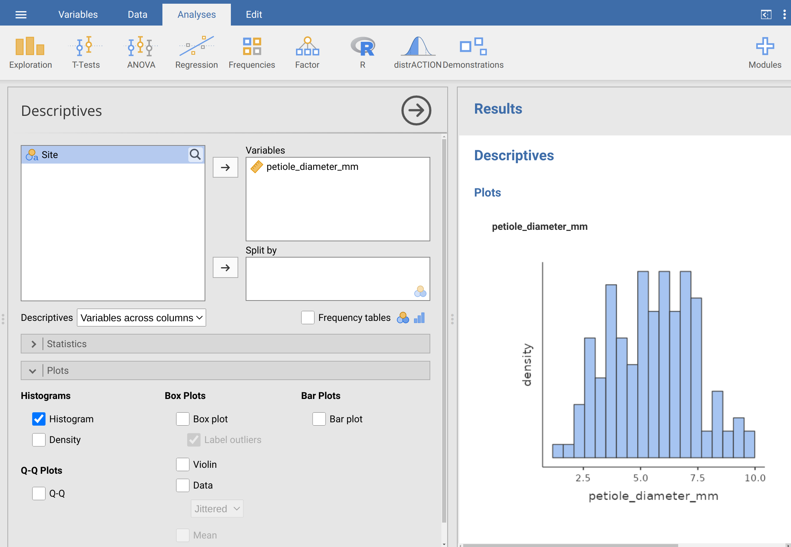

# (PART) Summary statistics {-}

# Week 3 Overview {-}

|                 |                                   |
|-----------------|-----------------------------------|
| **Dates**       | 6 February 2023 - 10 February 2023 |
| **Reading**     | **Required:** SCIU4T4 Workbook chapters 9-12  |
|                 | **Recommended:** @Navarro2022 [Chapter 5](https://davidfoxcroft.github.io/lsj-book/drawing-graphs.html) and [Chapter 4.1](https://davidfoxcroft.github.io/lsj-book/descriptive-statistics.html#measures-of-central-tendency) |
|                 | **Optional:** @Rowntree2018 Chapter 3 |
| **Lectures**    | 3.0: Decimal places and significant figures part 1 (8 min.) |
|                 | 3.1: Decimal places and significant figures part 2 (7 min.) |
|                 | 3.2: Graphs (11 min.) |
|                 | 3.3: Box-whisker plots (8 min.) |
|                 | 3.4: The mean (17 min.) |
|                 | 3.5: The mode (7 min.) |
|                 | 3.6: The median and quantiles (8 min.) |
|                 | 3.7: Mean, mode, median, and resistance (9 min.) |
| **Practical**   | Plotting and statistical summaries         |
| **Assessments** | Week 3 Practice quiz on Canvas  |


# Decimal places, significant figures, and rounding {#Chapter_9}

When making calculations, it is important that any numbers reported are communicated with [accuracy and precision](#Chapter_6). 
This means reporting numbers with the correct number of digits.
This chapter focuses on correctly interpreting the decimal places and significant figures of a number, and correctly rounding.
In your assessments, you will frequently be asked to report an answer to a specific number of decimal places or significant figures, and you will be expected to round numbers correctly.

## Decimal places and significant figures

A higher number of digits communicates a greater level of accuracy
For example, the number 2.718 expresses a higher precision than 2.7 does.
Reporting 2.718 implies that we know the value is somewhere between 2.7175 and 2.1785, but reporting 2.7 only implies that we know the value is somewhere between 2.65 and 2.75 [@Sokal1995].
These numbers therefore have a different number of *decimal places* and a different number *significant figures*.
Decimal places and significant figures are related, but not the same.

**Decimal places** are conceptually easier to understand. These are just the number of digits to the right of the decimal point. For example, 2.718 has 3 decimal places and 2.7 has 1 decimal place.

**Significant figures** are a bit more challenging. These are the number of digits that you need to infer the accuracy of a value. For example, the number 2.718 has 4 significant figures and 2.7 has 2 significant figures. This sounds straightforward, but it can get confusing when numbers start or end with zeros. For example, the number 0.045 has only two significant figures because the first two zeros only serve as placeholders (note that if this were a measurement of 0.045 m, then we could express the exact same value as 45 mm, so the zeros are not really necessary to indicate measurement accuracy). In contrast, the measurement 0.045000 has 5 significant figures because the last 3 zeros indicate a higher degree of accuracy than just 0.045 would (i.e., we know the value is somewhere between 0.44995 and 0.45005, not just 0.0445 and 0.0455). Lastly, the measurement 4500 has only 2 significant figures because the last 2 zeros are only serving as a placeholder to indicate magnitude, not accuracy (if we wanted to represent 4500 with 4 significant figures, we could use scientific notation and express it as $4.500 \times 10^3$).

Here is a table with some examples of some numbers, their decimal places, and their significant figures. 

| Number     |  Decimal places   |  Significant figures  |
|------------|-------------------|-----------------------|
| 3.14159    | 5                 | 5                     |
| 0.0333     | 4                 | 3                     |
| 1250       | 0                 | 3                     |
| 50000.0    | 1                 | 6                     |
| 0.12       | 2                 | 2                     |
| 1000000    | 0                 | 1                     |

Table: Numbers are presented in rows of the first column. Decimal places and significant figures for each row number are presented in the second and third column, respectively.

It is a good idea to double-check that the values in these tables make sense.
For assessments, make sure that you are confident that you can report your answer to a given number of decimal places or significant figures.

## Rounding

Often if you are asked to report a number to a specific number of decimals or significant figures, you will need to round the number.  
Rounding reduces the number of significant digits in a number, which might be necessary if a number that we calculate has more significant digits than we are justified in expressing.
There are different rules for rounding numbers, but in this module, we will follow @Sokal1995.
When rounding to the nearest decimal, the last decimal written should not be changed if the number that immediately follows is 0, 1, 2, 3, or 4. 
If the number that immediately follows is 5, 6, 7, 8, or 9, then the last decimal written should be increased by 1.

For example, if we wanted to round the number 3.141593 to 2 significant digits, then we would write it as 3.1 because the digit that immediately follows (i.e., the third digit) is 4.
If we wanted to round the number to 5 significant digits, then we would write it as 3.1415 because the digit that immediately follows is 9.
And if we wanted to round 3.141593 to 4 significant digits, then we would write it as 3.146 because the digit that immediately follows is 5. 
Note that this does not just apply for decimals.
If we wanted to round 1253 to 3 significant figures, then we would round by writing it as 1250.

Here is a table with some examples of numbers rounded to a given significant figure.

| Original number   | Significant figures  | Rounded number  |
|-------------------|----------------------|-----------------|
| 23.2439           | 4                    | 23.24           |
| 10.235            | 4                    | 10.24           |
| 102.39            | 2                    | 100             |
| 5.3955            | 3                    | 5.40            |
| 37.449            | 3                    | 37.4            |
| 0.00345           | 2                    | 0.0035          |

Table: Numbers to be rounded are presented in rows of the first column. The significant figures to which rounding is desired is in the second column, and the third column shows the correctly rounded number.

In this module, it will be necessary to round calculated values to specified decimal or significant figure. 
It is therefore important to understand the rules for rounding and why the values in the table above are rounded correctly.

# Graphs {#Chapter_10}

Graphs are useful tools for visualising and communicating data. 
Graphs come in many different types, and different types of graphs are effective for different types of data.
This chapter focuses on four types of graphs: (1) histograms, (2) pie charts, (3) barplots, and (4) box-whisker plots.

After collecting or obtaining a new dataset, it is almost always a good idea to plot the data in some way.
Visualising a dataset can often highlight important and obvious properties of a dataset more efficiently that inspecting raw data, calculating summary statistics, or running statistical tests.
When making graphs to communicate data visually, it is important to ensure the person reading the graph has a clear understanding what is being presented.
In practice, this means clearly labelling axes with meaningful descriptions and appropriate units, including a descripting caption, and indicating what any graph symbols mean.
In general, it is also best to make the simplest graph possible for visualising the data, which means avoiding unnecessary colour, three-dimensional display, or unnecessary distractions from the information being conveyed [@Dytham2011; @Kelleher2011]. 
It is also important to ensure that graphs are as accessible as possible, e.g., by providing strong colour contrast and appropriate colour combinations [@Elavsky2022], and alternative text for images where possible.
As a guide, the histogram, pie chart, barplot, and box-whisker plot below illustrate good practice when making graphs. 

## Histograms

Histograms illustrate the distribution of [continuous data](#Chapter_5).
They are especially useful visualisation tools because it is often important to assess data at a glance and make a decision about how to proceed with a statistical analysis.
The histogram shown in Figure 10.1 provides an example from the [fig fruits](https://raw.githubusercontent.com/bradduthie/statistical_techniques/main/data/fig_fruits.csv) data set from the practical in [Chapter 8](#Chapter_8).

```{r, echo = FALSE, fig.alt = "An example histogram is shown with a somewhat normal shape", fig.cap = "Example histogram fig fruit width (cm) using data from 78 fig fruits collected in in 2010 from Baja, Mexico.", out.width="100%"}
fig_fruits  <- read.csv(file = "data/fig_fruits.csv");
hist(x = fig_fruits[["Width_cm"]], xlab = "Fig fruit width (cm)", 
     ylab = "Frequency", cex.lab = 1.25, col = "grey", main = "", 
     breaks = 5, xlim = c(0.8, 2.2));
```

The histogram in Figure 10.1 shows how many fruits there are for different intervals of width (for a step-by-step demonstration of how a histogram is built, see [this interactive application](https://bradduthie.shinyapps.io/build_histogram/)[^2]).
That is, the frequency with which fruits within some width interval occur in the data.
For example, there are 6 fruits with a width between 1.0 and 1.2, so for this interval on the x-axis, the bar is 6 units in height on the y-axis.
In contrast, there is only 1 fig fruit that has a width greater than 2.0 cm (the biggest is 2.1 cm), so we see that the height of the bar for the interval between 2.0 and 2.2 is only 1 unit in frequency.
The bars of the histogram touch each other, which reinforces that the data are [continuous](#Chapter_5) [@Dytham2011; @Sokal1995].

It is especially important to be able to read and understand information from a histogram because it is often necessary to determine if the data are consistent with the assumptions of a statistical test.
For example, the *shape* of the distribution of fig fruit widths might be important for performing a particular test.
For the purposes of this module, the *shape* of the distribution just means what the data look like when plotted like this in a histogram. 
In this case, there is a peak toward the centre of the distribution, with fewer low and high values (this kind of distribution is quite common).
Different distribution shapes will be discussed more in Part IV (next week).

[^2]: Here is the full URL: https://bradduthie.shinyapps.io/build_histogram/.

## Barplots and pie charts

While histograms are an effective way of visualising [continuous data](#Chapter_5), barplots (also known as 'bar charts' or 'bar graphs') and pie charts can be used to visualise [categorical data](#Chapter_5).
For example, in the [fig fruits](https://raw.githubusercontent.com/bradduthie/statistical_techniques/main/data/fig_fruits.csv) data set [Chapter 8](#Chapter_8), `r dim(fig_fruits)[1]` fig fruits were collected from 4 different trees (A, B, C, and D). 
A barplot could be used to show how many samples were collected from each tree (see Figure 10.2).

```{r, echo = FALSE, fig.alt = "An example barplot shows the total number of fruits collected from four trees labelled A, B, C, and D.", fig.cap = "Example bar plot showing how many fruits were collected from each of 4 trees (78 collected in total) in 2010 from Baja, Mexico.", out.width="100%"}
fruits_per_tree <- table(fig_fruits[["Tree"]]);
barplot(fruits_per_tree, xlab = "Tree", ylab = "Fruits sampled", cex.lab = 1.25, 
        cex.axis = 1.25, col = "grey");
```

In Figure 10.2, each tree is represented by a separate bar on the x-axis.
Unlike a histogram, the bars do not touch each other, which reinforces that different categories of data are being shown (in this case, different trees).
The height of bar indicates how many fruits were sampled for each tree.
For example, `r as.numeric(fruits_per_tree[1])` fruits were sampled from tree A, and `r as.numeric(fruits_per_tree[2])` fruits were sampled from tree B.
At a glance, it is therefore possible to compare different trees and make inferences about how they differ in sampled fruits.

Pie charts are similar to barplots in that both present categorical data, but pie charts are more effective for visualising the relative quantity for each category.
That is, pie charts illustrate the percentage of measurements for each category.
For example, in the case of the fig fruits, it might be useful to visualise what percentage of fruits were sampled from each tree.
A pie chart could be used to evaluate this, with pie slices corresponding to different trees and the size of each slice reflecting the percentage of the total sampled fruits that came from each tree (Figure 10.3).

```{r, echo = FALSE, fig.alt = "An example pie chart shows the percentage of fruits collected from four trees labelled A, B, C, and D.", fig.cap = "Example pie plot showing the percentage of fruits that were collected from each of 4 trees (78 collected in total) in 2010 from Baja, Mexico.", out.width="100%"}
pie_fruits_labels <- c("Tree A", "Tree B", "Tree C", "Tree D");
pie(x = fruits_per_tree, labels = pie_fruits_labels,
    col = c("grey20", "grey80", "grey40", "grey60"), main = "");
```

Pie charts can be useful in some situations, but in the biological and environmental they are not used as often as barplots.
In contrast to pie charts, barplots present the absolute quantities (in Figure 10.2, e.g., the actual number of fruits sampled per tree), and it is still possible with barplots to infer the percentage each category contributes to the total from the relative sizes of the bars.
Pie charts, in contrast, only illustrate relative percentages unless numbers are used to indicate absolute quantities.
Unless only percentage is important, barplots are often the preferred way to communicate count data.


## Box-whisker plots

Box-whisker plots (also called boxplots) can be used to visualise distributions in a different way than histograms.
Instead of presenting the full distribution, as in a histogram, a box-whisker plot shows where summary statistics are located (summary statistics are explained below).
This allows the distribution of data to be represented in a more compact way, but does not show the full shape of a distribution.
Figure 10.4 compares a box-whisker plot of fig fruit widths (10.4A) with a histogram of fig fruit widths (10.4B).
In other words, both of the panels (A and B) in Figure 10.4 show the same information in two different ways (note that these are the same data as presented in Figure 10.1).

```{r, echo = FALSE, fig.alt = "Example of a simple boxplot shown to the left of a histogram, each showing the same information", fig.cap = "Boxplot (A) of fig fruit widths (cm) for 78 fig fruits collected in 2010 in Baja, Mexico. Panel (B) presents the same data as a histogram.", out.width="100%"}
par(mfrow = c(1, 2));
boxplot(x = fig_fruits[["Width_cm"]], ylab = "Fig fruit width (cm)", xlab = "All trees", cex.lab = 1.25, cex.axis = 1.25);
text(x = 0.6, y = 2.066, labels = "A", cex = 2.5);
hist(x = fig_fruits[["Width_cm"]], xlab = "Fig fruit width (cm)", 
     ylab = "Frequency", cex.lab = 1.25, col = "grey", main = "", 
     breaks = 5, xlim = c(0.8, 2.2));
sum_fig_fruits <- summary(fig_fruits[["Width_cm"]]);
text(x = 0.9, y = 27, labels = "B", cex = 2.5);
```

To show how the panels of Figure 10.4 correspond to one another more clearly, Figure 10.5 shows them again, but with points indicating where the summary statistics shown in the boxplot (Figure 10.5A) are located in the histogram (Figure 10.5B).
These summary statistics include the median (black circles of Figure 10.5), quartiles (red squares of Figure 10.5), and the limits of the distribution (i.e., the minimum and maximum values; blue triangles of Figure 10.5).
Note that in boxplots, if outliers exist, they are presented as separate points.


```{r, echo = FALSE, fig.alt = "Example of a simple boxplot shown to the left of a histogram, each showing the same information, with points showing how properties of the two panels match.", fig.cap = "Boxplot (A) of fig fruit widths (cm) for 78 fig fruits collected in 2010 in Baja, Mexico. Panel (B) presents the same data as a histogram. Points in the boxplot indicate the median (black circle), first and third quartiles (red squares), and the limits of the distribution (blue triangles). Corresponding locations are shown on the histogram in panel (B).", out.width="100%"}
par(mfrow = c(1, 2));
boxplot(x = fig_fruits[["Width_cm"]], ylab = "Fig fruit width (cm)", xlab = "All trees", cex.lab = 1.25, cex.axis = 1.25);
text(x = 0.6, y = 2.066, labels = "A", cex = 2.5);
points(y = as.numeric(sum_fig_fruits[3]), x = 1, pch = 16, cex = 2, 
       col = "black");
points(y = as.numeric(sum_fig_fruits[2]), x = 1, pch = 15, cex = 1.5, 
       col = "red");
points(y = as.numeric(sum_fig_fruits[5]), x = 1, pch = 15, cex = 1.5, 
       col = "red");
points(y = as.numeric(sum_fig_fruits[1]), x = 1, pch = 17, cex = 1.5, 
       col = "blue");
points(y = as.numeric(sum_fig_fruits[6]), x = 1, pch = 17, cex = 1.5, 
       col = "blue");
hist(x = fig_fruits[["Width_cm"]], xlab = "Fig fruit width (cm)",
     ylab = "Frequency", cex.lab = 1.25, col = "grey", main = "", 
     breaks = 5, xlim = c(0.8, 2.2));
sum_fig_fruits <- summary(fig_fruits[["Width_cm"]]);
points(x = as.numeric(sum_fig_fruits[3]), y = 0, pch = 16, cex = 2, 
       col = "black");
points(x = as.numeric(sum_fig_fruits[2]), y = 0, pch = 15, cex = 1.5, 
       col = "red");
points(x = as.numeric(sum_fig_fruits[5]), y = 0, pch = 15, cex = 1.5, 
       col = "red");
points(x = as.numeric(sum_fig_fruits[1]), y = 0, pch = 17, cex = 1.5, 
       col = "blue");
points(x = as.numeric(sum_fig_fruits[6]), y = 0, pch = 17, cex = 1.5, 
       col = "blue");
text(x = 0.9, y = 27, labels = "B", cex = 2.5);
par(mfrow = c(1, 1));
```

One benefit of a boxplot is that it is possible to show the distribution of multiple variables simultaneously.
For example, the distribution of fig fruit width can be shown for each of the four trees side by side on the same x-axis of a boxplot (Figure 10.6).
While it is possible to show histograms side by side, it will quickly take up a lot of space.

```{r, echo = FALSE, fig.alt = "Example of boxplot showing the distributions of fig fruit width for four different trees.", fig.cap = "Boxplot of fig fruit widths (cm) collected from 4 separate trees sampled in 2010 from Baja, Mexico.", out.width="100%"}
boxplot(formula = fig_fruits[["Width_cm"]]~fig_fruits[["Tree"]], ylab = "Fig fruit width (cm)", xlab = "Tree", cex.lab = 1.25, cex.axis = 1.25);
```

The boxplot in Figure 10.6 can be used to quickly compare the distribution of Trees A-D.
The point at the bottom of the distribution of Tree A shows an outlier.
This outlier is an especially low value of fig fruit width compared to the other fruits of Tree A.


# Measures of central tendency {#Chapter_11}

Summary statistics describe properties of data in a single number (e.g., the mean), or a set of numbers (e.g., quartiles).
This chapter focuses on summary statistics that describe the centre of a distribution.
It also introduces quantiles, which divide a distribution into different percentages of the data (e.g., the lowest 50\% or highest 75\%).
Throughout this section, verbal and mathematical explanations of summary statistics will be presented alongside histograms or boxplots that convey the same information.
The point of doing this is to help connect the two ways of summarising the data.
All of the summary statistics that follow describe calculations for a *sample* and are therefore estimates of the true values in a *population*.
Recall from [Chapter 4](#Chapter_4) the difference between a population and a sample.
This module focuses on statistical techniques, not statistical theory, so summary statistics will just focus on how to estimate statistics from sampled data instead of how statistics are defined mathematically[^3].

[^3]: If interested, a good textbook for learning about theoretical statistics and the mathematics underlying what we do in this module is @Miller2004. Note, @Miller2004 will not be useful for this module.

##  The mean

The arithmetic mean (hereafter just *the mean*[^4]) of a sample is one of the most commonly reported statistics when communicating information about a dataset. 
The mean is a measure of central tendency, so it is located somewhere in the centre of a distribution.
Figure 10.7 shows the same histogram of fig fruit widths shown in Figure 10.1, but with an arrow indicating where the mean of the distribution is located

```{r, echo = FALSE, fig.alt = "An example histogram is shown with a somewhat normal shape", fig.cap = "Example histogram fig fruit width (cm) using data from 78 fig fruits collected in in 2010 from Baja, Mexico.", out.width="100%"}
fig_fruits  <- read.csv(file = "data/fig_fruits.csv");
hist(x = fig_fruits[["Width_cm"]], xlab = "Fig fruit width (cm)", 
     ylab = "Frequency", cex.lab = 1.25, col = "grey", main = "", 
     breaks = 5, xlim = c(0.8, 2.2));
mean_fig_fruit_width <- mean(fig_fruits[["Width_cm"]], na.rm = TRUE);
arrows(x0 = mean_fig_fruit_width, x1 = mean_fig_fruit_width,
       y0 = 5, y1 = 0, lwd = 3);
mbox <- function(x0, x1, y0, y1){
    xx <- seq(from=x0, to=x1, length.out = 100);
    yy <- seq(from=y0, to=y1, length.out = 100);
    xd <- c(rep(x0, 100), xx, rep(x1,100), rev(xx));
    yd <- c(yy, rep(y1,100), rev(yy), rep(y0, 100));
    return(list(x=xd, y=yd));
}
tbox <- mbox(x0 = mean_fig_fruit_width - 0.15, 
             x1 = mean_fig_fruit_width + 0.15, y0 = 5, y1 = 9);
polygon(x=tbox$x, y=tbox$y, lwd=3, border="black", col="white");
text(x = mean_fig_fruit_width, y = 7, cex = 2, labels = "Mean");
```

The mean is calculated by adding up the values of all of the data and dividing this sum by the total number of data [@Sokal1995].
This is a fairly straightforward calculation, so we can use the mean as an example to demonstrate some new mathematical notation that will be used throughout the module.
We will start with a concrete example with actual numbers, then end with a more abstract equation describing how any sample mean is calculated.
The notation might be a bit confusing at first, but learning it will make understanding statistical concepts easier later in the module.
There are a lot of equations in what follows, but this is because we want to explain what is happening as clearly as possible, step by step.
We start with the following 8 values.

```
4.2, 5.0, 3.1, 4.2, 3.8, 4.6, 4.0, 3.5
```

To calculate the mean of a sample, we just need to add up all of the values and divide by 8 (the total number of values),

$$\bar{x} = \frac{4.2 + 5.0 + 3.1 + 4.2 + 3.8 + 4.6 + 4.0 + 3.5}{8}.$$

Note that I have used the symbol $\bar{x}$ to represent the mean of $x$, which is a common notation [@Sokal1995].
In the example above, $\bar{x} = `r mean(c(4.2, 5.0, 3.1, 4.2, 3.8, 4.6, 4.0, 3.5))`$.

Writing the calculation above is not a problem because we only have 8 points of data.
But sample sizes are often much larger than 8.
If we had a sample size of 80 or 800, then there is no way that we could write down every number to show how the mean is calculated.
One way to get around this is to use ellipses and just show the first and last couple of numbers,

$$\bar{x} = \frac{4.2 + 5.0 + ... + 4.0 + 3.5}{8}.$$

This is a more compact, and perfectly acceptable, way to write the sample mean.
But it is often necessary to have an even more compact way of indicating the sum over a set of values (i.e., the top of the fraction above).
To do this, each value can be symbolised by an $x$, with a unique subscript $i$, so that $x_{i}$ corresponds to a specific value in the list above.
The usefulness of this notation, $x_{i}$, will become clear soon.
It takes some getting used to, but the table below shows each symbol with its corresponding value to make it more intuitive.

| Symbol  | Value |
|---------|-------|
| $x_{1}$ | 4.2   |
| $x_{2}$ | 5.0   |
| $x_{3}$ | 3.1   |
| $x_{4}$ | 4.2   |
| $x_{5}$ | 3.8   |
| $x_{6}$ | 4.6   |
| $x_{7}$ | 4.0   |
| $x_{8}$ | 3.5   |

Note that we can first replace the actual values with their corresponding $x_{i}$, so the mean can be written as,

$$\bar{x} = \frac{x_{1} + x_{2} + x_{3} + x_{4} + x_{5} + x_{6} + x_{7} + x_{8}}{8}.$$
Next, we can rewrite the top of the equation in a different form using a summation sign,

$$\sum_{i = 1}^{8}x_{i} = x_{1} + x_{2} + x_{3} + x_{4} + x_{5} + x_{6} + x_{7} + x_{8}.$$
Like the use of $x_{i}$, the summation sign $\sum$ takes some getting used to, but here it just means "sum up all of the $x_{i}$ values".
You can think of it as a big 'S' that just says "sum up". 
The bottom of the S is the starting point and the top of it is the ending point for adding numbers.
Verbally, we can read this as saying, "starting with $i = 1$, add up all of the $x_{i}$ values until $i = 8$". 
We can then replace the long list of $x$ values with a summation,

$$\bar{x} = \frac{\sum_{i = 1}^{8}x_{i}}{8}.$$

This looks a bit messy, so we can rewrite the above equation.
Instead of dividing the summation by 8, we can multiply it by 1/8, which gives us the same answer,

$$\bar{x} = \frac{1}{8}\sum_{i = 1}^{8}x_{i}.$$

There is one more step.
We have started with 8 actual values and ended with a compact and abstract equation for calculating the mean.
But if we want a general description for calculating *any* mean, then we need to account for sample sizes not equal to 8.
To do this, we can use $N$ to represent the sample size.
In our example, $N = 8$, but it is possible to have a sample size be any finite value above zero.
We can therefore replace 8 with $N$ in the equation for the sample mean,

$$\bar{x} = \frac{1}{N}\sum_{i = 1}^{N}x_{i}.$$

There we have it.
Verbally, the above equation tells us to multiply $1/N$ by the sum of all $x_{i}$ values from 1 to $N$.
This describes the mean for any sample that we might collect.

[^4]: There are other types of means, such as the geometric mean or the harmonic mean, but we will not use these at all in this module.

## The mode

Explanation of the mode

## The median and quantiles

Notes on the median and quantiles


# Measures of spread {#Chapter_12}

## The range


## The inter-quartile range


## The variance


## The standard deviation


## The coefficient of variation


## The standard error


# _Practical_. Plotting and statistical summaries in Jamovi {#Chapter_13}

This practical focuses on applying the concepts from Chapters 9-12 in Jamovi. 
The data that we will work with in this practical were collected from a research project conducted by Dr Alan Law, Prof Nils Bunnefeld, and Prof Nigel Willby at the University of Stirling [@Law2014].
The project focused on beaver reintroduction in Scottish habitats and its consequences for the white water lily, *Nymphaea alba*, which beavers regularly consume (Figure 13.1)[^5].

```{r, echo = FALSE, fig.alt = "Lilypads shown covering a small strip of water with three flowers in bloom.", fig.cap = "Photo of white water lillies on the water.", out.width="100%"}

```

As an instructive example, this lab will use the data from @Law2014 on the petiole diameter (mm) from *N. alba* collected from 7 different sites on the west coast of Scotland (the petiole is the structure that attaches the plant stem to the blade of the leaf).
The *N. alba* dataset is available to download [here](https://raw.githubusercontent.com/bradduthie/statistical_techniques/main/data/Nymphaea_alba.csv).
Note that the data are not in a tidy format, so it is important to first reorganise the data so that they can be analysed in Jamovi (13.1).
Once the data are properly organised, we will use Jamovi to plot them (13.2), calculate summary statistics (13.3), apply appropriate decimals, significant figures, and rounding (13.4), and compare petiole diameters across sites (13.5).

[^5]: This figure was released into the public domain by [Аlexej Potupin](https://commons.wikimedia.org/wiki/File:Nymphaea_alba._Reader.jpg) on 8 June 2018.

## Reorganise the dataset into a tidy format

The *N. alba* dataset is not in a tidy format. 
All of the numbers from this dataset are measurements of petiole diameter in mm from *N. alba*, but each row contains 7 samples because each column shows a different site.
The full dataset is shown below.

```{r, echo = FALSE}
N_alba      <- read.csv("data/Nymphaea_alba.csv");
N_alba_tidy <- read.csv("data/Nymphaea_alba_tidy.csv");
print(N_alba)
```

Remember that to make these data tidy and usable in Jamovi, we need each row to be an independent sample.
What we really want then is a dataset with two columns of data.
The first column should indicate the site, and the second column should indicate the petiole diameter.
This can be done in two ways.
First, we could use a spreadsheet programme like LibreOffice or MS Excel to create a new dataset with two columns, one column with the site information and the other column with the petiole diameters.
Second, we could use the 'Data' tab in Jamovi to create two new columns of data (one for site and the other for petiole diameter).
Either way, we need to copy and paste site names into the first column and petiole diameters in the second column.
This is a bit tedious, and we will not ask you to do it for every dataset, but it is an important step in the process of data analysis.
See Figure 13.2 for how this would look in Jamovi.

```{r, echo = FALSE, fig.alt = "Jamovi interface is shown with new columns being added to the dataset.", fig.cap = "Tidying the raw data of petiole diameters from lily pad measurements across 7 sites in Scotland. A new column of data is created by right clicking on an existing column and choosing 'Add Variable'.", out.width="100%"}
knitr::include_graphics("img/lilypad_tidy.png")
```

Note that to insert a new column, we need to right click on an existing column and select 'Add Variable' $\to$ 'Insert'.
A new column will then pop up in Jamovi, and we can give this an informative name.
Make sure to specify that the 'Site' column should be a nominal measure type, and the 'petiole_diameter_mm' column should be a continuous measure type. 
The first 6 rows of the dataset should look like the below.

```{r, echo = FALSE}
print(head(N_alba_tidy));
```

With the reorganised dataset, we are now ready to do some analysis in Jamovi.
We will start with some plotting.

## Histograms and box-whisker plots

We will start by making a histogram of the full dataset of petiole diameter.
To do this, we need to go to 'Analyses' tab of the Jamovi toolbar, then select the 'Exploration' button.

```{r, echo = FALSE, fig.alt = "Jamovi interface is shown with an Exploration and Descriptive option being selected.", fig.cap = "Jamovi toolbar after having selected on the Analyses tab followed by the Exploration button.", out.width="100%"}
knitr::include_graphics("img/lilypad_descriptives.png")
```

Next, select the 'Descriptives' option (Figure 13.3).
This will open a new window where it is possible to create plots and calculate summary statistics.
The white box on the left of the Descriptive interface lists all of the variables in the dataset.
Below this box, there are options for selecting different summary statistics 'Statistics' and building different graphs 'Plots'.
To get started, select the petiole diameter variable in the box to the left, then move it to the 'Variables' box (top right) using the $\to$ arrow.
Next, open the Plots option at the bottom of the interface.
Choose the 'Histogram' option by clicking the checkbox.
A histogram will open up in the window on the right (you might need to scroll down).

```{r, echo = FALSE, fig.alt = "Jamovi Descriptives interface is shown with a histogram of petiole diameter.", fig.cap = "Jamovi Descriptives toolbar with petiole diameter selected and a histogram produced in the plotting window.", out.width="100%"}

```

Take a look at the histogram to the right (Figure 13.4).
Just looking at the histogram, write down what you think the following summary statistics will be.

Mean:                ____________________________

Median:              ____________________________

Standard deviation:  ____________________________


Based on the histogram, do you think that the mean and median are the same? Why or why not?

```


```

The histogram needs an informative caption.
To write one in Jamovi, click on the 'Edit' tab at the very top of the toolbar.
You will see some blue boxes above and below the histogram, and you can write your caption by clicking on the box immediately below the histogram.
Write a caption for the histogram below.

```


```

If you want to save the histogram, then you can right click on it.
A pop-up box will give you several options; select 'Image $\to$ Export' to save the histogram.
You can save it as a PDF, PNG, SVG, or EPS (if in doubt, PNG is probably the easiest to use).
You do not need to do this for this lab, but knowing how to do it will be useful for other modules, including your fourth year dissertation.

In the first example, we looked at petiole diameters across the entire dataset, but suppose that we want to see how the data are distributed for each site individually.
To do this, we just need to go back to the Descriptives box (Figure 13.4) and put the 'Site' variable into the box on the lower right called 'Split by'.
Do this by selecting 'Site' then using the lower $\to$ arrow to bring it to the 'Split by' box.
Instead of one histogram of petiole diameters, you will now see 7 different histograms, one for each site, all stacked on top of each other.
This might be useful, but all of these histograms together are a bit busy.
Instead, we can use a box-whisker plot to compare the distributions of petiole diameters across different sites.

To create a box plot, simply check 'Box plot' from the Plots options (you might want to uncheck 'Histogram', but it is not necessary).
You should now see all of the different sites on the x-axis of the newly created boxplot and a summary of the petiole diameters on the y-axis.
Based on the boxplot, which site appears to have the highest and lowest median petiole diameter?

Highest:  ____________________________

Lowest:   ____________________________


There is one more trick with box-whisker plots in Jamovi that is useful.
The current plots show a summary of each site, but it might also be useful to plot the actual data points to give some more information about the distribution of petiole diameters.
You can do this by checking the option 'Data', which places the petiole diameter of each sample over the box and whiskers for each site.
The y-axis shows the petiole diameter of each data point.
By default, the points are jittered on the x-axis, which just means that they are placed randomly on the x-axis within a site.
This is just to ensure that points will not be placed directly on top of each other if they are the same value.
If you prefer, you can use the pull-down menu right below the Data checkbox to select 'Stacked' instead of 'Jittered'
The stacked option will place points side by side.
Think about where the points are in relation to the box and whiskers of the plot; this should help you develop an intuitive understanding of how to read box-whisker plots.


## Calculate summary statistics

We can calculate the summary statistics using the 'Descriptives' option in Jamovi, just as we did with the histogram and box-whisker plots.
Before doing anything else, again place the petiole diameter variable in the box of variables, but do not split the dataset by site just yet because we first want summary statistics across the entire dataset.
Below the box of variables, but above the Plots options, there are options for selecting different summary statistics.
Open up this new box and have a look at the different summary statistics that can be calculated.
To calculate all of the variables explained in [Chapter 11](#Chapter_11) and [Chapter 12](#Chapter_11), check the following 11 boxes:

- N: _______________________
- Std. deviation: _______________________
- Variance: _______________________
- Range: _______________________
- Minimum: _______________________
- Maximum: _______________________
- Range: _______________________
- IQR: _______________________
- Mean: _______________________
- Median: _______________________
- Mode: _______________________
- Std. error of mean: _______________________

When you do this, the Statistics option in Jamovi should like like it does in Figure 13.5.

```{r, echo = FALSE, fig.alt = "Jamovi Descriptives interface is shown with checkboxes for different summary statistics, most of which are checked.", fig.cap = "Jamovi Descriptives toolbar showing the summary statistics available to report.", out.width="100%"}
knitr::include_graphics("img/lilypad_summary_statistics.png")
```

Once you check these boxes, you will see a 'Descriptives' table open on the right hand side of Jamovi.
This table will report all of the summary statistics that you have checked.
Write down the values for the summary statistics next to the corresponding bullet points above.

Next split these summary statistics up by site. 
Notice the very large table that is now produced on the right hand side of Jamovi.
Which of the 7 sites in the data set has the highest mean petiole diameter, and what is its mean?

Site: ______________________________ 

Mean: ______________________________


Which of the 7 sites has the lowest variation in petiole diameter, and what is its variation?

Site:      ______________________________ 

Variation: ______________________________


Make sure that you are able to find and interpret these summary statistics in Jamovi.
Explore different options to get more comfortable using Jamovi for building plots and reporting summary statistics.
Can you find the first and third quartiles for each site?
Report the third quartiles for each site below.

Beag:           ______________________________

Buic:           ______________________________

Choille-Bharr:  ______________________________

Creig-Moire:    ______________________________

Fidhle:         ______________________________

Lily_Loch:      ______________________________

Linne:          ______________________________


Next, we will look at reporting summary statistics to different significant figures.

## Reporting decimals and significant figures

Using the same values that you reported above for the whole dataset (i.e., not broken down by site), report each summary statistics to two significant figures.
Remember to round accurately if you need to reduce the number of significant figures from the original values to the new values below.
In assessments, you will often be asked to report a particular answer to a specific number of decimal places or significant figures, so the intention here is to help you practice.

- N: _______________________
- Std. deviation: _______________________
- Variance: _______________________
- Range: _______________________
- Minimum: _______________________
- Maximum: _______________________
- Range: _______________________
- IQR: _______________________
- Mean: _______________________
- Median: _______________________
- Mode: _______________________
- Std. error of mean: _______________________


Remember from 13.2 that you were asked to write down what you thought the mean, median, and standard deviation were just by inspecting the histogram.
Compare your answers in that section with the rounded statistics listed above.
Were you able to get a similar value from the histogram as calculated in Jamovi from the data?
What can you learn from the histogram that you cannot from the summary statistics, and what can you learn from the summary statistics that you cannot from the histogram?
Write your reflections in the space below.

```


```

Next, we will produce barplots to show the mean petiol diameter for each site.

## Comparing across sites

To make a barplot that compares the mean petiole diameters across sites, we again use the Descriptives option in Jamovi.
Place petiole diameter as the variable, and spit this by site.
Next, go down to the plotting options and check 'Bar plot'.
You will see a barplot produced in the window to the right with different sites on the x-axis.
Bar heights show the mean petiole diameter for each site.
Notice the intervals shown for each bar (i.e., the vertical lines in the centre of the bars that go up and down different lengths).
These error bars are centred on the mean petiole diameter (bar height) and show one standard error above and below the site mean.
Recall back from [Chapter 12](#Chapter_12); what information do these error bars convey about the estimated mean petiole diameter?

```


```

What can you say about the mean petiole diameters across the different sites?
Do these sites appear to have very different mean petiole diameters?

```


```

There were 20 total petiole diameters sampled from each site.
If we were to go back out to these 7 sites and sample another 20 petiole diameters, could we **really** expect to get the exact same site means?
Assuming the site means would be at least a bit different for our new sample, is it possible that the sites with the highest or lowest petiole diameters might also be different in our new sample?
If so, then what does this say about our ability to make conclusions about the differences in petiole diameter among sites?

```


```


