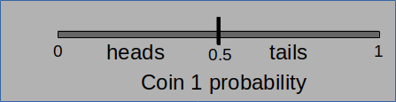
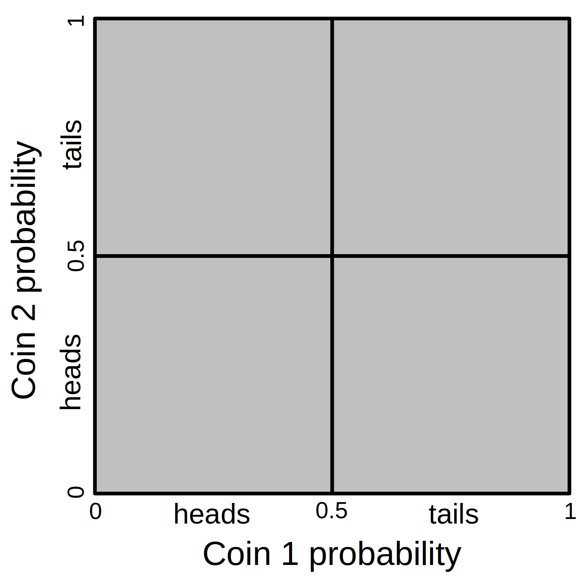
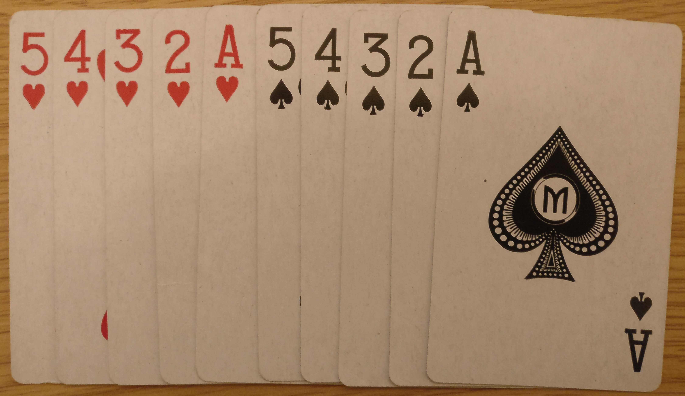
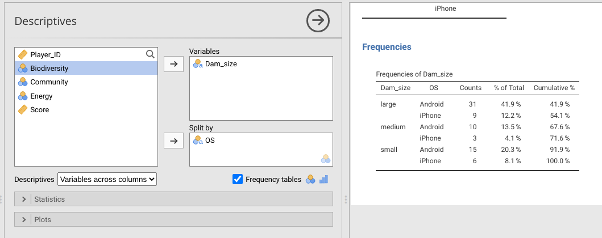
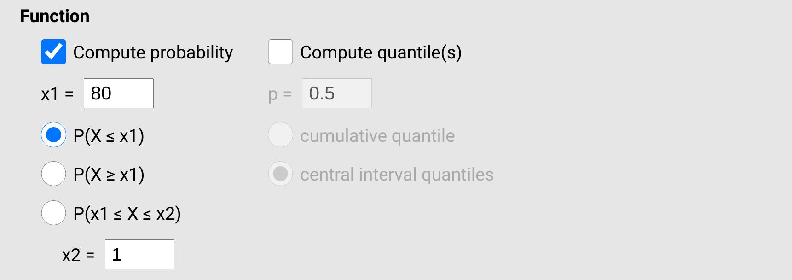
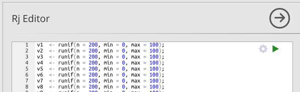
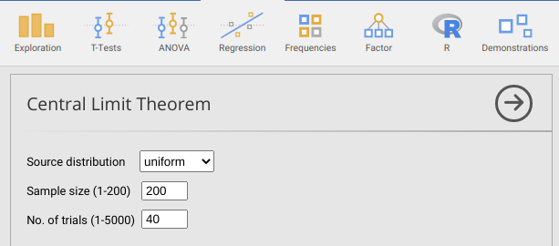

# (PART) Probability models and the Central Limit Theorem {-}

# Week 4 Overview {-#Week4}

|                 |                                   |
|-----------------|-----------------------------------|
| **Dates**       | 13 February 2023 - 17 February 2023 |
| **Reading**     | **Required:** SCIU4T4 Workbook chapters 14-15  |
|                 | **Recommended:** @Navarro2022 [Chapter 7](https://davidfoxcroft.github.io/lsj-book/07-Introduction-to-probability.html)    |
|                 | **Suggested:**  @Rowntree2018 Chapter 4 |
|                 | **Advanced:** None
| **Lectures**    | 4.1: Probability models (17 min.) |
|                 | 4.2: Probabilities to make predictions (12 min.) |
|                 | 4.3: Probability distributions (11 min.) |
|                 | 4.4: Predictions using sample statistics (16 min.) |
|                 | 4.5: Jamovi procedures |
| **Practical**   | Probability and simulation ([Chapter 16](#Chapter_16))       |
|                 |   Room: Cottrell 2A17         |
|                 |   Group A: 15 FEB 2023 (WED) 13:05-15:55 |
|                 |   Group B: 16 FEB 2023 (THU) 09:05-11:55 |
| **Help hours**  | Ian Jones                       |
|                 |   Room: Cottrell 1A13           |
|                 |   17 FEB 2023 (FRI) 15:05-17:55 |
| **Assessments** | [Week 4 Practice quiz](https://canvas.stir.ac.uk/courses/13075/quizzes/29675) on Canvas  |

Week 4 focuses on probability and the central limit theorem.

[Chapter 14](#Chapter_14) introduces probability models and how to interpret them.
The chapter also provides some examples of probability distributions that are especially relevant to biological and environmental sciences.

[Chapter 15](#Chapter_15) focuses on the central limit theorem (CLT), what it is, and why it is so important in statistics.

[Chapter 16](#Chapter_16) guides you through the week 4 practical.
The aim of this practical is to apply the ideas from [Chapter 14](#Chapter_14) and [Chapter 15](#Chapter_15) in Jamovi to predict probabilities from a real dataset.


# Introduction to probability models {#Chapter_14}

Suppose that we flip a fair coin over a flat surface.
There are two possibilities for how the coin lands on the surface.
Either the coin lands on one side (heads) or the other side (tails), but we do not know the outcome in advance.
If these two events (heads or tails) are equally likely, then we could reason that there is a 50\% chance that a flipped coin will land heads up and a 50\% chance that it will land heads down.
What do we actually mean when we say this?
For example, when we say that there is a 50\% chance of the coin landing heads up, are we making a claim about our own uncertainty, how coins work, or how the world works?
We might mean that we simply do not know whether or not the coin will land heads up, so a 50-50 chance just reflects our own ignorance about what will actually happen when the coin is flipped.
Alternatively, we might reason that if a fair coin were to be flipped many times, all else being equal, then about half of flips should end heads up, so a 50\% chance is a reasonable prediction of what will happen in any given flip.
Or, perhaps we reason that events such as coin flips really are guided by chance on some deeper fundamental level, such that our 50\% chance reflects some real causal metaphysical process in the world.
These are questions concerning the philosophy of probability.
The philosophy of probability is an interesting sub-discipline in its own right, with implications that can and do affect how researchers do statistics [@Edwards1972; @Mayo1996; @Gelman2013; @Suarez2020; @Mayo2021; @Navarro2022].

In this chapter, we will not worry about the philosophy of probability[^12] and instead focus on the mathematical rules of probability as applied to statistics.
These rules are important for predicting real-world events in the biological and environmental sciences.
For example, we might need to make predictions concerning the risk of disease spreading in a population, or the risk of extreme events such as droughts occurring given increasing global temperatures.
Probability is also important for testing scientific hypotheses.
For example, if we sample two different groups and calculate that they have different means (e.g., two different fields have different mean soil nitrogen concentrations), we might want to know the probability that this difference between means could have arisen by chance.
Here we will introduce practical examples of probability, then introduce some common probability distributions. 

[^12]: In the interest of transparency, this book presents a *frequentist* interpretation of probability [@Mayo1996]. While this approach does reflect the philosophical inclinations of the author, the reason for working from this interpretation has more to do with the statistical tests that are most appropriate for an introductory statistics module, which are also the tests most widely used in the biological and environmental sciences.


## An instructive example

Probability focuses on the outcomes of trials, such as the **outcome** (heads or tails) of the **trial** of a coin flip.
The probability of a specific outcome is the relative number of times it is expected to happen given a large number of trials,

$$P(outcome) = \frac{Number\:of\:times\:outcome\:occurs}{Total\:number\:of\:trials}.$$

For the outcome of a flipped coin landing on heads,

$$P(heads) = \frac{Flips\:landing\:on\:heads}{Total\:number\:of\:flips}.$$

As the total number of flips becomes very large, the number of flips that land on heads should get closer and closer to half the total, $1/2$ or $0.5$ (more on this later).
The above equations use the notation $P(E)$ to define the probability ($P$) of some event ($E$) happening.
Note that the number of times an outcome occurs cannot be less than 0, so $P(E) \geq 0$ must always be true.
Similarly, the number of times an outcome occurs cannot be greater than the number of trials; the most frequently it can happen is in *every* trial, in which case the top and bottom of the fraction has the same value.
Hence, $P(E) \leq 1$ must also always be true.
Probabilities therefore range from 0 (an outcome *never* happens) to 1 (an outcome *always* happens).

It might be more familiar and intuitive at first to think in terms of percentages (i.e., from 0-100\% chance of an outcome, rather than from 0-1), but there are good mathematical reasons for thinking about probability on a 0-1 scale (it makes calculations easier).
For example, suppose we have two coins, and we want to calculate the probability that they will both land on heads if we flip them at the same time.
That is, we want to know the probability that coin 1 lands on heads **and** coin 2 lands on heads.
We can assume that the coins do not affect each other in any way, so each coin flip is **independent** of the other (i.e., the outcome of coin 1 does not affect the outcome of coin 2, and *vice versa* -- this kind of assumption is often very important in statistics).
Each coin, by itself, is expected to land on heads with a probability of 0.5, $P(heads) = 0.5$.
When we want to know the probability that two or more independent events will happen, we *multiply* their probabilities.
In the case of both coins landing on heads, the probability is therefore,

$$P(Coin_{1} = heads\:\cap Coin_{2} = heads) = 0.5 \times 0.5 = 0.25.$$

Note that the symbol $\cap$ is basically just a fancy way of writing 'and' (technically, the intersection between sets; see set theory for details).
Verbally, all this is saying is that the probability of coin 1 landing on heads *and* the probability of coin 2 landing on heads equals 0.5 times 0.5, which is 0.25.

But why are we *multiplying* to get the joint probability of both coins landing on heads?
Why not add, for example?
We could just take it as a given that multiplication is the correct operation to use when calculating the probability that multiple events will occur.
Or we could do a simple experiment to confirm that 0.25 really is about right (e.g., by flipping 2 coins 100 times and recording how many times both coins land on heads).
But neither of these options would likely be particularly satisfying.
Let us first recognise that adding the probabilities cannot be the correct answer.
If the probability of each coin landing on heads is 0.5, then adding probabilities would imply that the probability of both landing on heads is 0.5 + 0.5 = 1.
This does not make any sense because we know that there are other possibilities, such as both coins landing on tails, or one coin landing on heads and the other landing on tails.
Adding probabilities cannot be the answer, but why multiply?

We can think about probabilities visually, as a kind of probability space.
When we have only one trial, then we can express the probability of an event along a line (Figure 14.1).

```{r, echo = FALSE, fig.alt = "A drawing of a line from 0 to 1 with heads indicated below 0.5 and tails indicated above 0.5.", fig.cap = "Total probability space for flipping a single coin and observing its outcome (heads or tails). Given a fair coin, the probability of heads equals a proportion 0.5 of the total probability space, while the probability of tails equals the remaining 0.5 proportion.", out.width="100%"}
;
```

The total probability space is 1, and 'heads' occupies a density of 0.5 of the total space.
The remaining space, also 0.5, is allocated to 'tails'.
When we add a second independent trial, we now need 2 dimensions of probability space (Figure 14.2).
The probability of heads or tails for coin 1 (the horizontal axis of Figure 14.2) remains unchanged, but we add another axis (vertical this time) to think about the equivalent probability space of coin 2.

```{r, echo = FALSE, fig.alt = "A square is shown with coin 1 probability on the bottom and coin 2 probability on the left side, with a cross in the centre of the square indicating a division between outcomes of coin flips (heads-heads, heads-tails, etc.).", fig.cap = "Total probability space for flipping two coins and observing their different possible outcomes (heads-heads, heads-tails, tails-heads, and tails-tails). Given two fair coins, the probability of flipping each equals 0.25, which corresponds to the lower left square of the probability space.", out.width="100%"}
;
```

Now we can see that that the area in which both coin 1 and coin 2 land on heads has a proportion of 0.25 of the total area.
This is a geometric representation of what we did when calculating $P(Coin_{1} = heads\:\cap Coin_{2} = heads) = 0.5 \times 0.5 = 0.25.$
The multiplication works because multiplying probabilities carves out more specific regions of probability space.
Note that the same pattern would apply if we flipped a third coin.
In this case, the probability of all 3 coins landing on heads would be $0.5 \times 0.5 \times 0.5 = 0.125$, or $0.5^{3} = 0.125$.

What about when we want to know the probability of one outcome **or** another outcome happening?
Here is where we add.
Note that the probability of a coin flip landing on heads or tails must be 1 (there are only 2 possibilities!).
What about the probability of both coins landing on the same outcome; that is, either both coins landing on heads or both landing on tails?
We know that the probability of both coins landing on heads is $0.25$.
The probability of both coins landing on tails is also $0.25$, so the probability that both coins land on either heads **or** tails is $0.25 + 0.25 = 0.5$.
The visual representation in Figure 14.2 works for this example too.
Note that heads-heads and tails-tails outcomes are represented by the lower left and upper right areas of probability space, respectively.
This is 0.5 (i.e., 50\%) of the total probability space.


## Biological applications

Coin flips are instructive, but the relevance for biological and environmental sciences might not be immediately clear.
In fact, probability is extremely relevant in nearly all areas of the natural sciences.
The following are just 2 hypothetical examples where the calculations in the previous section might be usefully applied:

1. From a recent report online, suppose you learn that 1 in 40 people in your local area are testing positive for Covid-19. You find yourself in a small shop with 6 other people. What is the probability that at least 1 of these 6 other people would test positive for Covid-19? To calculate this, note that the probability that any given person has Covid-19 is $1/40 = 0.025$, which means that the probability that a person does **not** must be $1 - 0.025 = 0.975$ (they either do or do not, and the probabilities must sum to 1). The probability that **all** 6 people *do not* have Covid-19 is therefore $(0.975)^6 = 0.859$. Consequently, the probability that at least 1 of the 6 people **does** have Covid-19 is $1 - 0.859 = 0.141$, or $14.1\%$. 

2. Imagine you are studying a population of sexually reproducing, diploid (i.e., 2 sets of chromosomes), animals, and you find that a particular genetic locus has 3 alleles with frequencies $P(A_{1}) = 0.40$, $P(A_{2}) = 0.45$, and $P(A_{3}) = 0.15$. What is the probability that a randomly sampled animal will be heterozygous with 1 copy of the $A_{1}$ allele and 1 copy of the $A_{3}$ allele? Note that there are 2 ways for $A_{1}$ and $A_{3}$ to arise in an individual, just like there were 2 ways to get a heads and tails coin in the section 14.1 example (see Figure 14.2). The individual could either get an $A_{1}$ in the first position and $A_{3}$ in the second position, or an $A_{3}$ in the first position and $A_{1}$ in the second position. We can therefore calculate the probability as, $P(A_{1}) \times P(A_{3}) + P(A_{3}) \times P(A_{1})$, which is $(0.40 \times 0.15) + (0.15 \times 0.4) = 0.12$, or 12\% (in population genetics, we might use the notation $p = P(A_{1})$ and $r = P(A_{3})$, then note that $2pr = 0.12$).

In both of these examples, we made some assumptions, which might or might not be problematic.
In the first example, we assumed that the 6 people in our shop were a random and independent sample from the local area (i.e., people with Covid-19 are not more or less likely to be in the shop, and the 6 people in the shop were not associated in a way that would affect their individual probabilities of having Covid-19).
In the second example, we assumed that individuals mate randomly, and that there is no mutation, migration, or selection on genotypes [@Hardy1908].
It is important to recognise these assumptions when we are making them because violations of assumptions could affect the probabilities of events!


## Sampling with and without replacement

It is often important to make a distinction between sampling with or without replacement.
Sampling with replacement just means that whatever has been sampled once gets put back into the population before sampling again.
Sampling without replacement means that whatever has been sampled does not get put back into the population before sampling again.
An example makes the distinction between sampling with and without replacement clearer.

```{r, echo = FALSE, fig.alt = "Close up of 10 playing cards are shown, 5 hearts (left) and 5 clubs (right). Cards decrease from 5 to ace left to right for both suits.", fig.cap = "Playing cards can be useful for illustrating concepts in probability. Here we have 5 hearts (left) and 5 spades (right).", out.width="100%"}
;
```

Figure 14.3 shows 10 playing cards, 5 hearts and 5 spades.
If we shuffle these cards thoroughly and randomly select 1 card, what is the probability of selecting a heart?
This is simply,

$$P(heart) = \frac{5\:hearts}{10\:total\:cards} = 0.5.$$

What is the probability of randomly selecting 2 hearts?
This depends if we are sampling with or without replacement.
If we sample 1 card, then put it back into the deck before sampling the second card, then the probability of sampling a heart does not change (in both samples, we have 5 hearts and 10 cards).
Hence, the probability of sampling two hearts with replacement is $P(heart) \times P(heart) = 0.5 \times 0.5 = 0.25$.
If we do not put the first card back into the deck before sampling again, then we have changed the total number of cards.
After sampling the first heart, we have one fewer hearts in the deck and one fewer cards, so the new probability for sampling a heart becomes,

$$P(heart) = \frac{4\:hearts}{9\:total\:cards} = 0.444.$$

Since the probability has changed after the first heart is sampled, we need to use this adjusted probability when sampling without replacement.
In this case, the probability of sampling two hearts is $0.5 \times 0.444 = 0.222$.
This is a bit lower than the probability of sampling with replacement because we have decreased the number of hearts that can be sampled.
When sampling from a set, it is important to consider whether the sampling is done with or without replacement (in assessments, we will always make this clear).


## Probability distributions

Up until this point, we have been considering the probabilities of specific outcomes.
That is, we have considered the probability that a coin flip will be heads, that an animal will have a particular combination of alleles, or that we will randomly select a particular suit of card from a deck.
Here we will move from specific outcomes and consider the *distribution* of outcomes.
For example, instead of finding the probability that a flipped coin lands on heads, we might want to consider the distribution of the number of times that it does (in this case, 0 times or 1 time).

```{r, echo = FALSE, fig.alt = "A barplot is shown with 2 bars, one labelled 0 and one labelled 1, both of which are the same height (0.5). The x-axis is labelled 'Times coin flip is heads'.", fig.cap = "Probability distribution for the number of times that a flipped coin lands on heads in 1 trial."}
par(mar = c(5, 5, 1.5, 1.5));
plot(x = 0, y = 0, xlim = c(0.5, 2.5), type = "n", ylim = c(0, 1), xaxt = "n",
     ylab = "Probability", xlab = "Times a coin flip is heads", cex.lab = 1.25,
     cex.axis = 1.25, yaxs = "i");
axis(side = 1, at = 1:2, labels = 0:1);
yy <- seq(from = 0, to = 0.5, length = 100);
points(x = rep(1, times = 100), y = yy, type = "l", lwd = 6);
points(x = rep(2, times = 100), y = yy, type = "l", lwd = 6);
```

This is an extremely simple distribution.
There are only two discrete possibilities for the number of times the coin will land on heads, 0 or 1.
And the probability of both outcomes is 0.5, so the bars in Figure 14.4 are the same height.
Next, we will consider some more interesting distributions.


### Binomial distribution

The simple distribution with a single trial of a coin flip was actually an example of a binomial distribution.
More generally, a binomial distribution describes the number of successes in some number of trials [@Miller2004].
The word 'success' should not be taken too literally here; it does not necessarily indicate a good outcome, or an accomplishment of some kind.
A success in the context of a binomial distribution just means that an outcome *did* happen as opposed to it *not* happening.
If we define a coin flip landing on heads as a success, we could consider the probability distribution of the number of successes over 10 trials (Figure 14.5)

```{r, echo = FALSE, fig.alt = "A barplot is shown with 11 bars, which correspond to the number of times a coin flip lands on heads; the distribution takes a humped shape", fig.cap = "Probability distribution for the number of times that a flipped coin lands on heads in 10 trials."}
par(mar = c(5, 5, 1.5, 1.5));
pr_binom <- dbinom(x = 0:10, size = 10, prob = 0.5);
plot(x = 0, y = 0, xlim = c(0.5, 11.5), type = "n", ylim = c(0, 0.3), 
     xaxt = "n", ylab = "Probability", xlab = "Times a coin flip is heads", 
     cex.lab = 1.25, cex.axis = 1.25, yaxs = "i");
axis(side = 1, at = 1:11, labels = 0:10);
for(i in 1:11){
  yy <- seq(from = 0, to = pr_binom[i], length = 100);
  points(x = rep(i, times = 100), y = yy, type = "l", lwd = 6);  
}
```

Figure 14.5 shows that the most probable outcome is that 5 of the 10 coins flipped will land on heads.
This makes some sense because the probability that any 1 flip lands on heads is 0.5, and 5 is 1/2 of 10.
But 5 out 10 heads happens only with a probability of about 0.25.
There is also about a 0.2 probability that the outcome is 4 heads, and the same probability that the outcome is 6 heads.
Hence, the probability that we get an outcome of between 4-6 heads is about $0.25 + 0.2 + 0.2 = 0.65$.
In contrast, the probability of getting all heads is very low (about 0.00098).

More generally, we can define the number of successes using the random variable $X$.
We can then use the notation $P(X = 5) = 0.25$ to indicate the probability of 5 successes, or $P(4 \leq X \leq 6) = 0.65$ as the probability that the number of success is greater than or equal to 4 and less than or equal to 6.

Imagine that you were told a coin was fair, then flipped it 10 times.
Imagine that 9 flips out of the 10 came up heads.
Given the probability distribution shown in Figure 14.5, the probability of getting 9 or more heads in 10 flips given a fair coin is very low ($P(X \geq 9) \approx 0.011$).
Would you still believe that the coin is fair after these 10 trials?
How many, or how few, heads would it take to convince you that the coin was not fair?
This question gets to the heart of a lot of hypothesis-testing in statistics, and we will discuss it more in Week 6. 

Note that a binomial distribution does not need to involve a fair coin with equal probability of success and failure.
We can consider again the first example in Section 14.2, in which 1 in 40 people in an area are testing positive for Covid-19, then ask what the probability is that 0-6 people in a small shop would test positive (Figure 14.6).

```{r, echo = FALSE, fig.alt = "A barplot is shown with 7 bars, which correspond to the probability that a given number of people have covid in a shop of 6 when the probability of infection is 0.025.", fig.cap = "Probability distribution for the number of people who have Covid-19 in a shop of 6 when the probability of testing positive is 0.025."}
par(mar = c(5, 5, 1.5, 1.5));
pr_binom <- dbinom(x = 0:6, size = 10, prob = 1/40);
plot(x = 0, y = 0, xlim = c(0.5, 7.5), type = "n", ylim = c(0, 1), 
     xaxt = "n", ylab = "Probability", xlab = "People testing positive", 
     cex.lab = 1.25, cex.axis = 1.25, yaxs = "i");
axis(side = 1, at = 1:11, labels = 0:10);
for(i in 1:7){
  yy <- seq(from = 0, to = pr_binom[i], length = 100);
  points(x = rep(i, times = 100), y = yy, type = "l", lwd = 6);  
}
```

Note that the shape of this binomial distribution is different from the coin flipping trials in Figure 14.5.
The distribution is skewed, with a high probability of 0 successes and a diminishing probability of 1 or more successes.

The shape of a statistical probability distribution can be defined mathematically.
Depending on the details (more on this later), we call the equation defining the distribution either a probability mass function or a probability density function.
This book is about statistical techniques, not statistical theory, so we will relegate these equations to footnotes.[^13]
What is important to know is that the shape of a distribution is modulated by **parameters**.
The shape of a binomial distribution is determined by 2 parameters, the number of trials ($n$) and the probability of success ($\theta$).
In Figure 14.5, there were 10 trials each with a success probability of 0.5 (i.e., $n = 10$ and $\theta = 0.5$).
In Figure 14.6, there were 6 trials each with a success probability of 0.025 (i.e., $n = 6$ and $\theta = 0.025$).
This difference in parameter values is why the two probability distributions have a different shape.

[^13]: For those interested, more technically, we can say that a random variable $X$ has binomial distribution if and only if its probability mass function is defined by [@Miller2004], $$b \left(x; n, \theta \right) = {n \choose x} \theta^{x} \left(1 - \theta\right)^{n-x}.$$ In this binomial probability mass function, $x = 0, 1, 2, ..., n$ (i.e., $x$ can take any integer value from 0 to n). Note that the $n$ over the $x$ in the first parentheses on the right hand side of the equation is a binomial coefficient, which can be read "n choose x". This can be written out as, $${n \choose x} = \frac{n!}{x!(n - x)!}.$$ Note that the exclamation mark indicates a factorial, such that $n! = n \times (n-1) \times (n - 2) \times ... \times 2 \times 1$. That is, the factorial multiplies every decreasing integer down to 1. For example, $4! = 4 \times 3 \times 2 \times 1 = 24$. None of this is critical to know for applying statistical techniques to biological and environmental science data, but it demonstrates just a bit of the theory underlying statistical tools.


### Poisson distribution

Imagine sitting outside on a park bench along a path that is a popular route for joggers.
On this particular day, runners pass by the bench at a steady rate of about 4 per minute, on average.
We might then want to know the *distribution* of the number of runners passing by per minute.
That is, given that we see 4 runners per minute on average, what is the probability that we will see just 2 runners pass in any given minute.
What is the probability that we will see 8 runners pass in a minute?
This hypothetical example is modelled with a Poisson distribution.
A Poisson distribution describes events happening over some interval (e.g., happening over time or space).
There are a lot of situations where a Poisson distribution is relevant in biological and environmental sciences:

- Number of times a particular species will be encountered while walking a given distance.
- Number of animals a camera trap will record during a day.
- Number of floods or earthquakes that will occur in a given year.

The shape of a Poisson distribution is described by just 1 parameter, $\lambda$.
This parameter is both the mean and the variance of the Poisson distribution.
We can therefore get the probability that some number of events ($x$) will occur just by knowing $\lambda$ (Figure 14.6).

```{r, echo = FALSE, fig.alt = "Four panels are shown, each with a Poisson distribution of a different rate paramter (0.5, 1.0, 2.5, and 5.0).", fig.cap = "Poisson probability distributions given different rate parameter values.", fig.asp = 1}
lambda0pt5 <- dpois(x = 0:10, lambda = 0.5);
lambda1pt0 <- dpois(x = 0:10, lambda = 1.0);
lambda2pt5 <- dpois(x = 0:10, lambda = 2.5);
lambda5pt0 <- dpois(x = 0:10, lambda = 5.0);
par(mfrow = c(2, 2));
plot(x = 0, y = 0, xlim = c(0.5, 11.5), type = "n", ylim = c(0, 0.65), 
     xaxt = "n", ylab = "Probability", xlab = "Event (x)", 
     cex.lab = 1.25, cex.axis = 1.25, yaxs = "i");
axis(side = 1, at = 1:11, labels = 0:10);
for(i in 1:11){
  yy <- seq(from = 0, to = lambda0pt5[i], length = 100);
  points(x = rep(i, times = 100), y = yy, type = "l", lwd = 6);  
}
lambda <- expression(paste(lambda, "= 0.5"));
text(x = 9, y = 0.58, cex = 1.5, labels = lambda);
plot(x = 0, y = 0, xlim = c(0.5, 11.5), type = "n", ylim = c(0, 0.65), 
     xaxt = "n", ylab = "Probability", xlab = "Event (x)", 
     cex.lab = 1.25, cex.axis = 1.25, yaxs = "i");
axis(side = 1, at = 1:11, labels = 0:10);
for(i in 1:11){
  yy <- seq(from = 0, to = lambda1pt0[i], length = 100);
  points(x = rep(i, times = 100), y = yy, type = "l", lwd = 6);  
}
lambda <- expression(paste(lambda, "= 1.0"));
text(x = 9, y = 0.58, cex = 1.5, labels = lambda);
plot(x = 0, y = 0, xlim = c(0.5, 11.5), type = "n", ylim = c(0, 0.65), 
     xaxt = "n", ylab = "Probability", xlab = "Event (x)", 
     cex.lab = 1.25, cex.axis = 1.25, yaxs = "i");
axis(side = 1, at = 1:11, labels = 0:10);
for(i in 1:11){
  yy <- seq(from = 0, to = lambda2pt5[i], length = 100);
  points(x = rep(i, times = 100), y = yy, type = "l", lwd = 6);  
}
lambda <- expression(paste(lambda, "= 2.5"));
text(x = 9, y = 0.58, cex = 1.5, labels = lambda);
plot(x = 0, y = 0, xlim = c(0.5, 11.5), type = "n", ylim = c(0, 0.65), 
     xaxt = "n", ylab = "Probability", xlab = "Event (x)", 
     cex.lab = 1.25, cex.axis = 1.25, yaxs = "i");
axis(side = 1, at = 1:11, labels = 0:10);
for(i in 1:11){
  yy <- seq(from = 0, to = lambda5pt0[i], length = 100);
  points(x = rep(i, times = 100), y = yy, type = "l", lwd = 6);  
}
lambda <- expression(paste(lambda, "= 5.0"));
text(x = 9, y = 0.58, cex = 1.5, labels = lambda);
```

Like the binomial distribution, the Poisson distribution can also be defined mathematically[^14].
Also like the binomial distribution, probabilities in the Poisson distribution focus on **discrete** observations.
This is, probabilities are assigned to a specific number of successes in a set of trials (binomial distribution) or the number of events over time (Poisson distribution).
In both cases, the probability distribution focuses on countable numbers.
In other words, it does not make any sense to talk about the probability of a coin landing on heads 3.75 times after 10 flips, nor the probability of 2.21 runners passing by a park bench in a given minute.
The probability of either of these events happening is zero, which is why the Figures 14.5-14.7 all have spaces between the vertical bars.
These spaces indicate that values between the integers are impossible.
When observations are discrete like this, they are defined by a *probability mass function*.
In the next section, we consider distributions with a continuous range of possible sample values; these distributions are defined by a *probability density function*.


[^14]: A random variable $X$ has a Poisson distribution if and only if its probability mass function is defined by [@Miller2004], $$p \left(x; \lambda \right) = \frac{\lambda^{x}e^{x}}{x!}.$$ Recall from [Chapter 1](#Chapter_1) Euler's number, $e \approx 2.718282$, and from footnote 13 that the exclamation mark indicates a factorial. In the Poisson probability mass function, $x$ can take any integer value greater than or equal to 0.


### Uniform distribution

We now move on to continuous distributions, starting with the continuous uniform distribution.
We introduce this distribution mainly to clarify the difference between a discrete and continuous distribution.
While the uniform distribution is very important in a lot of statistical tools (notably, simulating pseudorandom numbers), it is not something that we come across much in biological or environmental science data.
The continuous uniform distribution has two parameters, $\alpha$ and $\beta$ [@Miller2004].[^15]
Values of $\alpha$ and $\beta$ can be any real number (not just integers).
For example, suppose that $\alpha = 1$ and $\beta = 2.5$.
In this case, Figure 14.7 shows the probability distribution for sampling some value $x$.

```{r, echo = FALSE, fig.alt = "A uniform distribution is shown, which appears as a grey rectangle in the middle of a plot with 'x' on the x-axis and 'Probability' on the y-axis", fig.cap = "A continuous uniform distribution in which a random variable X takes a value between 1 and 2.5.", fig.asp = 1}
alpha <- 1;
beta  <- 2.5;
yvals <- 1 / (2.5 - 1);
mbox <- function(x0, x1, y0, y1){
  xx <- seq(from=x0, to=x1, length.out = 100);
  yy <- seq(from=y0, to=y1, length.out = 100);
  xd <- c(rep(x0, 100), xx, rep(x1,100), rev(xx));
  yd <- c(yy, rep(y1,100), rev(yy), rep(y0, 100));
  return(list(x=xd, y=yd));
}
tbox <- mbox(x0 = alpha, x1 = beta, y0 = 0, y1 = yvals);
plot(x = 0, y = 0, type = "n", xlim = c(0, 3.5), ylim = c(0, 1),
     xlab = "x", ylab = "Probability",
     cex.lab = 1.25, cex.axis = 1.25, yaxs = "i")
polygon(x=tbox$x, y=tbox$y, lwd=3, border="black", col="grey");
```

The height of the distribution in Figure 14.7 is $1/(\beta - \alpha) = 1/(2.5 - 1) \approx 0.667$.
All values between 1 and 2.5 have equal probability of being sampled.

Here is a good place to point out the difference between the continuous distribution versus the discrete binomial and Poisson distributions.
From the uniform distribution of Figure 14.7, we can, theoretically, sample *any* real value between 1 and 2.5 (e.g., 1.34532 or 2.21194; the sampled value can have as many decimals as our measuring device allows).
There are uncountably infinite real numbers, so it no longer makes sense to ask what is the probability of sampling a specific number.
For example, what is the probability of sampling a value of *exactly* 2, rather than, say, 1.999999 or 2.000001, or something else arbitrarily close to 2?
The probability of sampling a specific number exactly is negligible.
Instead, we need to think about the probability of sampling within intervals.
For example, what is the probability of sampling a value between 1.9 and 2.1, or any value greater than 2.2?
This is the nature of probability when we consider continuous distributions.

[^15]: A random variable $X$ has a continuous uniform distribution if and only if its probability density function is defined by [@Miller2004], $$u\left(x; \alpha, \beta\right) = \frac{1}{\beta - \alpha},$$ where $\alpha < x < \beta$, and $u\left(x; \alpha, \beta\right) = 0$ everywhere else. The value $x$ can take any real number.


### Normal distribution

The last distribution, the normal distribution (also known as the "Gaussian distribution" or the "bell curve") has a special place in statistics [@Miller2004; @Navarro2022].
It appears in many places in the biological and environmental sciences and, partly due to the central limit theorem (see [Chapter 15](#Chapter_15)), is fundamental to many statistical tools.
The normal distribution is continuous, just like the continuous uniform distribution from the previous section.
Unlike the uniform distribution, with the normal distribution, it is possible (at least in theory) to sample *any* real value,  $-\infty < x < \infty$.
The distribution has a symmetrical, smooth bell shape (Figure 14.8), in which probability density peaks at the mean, which is also the median and mode of the distribution.
The normal distribution has two parameters, the mean ($\mu$) and the standard deviation ($\sigma$).[^16]
The mean determines where the peak of the distribution is, and the standard deviation determines the width or narrowness of the distribution.
Note that we are using $\mu$ for the mean here instead of $\bar{x}$, and $\sigma$ for the standard deviation instead of $s$, to differentiate between the *population* parameters from the *sample* estimates of [Chapter 11](#Chapter_11) and [Chapter 12](#Chapter_12).

```{r, echo = FALSE, fig.alt = "A plot of a bell curve, shaded in grey and centered at the x-axis on a value of zero is shown.", fig.cap = "A standard normal probability distribution, which is defined by a mean value of 0 and a standard deviation of 1."}
par(mar = c(5, 5, 1.5, 1.5));
xx       <- seq(from = -5, to = 5, by = 0.001);
pr_norm  <- dnorm(x = xx, mean = 0, sd = 1);
plot(x = xx, y = pr_norm, type = "l", ylim = c(0, 0.48), 
     ylab = "Probability",  xlab = "x", lwd = 3, xlim = c(-3, 3),
     cex.lab = 1.25, cex.axis = 1.25, yaxs = "i");
polygon(c(xx, max(xx)), c(pr_norm, 0), col="grey");
mn_val <- expression(paste(mu, " = 0"));
sd_val <- expression(paste(sigma, " = 1"));
text(x = 2, y = 0.45, cex = 1.5, labels = mn_val);
text(x = 2, y = 0.40, cex = 1.5, labels = sd_val);
```

The normal distribution shown in Figure 14.9 is called the **standard normal distribution**, which means that it has a mean of 0 ($\mu = 0$) and a standard deviation of 1 ($\sigma = 1$). 
Note that because the standard deviation of a distribution is the square-root of the variance (see [Chapter 12](#Chapter_12)), and $\sqrt{1} = 1$, the variance of the standard normal distribution is also 1.
We will look at the standard normal distribution more closely in [Chapter 15](#Chapter_15).


[^16]: A random variable $X$ has a normal distribution if and only if its probability density function is defined by [@Miller2004], $$n\left(x; \mu, \sigma\right) = \frac{1}{\sigma\sqrt{2\pi}}e^{-\frac{1}{2}\left(\frac{x - \mu}{\sigma}\right)^{2}}.$$ In the normal distribution, $-\infty < x < \infty$. Note the appearance of two irrational numbers introduced back in [Chapter 1](#Chapter_1), $\pi$ and $e$.

## Summary

This chapter has introduced probability models and different types of distributions.
It has focused on the key points that are especially important for understanding and implementing statistical techniques.
As such, a lot of details have been left out.
For example, the probability distributions considered in Section 14.4 comprise only a small number of example distributions that are relevant for biological and environmental sciences.
In [Chapter 15](#Chapter_15), we will get an even closer look at the normal distribution and why it is especially important.

# The Central Limit Theorem (CLT) {#Chapter_15}

The previous chapter finished by introducing the normal distribution.
This chapter focuses on the normal distribution in more detail and explains why it is so important in statistics.

## The distribution of means is normal

The central limit theorem (CLT) is one of the most important theorems in statistics.
It states that if we sample values from **any** distribution and calculate the mean, as we increase our sample size $N$, the distribution *of the mean* gets closer and closer to a normal distribution [@Sokal1995; @Miller2004; @Spiegelhalter2019].[^17]
This statement is busy and potentially confusing at first, partly because it refers to two separate distributions, the sampling distribution and the distribution of the sample mean.
We can take this step by step, starting with the sampling distribution.

The sampling distribution could be any of the 4 distributions introduced in [Chapter 14](#Chapter_14) (binomial, Poisson, uniform, or normal).
Suppose that we sample the binomial distribution from Figure 14.6, the one showing the number of people out of 6 who would test positive for Covid-19 if the probability of testing positive was 0.025.
Assume that we sample a value from this distribution (i.e., a number from 0 to 6) 100 times (i.e., $N = 100$).
If it helps, we can imagine going to 100 different shops, all of which are occupied by 6 people.
From these 100 samples, we can calculate the sample mean $\bar{x}$.
This would be the mean number of people in a shop who would test positive for Covid-19.
If we were just collecting data to try to estimate the mean number of people with Covid-19 in shops of 6, this is where our calculations might stop.
But here is where the second distribution becomes relevant.

Suppose that we could somehow go back out to collect *another* 100 samples from 100 completely different shops.
We could then get the mean of this new sample of $N = 100$ shops.
To differentiate, we can call the first sample mean $\bar{x}_{1}$ and this new sample mean $\bar{x}_{2}$.
Will $\bar{x}_{1}$ and $\bar{x}_{2}$ be the exact same value?
Probably not!
Since our samples are independent and random from the binomial distribution (Figure 14.6), it is almost certain that the two sample means will be at least a bit different.
We can therefore ask about the *distribution* of sample means.
That is, what if we kept going back out to get more samples of 100, calculating additional sample means $\bar{x}_{3}$, $\bar{x}_{4}$, $\bar{x}_{5}$, and so forth?
What would this distribution look like?
It turns out, it would be a normal distribution!


```{r, echo = FALSE, fig.alt = "A two panel figure, the first shows a barplot is shown with 7 bars, which correspond to the probability that a given number of people have covid in a shop of 6 when the probability of infection is 0.025. The second panel shows a normal distribution with data comprised of means sampled from the first panel.", fig.cap = "A simulated demonstration of the central limit theorem. (a) Recreation of Figure 14.6 showing the probability distribution for the number of people who have Covid-19 in a shop of 6 when the probability of testing positive is 0.025. (b) The distribution of 1000 means sampled from panel (a), where the sample size is 100."}
par(mfrow = c(1, 2), mar = c(5, 5, 1.5, 1.5));
pr_binom <- dbinom(x = 0:6, size = 10, prob = 1/40);
plot(x = 0, y = 0, xlim = c(0.5, 7.5), type = "n", ylim = c(0, 1), 
     xaxt = "n", ylab = "Probability", xlab = "People testing positive", 
     cex.lab = 1.25, cex.axis = 1.25, yaxs = "i");
axis(side = 1, at = 1:11, labels = 0:10);
for(i in 1:7){
  yy <- seq(from = 0, to = pr_binom[i], length = 100);
  points(x = rep(i, times = 100), y = yy, type = "l", lwd = 6);  
}
text(x = 7, y = 0.95, cex = 1.5, labels = "a");
clt_dat <- sample(x = 0:6, size = 100 * 1000, replace = TRUE, prob = pr_binom);
clt_mat <- matrix(data = clt_dat, nrow = 1000, ncol = 100);
clt_mns <- apply(X = clt_mat, MARGIN = 1, FUN = mean);
hist(x = clt_mns, xlab = expression(paste("Sample mean (",bar(x),")")), 
     main = "", cex.lab = 1.25, cex.axis = 1.25, breaks = 20, ylim = c(0, 180));
text(x = 0.38, y = 178, cex = 1.5, labels = "b");
```

To demonstrate the CLT in action, Figure 15.1 shows the two distributions side-by-side.
The first (Figure 15.1a) shows the original distribution from Figure 14.6, from which samples are collected and sample means are calculated.
The second (Figure 15.1b) shows the distribution of 1000 sample means (i.e., $\bar{x}_{1}, \bar{x}_{2}, ..., \bar{x}_{999}, \bar{x}_{1000}$).
Each mean $\bar{x}_{i}$ is calculated from a sample of $N = 100$ from the distribution in Figure 15.1a.
Sampling is simulated using a random number generator on the computer (the lab practical in [Chapter 16](#Chapter_16) shows an example of how to do this in Jamovi).

The distribution of sample means shown in Figure 15.1b is not perfectly normal.
We can try again with an even bigger sample size of $N = 1000$, this time with a Poisson distribution where $\lambda = 1$ in Figure 14.7.
Figure 15.2 shows this result, with the original Poisson distribution shown in Figure 15.2a, and the corresponding distribution built from 1000 sample means shown in Figure 15.2b.

```{r, echo = FALSE, fig.alt = "A two panel figure, the first shows a barplot is shown with 11 bars corresponding to the probability of sampling 0-10 from a Poisson distribution with a rate parameter of 1. The second panel shows a normal distribution with data comprised of means sampled from the first panel.", fig.cap = "A simulated demonstration of the central limit theorem. (a) Recreation of Figure 14.7 showing the probability distribution for the number of events occurring in a Poisson distribution with a rate parameter of 1. (b) The distribution of 1000 means sampled from panel (a), where the sample size is 1000."}
par(mfrow = c(1, 2), mar = c(5, 5, 1.5, 1.5));
lambda1pt0 <- dpois(x = 0:10, lambda = 1.0);
plot(x = 0, y = 0, xlim = c(0.5, 11.5), type = "n", ylim = c(0, 0.65), 
     xaxt = "n", ylab = "Probability", xlab = "Event (x)", 
     cex.lab = 1.25, cex.axis = 1.25, yaxs = "i");
axis(side = 1, at = 1:11, labels = 0:10);
for(i in 1:11){
  yy <- seq(from = 0, to = lambda1pt0[i], length = 100);
  points(x = rep(i, times = 100), y = yy, type = "l", lwd = 6);  
}
lambda <- expression(paste(lambda, "= 1.0"));
text(x = 9, y = 0.58, cex = 1.5, labels = lambda);
text(x = 1, y = 0.6, cex = 1.5, labels = "a");
clt_dat <- sample(x = 0:10, size = 1000 * 1000, replace = TRUE, 
                  prob = lambda1pt0);
clt_mat <- matrix(data = clt_dat, nrow = 1000, ncol = 1000);
clt_mns <- apply(X = clt_mat, MARGIN = 1, FUN = mean);
hist(x = clt_mns, xlab = expression(paste("Sample mean (",bar(x),")")), 
     main = "", cex.lab = 1.25, cex.axis = 1.25, breaks = 20, ylim = c(0, 200),
     xlim = c(0.65, 1.35));
text(x = 0.68, y = 195, cex = 1.5, labels = "b");
```


Finally, we can try the same approach with the continuous uniform distribution shown in Figure 14.8.
This time, we will use an even larger sample size of $N = 10000$ to get our 1000 sample means.
The simulated result is shown in Figure 14.9.

```{r, echo = FALSE, fig.alt = "A two panel figure, the first shows a uniform probability distribution with a minimum of 1 and a maximum of 2.5. The second panel shows a normal distribution with data comprised of means sampled from the first panel.", fig.cap = "A simulated demonstration of the central limit theorem. (a) Recreation of Figure 14.8 showing a continuous uniform distribution with a minimum of 1 and a maximum of 2.5. (b) The distribution of 1000 means sampled from panel (a), where the sample size is 10000."}
par(mfrow = c(1, 2), mar = c(5, 5, 1.5, 1.5));
alpha <- 1;
beta  <- 2.5;
yvals <- 1 / (2.5 - 1);
mbox <- function(x0, x1, y0, y1){
  xx <- seq(from=x0, to=x1, length.out = 100);
  yy <- seq(from=y0, to=y1, length.out = 100);
  xd <- c(rep(x0, 100), xx, rep(x1,100), rev(xx));
  yd <- c(yy, rep(y1,100), rev(yy), rep(y0, 100));
  return(list(x=xd, y=yd));
}
tbox <- mbox(x0 = alpha, x1 = beta, y0 = 0, y1 = yvals);
plot(x = 0, y = 0, type = "n", xlim = c(0, 3.5), ylim = c(0, 1),
     xlab = "x", ylab = "Probability",
     cex.lab = 1.25, cex.axis = 1.25, yaxs = "i")
polygon(x=tbox$x, y=tbox$y, lwd=3, border="black", col="grey");
text(x = 0.5, y = 0.9, cex = 1.5, labels = "a");
clt_dat <- runif(n = 10000 * 1000, min = 1, max = 2.5);
clt_mat <- matrix(data = clt_dat, nrow = 1000, ncol = 10000);
clt_mns <- apply(X = clt_mat, MARGIN = 1, FUN = mean);
hist(x = clt_mns, xlab = expression(paste("Sample mean (",bar(x),")")), 
     main = "", cex.lab = 1.25, cex.axis = 1.25, breaks = 20, ylim = c(0, 220),
     xlim = c(1.73, 1.77));
text(x = 1.735, y = 210, cex = 1.5, labels = "b");
```

In all cases, regardless of the original sampling distribution (binomial, Poisson, or uniform), the distribution of sample *means* has the shape of a normal distribution.
This normal distribution of sample means has important implications for statistical hypothesis testing.
The CLT allows us to make inferences about the means of non-normally distributed distributions [@Sokal1995], to create confidence intervals around sample means, and to apply statistical hypothesis tests that would otherwise not be possible.
We will look at these statistical tools in future chapters.


[^17]: For those interested, a mathematical proof of the CLT can be found in @Miller2004. Here we will demonstrate the CLT by simulation. As an aside, the CLT also applies the the sum of sample values, which will also have a distribution that approaches normality as $N \to \infty$.


## Probability and z-scores

We can calculate the probability of sampling some range of values from the normal distribution if we know the distribution's mean ($\mu$) and standard deviation ($\sigma$).
For example, because the normal distribution is symmetric around the mean, the probability of sampling a value greater than the mean will be 0.5 (i.e., $P(x > \mu) = 0.5$), and so will the probability of sampling a value less than the mean (i.e., $P(x < \mu) = 0.5$).
Similarly, about 68.2\% of the normal distribution's probability density lies within 1 standard deviation of the mean (shaded region of Figure 15.4), which means that the probability of randomly sampling a value $x$ that is greater than $\mu - \sigma$ but less than $\mu + \sigma$ is $P(\mu - \sigma < x < \mu + \sigma) = 0.682$.


```{r, echo = FALSE, fig.alt = "A plot of a bell curve, with a range of the curve shaded in grey between negative sigma and positive sigma, symmetrical around the peak of the curve", fig.cap = "A normal distribution in which the shaded region shows the area within one standard deviation of the mean (dotted line); that is, the shaded region starts on the left at the mean minus one standard deviation, then ends at the right at the mean plus one standard deviation. This shaded area encompases 68.2 per cent of the total area under the curve."}
par(mar = c(5, 5, 1.5, 1.5));
xx       <- seq(from = -5, to = 5, by = 0.0001);
pr_norm  <- dnorm(x = xx, mean = 0, sd = 1);
plot(x = xx, y = pr_norm, type = "l", ylim = c(0, 0.48), xaxt = "n",
     ylab = "Probability",  xlab = "x", lwd = 3, xlim = c(-3, 3),
     cex.lab = 1.25, cex.axis = 1.25, yaxs = "i");
xx_vals <- 40001:60001;
polygon(c(xx[xx_vals], xx[60001], xx[40001]), 
        c(pr_norm[xx_vals], 0, 0), col="grey");
yy_mean1 <- seq(from = 0, to = 0.15, length = 1000);
xx_mean1 <- rep(0, times = 1000);
yy_mean2 <- seq(from = 0.25, to = max(pr_norm), length = 1000);
xx_mean2 <- rep(0, times = 1000);
points(x = xx_mean1, y = yy_mean1, type = "l", lwd = 2, lty = "dotted");
points(x = xx_mean2, y = yy_mean2, type = "l", lwd = 2, lty = "dotted");
distr_lab <- c(expression(mu-sigma), expression(mu), expression(mu+sigma));
axis(side = 1, at = c(-1, 0, 1), labels = distr_lab, cex.axis = 1.25);
text(x = 0,  y = 0.2, labels = "68.2%", cex = 1.25);
```


Remember that total probability always needs to equal 1.
This remains true whether it is the binomial distribution that we saw with the coin flipping example in [Chapter 14](#Chapter_14), or any other distribution.
Consequently, the area under curve of the normal distribution (i.e., under the curved line of Figure 15.4) must equal 1.
When we say that the probability of sampling a value within 1 standard deviation of the mean is 0.682, this also means that the *area* of this region under the curve equals 0.682 (i.e., the shaded area in Figure 15.4).
And, again, because the whole area under the curve sums to 1, that must mean that the unshaded area of Figure 15.4 (where $x < \mu -\sigma$ or $x > \mu + \sigma$) has an area equal to $1 - 0.682 = 0.318$.
That is, the probability of randomly sampling a value $x$ in this region is $P(x < \mu - \sigma \: \cup \: x > \mu + \sigma) = 0.318$, or 31.8\% (note that the $\cup$, is just a fancy way of saying 'or', in this case; technically, the *union* of two sets).

We can calculate other percentages using standard deviations too [@Sokal1995].
For example, about 95.4\% of the probability density in a normal distribution lies between 2 standard deviations of the mean, i.e., $P(\mu - 2\sigma < x < \mu + 2\sigma) = 0.954$.
And about 99.6\% of the probability density in a normal distribution lies between 3 standard deviations of the mean, i.e., $P(\mu - 3\sigma < x < \mu + 3\sigma) = 0.996$.
We could go on mapping percentages to standard deviations like this; for example, about 93.3\% of the probability density in a normal distribution is less than $\mu + 1.5\sigma$ (i.e., less than 1.5 standard deviations greater than the mean; see Figure 15.5).

```{r, echo = FALSE, fig.alt = "A plot of a bell curve, with a range of the curve shaded in grey below an indicated value of 1.5 times sigma", fig.cap = "A normal distribution in which the shaded region shows the area under 1.5 standard deviations of the mean (dotted line). This shaded area encompases about 93.3 per cent of the total area under the curve."}
par(mar = c(5, 5, 1.5, 1.5));
xx       <- seq(from = -5, to = 5, by = 0.0001);
pr_norm  <- dnorm(x = xx, mean = 0, sd = 1);
plot(x = xx, y = pr_norm, type = "l", ylim = c(0, 0.48), xaxt = "n",
     ylab = "Probability",  xlab = "x", lwd = 3, xlim = c(-3, 3),
     cex.lab = 1.25, cex.axis = 1.25, yaxs = "i");
xx_vals <- 1:65001;
polygon(c(xx[xx_vals], xx[65001], xx[1]), 
        c(pr_norm[xx_vals], 0, 0), col="grey");
yy_mean1 <- seq(from = 0, to = 0.15, length = 1000);
xx_mean1 <- rep(0, times = 1000);
yy_mean2 <- seq(from = 0.25, to = max(pr_norm), length = 1000);
xx_mean2 <- rep(0, times = 1000);
points(x = xx_mean1, y = yy_mean1, type = "l", lwd = 2, lty = "dotted");
points(x = xx_mean2, y = yy_mean2, type = "l", lwd = 2, lty = "dotted");
distr_lab <- c(expression(mu), expression(paste(mu, " + 1.5", sigma)));
axis(side = 1, at = c(0, 1.5), labels = distr_lab, cex.axis = 1.25);
text(x = 0,  y = 0.2, labels = "93.3%", cex = 1.25);
```


Notice that there are no numbers on the x-axes of Figure 15.4 or 15.5.
This is deliberate; the relationship between standard deviations and probability density applies regardless of the scale.
We could have a mean of $\mu = 100$ and standard deviation of $\sigma = 4$, or $\mu = -12$ and $\sigma = 0.34$.
It does not matter.
Nevertheless, it would be very useful if we could work with some standard values of $x$ when working out probabilities.
This is where the standard normal distribution, first introduced in [Chapter 14](#Chapter_14), becomes relevant.
Recall that the standard normal distribution has a mean of $\mu = 0$ and a standard deviation (and variance) of $\sigma = 1$.
With these standard values of $\mu$ and $\sigma$, we can start actually putting numbers on the x-axis and relating them to probabilities.
We call these numbers **standard normal deviates**, or **z-scores** (Figure 15.6).

```{r, echo = FALSE, fig.alt = "A plot of a bell curve, shaded in grey and centered at the x-axis on a value of zero is shown. The x axis is labelled 'z-score'.", fig.cap = "A standard normal probability distribution with z-scores shown on the x-axis."}
par(mar = c(5, 5, 1.5, 1.5));
xx       <- seq(from = -5, to = 5, by = 0.001);
pr_norm  <- dnorm(x = xx, mean = 0, sd = 1);
plot(x = xx, y = pr_norm, type = "l", ylim = c(0, 0.48), 
     ylab = "Probability",  xlab = "z score", lwd = 3, xlim = c(-3, 3),
     cex.lab = 1.25, cex.axis = 1.25, yaxs = "i");
polygon(c(xx, max(xx)), c(pr_norm, 0), col="grey");
```

What z-scores allow us to do is map probabilities to deviations from the mean of a standard normal distribution (hence 'standard normal deviates').
We can say, e.g., that about 95\% of the probability density lies between $z = -1.96$ and $z = 1.96$, or that about 99\% lies between $z = -2.58$ and $z = 2.58$ (this will become relevant later).
It is important to get a good sense of what this means, so we have written an interactive application ([click here](https://bradduthie.shinyapps.io/zandp/)) that visually shows how probability density changes with changing z-score.

> [Click here](https://bradduthie.shinyapps.io/zandp/) for an interactive application to visualise z-scores

Of course, most variables that we measure in the biological and environmental sciences will not fit the standard normal distribution.
Almost all variables will have a different mean and standard deviation, even if they are normally distributed.
Nevertheless, we can translate any normally distributed variable into a standard normal distribution by subtracting its mean and dividing by its standard deviation.
We can see what this looks like visually in Figure 15.7.

```{r, echo = FALSE, fig.alt = "A two panel figure, the first shows a curve of the standard normal distribution, to the right of which there is a histogram of data centred at a mean of 5 with a relatively high standard deviation. In the second figure, the histogram data fit nicely within the normal distribution", fig.cap = "A visual representation of what happens when we subtract the sample mean from a dataset, then divide by its standard deviation. (a) A histogram (grey bars) show 10000 normally distributed values with a mean of 5 and a standard deviation of 2; the curved dotted line shows the standard normal distribution with a mean of 0 and standard deviation of 1. (b) Histogram after subtracting 5, then dividing by 2, from all values shown in panel (a)."}
par(mfrow = c(1, 2), mar = c(5, 5, 1.5, 1.5));
xx       <- seq(from = -5, to = 5, by = 0.001);
pr_norm  <- dnorm(x = xx, mean = 0, sd = 1);
xvals    <- rnorm(n = 10000, mean = 5, sd = 2)
hist(xvals, main = "", freq = FALSE, breaks = 40, col = "grey", yaxs = "i",
     xlab = "x", xlim = c(-4, 12), ylim = c(0, 0.49), ylab = "Probability");
points(x = xx, y = pr_norm, type = "l", lty = "dotted", lwd = 3);
text(x = 10, y = 0.37, labels = "a", cex = 1.5);
xstd <- (xvals - mean(xvals))/sd(xvals);
hist(xstd, main = "", freq = FALSE, breaks = 40, col = "grey", yaxs = "i",
     xlab = "x", xlim = c(-4, 12), ylim = c(0, 0.49), ylab = "Probability");
points(x = xx, y = pr_norm, type = "l", lty = "dotted", lwd = 3);
text(x = 10, y = 0.37, labels = "b", cex = 1.5);
```

In Figure 15.7a, we see the standard normal distribution curve represented by the dotted line, centered at $\mu = 0$ and with a standard deviation of $\sigma = 1$.
To the right of this normal distribution we have 10000 values randomly sampled from a normal distribution with a mean of 5 and a standard deviation of 2 (note that the histogram peaks around 5 and is wider than the standard normal distribution because the standard deviation is higher).
After subtracting 5 from all of the values in the histogram of Figure 15.7a, then dividing by 2, the data fit nicely within the standard normal curve, as shown in Figure 15.7b.
By doing this transformation on the original dataset, z-scores can now be used with the data.
Mathematically, here is how the calculation is made,

$$z = \frac{x - \mu}{\sigma}.$$

For example, if we had a value of $x = 9.1$ in our simulated dataset, in which $\mu = 5$ and $\sigma = 2$, then we could calculate $z = (9.1 - 5) / 2 = 2.05$.
Since we almost never know what the true population mean ($\mu$) and standard deviation ($\sigma$) are, we usually need to use the estimates made from our sample,

$$z = \frac{x - \bar{x}}{s}.$$

We could then use a statistical program such as Jamovi, our [interactive application](https://bradduthie.shinyapps.io/zandp/), or an old-fashioned z-table[^18] to find that only about 2\% of values are expected to be higher than $x = 9.1$ in our original dataset.
These z scores will become especially useful for calculating confidence intervals in [Chapter 17](#Chapter_17).
They can also be useful for comparing values from variables or statistics measured on different scales [@Sokal1995; @Cheadle2003; @Adams2016].


[^18]: Before the widespread availability of computers, which can easily be used to calculate probability densities on a normal distribution, the way to map $z$ scores to probabilities was using a [z table](https://www.z-table.com/). The table would have rows and columns mapping to different $z$ values, which could be used to find the appropriate probability densities. Such tables would be used for many different distributions, not just the normal distribution. The text @Sokal1995 comes with a nearly 200 page supplemental book that is just statistical tables. These tables are more or less obsolete nowadays, but some people still use them. 


# _Practical_. Probability and simulation {#Chapter_16}

This practical focuses on applying the concepts from [Chapter 14](#Chapter_14) and [Chapter 15](#Chapter_15) in Jamovi.
There will be 3 exercises.

1. Calculating probabilities from a dataset.
2. Calculating probabilities from a normal distribution.
3. Demonstrating the central limit theorem (CLT).

To complete exercises 2 and 3, we will need to download and install two new Jamovi modules.
Jamovi modules are add-ons that make it possible to run specialised statistical tools inside Jamovi.
These tools are written by a community of statisticians, scientists, and educators and listed in the [Jamovi library](https://www.jamovi.org/library.html).
Like Jamovi, these tools are open source and free to use.

The dataset for this practical is something a bit different.
It comes from the [Beacon Project](https://www.thebeaconproject.net/), which is an interdisciplinary scientific research programme led by [Dr Isabel Jones](https://www.stir.ac.uk/people/256518) at the University of Stirling.
This project focuses on large hydropower dams as a way to understand the trade-offs between different United Nations [Sustainable Development Goals](https://sdgs.un.org/goals).
It addresses challenging questions about environmental justice, biodiversity, and sustainable development.  
The project works with people affected, and sometimes displaced, by dam construction in Brazil, Kazakhstan, India, USA, and the UK.
Part of this project involves the use of mobile games to investigate how people make decisions about sustainable development.

```{r, echo = FALSE, fig.alt = "Decorative image shown of the interface of the mobile app game Power Up!", fig.cap = "Welcome screen of the mobile game Power Up!", out.width="80%"}

```

The game "Power Up!" is freely available as an [Android](https://play.google.com/store/apps/details?id=com.hyperluminal.stirlinguniversity.sustainabledevelopmentgame) and [iPhone](https://apps.apple.com/gb/app/power-up/id1585634888) app (Figure 16.1).
Data are collected from players' decisions and used to investigate social-ecological questions.
We will use the [power_up](https://raw.githubusercontent.com/bradduthie/statistical_techniques/main/data/power_up.csv) dataset in exercises 1 and 2.
To get started, first download the [power_up](https://raw.githubusercontent.com/bradduthie/statistical_techniques/main/data/power_up.csv) dataset and open it in Jamovi.
Note that these data are already in a tidy format, so we do not need to do any reorganising.
The dataset includes columns for each player's ID, the OS that they use, the dam size that they decided to build in the game, their in-game investment in Biodiversity, Community, and Energy, and their final Score.


## Probabilities from a dataset

Suppose that we want to estimate the probability that a new Power Up! game player will be an Android user.
To estimate this probability, we can use the proportion of players in the dataset who are Android users.
To get this proportion, we need to divide the number of Android users by the total number of players,

$$P(Android) = \frac{Number\:of\:Android\:users}{Number\:of\:players}.$$

In Jamovi, you could figure this out the long way by counting up the number of rows with 'Android' in the second column, then dividing by the total number of rows.
But there is an easier way, which is faster and less prone to human error than manually tallying up items.
To do this, go to the Analyses tab in Jamovi and navigate to Exploration, then Descriptives.
Place the 'OS' variable in to the 'Variables' box.
Next, find the check box called 'Frequency tables' just under the 'Split by' box and above the 'Statistics' drop down tab.
Check this box to get a table of frequencies for Android versus iPhone users.

```{r, echo = FALSE, fig.alt = "Jamovi interface of Descriptives with OS selected as a Variable and a frequency table to the right showing the frequencies of Android and iPhone users", fig.cap = "Jamovi Descriptives toolbar showing the OS column from the Power Up! dataset selected. The 'Frequency tables' checkbox builds a table of counts and percentages.", out.width="100%"}
power_up  <- read.csv("data/power_up.csv");
android_N <- sum(power_up$OS == "Android");
iPhone_N  <- sum(power_up$OS == "iPhone");

```

The table of frequencies shown in Figure 16.2 includes counts of Android versus iPhone users.
We can see that `r android_N` of the `r dim(power_up)[1]` total game players use Android, while `r iPhone_N` players use iPhone.
To get the proportion of Android users, we could divide `r android_N` by `r dim(power_up)[1]` to get `r android_N/dim(power_up)[1]`.
Similarly, for the proportion of iPhone users, we could calculate `r iPhone_N` / `r dim(power_up)[1]` = `r iPhone_N/dim(power_up)[1]`.
But Jamovi already does this for us, with a bit of rounding.
The second column of the Frequencies table gives us these proportions, but expressed as a percentage.
The percentage of Android users is `r round(100 * android_N/dim(power_up)[1], digits = 1)`%, and the percentage of iPhone users is `r round(100 * iPhone_N/dim(power_up)[1], digits = 1)`%.
Percentages are out of a total of 100, so to get back to the proportions, we can just divide by 100\%, `r round(100 * android_N/dim(power_up)[1], digits = 1)` / 100 = `r round(100 * android_N/dim(power_up)[1], digits = 1)/100` for Android and `r round(100 * iPhone_N/dim(power_up)[1], digits = 1)` / 100 = `r round(100 * iPhone_N/dim(power_up)[1], digits = 1)/100` for iPhone.
To answer the original question, our best estimate of the probability that a new Power Up! game player will be an Android user is therefore `r round(android_N/dim(power_up)[1], digits = 3)`.

Next, use the same procedure to find the probability that a game player will make a small, medium, and large size dam.
Now, fill in Table 16.1 with counts, percentage, and the estimated probability of a player selecting a small, medium, or large dam.

| Dam size  |  Counts  |  Percentage |  Estimated Probability |
|-----------|----------|-------------|------------------------|
| Small     |          |             |                        |
| Medium    |          |             |                        |
| Large     |          |             |                        |

Table: Statistics of Power Up! decisions for dam size.

We can use these estimated probabilities of small, medium, and large dam size selection to predict what will happen in future games.
Suppose that a new player decides to play the game.
What is the probability that this player chooses a small **or** a large dam?

$P(small\:or\:large) =$  __________________________

Now suppose that 3 new players arrive and decide to play the game.
What is the probability that all 3 of these new players choose a large dam?

$Pr(3\:large) =$  __________________________

What is the probability that all 3 of these new players choose *different* dam sizes?

$P(small,\:medium,\:large) =$  __________________________

Now consider a slightly different type of question.
Instead of trying to predict the probability of new player decisions, we will focus on sampling from the existing power up dataset.
Imagine that you randomly choose one of the `r dim(power_up)[1]` players with equal probability (i.e., every player is equally likely to be chosen).
What is the probability that you choose player 20?

$P(Player\:20) =$  __________________________

What is the probability that you choose player 20, *then* choose a different player with a large dam?
As a hint, remember that you are now sampling *without replacement*. 
The second choice cannot be player 20 again, so the probability of choosing a player with a large dam has changed from the estimated probability in Table 16.1.

$P(Player\:20,\:Large) =$ __________________________

Now we can use the Descriptives tool in Jamovi to ask a slightly different question with the data.
Suppose that we wanted to estimate the probability that an Android user will choose a large dam.
We could multiply the proportion of Android users times the proportion of players who choose a large dam (i.e., find the probability of Android *and* large dam).
But this assumes that the two characteristics are independent (i.e., that Android users are not more or less likely than iPhone users to build large dams).
To estimate the probability that a player chooses a large dam *given* that they are using Android, we can keep Dam_size in the Variables box, but now put OS in the 'Split by' box.
Figure 16.3 shows the output of Jamovi.
A new frequency table breaks down dam choice for each OS.

```{r, echo = FALSE, fig.alt = "Jamovi interface of Descriptives with dam size selected as a Variable split by OS, and a frequency table to the right showing the frequencies of Android and iPhone users who chose small, medium, and large dams.", fig.cap = "Jamovi Descriptives toolbar showing the dam size column from the Power Up! dataset selected as a variable split by OS. The 'Frequency tables' checkbox builds a table of counts for small, medium, and large dam size broken down by Android versus iPhone OS.", out.width="100%"}

```


To get the proportion of Android users who choose to build a large dam, we just need to divide the number of Android users who chose the large dam size by the total number of Android users (i.e., sum of the first column in the Frequencies table; Figure 16.3).
Note that the vertical bar, $|$, in the equation below just means 'given' (or, rather, 'conditional up', so the number of players that chose a large dam *given* that they are Android users),

$$P(Large | Android) = \frac{Number\:of\:Android\:users\:choosing\:large\:dam}{Number\:of\:Android\:users}.$$

Now, recreate the table in Figure 16.3 and estimate the probability that an Android user will choose to build a large dam,

$P(Large | Android) =$  __________________________

Is $P(Large | Android)$ much different from the probability that *any* player chooses a large dam, as calculated in Table 16.1? Do you think that the difference is significant?


```


```

Next, we will move on to calculating probabilities from a normal distribution.


## Probabilities from a normal distribution

In the example of the first exercise, we looked at OS and dam size choice.
Players only use Android or iPhone, and they could only choose one of three sizes of dam.
For these nominal variables, estimating the probability of a particular discrete outcome (e.g., Android versus iPhone) was just a matter of dividing counts.
But we cannot use the same approach for calculating probabilities from continuous data.
Consider, for example, the final score for each player in the column 'Score'.
Because of how the game was designed, Score can potentially be any real number, although most scores are somewhere around 100.
We can use a histogram to see the distribution of player scores (Figure 16.4).

```{r, echo = FALSE, fig.alt = "A histogram is shown with a normal shape. The x-axis is labelled 'Player Score'.", fig.cap = "Distribution of player scores in the game Power Up!", out.width="100%"}
hist(x = power_up$Score, xlab = "Player Score", cex.lab = 1.25, cex.axis = 1.25,
     main = "", freq = FALSE);
```

In this case, it does not really make sense to ask what the probability is of a particular score.
If the score can take *any* real value, out to as many decimals as we want, then what is the probability of a score being *exactly* 94.97 (i.e., 94.97 with infinite zeros after it, $94.9700000\bar{0}$)?
The probability is infinitesimal, i.e., basically zero, because there are an infinite number of real numbers.
Consequently, we are not really interested in the probabilities of specific values of continuous data.
Instead, we want to focus on intervals.
For example, what is the probability that a player scores higher than 120?
What is the probability that a player scores lower than 100?
What is the probability that a player scores between 100 and 120?

Take another look at Figure 16.4, then take a guess at each of these probabilities.
As a hint, the y-axis of this histogram is showing density instead of frequency.
What this means is that the total grey area (i.e., the histogram bars) sums to 1.
Guessing the probability that a player scores higher than 120 is the same as guessing the proportion of grey space in the highest 4 bars of Figure 16.4 (i.e., grey space >120).

$P(Score>120) =$  __________________________

$P(Score<100) =$  __________________________


$P(100<Score<120) =$  __________________________

Trying to do this by looking at a histogram is not easy, and it is really not the best way to get the above probabilities.
We can get much better estimates using Jamovi, but we need to make an assumption about the distribution of Player Score.
Specifically, we need to assume that the distribution of Player Score has a specific shape.
More technically, we must assume a specific probability density function that we can use to mathematically calculate probabilities of different ranges of player scores.
Inspecting Figure 16.4, Player Score appears to be normally distributed.
In other words, the shape of Player Score distribution appears to be normal, or 'Gaussian'.
If we are willing to assume this, then we can calculate probabilities using its mean and standard deviation.
Use Jamovi to find the mean and the standard deviation of player score (note, we can just say that score is unitless, so no need to include units).

Mean score: __________________________

Standard deviation score: __________________________

We will assume that the *sample* of scores shown in Figure 16.4 came from a *population* that is normally distributed with the mean and standard deviation that you wrote above (recall sample versus population from [Chapter 4](#Chapter_4)).
We can overlay this distribution on the histogram above using a curved line (Figure 16.5).

```{r, echo = FALSE, fig.alt = "A histogram is shown with a normal shape. The x-axis is labelled 'Player Score', and there is a line indicating the probability density function of a normal distribution overlaid.", fig.cap = "Distribution of player scores in the game Power Up! shown in histogram bars. The overlaid curve shows the probability density function for a normal distribution that has the same mean and standard deviation as the sample described by the histogram.", out.width="100%"}
hist(x = power_up$Score, xlab = "Player Score", cex.lab = 1.25, cex.axis = 1.25,
     main = "", freq = FALSE);
mnsc <- mean(power_up$Score);
sdsc <- sd(power_up$Score);
xx   <- seq(from = 30, to = 180, by = 0.001);
d_yy <- dnorm(x = xx, mean = mnsc, sd = sdsc);
points(x = xx, y = d_yy, type = "l", lwd = 3);
```


We can interpret the area under the curve in the same way that we interpret the area in the grey bars. 
As mentioned earlier, the total area of the histogram bars must sum to 1.
The total area under the curve must also sum to 1.
Both represent the probability of different ranges of player scores.
Notice that the normal distribution is not a perfect match for the histogram bars.
For example, the middle bar of values illustrating scores between 90 and 100 appears to be a bit low compared to a perfect normal distribution, and there are more scores between 40 and 50 than we might expect.
Nevertheless, the two distributions broadly overlap, so we might be willing to assume that the player scores represented in the histogram bars are sampled from the population described by the curve.

Because the curve relating player score to probability density is described by an equation (see [Chapter 14](#Chapter_14)), we can use that equation to make inferences about the probabilities of different ranges of scores.
The simplest example is the mean of the distribution.
Because the normal distribution is symmetric, the area to the left of the mean must be the same as the area to the right of the mean.
And since the whole area under the curve must sum to 1, we can conclude that the probability of sampling a player score that is less than the mean is 1/2, and the probability of sampling a player score greater than the mean is also 1/2.
Traditionally, we would need to do some maths to get other player score probabilities, but Jamovi can do this much more easily.

To get Jamovi to calculate probabilities from a normal distribution, we need to go to the Modules option and download a new module (Figure 16.5).


```{r, echo = FALSE, fig.alt = "Jamovi toolbar is shown, which includes an option on the far right hand side called 'modules'.", fig.cap = "Jamovi tool bar, which includes an option for downloading new Modules (right hand side)", out.width="100%"}

```

Click on the 'Modules' button, and select the first option called 'jamovi library' from the pull-down menu.
From the 'Available' tab, scroll down until you find the Module called 'distrACTION - Quantiles and Probabilities of Continuous and Discrete Distributions' [@Rihs2018].
Click the 'Install' button to install it into Jamovi.
A new button in the toolbar called 'distrACTION' should become visible (Figure 16.6).

```{r, echo = FALSE, fig.alt = "Jamovi toolbar is shown, which includes an option on the far right hand side called 'modules' and a button called distrACTION.", fig.cap = "Jamovi tool bar, which includes an added module called distrACTION.", out.width="100%"}

```

If the module is not there after installation, then it should be possible to find by again going to Modules and selecting distrACTION from the pulldown menu.
Click on the module and choose 'Normal Distribution' from the pulldown menu.
Next, we can see a box for the mean and standard deviation (SD) under the 'Parameters' subtitle in bold.
Put the mean and the standard deviation calculated from above into these boxes.
In the panel on the right, Jamovi will produce the same normal distribution that is in Figure 16.5 (note that the axes might be scaled a bit differently).

Given this normal distribution, we can compute the probability that a player scores less than x1 = 80 by checking the box 'Compute probability', which is located just under 'Function' (Figure 16.8).
We can then select the first radio button to find the probability that a randomly sampled value X from this distribution is less than x1, $P(X \leq x1)$.
Notice in the panel on the right that the probability is given as $P =$ `r round(pnorm(q = 80, mean = mean(power_up$Score), sd = sd(power_up$Score)), digits = 3)`.
This is also represented in the plot of the normal distribution, with the same proportion in the lower part of the distribution shaded ($P =$ `r round(pnorm(q = 80, mean = mean(power_up$Score), sd = sd(power_up$Score)), digits = 3)`, i.e., about `r round(pnorm(q = 80, mean = mean(power_up$Score), sd = sd(power_up$Score)), digits = 3) * 100` per cent).

```{r, echo = FALSE, fig.alt = "Jamovi options for a module that calculates probabilities associated with a normal distribution, with computing probability checkboxes and radio buttons selected", fig.cap = "Jamovi options for the distrACTION module for computing probability for a given normal distribution. The example shown here calculates the probability that a value sampled from the normal distribution of interest is less than 80.", out.width="80%"}

```

To find the probability that a value is greater than 80, we could subtract our answer of `r round(pnorm(q = 80, mean = mean(power_up$Score), sd = sd(power_up$Score)), digits = 3)` from 1, $1 - `r round(pnorm(q = 80, mean = mean(power_up$Score), sd = sd(power_up$Score)), digits = 3)` = `r 1 - round(pnorm(q = 80, mean = mean(power_up$Score), sd = sd(power_up$Score)), digits = 3)`$ (remember that the total area under the normal curve equals 1, so the shaded plus the unshaded region must also equal 1; hence, 1 minus the shaded region gives us the unshaded region).
We could also just select the second radio button for $P(X \geq x1)$.
Give this a try, and notice that the shaded and unshaded regions have flipped in the plot, and we get our answer in the table of $P =$ `r 1 - round(pnorm(q = 80, mean = mean(power_up$Score), sd = sd(power_up$Score)), digits = 3)`.

Finally, to compute the probability of an interval, we can check the third radio button and set x2 in the bottom box (Figure 16.8). 
For example, to see the probability of a score between 80 and 120, we can choose select $P(x1 \leq X \leq x2)$, then set $x2 = 120$ in the bottom box.
Notice where the shaded area is in the newly drawn plot.
What is the probability of a player getting a score between 80 and 120?

$P(80 \leq X \leq 120)$ = __________________________

What is the probability of a player getting a score greater than 130?

$P(X \geq 130)$ = __________________________

Now try the following probabilities for different scores.

$P(X \geq 120)$ = __________________________


$P(X \leq 100)$ = __________________________


$P(100 \leq X \leq 120)$ = __________________________

Note, these last 3 were the same intervals that you guessed using the histogram. 
How close was your original guess to the calculations above?

```


```


One last one.
What is the probability of a player getting a score lower than 70 or higher than 130?

$P(X \leq 70 \: \cup \: X \geq 130)$ =  __________________________

There is more than one way to figure this last one out.
How did you do it, and what was your reasoning?


```


```


We will now move on to the central limit theorem.


## Central limit theorem


To demonstrate the central limit theorem, we need to download and install another module in Jamovi.
This time, go to 'Modules', and from the 'Available' tab, scroll down until you find 'Rj' in the Jamovi library.
Install 'Rj', then a new button 'R' should become available in the toolbar.
This will allow us to run a bit of script using the coding language R.
We will work with R a bit more in future practicals, but for now you will not need to do anymore than copying and pasting.
For now, click on the new 'R' button in the toolbar and select 'Rj Editor' from the pulldown menu.
You will see an open editor; this is where the code will go.
If it has some code in it already (e.g., `# summary(data[1:3])`), just delete it so that we can start with a clean slate.
Copy and paste the following lines into the Rjeditor.


```{r, eval = FALSE}
v1  <- runif(n = 200, min = 0, max = 100);
v2  <- runif(n = 200, min = 0, max = 100);
v3  <- runif(n = 200, min = 0, max = 100);
v4  <- runif(n = 200, min = 0, max = 100);
v5  <- runif(n = 200, min = 0, max = 100);
v6  <- runif(n = 200, min = 0, max = 100);
v7  <- runif(n = 200, min = 0, max = 100);
v8  <- runif(n = 200, min = 0, max = 100);
v9  <- runif(n = 200, min = 0, max = 100);
v10 <- runif(n = 200, min = 0, max = 100);
v11 <- runif(n = 200, min = 0, max = 100);
v12 <- runif(n = 200, min = 0, max = 100);
v13 <- runif(n = 200, min = 0, max = 100);
v14 <- runif(n = 200, min = 0, max = 100);
v15 <- runif(n = 200, min = 0, max = 100);
v16 <- runif(n = 200, min = 0, max = 100);
v17 <- runif(n = 200, min = 0, max = 100);
v18 <- runif(n = 200, min = 0, max = 100);
v19 <- runif(n = 200, min = 0, max = 100);
v20 <- runif(n = 200, min = 0, max = 100);
v21 <- runif(n = 200, min = 0, max = 100);
v22 <- runif(n = 200, min = 0, max = 100);
v23 <- runif(n = 200, min = 0, max = 100);
v24 <- runif(n = 200, min = 0, max = 100);
v25 <- runif(n = 200, min = 0, max = 100);
v26 <- runif(n = 200, min = 0, max = 100);
v27 <- runif(n = 200, min = 0, max = 100);
v28 <- runif(n = 200, min = 0, max = 100);
v29 <- runif(n = 200, min = 0, max = 100);
v30 <- runif(n = 200, min = 0, max = 100);
v31 <- runif(n = 200, min = 0, max = 100);
v32 <- runif(n = 200, min = 0, max = 100);
v33 <- runif(n = 200, min = 0, max = 100);
v34 <- runif(n = 200, min = 0, max = 100);
v35 <- runif(n = 200, min = 0, max = 100);
v36 <- runif(n = 200, min = 0, max = 100);
v37 <- runif(n = 200, min = 0, max = 100);
v38 <- runif(n = 200, min = 0, max = 100);
v39 <- runif(n = 200, min = 0, max = 100);
v40 <- runif(n = 200, min = 0, max = 100);

hist(x = v1, main = "", xlab = "Random uniform variable");
```


What this code is doing is creating 40 different datasets of 200 random numbers from 0 to 100 (there is a way to do all of this in much fewer lines of code, but it requires a bit more advanced use of R).
The `hist` function plots a histogram of the first variable.
To run the code, find the green triangle in the upper right (Figure 16.9).

```{r, echo = FALSE, fig.alt = "Jamovi window with an R editor open and several lines of code for generating uniform numbers.", fig.cap = "Jamovi interface for the Rj Editor module. Code can be run by clicking on the green triangle in the upper right.", out.width="80%"}

```


When you run the code, the 40 new variables will be created, each variable being made up of 200 random numbers.
The histogram for `v1` is plotted to the right (to plot other variables, substitute `v1` in the `hist` function for some other variable).
How would you describe the shape of the distribution of `v1`?

```


```


Next, we are going to get the mean value of each of the 40 variables. 
To do this, copy the code below and paste it at the bottom of the Rj Editor (somewhere below the `hist` function).

```{r, eval = FALSE}
m1  <- mean(v1);
m2  <- mean(v2);
m3  <- mean(v3);
m4  <- mean(v4);
m5  <- mean(v5);
m6  <- mean(v6);
m7  <- mean(v7);
m8  <- mean(v8);
m9  <- mean(v9);
m10 <- mean(v10);
m11 <- mean(v11);
m12 <- mean(v12);
m13 <- mean(v13);
m14 <- mean(v14);
m15 <- mean(v15);
m16 <- mean(v16);
m17 <- mean(v17);
m18 <- mean(v18);
m19 <- mean(v19);
m20 <- mean(v20);
m21 <- mean(v21);
m22 <- mean(v22);
m23 <- mean(v23);
m24 <- mean(v24);
m25 <- mean(v25);
m26 <- mean(v26);
m27 <- mean(v27);
m28 <- mean(v28);
m29 <- mean(v29);
m30 <- mean(v30);
m31 <- mean(v31);
m32 <- mean(v32);
m33 <- mean(v33);
m34 <- mean(v34);
m35 <- mean(v35);
m36 <- mean(v36);
m37 <- mean(v37);
m38 <- mean(v38);
m39 <- mean(v39);
m40 <- mean(v40);

all_means <- c(m1,  m2,  m3,  m4,  m5,  m6,  m7,  m8,  m9,  m10, 
               m11, m12, m13, m14, m15, m16, m17, m18, m19, m20,
               m21, m22, m23, m24, m25, m26, m27, m28, m29, m30,
               m31, m32, m33, m34, m35, m36, m37, m38, m39, m40);
```


Now we have calculated the mean for each variable.
The last line of code defines `all_means`, which makes a new dataset that includes the mean value of each of our original variables.
Think about what you think the distribution of these mean values will look like. 
Sketch what you predict the shape of its distribution will be below.

```


```


Now, add one more line of code to the very bottom of the Rj Editor.


```{r, eval = FALSE}
hist(x = all_means, main = "", xlab = "All variable means");
```

This last line will make a histogram of the means of all 40 variables.
Click the green button again to run the code.
Compare the distribution of the original `v1` to the means of variables 1-40, and to your prediction above.
Is this what you expected?
As best you can, explain why the shapes of the two distributions differ.


```


```

We did all of this the long way to make it easier to see and think about the relationship between the original, uniformly distributed, variables and the distribution of their means.
Now, we can repeat this more quickly using one more Jamovi module.
Go to 'Modules', and from the 'Available' tab, download the 'clt - Demonstrations' module from the Jamovi library.
Once it is downloaded, go to the 'Demonstrations' button in the Jamovi toolbar and select 'Central Limit Theorem' from the pulldown menu.


```{r, echo = FALSE, fig.alt = "Jamovi window with the central limit theorem (CLT) module open and boxes for changing the distribution, sample size, and trial number", fig.cap = "Jamovi interface for the 'Demonstrations' module, which allows users to randomly generate data from a specific source distribution (normal, uniform, geometric, lognormal, and binary), sample size, and number of trials (i.e., variables)", out.width="80%"}

```


To replicate what we did in the Rjeditor above, we just need to set the 'Source distribution' to 'uniform' using the pulldown menu, set the sample size to 200, and set the number of trials to 40 (Figure 16.10).
Try doing this, then look at the histogram generated to the lower right.
It should look similar, but not identical, to the histogram produced with the R code.
Now try increasing the number of trials to 200. 
What happens to the histogram?
What about when you increase the number of trials to 2000?


```


```

Try playing around with different source distributions, sample sizes, and numbers of trials.
What general conclusion can you make about the distribution of sample means from the different distributions?

```


```


