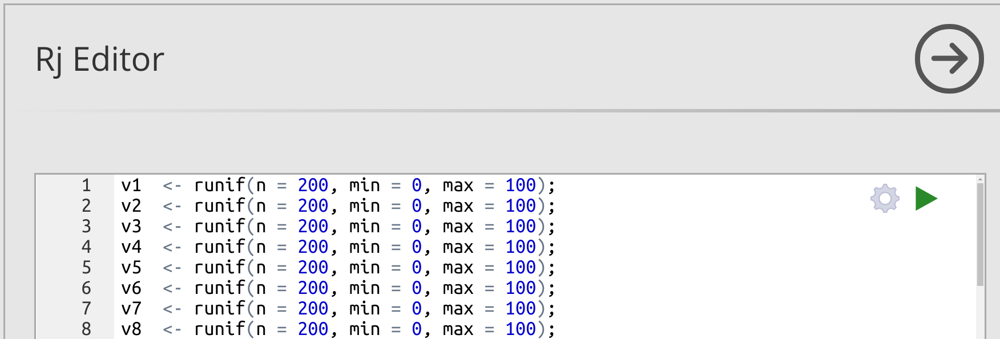
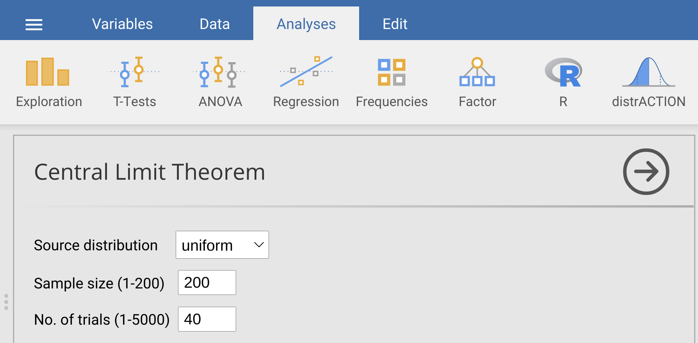

# (PART) Probability models and the Central Limit Theorem {-}

# Week 4 Overview {-}

General overview of what will be the focus of this week.

Week: 4
Dates: 
Suggested Readings: Textbook intro to probability
Assessments: Practice quiz
Practical:

# Introduction to probability models

Some background

## A practical example

How to think about probability


## Probability distributions

Some more useful examples

### Binomial distribution

Explanation, fairly straightforward

### Poisson distribution

Another example

### Normal distribution

Why this is so important


# The Central Limit Theorem (CLT)

General overview

## Examples of the CLT in action

## The standard normal distribution

## What are z-scores?


# _Practical_. Probability and simulation

This practical focuses on applying the concepts from chapter 14 and 15 in Jamovi.
There will be 3 exercises.

1. Calculating probabilities from a dataset.
2. Calculating probabilities from a normal distribution.
3. Demonstrating the central limit theorem (CLT).

To complete exercises 2 and 3, we will need to download and install two new Jamovi modules.
Jamovi Modules are add-ons that make it possible to run specialised statistical tools inside Jamovi.
These tools are written by a community of statisticians, scientists, and educators and listed in the [Jamovi library](https://www.jamovi.org/library.html).
Like Jamovi, these tools are open source and free to use.

The dataset for this practical is something a bit different.
It comes from the [Beacon Project](https://www.thebeaconproject.net/), which is an interdisciplinary scientific research programme led by [Dr Isabel Jones](https://www.stir.ac.uk/people/256518) at the University of Stirling.
This project focuses on large hydropower dams as a way to understand the trade-offs between different United Nations [Sustainable Development Goals](https://sdgs.un.org/goals).
It addresses challenging questions about environmental justice, biodiversity, and sustainable development.  
The project works with people affected, and sometimes displaced, by dam construction in Brazil, Kazakhstan, India, USA, and the UK.
Part of this project involves the use of mobile games to investigate how people make decisions about sustainable development.

```{r, echo = FALSE, fig.alt = "Decorative image shown of the interface of the mobile app game Power Up!", fig.cap = "Welcome screen of the mobile game Power Up!", out.width="80%"}
knitr::include_graphics("img/power_up.png")
```

The game "Power Up!" is freely available as an [Android](https://play.google.com/store/apps/details?id=com.hyperluminal.stirlinguniversity.sustainabledevelopmentgame) and [iPhone](https://apps.apple.com/gb/app/power-up/id1585634888) app (Figure 16.1).
Data are collected from players' decisions and used to investigate social-ecological questions.
We will use the [power_up](https://raw.githubusercontent.com/bradduthie/statistical_techniques/main/data/power_up.csv) dataset in exercises 1 and 2.
To get started, first download the [power_up](https://raw.githubusercontent.com/bradduthie/statistical_techniques/main/data/power_up.csv) dataset and open them in Jamovi.
Note that these data are already in a tidy format, so we do not need to do any reorganising.
The dataset includes columns for each player's ID, the OS that they use, the dam size that they decided to build in the game, their in-game investment in Biodiversity, Community, and Energy, and their final Score.


## Probabilities from a dataset

Suppose that we want to estimate the probability that a new Power Up! game player will be an Android user.
To estimate this probability, we can use the proportion of players in the dataset who are Android users.
To get this proportion, we need to divide the number of Android users by the total number of players,

$$P_{(Android)} = \frac{Number\:of\:Android\:users}{Number\:of\:players}.$$

In Jamovi, you could figure this out the long way by counting up the number of rows with 'Android' in the second column, then dividing by the total number of rows.
But there is an easier way, which is faster and less prone to human error than manually tallying up items.
To do this, go to the Analyses tab in Jamovi and navigate to Exploration, then Descriptives.
Place the 'OS' variable in to the 'Variables' box.
Next, find the check box called 'Frequency tables' just under the 'Split by' box and above the 'Statistics' drop down tab.
Check this box to get a table of frequencies for Android versus iPhone users.

```{r, echo = FALSE, fig.alt = "Jamovi interface of Descriptives with OS selected as a Variable and a frequency table to the right showing the frequencies of Android and iPhone users", fig.cap = "Jamovi Descriptives toolbar showing the OS column from the Power Up! dataset selected. The 'Frequency tables' checkbox builds a table of counts and percentages.", out.width="100%"}
power_up  <- read.csv("data/power_up.csv");
android_N <- sum(power_up$OS == "Android");
iPhone_N  <- sum(power_up$OS == "iPhone");
knitr::include_graphics("img/jamovi_power_up_frequencies.png")
```

The table of frequencies shown in Figure 16.2 includes counts of Android versus iPhone users.
We can see that `r android_N` of the `r dim(power_up)[1]` total game players use Android, while `r iPhone_N` players use iPhone.
To get the proportion of Android users we could divide `r android_N` by `r dim(power_up)[1]` to get `r android_N/dim(power_up)[1]`.
Similarly, the proportion of iPhone users, we could calculate `r iPhone_N` / `r dim(power_up)[1]` = `r iPhone_N/dim(power_up)[1]`.
But Jamovi already does that for us, with a bit of rounding.
The second column of the Frequencies table gives us these proportions, but expressed as a percentage.
The percentage of Android users is `r round(100 * android_N/dim(power_up)[1], digits = 1)`%, and the percentage of iPhone users is `r round(100 * iPhone_N/dim(power_up)[1], digits = 1)`%.
Percentages are out of a total of 100, so to get back to the proportions, we can just divide by 100, `r round(100 * android_N/dim(power_up)[1], digits = 1)` / 100 = `r round(100 * android_N/dim(power_up)[1], digits = 1)/100` for Android and `r round(100 * iPhone_N/dim(power_up)[1], digits = 1)` / 100 = `r round(100 * iPhone_N/dim(power_up)[1], digits = 1)/100` for iPhone.
To answer the original question, our best estimate of the probability that a new Power Up! game player will be an Android user is therefore `r round(android_N/dim(power_up)[1], digits = 3)`.

Next, use the same procedure to find the probability that a game player will make a small, medium, and large size dam.
Now, fill in Table 16.1 with counts, percentage, and the estimated probability of a player selecting a small, medium, or large dam.

| Dam size  |  Counts  |  Percentage |  Estimated Probability |
|-----------|----------|-------------|------------------------|
| Small     |          |             |                        |
| Medium    |          |             |                        |
| Large     |          |             |                        |

Table: Statistics of Power Up! decisions for dam size.

We can use these estimated probabilities of small, medium, and large dam size selection to predict what will happen in future games.
Suppose that a new player decides to play the game.
What is the probability that this player chooses a small **or** a large dam?

$Pr_{(small\:or\:large)} =$ : __________________________

Now suppose that 3 new players arrive and decide to play the game.
What is the probability that all 3 of these new players choose a large dam?

$Pr_{(3\:large)} =$ : __________________________

What is the probability that all 3 of these new players choose *different* dam sizes?

$Pr_{(small,\:medium,\:large)} =$ : __________________________

Now consider a slightly different type of question.
Instead of trying to predict the probability of new player decisions, we will focus on sampling from the existing power up dataset.
Imagine that you randomly choose one of the `r dim(power_up)[1]` players with equal probability (i.e., every player is equally likely to be chosen).
What is the probability that you choose player 20?

$Pr_{(Player\:20)} =$ : __________________________

What is the probability that you choose player 20, *then* choose a different player with a large dam?
As a hint, remember that you are now sampling *without replacement*. 
The second choice cannot be player 20 again, so the probability of choosing a player with a large dam has changed from the estimated probability in Table 16.1.

$Pr_{(Player\:20,\:Large)} =$ : __________________________

Now we can use the Descriptives tool in Jamovi to ask a slightly different question with the data.
Suppose that we wanted to estimate the probability that an Android user will choose a large dam.
We could multiply the proportion of Android users times the proportion of players who choose a large dam (i.e., find the probability of Android *and* large dam).
But this assumes that the two characteristics are independent (i.e., that Android users are not more or less likely than iPhone users to build large dams).
To estimate the probability that a player chooses a large dam *given* that they are using Android, we can keep Dam_size in the Variables box, but now put OS in the 'Split by' box.
Figure 16.3 shows the output of Jamovi.
A new frequency table breaks down dam choice for each OS.

```{r, echo = FALSE, fig.alt = "Jamovi interface of Descriptives with dam size selected as a Variable split by OS, and a frequency table to the right showing the frequencies of Android and iPhone users who chose small, medium, and large dams.", fig.cap = "Jamovi Descriptives toolbar showing the dam size column from the Power Up! dataset selected as a variable split by OS. The 'Frequency tables' checkbox builds a table of counts for small, medium, and large dam size broken down by Android versus iPhone OS.", out.width="100%"}

```


To get the proportion of Android users who choose to build a large dam, we just need to divide the number of Android users who chose the large dam size by the total number of Android users (i.e., sum of the first column in the Frequencies table; Figure 16.3).

$$P_{(Large | Android)} = \frac{Number\:of\:Android\:users\:choosing\:large\:dam}{Number\:of\:Android\:users}.$$

Now, recreate the table in Figure 16.3 and estimate the probability that an Android user will choose to build a large dam,

$P_{(Large | Android)} =$ : __________________________

Is $P_{(Large | Android)}$ much different from the probability that *any* player chooses a large dam, as calculated in Table 16.1? Do you think that the difference is significant?


```


```

Next, we will move on to calculating probabilities from a normal distribution.


## Probabilities from a normal distribution

In the example of the first exercise, we looked at OS and dam size choice.
Players only use Android or iPhone, and they could only choose one of three sizes of dam.
For these nominal variables, estimating the probability of a particular discrete outcome (e.g., Android versus iPhone) was just a matter of dividing counts.
But we cannot use the same approach for calculating probabilities from continuous data.
Consider, for example, the final score for each player in the column 'Score'.
Because of how the game was designed, Score can potentially be any real number, although most scores are somewhere around 100.
We can use a histogram to see the distribution of player scores (Figure 16.4).

```{r, echo = FALSE, fig.alt = "A histogram is shown with a normal shape. The x-axis is labelled 'Player Score'.", fig.cap = "Distribution of player scores in the game Power Up!", out.width="100%"}
hist(x = power_up$Score, xlab = "Player Score", cex.lab = 1.25, cex.axis = 1.25,
     main = "", freq = FALSE);
```

In this case, it does not really make sense to ask what the probability is of a particular score.
If the score can take *any* real value, out to as many decimals as we want, then what is the probability of a score being *exactly* 94.97 (i.e., 94.97 with infinite zeros after it, $94.9700000\bar{0}$)?
The probability is infinitesimal, i.e., basically zero, because there are an infinite number of real numbers.
Consequently, we are not really interested in the probabilities of specific values of continuous data.
Instead, we want to focus on intervals.
For example, what is the probability that a player scores higher than 120?
What is the probability that a player scores lower than 100?
What is the probability that a player scores between 120 and 100?

Take another look at Figure 16.4 above, then take a guess at each of these probabilities.
As a hint, the y-axis of this histogram is showing density instead of frequency.
What this means is that the total grey area (i.e., the histogram bars) sums to 1.
Guessing the probability that a player scores higher than 120 is the same as guessing the proportion of grey space in the highest 4 bars of Figure 16.4 (i.e., grey space >120).

$P_{(Score>120)} =$ : __________________________

$P_{(Score<100)} =$ : __________________________


$P_{(100<Score<120)} =$ : __________________________

Trying to do this by looking at a histogram is not easy, and it is really not the best way to get the above probabilities.
We can get much better estimates using Jamovi, but we need to make an assumption about the distribution of Player Score.
Specifically, we need to assume that the distribution of Player Score has a specific shape.
More technically, we must assume a specific probability density function that we can use to mathematically calculate probabilities of different ranges of player scores.
Inspecting Figure 16.4, Player Score appears to be normally distributed.
In other words, the shape of Player Score distribution appears to be normal, or 'Gaussian'.
If we are willing to assume this, then we can calculate probabilities using its mean and standard deviation.
Use Jamovi to find the mean and the standard deviation of player score (note, we can just say that score is unitless, so no need to include units).

Mean score: __________________________

Standard deviation score: __________________________

We will assume that the *sample* of scores shown in Figure 16.4 came from a *population* that is normally distributed with the mean and standard deviation above that you wrote above (recall sample versus population from [Chapter 4](#Chapter_4)).
We can overlay his distribution on the histogram above using a curved line (Figure 16.5).

```{r, echo = FALSE, fig.alt = "A histogram is shown with a normal shape. The x-axis is labelled 'Player Score', and there is a line indicating the probability density function of a normal distribution overlaid.", fig.cap = "Distribution of player scores in the game Power Up! shown in histogram bars. The overlaid curve shows the probability density function for a normal distribution that has the same mean and standard deviation as the sample described by the histogram.", out.width="100%"}
hist(x = power_up$Score, xlab = "Player Score", cex.lab = 1.25, cex.axis = 1.25,
     main = "", freq = FALSE);
mnsc <- mean(power_up$Score);
sdsc <- sd(power_up$Score);
xx   <- seq(from = 30, to = 180, by = 0.001);
d_yy <- dnorm(x = xx, mean = mnsc, sd = sdsc);
points(x = xx, y = d_yy, type = "l", lwd = 3);
```


We can interpret the area under the curve in the same way that we interpret the area in the grey bars. 
As mentioned earlier, the total area of the histogram bars must sum to 1.
The total area under the curve must also sum to 1.
Both represent the probability of different ranges of player scores.
Notice that the normal distribution is not a perfect match for the histogram bars.
For example, the middle bar of values illustrating scores between 90 and 100 appears to be a bit low compared to a perfect normal distribution, and there are more scores between 40 and 50 than we might expect.
Nevertheless, the two distributions broadly overlap, so we might be willing to assume that the player scores represented in the histogram bars are sampled from the population described by the curve.

Because the curve relating player score to probability density is described by an equation (see [Chapter 14](#Chapter_14)), we can use that equation to make inferences about the probabilities of different ranges of scores.
The simplest example is the mean of the distribution.
Because the normal distribution is symmetric, the area to the left of the mean must be the same as the area to the right of the mean.
And since the whole area under the curve must sum to 1, we can conclude that the probability of sampling a player score that is less than the mean is 1/2, and the probability of sampling a player score greater than the mean is also 1/2.
Traditionally, we would need to do some maths to get other player score probabilities, but Jamovi can do this much more easily.

To get Jamovi to calculate probabilities from a normal distribution, we need to go to the Modules option and download a new module (Figure 16.5).


```{r, echo = FALSE, fig.alt = "Jamovi toolbar is shown, which includes an option on the far right hand side called 'modules'.", fig.cap = "Jamovi tool bar, which includes an option for downloading new Modules (right hand side)", out.width="100%"}
knitr::include_graphics("img/jamovi_toolbar_modules.png")
```

Click on the 'Modules' button, and select the first option called 'jamovi library' from the pull-down menu.
From the 'Available' tab, scroll down until you find the Module called 'distrACTION - Quantiles and Probabilities of Continuous and Discrete Distributions' [@Rihs2018].
Click the 'Install' button to install it into Jamovi.
A new button in the toolbar called 'distrACTION' should become visible (Figure 16.6).

```{r, echo = FALSE, fig.alt = "Jamovi toolbar is shown, which includes an option on the far right hand side called 'modules' and a button called distrACTION.", fig.cap = "Jamovi tool bar, which includes an added module called distrACTION.", out.width="100%"}
knitr::include_graphics("img/jamovi_toolbar_modules_distrACTION.png")
```

If the module is not there, then it should be possible to find by again going to Modules and selecting distrACTION from the pulldown menu.
Click on the module and choose 'Normal Distribution' from the pulldown menu.
Next, we can see a box for the mean and standard deviation (SD) under the 'Parameters' subtitle in bold.
Put the mean and the standard deviation calculated from above into these boxes.
In the panel on the right, Jamovi will produce the same normal distribution that is in Figure 16.5 (note that the axes might be scaled a bit differently).

Given this normal distribution, we can compute the probability that a player scores less than x1 = 80 by checking the box 'Compute probability', which is located just under 'Function' (Figure 16.8).
We can then select the first radio button to find the probability that a randomly sampled value X from this distribution is less than x1, $P(X \leq x1)$.
Notice in the panel on the right that the probability is given as $P =$ `r round(pnorm(q = 80, mean = mean(power_up$Score), sd = sd(power_up$Score)), digits = 3)`.
This is also represented in the plot of the normal distribution, with the same proportion in the lower part of the distribution shaded ($P =$ `r round(pnorm(q = 80, mean = mean(power_up$Score), sd = sd(power_up$Score)), digits = 3)`, i.e., ca `r round(pnorm(q = 80, mean = mean(power_up$Score), sd = sd(power_up$Score)), digits = 3) * 100` per cent).

```{r, echo = FALSE, fig.alt = "Jamovi options for a module that calculates probabilities associated with a normal distribution, with computing probability checkboxes and radio buttons selected", fig.cap = "Jamovi options for the distrACTION module for computing probability for a given normal distribution. The example shown here calculates the probability that a value sampled from the normal distribution of interest is less than 80.", out.width="80%"}
knitr::include_graphics("img/jamovi_normal_distribution.png")
```

To find the probability that a value is greater than 80, we could subtract our answer of `r round(pnorm(q = 80, mean = mean(power_up$Score), sd = sd(power_up$Score)), digits = 3)` from 1, $1 - `r round(pnorm(q = 80, mean = mean(power_up$Score), sd = sd(power_up$Score)), digits = 3)` = `r 1 - round(pnorm(q = 80, mean = mean(power_up$Score), sd = sd(power_up$Score)), digits = 3)`$ (remember that the total area under the normal curve equals 1, so the shaded plus the unshaded region must also equal 1; hence, 1 minus the shaded region gives us the unshaded region).
We could also just select the second radio button for $P(X \geq x1)$.
Give this a try, and notice that the shaded and unshaded regions have flipped in the plot, and we get our answer in the table of $P =$ `r 1 - round(pnorm(q = 80, mean = mean(power_up$Score), sd = sd(power_up$Score)), digits = 3)`.

Finally, to compute the probability of an interval, we can check the third radio button and set x2 in the bottom box (Figure 16.8). 
For example, to see the probability of a score between 80 and 120, we can choose select $P(x1 \leq X \leq x2)$, then setting x2 = 120 in the bottom box.
Notice where the shaded area is in the newly drawn plot.
What is the probability of a player getting a score between 80 and 120?

$P(80 \leq X \leq 120)$ = : __________________________

What is the probability of a player getting a score greater than 130?

$P(X \geq 130)$ = : __________________________

Now try the following probabilities for different scores.

$P(X \geq 120)$ = : __________________________


$P(X \leq 100)$ = : __________________________


$P(100 \leq X \leq 120)$ = : __________________________

Note, these last three were the same intervals that you guessed using the histogram. 
How close was your original guess to the calculations above?

```


```


One last one.
What is the probability of a player getting a score lower than 70 or higher than 130?

$P(X \leq 70 \: | \: X \geq 130)$ = : __________________________

There is more than one way to figure this last one out.
How did you do it, and what was your reasoning?


```


```


We will now move on to the central limit theorem.


## Central limit theorem


To demonstrate the central limit theorem, we need to download and install another module in Jamovi.
This time, go to 'Modules', and from the 'Available' tab, scroll down until you find 'Rj' in the Jamovi library.
Install 'Rj', then a new button 'R' should become available in the toolbar.
This will allow us to run a bit of script using the coding language R.
We will work with R a bit more in future practicals, but for now you will not need to do anymore than copying and pasting code.
For now, click on the new 'R' button in the toolbar and select 'Rj Editor' from the pulldown menu.
You will see an open editor; this is where the code will go.
If it has some code in it already (e.g., `# summary(data[1:3])`), just delete it so that we can start with a clean slate.
Copy and paste the following lines into the Rjeditor.


```{r, eval = FALSE}
v1  <- runif(n = 200, min = 0, max = 100);
v2  <- runif(n = 200, min = 0, max = 100);
v3  <- runif(n = 200, min = 0, max = 100);
v4  <- runif(n = 200, min = 0, max = 100);
v5  <- runif(n = 200, min = 0, max = 100);
v6  <- runif(n = 200, min = 0, max = 100);
v7  <- runif(n = 200, min = 0, max = 100);
v8  <- runif(n = 200, min = 0, max = 100);
v9  <- runif(n = 200, min = 0, max = 100);
v10 <- runif(n = 200, min = 0, max = 100);
v11 <- runif(n = 200, min = 0, max = 100);
v12 <- runif(n = 200, min = 0, max = 100);
v13 <- runif(n = 200, min = 0, max = 100);
v14 <- runif(n = 200, min = 0, max = 100);
v15 <- runif(n = 200, min = 0, max = 100);
v16 <- runif(n = 200, min = 0, max = 100);
v17 <- runif(n = 200, min = 0, max = 100);
v18 <- runif(n = 200, min = 0, max = 100);
v19 <- runif(n = 200, min = 0, max = 100);
v20 <- runif(n = 200, min = 0, max = 100);
v21 <- runif(n = 200, min = 0, max = 100);
v22 <- runif(n = 200, min = 0, max = 100);
v23 <- runif(n = 200, min = 0, max = 100);
v24 <- runif(n = 200, min = 0, max = 100);
v25 <- runif(n = 200, min = 0, max = 100);
v26 <- runif(n = 200, min = 0, max = 100);
v27 <- runif(n = 200, min = 0, max = 100);
v28 <- runif(n = 200, min = 0, max = 100);
v29 <- runif(n = 200, min = 0, max = 100);
v30 <- runif(n = 200, min = 0, max = 100);
v31 <- runif(n = 200, min = 0, max = 100);
v32 <- runif(n = 200, min = 0, max = 100);
v33 <- runif(n = 200, min = 0, max = 100);
v34 <- runif(n = 200, min = 0, max = 100);
v35 <- runif(n = 200, min = 0, max = 100);
v36 <- runif(n = 200, min = 0, max = 100);
v37 <- runif(n = 200, min = 0, max = 100);
v38 <- runif(n = 200, min = 0, max = 100);
v39 <- runif(n = 200, min = 0, max = 100);
v40 <- runif(n = 200, min = 0, max = 100);

hist(x = v1, main = "", xlab = "Random uniform variable");
```


What this code is doing is creating 40 different datasets of 200 random numbers from 0 to 100 (there is a way to do all of this in much fewer lines of code, but it requires a bit more advanced use of R).
The `hist` function plots a histogram of the first variable.
To run the code, find the green triangle in the upper right (Figure 16.9).

```{r, echo = FALSE, fig.alt = "Jamovi window with an R editor open and several lines of code for generating uniform numbers.", fig.cap = "Jamovi interface for the Rj Editor module. Code can be run by clicking on the green triangle in the upper left.", out.width="80%"}

```


When you run the code, the 40 new variables will be created, each variable being made up of 200 random numbers.
The histogram for `v1` is plotted to the right (to plot other variables, substitute `v1` in the `hist` function for some other variable).
How would you describe the shape of the distribution of `v1`?

```


```


Next, we are going to get the mean value of each of the 40 variables. 
To do this, copy the code below and paste it at the bottom of the Rj Editor (somewhere below the `hist` function).

```{r, eval = FALSE}
m1  <- mean(v1);
m2  <- mean(v2);
m3  <- mean(v3);
m4  <- mean(v4);
m5  <- mean(v5);
m6  <- mean(v6);
m7  <- mean(v7);
m8  <- mean(v8);
m9  <- mean(v9);
m10 <- mean(v10);
m11 <- mean(v11);
m12 <- mean(v12);
m13 <- mean(v13);
m14 <- mean(v14);
m15 <- mean(v15);
m16 <- mean(v16);
m17 <- mean(v17);
m18 <- mean(v18);
m19 <- mean(v19);
m20 <- mean(v20);
m21 <- mean(v21);
m22 <- mean(v22);
m23 <- mean(v23);
m24 <- mean(v24);
m25 <- mean(v25);
m26 <- mean(v26);
m27 <- mean(v27);
m28 <- mean(v28);
m29 <- mean(v29);
m30 <- mean(v30);
m31 <- mean(v31);
m32 <- mean(v32);
m33 <- mean(v33);
m34 <- mean(v34);
m35 <- mean(v35);
m36 <- mean(v36);
m37 <- mean(v37);
m38 <- mean(v38);
m39 <- mean(v39);
m40 <- mean(v40);

all_means <- c(m1,  m2,  m3,  m4,  m5,  m6,  m7,  m8,  m9,  m10, 
               m11, m12, m13, m14, m15, m16, m17, m18, m19, m20,
               m21, m22, m23, m24, m25, m26, m27, m28, m29, m30,
               m31, m32, m33, m34, m35, m36, m37, m38, m39, m40);
```


Now we have calculated the mean for each variable.
The last line of code defines `all_means`, which makes a new dataset that includes the mean value of each of our original variables.
Think about what you think the distribution of these mean values will look like. 
Sketch what you predict the shape of its distribution will be below.

```


```


Now, add one more line of code to the very bottom of the Rj Editor.


```{r, eval = FALSE}
hist(x = all_means, main = "", xlab = "All variable means");
```

This last line will make a histogram of the means of all 40 variables.
Click the green button again to run the code.
Compare the distribution of the original `v1` to the means of variables 1-40, and to your prediction above.
Is this what you expected?
As best you can, explain why the shapes of the two distributions differ.


```


```

We did all of this the long way to make it easier to see and think about the relationship between the original, uniformly distributed, variables and the distribution of their means.
Now, we can repeat this more quickly using one more Jamovi module.
Go to 'Modules', and from the 'Available' tab, download the 'clt - Demonstrations' module from the Jamovi library.
Once it is downloaded, go to the 'Demonstrations' button in the Jamovi toolbar and select 'Central Limit Theorem' from the pulldown menu.


```{r, echo = FALSE, fig.alt = "Jamovi window with the central limit theorem (CLT) module open and boxes for changing the distribution, sample size, and trial number", fig.cap = "Jamovi interface for the 'Demonstrations' module, which allows users to randomly generate data from a specific source distribution (normal, uniform, geometric, lognormal, and binary), sample size, and number of trials (i.e., variables)", out.width="80%"}

```


To replicate what we did in the Rjeditor above, we just need to set the 'Source distribution' to 'uniform' using the pulldown menu, set the sample size to 200, and set the number of trials to 40 (Figure 16.10).
Try doing this, then look at the histogram generated to the lower right.
It should look similar, but not identical, to the histogram produced with the R code.
Now try increasing the number of trials to 200. 
What happens to the histogram?
What about when you increase the number of trials to 2000?


```


```

Try playing around with different source distributions, sample sizes, and numbers of trials.
What general conclusion can you make about the distribution of sample means from the different distributions?

```


```


