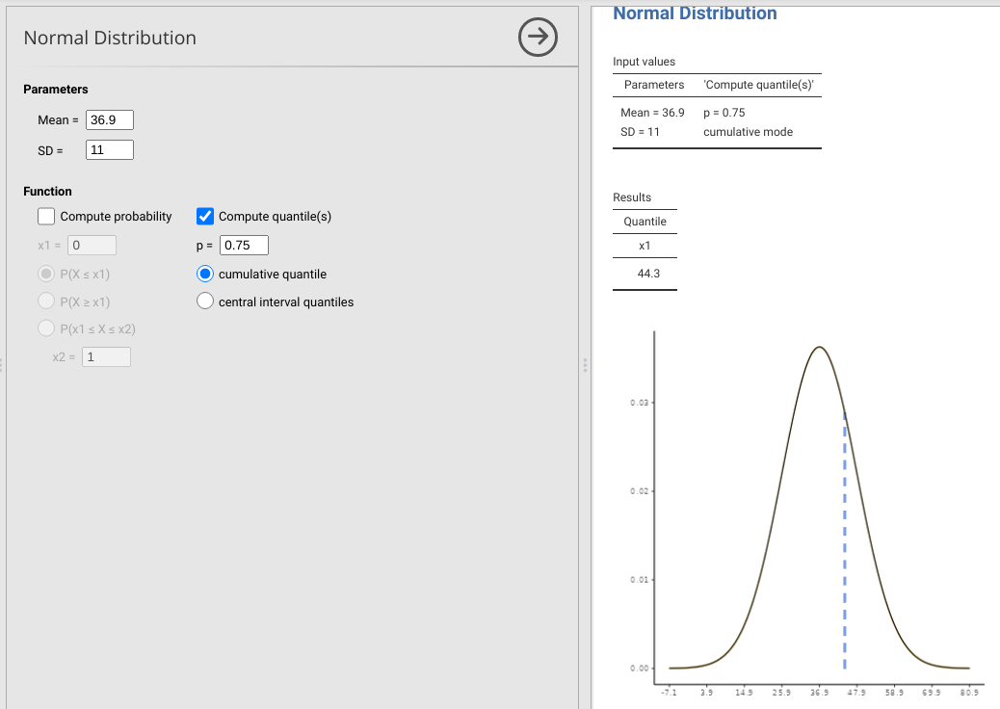

# (PART) Statistical inference {-}

# Week 5 Overview {-#Week5}

|                 |                                   |
|-----------------|-----------------------------------|
| **Dates**       | 20 February 2023 - 24 February 2023 |
| **Reading**     | **Required:**  SCIU4T4 Workbook chapters 17 and 18  |
|                 | **Recommended:** None    |
|                 | **Suggested:**   @Fedor-Freybergh2006 ([Download](http://portal.fmed.uniba.sk/download.php?fid=280)) |
|                 | **Advanced:** None |
| **Lectures**    | 5.1: Some background for confidence intervals (6:36 min; [Video](https://stirling.cloud.panopto.eu/Panopto/Pages/Viewer.aspx?id=f56a623e-1d54-4aea-b310-af9e00c2e8c5)) |
|                 | 5.2: Recap of z-scores (10:47 min; [Video](https://stirling.cloud.panopto.eu/Panopto/Pages/Viewer.aspx?id=b1e79c1d-e0ad-4048-930b-af9e00c44b35)) |
|                 | 5.3: Confidence interval for the population mean (14:08 min [Video](https://stirling.cloud.panopto.eu/Panopto/Pages/Viewer.aspx?id=ea812a85-4a03-4d15-9812-af9e00c6a55e)) |
|                 | 5.4: The t-interval (10:24 min;  [Video](https://stirling.cloud.panopto.eu/Panopto/Pages/Viewer.aspx?id=1972834b-3c22-4ab1-aea4-af9e00c8995f)) |
|                 | 5.5: Confidence interval for the population proportion (6:37 min;  [Video](https://stirling.cloud.panopto.eu/Panopto/Pages/Viewer.aspx?id=f3fcb762-1002-42ea-b949-afa5011f98a1)) |
| **Practical**   | z- and t- intervals ([Chapter 19](#Chapter_19))       |
|                 |   Room: Cottrell 2A17         |
|                 |   Group A: 22 FEB 2023 (WED) 13:05-15:55 |
|                 |   Group B: 23 FEB 2023 (THU) 09:05-11:55 |
| **Help hours**  | Ian Jones                       |
|                 |   Room: Cottrell 1A13           |
|                 |   24 FEB 2023 (FRI) 15:05-17:55 |
| **Assessments** | [Week 5 Practice quiz](https://canvas.stir.ac.uk/courses/13075/quizzes/30516) on Canvas  |


Week 5 focuses making statistical inferences using confidence intervals (CIs) and and introduces the t-interval.

[Chapter 17](#Chapter_17) introduces what confidence intervals are and how to calculate them for normally and binomially distributed variables.

[Chapter 18](#Chapter_18) introduces the t-interval and explains why this interval is usually necessary for calculating confidence intervals.

[Chapter 19](#Chapter_19) guides you through the week 5 practical.
The aim of this practical is to practice working with intervals and calculating confidence intervals.


# Confidence intervals (CIs) {#Chapter_17}

In [Chapter 15](#Chapter_15), we saw how it is possible to calculate the probability of sampling values from a specific interval of the normal distribution (e.g., the probability of sampling a value within 1 standard deviation of the mean).
In this chapter, we will see how to apply this knowledge to calculating intervals that express confidence in the mean value of a population.

Remember that we almost never really know the true mean value of a *population*, $\mu$.
Our best estimate of $\mu$ is the mean that we have calculated from a *sample*, $\bar{x}$ (see [Chapter 4](#Chapter_4) for a review of the difference between populations and samples).
But how good of an estimate is $\bar{x}$ of $\mu$, really?
Since we cannot know $\mu$, one way of answering this question is to find an interval that expresses a degree of confidence about the value of $\mu$.
The idea is to calculate 2 numbers that we can say with some degree of confidence that $\mu$ is between (i.e., a lower confidence interval and an upper confidence interval).
The wider this interval is, the more confident that we can be that the true mean $\mu$ is somewhere within it.
The narrower the interval is, the less confident we can be that our confidence intervals (CIs) contain $\mu$.

Confidence intervals are notoriously easy to misunderstand.
We will explain this verbally first, focusing on the general ideas rather than the technical details.
Then we will present the calculations before coming back to their interpretation again.
The idea follows a similar logic to the standard error from [Chapter 12](#Chapter_12).

Suppose that we want to know the mean body mass of all domestic cats (Figure 17.1).
We cannot weigh every living cat in the world, but maybe we can find enough to get a sample of 20.
From these 20 cats, we want to find some interval of masses (e.g., 3.9-4.3 kg) within which the *true* mean mass of the population is contained.
The only way to be 100\% certain that our proposed interval *definitely* contains the true mean would be to make the interval absurdly large.
Instead, we might more sensibly ask what the interval would need to be to contain the mean with 95\% confidence.
What does "with 95\% confidence" actually mean?
It means when we do the calculation to get the interval, the true mean should be somewhere within the interval 95\% of the time that a sample is collected.

```{r, echo = FALSE, fig.alt = "Two cats sitting close together on a windowsill, a large orange one in the front and small black and brown one in the back", fig.cap = "Two domestic cats sitting side by side with much different body masses.", out.width="100%"}
knitr::include_graphics("img/housecats.png");
```

In other words, if we were to go back out and collect another sample of 20 cats, and then another, and another (and so forth), calculating 95\% CIs each time, then in 95\% of our samples the true mean will be within our CIs (meaning that 5\% of the time it will be outside the CIs).
Note that this is slightly different than saying that there is a 95\% probability that the true mean is between our CIs.[^19]
Instead, the idea is that if we were to repeatedly resample from a population and calculate CIs each time, then 95\% of the time the true mean would be within our CIs [@Sokal1995].
If this idea does not make sense at first, that is okay.
The calculation is actually relatively straightforward, and we will come back to the statistical concept again afterwards to interpret it.
First we will look at CIs assuming a normal distribution, then the special case of a binomial distribution.

[^19]: The reason that these two ideas are different has to do with the way that probability is defined in the frequentist approach to statistics (see [Chapter 14](#Chapter_14)). With this approach, there is no way to get the probability of the true mean being within an interval, strictly speaking. Other approaches to probability, such as Bayesian probability, do allow you to build intervals in which the true mean is contained with some probability. These are called "credible intervals" rather than "confidence intervals" [e.g., @Ellison2004]. The downside to credible intervals (or not, depending on your philosophy of statistics) is that Bayesian probability is at least partly subjective; i.e., based in some way on the subjective opinion of the individual researcher.


## Normal distribution CIs

Remember from the Central Limit Theorem in [Chapter 15](#Chapter_15) that as our sample size $N$ increases, the distribution of our sample mean $\bar{x}$ will start looking more and more like a normal distribution.
Also from [Chapter 15](#Chapter_15), we know that we can calculate the probability associated with any interval of values in a normal distribution.
For example, we saw that about 68.2\% of the probability density of a normal distribution is contained within a standard deviation of the mean.
We can use this knowledge from [Chapter 15](#Chapter_15) to set confidence intervals for any percentage of values around the sample mean ($\bar{x}$) using a standard error (SE) and z-score (z).
Confidence intervals include 2 numbers.
The **lower confidence interval** (LCI) is below the mean, and the **upper confidence interval** (UCI) is above the mean.
Here is how they are calculated,

$$LCI = \bar{x} - (z \times SE),$$

$$UCI = \bar{x} + (z \times SE).$$

Note that the equations are the same, except that for the LCI, we are subtracting $z \times SE$, and for the UCI we are adding it.
The specific value of z determines the confidence interval that we are calculating.
For example, about 95\% of the probability density of a standard normal distribution lies between $z = -1.96$ and $z = 1.96$ (Figure 17.2).
Hence, if we use $z = 1.96$ to calculate LCI and UCI, we would be getting 95\% confidence intervals around our mean.

```{r, echo = FALSE, fig.alt = "A plot of a bell curve in which the middle 95 per cent of the distribution is shaded in grey. A value of zero centres the x-axis, which is labelled 'z-score'.", fig.cap = "A standard normal probability distribution showing 95 per cent of probability density surrounding the mean."}
par(mar = c(5, 5, 1.5, 1.5));
xx       <- seq(from = -5, to = 5, by = 0.001);
xx_vals  <- 3041:6961;
pr_norm  <- dnorm(x = xx, mean = 0, sd = 1);
plot(x = xx, y = pr_norm, type = "l", ylim = c(0, 0.48), 
     ylab = "Probability",  xlab = "z score", lwd = 3, xlim = c(-3, 3),
     cex.lab = 1.25, cex.axis = 1.25, yaxs = "i");
polygon(c(xx[xx_vals], xx[6961], xx[3041]), 
        c(pr_norm[xx_vals], 0, 0), col="grey");
text(x = 0, y = 0.18, cex = 1.5, labels = "95%");
```

An [interactive application](https://bradduthie.shinyapps.io/zandp/) helps visualise the relationship between probability intervals and z-scores more generally (make sure to set 'Tailed' to 'Two-tailed' using the pulldown menu).

> [Click here](https://bradduthie.shinyapps.io/zandp/) for an interactive application demonstrating the relationship between probability intervals and z-scores.

Now suppose that we want to calculate 95\% CIs around the sample mean of our $N = 20$ domestic cats from earlier. 
We find that the mean body mass of cats in our sample is $\bar{x} = 4.1$ kg, and that the standard deviation is $s = 0.6$ kg (suppose that we are willing to assume, for now, that $s = \sigma$; that is, we know the true standard deviation of the population).
Remember from [Chapter 12](#Chapter_12) that the sample standard error can be calculated as $s / \sqrt{N}$.
Our lower 95\% confidence interval is therefore,

$$LCI_{95\%} = 4.1 - \left(1.96 \times \frac{0.6}{\sqrt{20}}\right) = 3.837$$

Our upper 95\% confidence interval is,

$$UCI_{95\%} = 4.1 + \left(1.96 \times \frac{0.6}{\sqrt{20}}\right) = 4.363$$

Our 95\% CIs are therefore $LCI = 3.837$ and $UCI = 4.363$.
We can now come back to the statistical concept of what this actually means.
If we were to go out and repeatedly collect new samples of 20 cats, and do the above calculations each time, then 95\% of the time our true mean cat body mass would be somewhere between the LCI and UCI.

Ninety-five per cent confidence intervals are the most commonly used in biological and environmental sciences.
In other words, we accept that about 5\% of the time (1 in 20 times), our confidence intervals will not contain the true mean that we are trying to estimate.
Suppose, however, that we wanted to be a bit more cautious.
We could calculate 99\% CIs; that is, CIs that contain the true mean in 99\% of samples.
To do this, we just need to find the z-score that corresponds with 99\% of the probability density of the standard normal distribution.
This value is about $z = 2.58$, which we could find with the [interactive application](https://bradduthie.shinyapps.io/zandp/), a [z table](https://www.z-table.com/), some maths, or a quick online search[^20].
Consequently, the upper 99\% confidence interval for our example of cat body masses would be,

$$LCI_{99\%} = 4.1 - \left(2.58 \times \frac{0.6}{\sqrt{20}}\right) = 3.754$$

Our upper 99\% confidence interval is,

$$UCI_{99\%} = 4.1 + \left(2.58 \times \frac{0.6}{\sqrt{20}}\right) = 4.446$$

Notice that the confidence intervals became wider around the sample mean.
The 99\% CI is now 3.754-4.446, while the 95\% CI was 3.837-4.363
This is because if we want to be more confident about our interval containing the true mean, we need to make a bigger interval.

We could make CIs using any percentage that we want, but in practice it is very rare to see anything other than 90\% ($z = 1.65$), 95\% ($z = 1.96$), or 99\% ($z = 2.58$).
It is useful to see what these different intervals actually look like when calculated from actual data, so this [interactive application](https://bradduthie.shinyapps.io/CI_hist_app/) illustrates CIs on a histogram with red dotted lines next to the LCI and UCI equations.

> [Click here](https://bradduthie.shinyapps.io/CI_hist_app/) for an interactive application demonstrating confidence intervals.

Unfortunately, the CI calculations from the this section are a bit of an idealised situation.
We assumed that the sample means are normally distributed around the population mean.
While we know that this *should* be the case as our sample size increases, it is not quite true when our sample is small.
In practice, what this means is that our z-scores are usually not going to be the best values to use when calculating CIs, although they are often good enough when a sample size is large[^21].
We will see what to do about this in [Chapter 18](#Chapter_18), but first we turn to the special case of how to calculate CIs from binomial proportions.

[^20]: While it is always important to be careful when searching, typing "z score 99 percent confidence interval" will almost always get the intended result. 

[^21]: What defines a 'small' or a 'large' sample is a bit arbitrary. A popular suggestion [e.g., @Sokal1995 page 145] is that any $N < 30$ is too small to use z-scores, but any cut-off $N$ is going to be somewhat arbitrary. Technically, the z score is not **completely** accurate until $N \to \infty$, but for all intents and purposes, it is usually only trivially inaccurate for sample sizes in the hundreds. Fortunately, you do not need to worry about any of this when calculating CIs from continuous data in Jamovi because Jamovi applies a correction for you, which we will look at in [Chapter 18](#Chapter_18).


## Binomial distribution CIs

For a binomial distribution, our data are counts of successes and failures (see [Chapter 14](#Chapter_14)).
For example, we might flip a coin 40 times and observe 22 heads and 18 tails.
Suppose that we do not know in advance the coin is fair, so we cannot be sure that the probability of it landing on heads is $p = 0.5$.
From our collected data, our estimated probability of landing on heads is, $\hat{p} = 22/40 = 0.55$.[^22]
But how would we calculate the CIs around this estimate?
In this case, the formula is similar to ones for LCI and UCI from the normal distribution shown earlier.
We just need to note that the variance of $p$ for a binomial distribution is $\sigma^{2} = p\left(1 - p\right)$ [@Box1978; @Sokal1995].[^23]
This means that the standard deviation of $p$ is $\sigma = \sqrt{p\left(1 - p\right)}$, and $p$ has a standard error,

$$SE(p) = \sqrt{\frac{p\left(1 - p\right)}{N}}.$$

We can use this standard error in the same equation from earlier for calculating confidence intervals.
For example, if we wanted to calculate the lower 95\% CI for $\hat{p} = 0.55$,

$$LCI_{95\%} = 0.55 - 1.96 \sqrt{\frac{0.55\left(1 - 0.55\right)}{40}} = 0.396$$

Similarly, to calculate the upper 95\% CI,

$$UCI_{95\%} = 0.55 + 1.96 \sqrt{\frac{0.55\left(1 - 0.55\right)}{40}} = 0.704.$$

Our conclusion is that, based on our sample, 95\% of the time we flip a coin 40 times, the true mean $p$ will be somewhere between 0.396 and 0.704. 
These are quite wide CIs, which suggests that our flip of $\hat{p} = 0.55$ would not be particularly remarkable even if the coin was fair ($p = 0.5$).[^24]

We can do another example, this time with our example of the probability of testing positive for Covid-19 at $\hat{p} = 0.025$.
Suppose this value of $\hat{p}$ was calculated from a survey of 400 people ($N = 400$).
We might want to be especially cautious about estimating CIs around such an important probability, so perhaps we prefer to use 99\% CIs instead of 95\% CIs.
In this case, we use $z = 2.58$ as with the normal distribution example from earlier.
But we apply this z score using the binomial standard error to get the LCI,

$$LCI_{99\%} = 0.025 - 2.58 \sqrt{\frac{0.025\left(1 - 0.025\right)}{400}} = 0.00486$$

Similarly, we get the UCI,

$$UCI_{99\%} = 0.025 + 2.58 \sqrt{\frac{0.025\left(1 - 0.025\right)}{400}} = 0.0451.$$

Notice that the LCI and UCI differ here by about an order of magnitude (i.e., the UCI is about 10 times higher than the LCI).

In summary, this chapter has focused on what confidence intervals are and how to calculate them.
[Chapter 18](#Chapter_18) will turn to the t-interval, what it is and why it is used.


[^22]: The hat over the P, ($\hat{P}$) is just being used here to indicate the *estimate* of $P(heads)$, rather than the *true* $P(heads)$.

[^23]: Note, the variance of total *successes* is simply $np\left(1 - p\right)$; i.e., just multiply the variance of $p$ by $n$.

[^24]: You might ask, why are we doing all of this for the binomial distribution? The central limit theorem is supposed to work for the mean of any distribution, so should that not include the distribution of $p$ too? Can we not just indicate success (heads) with a 1 and failures (tails) with a 0, then estimate the standard error of 22 values of 1 and 18 values of 0? Well, yes! That actually does work and gives an estimate of 0.079663, which is very close to the $\sqrt{\hat{p}(1-\hat{p})/N} = 0.078661$. The problem arises when the sample size is low, or when $p$ is close to 0 or 1, and we are trying to map the z score to probability density. For this reason, it is best to stick with $\sqrt{\hat{p}(1-\hat{p})/N}$. There are other methods that attempt to give even better estimates (the one we are using is called the Wald method), but we will not consider these here.


# The t-interval {#Chapter_18}

[Chapter 14](#Chapter_14) introduced the binomial, Poisson, uniform, and normal distributions.
In this chapter, we introduce another distribution, the t-distribution.
Unlike the distributions of [Chapter 14](#Chapter_14), the t-distribution arises from the need to make accurate statistical inferences, not from any particular kind of data (e.g., successes or failures in a binomial distribution, or events happening over time in a Poisson distribution).
In [Chapter 17](#Chapter_17), we calculated confidence intervals (CIs) using the normal distribution and z-scores.
In doing so, we made the assumption that the sample standard deviation ($s$) was the same as the population standard deviation ($\sigma$), $s = \sigma$.
In other words, we assumed that we knew what $\sigma$ was, which is almost never true.
For large enough sample sizes (i.e., high $N$), this is not generally a problem, but for lower sample sizes we need to be careful.

If there is a difference between $s$ and $\sigma$, then our CIs will also be wrong.
More specifically, the uncertainty between our sample estimate ($s$) and the true standard deviation ($\sigma$) is expected to increase the deviation of our sample mean ($\bar{x}$) from the true mean ($\mu$). 
This means that if we are using the *sample* standard deviation instead of the *population* standard deviation (which is pretty much always), then the shape of the standard normal distribution from [Chapter 17](#Chapter_17) (Figure 17.2) will be wrong.
The correct shape will be "wider and flatter" [@Sokal1995], with more probability density at the extremes and less in the middle of the distribution [@Box1978].
What this means is that if we use z-scores when calculating CIs using $s$, our CIs will not be wide enough, and we will think that we have more confidence in the mean than we really do.
Instead of using the standard normal distribution, we need to use a t-distribution[^25].

The difference between the standard normal distribution and t-distribution depends on our sample size, $N$.
As $N$ increases, we become more confident that the sample variance will be close to the true population variance (i.e., the deviation of $s^{2}$ from $\sigma^{2}$ decreases).
At low $N$, our t-distribution is much wider and flatter than the standard normal distribution.
As $N$ becomes large[^26], the t-distribution becomes basically indistinguishable from the standard normal distribution.
For calculating CIs from a sample, especially for small sample sizes, it is therefore best to use t-scores instead of z-scores.
The idea is the same; we are just multiplying the standard errors by a different constant to get our CIs.
For example, in [Chapter 17](#Chapter_17), we multiplied the standard error of 20 cat masses by $z = 1.96$ because 95\% of the probability density lies between $z = -1.96$ and $z = 1.96$ in the standard normal distribution.
In truth, we should have multiplied by `r round(qt(p = 0.025, df = 19, lower.tail = TRUE), digits = 3)` because we only had a sample size of $N = 20$.
Figure 18.1 shows the difference between the standard normal distribution and the more appropriate t-distribution[^27].

```{r, echo = FALSE, fig.alt = "A plot of a bell curve in which the middle 95 per cent of the distribution is shaded in grey. Overlaid on the grey distribution is another distribution shown in red that is just a bit wider.", fig.cap = "A standard normal probability distribution showing 95 per cent of probability density surrounding the mean (grey). On top of the standard normal distribution in grey, red dotted lines show a t-distribution with 19 degrees of freedom. Red shading shows 95 per cent of the probability density of the t-distribution."}
par(mar = c(5, 5, 1.5, 1.5));
xx       <- seq(from = -5, to = 5, by = 0.001);
xx_vals  <- 3041:6961;
pr_norm  <- dnorm(x = xx, mean = 0, sd = 1);
plot(x = xx, y = pr_norm, type = "l", ylim = c(0, 0.48), 
     ylab = "Probability",  xlab = "t-score", lwd = 2, xlim = c(-3, 3),
     cex.lab = 1.25, cex.axis = 1.25, yaxs = "i");
polygon(c(xx[xx_vals], xx[6961], xx[3041]), 
        c(pr_norm[xx_vals], 0, 0), col="grey");

yy       <- dt(xx, df = 19);
xx_vals  <- 2908:7094;
points(x = xx, y = yy, type = "l", lwd = 2, lty = "dotted", col = "red");
polygon(c(xx[xx_vals], xx[7094], xx[2908]), border = "red", lty = "dotted",
        c(yy[xx_vals], 0, 0), col = rgb(1, 0, 0,0.5), lwd = 2);
points(x = xx, y = yy, type = "l", lwd = 2, lty = "dotted", col = "red");
points(x = xx, y = pr_norm, type = "l", lwd = 2, col = "black");
```

Note that in Figure 18.1, a t-distribution with 19 degrees of freedom (df) is shown.
The t-distribution is parameterised using df, and we lose a degree of freedom when calculating $s^{2}$ from a sample size of $N = 20$, so $df = 20 - 1 = 19$ is the correct value (see [Chapter 12](#Chapter_12) for a brief explanation).
For calculating CIs, df will always be $N - 1$, and this will be taken care of automatically in statistical programs such as Jamovi and R[^28] [@Jamovi2022; @Rproject].

Recall from [Chapter 17](#Chapter_17) that our body mass measurements of 20 cats had a sample mean of $\bar{x} = 4.1$ kg and sample standard deviation of $s = 0.6$ kg. We calculated the lower 95\% CI to be $LCI_{95\%} = 4.041$ and the upper 95\% CI to be $UCI_{95\%} = 4.159$. We can now repeat the calculation using the t-score 2.093 instead of the z-score 1.96.
Our corrected lower 95\% CI is,

$$LCI_{95\%} = 4.1 - \left(2.093 \times \frac{0.6}{\sqrt{20}}\right) = 3.819$$

Our upper 95\% confidence interval is,

$$UCI_{95\%} = 4.1 + \left(2.093 \times \frac{0.6}{\sqrt{20}}\right) = 4.381$$

The confidence intervals have not changed too much.
By using the t-distribution, the LCI changed from 3.837 to 3.819, and the UCI changed from 4.363 to 4.381
In other words, we only needed our CIs to be a bit wider ($4.381 - 3.819 = 0.562$ for the using t-scores versus $4.363 - 3.837 = 0.526$ using z-scores).
This is because a sample size of 20 is already large enough for the t-distribution and standard normal distribution to be very similar (Figure 18.1).
But for lower sample sizes ($N$) and therefore fewer degrees of freedom ($df = N - 1$), the difference between the shapes of these distributions gets more obvious (Figure 18.2).

```{r, echo = FALSE, fig.alt = "A plot of a bell curve showing the standard normal distribution. Overlaid are lines showing t-distributions with degrees of freedom equaling 20, 10, 5, and 2.", fig.cap = "A t-distribution with infinite degrees of freedom (df) is shown in black; this distribution is identical to the standard normal distribution. Other t-distributions with the same mean and standard deviation, but different degrees of freedom, are indicated by curves of different colours and line types."}
cbPalett <- c("#E69F00", "#56B4E9", "#009E73", "#F0E442", "#0072B2", 
              "#D55E00", "#CC79A7", "#cc0000", "#000066", "#FF6666", 
              "#666633", "#b3b3b3");
par(mar = c(5, 5, 1.5, 1.5));
xx       <- seq(from = -5, to = 5, by = 0.001);
pr_norm  <- dnorm(x = xx, mean = 0, sd = 1);
plot(x = xx, y = pr_norm, type = "l", ylim = c(0, 0.48), 
     ylab = "Probability",  xlab = "t-score", lwd = 2, xlim = c(-3, 3),
     cex.lab = 1.25, cex.axis = 1.25, yaxs = "i");
yy1      <- dt(xx, df = 20);
points(x = xx, y = yy1, type = "l", lwd = 2, lty = "dashed", col = cbPalett[1]);
yy2      <- dt(xx, df = 10);
points(x = xx, y = yy2, type = "l", lwd = 2, lty = "dotted", col = cbPalett[2]);
yy2      <- dt(xx, df = 5);
points(x = xx, y = yy2, type = "l", lwd = 2, lty = "dotdash", 
       col = cbPalett[3]);
yy2      <- dt(xx, df = 2);
points(x = xx, y = yy2, type = "l", lwd = 2, lty = "longdash", 
       col = cbPalett[4]);
legend(lty = c("solid", "dashed", "dotted", "dotdash", "longdash"),
       x = -3, y = 0.47, col = c("black", cbPalett[1:4]), lwd = 2, 
       legend = c(expression(paste("df = ", infinity)), "df = 20", 
                "df = 10", "df = 5", "df = 2"));
```


The main point of Figure 18.2 is that as degrees of freedom decreases, the t-distribution becomes wider, with more probability density in the tails.
Figure 18.2 is quite busy, so we have made an [interactive application](https://bradduthie.shinyapps.io/t_score/) to make visualising the t-distribution easier.

> [Click here](https://bradduthie.shinyapps.io/t_score/) for an interactive application to visualise t-scores


Note that t-scores do not need to be used when making binomial confidence intervals.
Using z-scores is fine.

The t-distribution is important throughout most of the rest of this module. 
It is not just used for calculating confidence intervals.
The t-distribution also plays a critical role in hypothesis-testing, which is the subject of [Week 6](#Week_6) and applied throughout the rest of the book.
The t-distribution is therefore very important for understanding most of the statistical techniques presented in this book.

[^25]: This is also called the "Student's t-distribution". It was originally discovered by the head brewer of Guinness in Dublin in the early 20th century [@Box1978]. The brewer, W. S. Gosset, published under the pseudonym "A. Student" because Guinness had a policy of not allowing employees to publish [@Miller2004].

[^26]: How large N needs to be for the t-distribution to considered close enough to the normal distribution is subjective. The two distributions get closer and closer as $N \to \infty$, but @Sokal1995 suggest that they are indistinguishable for all intents and purposes once $N > 30$. It is always safe to use the t-distribution when calculating confidence intervals, which is what all statistical programs such as Jamovi or R will do by default, so there is no need to worry about these kinds of arbitrary cutoffs in this case.

[^27]: We can define the t-distribution mathematically [@Miller2004], but it is an absolute beast, $$f(t) = \frac{\Gamma\left(\frac{v + 1}{2} \right)}{\sqrt{\pi v} \Gamma{\left(\frac{v}{2}\right)}}\left(1 + \frac{t^{2}}{v} \right)^{-\frac{v + 1}{2}}.$$ In this equation, $v$ is the degrees of freedom. The $\Gamma\left(\right)$ is called a "gamma function", which is basically the equivalent of a factorial function, but for any number z (not just integers), such that $\Gamma(z + 1) = \int_{0}^{\infty}x^{z}e^{-x}dx$ (where $z > -1$, or, even more technically, the real part of $z > -1$). If z is an integer n, then $\Gamma\left({n + 1}\right) = n!$ [@Borowski2005]. What about the rest of the t probability density function? Why is it all so much? The reason is that it is the result of 2 different probability distributions affecting t independently, a standard normal distribution and a Chi-square distribution [@Miller2004]. We will look at the Chi-square in [Week 9](#Week_9). Suffice to say that underlying mathematics of the t-distribution is not important for our purposes in applying statistical techniques.

[^28]: Another interesting caveat, which Jamovi and R will take care of automatically (so we do not actually have to worry about it), is that when we calculate $s^{2}$ to map t-scores to probability densities in the t-distribution, we multiply the sum of squares by $1/N$ instead of $1/(N-1)$ [@Sokal1995]. In other words, we no longer need to correct the sample variance $s^{2}$ to account for bias in estimating $\sigma^{2}$ because the t-distribution takes care of this for us.


# _Practical_. z- and t- intervals {#Chapter_19}

This lab focuses on applying the concepts from [Chapter 17](#Chapter_17) and [Chapter 18](#Chapter_18) in Jamovi [@Jamovi2022].
Specifically, we will practice calculating confidence intervals (CIs).
There will be 4 exercises focusing on calculating confidence intervals in Jamovi.
To complete the first 2 exercises, you will need the distrACTION module in Jamovi. 
We downloaded the distrACTION module in the [Week 4](#Week_4) practical.
If you need to download it again, the instructions to do this are in [Chapter 16](#Chapter_16) [Exercise 16.2](https://bradduthie.github.io/SCIU4T4/Chapter_16.html#probabilities-from-a-normal-distribution) (briefly, go to the Modules option and select 'jamovi library', then scroll down until you find the 'distraACTION' module).

The data for this lab are inspired by ongoing work in the Woodland Creation and Ecological Networks (WrEN) project [@Fuentes-Montemayor2022; @Fuentes-Montemayor2022a]. 
The Wren project is led by University of Stirling researchers Dr Elisa Fuentes-Montemayor, Dr Robbie Whytock, Dr Kevin Watts, and Prof Kirsty Park ([https://www.wren-project.com/](https://www.wren-project.com/)).
It focuses on questions about what kinds of conservation actions should be prioritised to restore degraded ecological networks.


```{r, echo = FALSE, fig.alt = "Decorative image showing various pictures from a forest, including a woman doing field work, field equipment, a flower, and a tree.", fig.cap = "Images from the WrEN project led by the University of Stirling", out.width="100%"}

```

The WrEN project encompasses a huge amount of work and data collection from hundreds of surveyed secondary or ancient woodland sites.
Here we will focus on observations of tree diameter at breast height (DBH) and grazing to calculate confidence intervals.


## Confidence intervals with distrACTION

First, it is important to download the disrACTION module if it has not been downloaded already.
If the distrACTION module has already been downloaded, it should appear in the toolbar of Jamovi (Figure 19.2)
If it has not been downloaded, then see the instructions for downloading it with the 'Modules' option (see Figure 19.2) in [Exercise 16.2](https://bradduthie.github.io/SCIU4T4/Chapter_16.html#probabilities-from-a-normal-distribution).

```{r, echo = FALSE, fig.alt = "Jamovi toolbar is shown, which includes an option on the far right hand side called 'modules' and a button called distrACTION.", fig.cap = "Jamovi tool bar, which includes an added module called distrACTION.", out.width="100%"}
knitr::include_graphics("img/jamovi_toolbar_modules_distrACTION.png")
```

Once the distrACTION module has been made available, download the WrEN trees dataset [wren_trees.xlsx](https://raw.githubusercontent.com/bradduthie/statistical_techniques/main/data/wren_trees.xlsx) dataset and open it in a spreadsheet.
Notice that the dataset is not in a tidy format.
There are 4 different sites represented by different columns in the dataset.
The numbers under each column are measurements of tree diameter at breast height (DBH) in centimeteres.
Before doing anything else, it is therefore necessary to put the WrEN dataset into a tidy format.
The tidy dataset should include two columns, one for site and the other for DBH.

Once the WrEN trees dataset has been reorganised into a tidy format, save it as a CSV file and open it in Jamovi.
In Jamovi, go to Exploration and Descriptives in the toolbar and build a histogram that shows the distribution of DBH. 
Do these data appear to be roughly normal?
Why or why not?

```


```


Next, calculate the grand mean and standard deviation of tree DBH (i.e., the mean and standard deviation of trees across all sites).

Grand Mean: ____________________________________

Grand Standard Deviation: _____________________


We will use this mean and standard deviation to compute quantiles and obtain 95\% z-scores.
First, click on the distrACTION icon in the toolbar (see Figure 19.2).
From the distrACTION pulldown menu, select 'Normal Distribution'.
To the left, you should see boxes to input parameter values for the mean and standard deviation (SD).
Below the Parameters options, you should also see different functions for computing probability or quantiles.
To the right, you should see a standard normal distribution (i.e., a normal distribution with a mean of 0 and a standard deviation of 1).

For this exercise, we will assume that the population of DBH from which our sample came is normally distributed. 
In other words, if we somehow had access to *all possible* DBH measurements in the woodland sites (not just the 120 trees sampled), we assume that DBH would be normally distributed.
To find the probability of sampling a tree within a given interval of DBH (e.g., greater than 30), we therefore need to build this distribution with the correct mean and standard deviation.
We do not know the *true* mean ($\mu$) and standard deviation ($\sigma$) of the population, but our best estimate of these values are the mean ($\bar{x}$) and standard deviation ($s$) of the sample, as reported above (i.e., the grand mean and standard deviation). 
Using the Mean and SD parameter input boxes in distrACTION, we can build a normal distribution with the same mean and standard deviation as our sample.
Do this now by inputting the calculated Grand Mean and Grand Standard Deviation from above in the appropriate boxes.
Note that the normal distribution on the right has the same shape, but the table of parameters has been updated to reflect the mean mean and standard deviation.

In the previous practical from [Chapter 16](#Chapter_16), we calculated the probability of sampling a value within a given interval of the normal distribution.
If we wanted to do the same exercise here, we might find the probability of sampling a DBH < 30 using the Compute probability function (the answer is P = 0.265).
Instead, we are now going to do the opposite using the Compute quantile(s) function.
We might want to know, for example, what 75\% of DBH values will be less than (i.e., what is the cutoff DBH, below which DBH values will be lower than this cutoff with a probability of 0.75).
To find this, uncheck the 'Compute probability' box and check the 'Compute quantile(s)' box.
Make sure that the 'cumulative quantile' radio button is selected, then set p = 0.75 (Figure 19.3).

```{r, echo = FALSE, fig.alt = "Jamovi window showing with parameters for a normal distribution with a mean of 36.9 and a standard deviatio of 11, and a normal distribution shows a vertical dotted line on an x-axis value of 44.3, below which 75 per cent of values fall.", fig.cap = "Jamovi interface for the 'distrACTION' module, in which quantiles have been computed to find the diameter at breast height (DBH) below which 75 per cent of DBHs will be given a normal distribution with a mean of 36.9 and standard deviation of 11. Data for these parameter values were collected from in Scotland as part of the Woodland Creation and Ecological Networks (WrEN) project.", out.width="100%"}

```


From Figure 19.3, we can see that the cumulative 0.75 quantile is 44.3, so if DBH is normally distributed with the mean and standard deviation calculated above, 75\% of DBH values in a population will be below 36.1 cm.
Using the same principles, what is the cumulative 0.4 quantile for the DBH data?

Quantile: _____________________ cm

We can also use the Compute quantile(s) option in Jamovi to compute interval quantiles.
For example, if we want to know the DBH values within which 95\% of the probability density is contained, we can set p = 0.95, then select the radio button 'central interval quantiles'.
Do this for the DBH data.
From the Results table on the right, what interval of DBH values will contain 95\% of the probability density around the mean?

Interval: _____________________ cm


Remember that we are looking at the full sample distribution of DBH.
That is, getting intervals for the probability of sampling DBH values around the mean, *not* confidence intervals around the mean as introduced in [Chapter 17](#Chapter_17).
How would we get confidence intervals around the mean?
That is, what if we want to say that we have 95\% confidence that the *mean* lies between 2 values?
We would need to use the standard deviation *of the sample mean* $\bar{x}$ around the true mean $\mu$, rather than the sample standard deviation.
Recall from [Chapter 12.6](Chapter_12.html#the-standard-error) that the standard error is the standard deviation of $\bar{x}$ values around $\mu$.
We can therefore use the standard error to calculate confidence intervals around the mean value of DBH.
From the Descriptives panel in Jamovi (recall that this is under the 'Exploration' button), find the standard error of DBH,

Std. error of Mean: ___________________

Now, go back to the distrACTION Normal Distribution and put the DBH mean into the parameters box as before.
But this time, put the standard error calculated above into the box for SD.
Next, choose the Compute quantile(s) option and set p = 0.95 to calculate a 95\% confidence interval. 
Based on the Results table, what can you infer are the lower and upper 95\% confidence intervals (CIs) around the mean?

Lower 95\% CI: ________________

Upper 95\% CI: ________________


Remember that this assumed that the sample means ($\bar{x}$) are normally distributed around the true mean ($\mu$).
But as we saw in [Chapter 18](#Chapter_18), when we assume that our sample standard deviation ($s$) is the same as the population standard deviation ($\sigma$), then the shape of the normal distribution will be at least a bit off.
Instead, we can get a more accurate estimate of CIs using a t-distribution.
Jamovi usually does this automatically when calculating CIs outside of the distrACTION module.
To get 95\% CIs, go back to the Descriptives panel in Jamovi, then choose DBH (cm) as variable. 
Scroll down to the Statistics options and check 'Confidence interval for Mean' under the **Mean Dispersion** options, and make sure that the number in the box is 95 for 95\% confidence.
Confidence intervals will appear in the Descriptives table on the right.
From this Descriptives table now, write the lower and upper 95\% CIs below.

Lower 95\% CI: ________________

Upper 95\% CI: ________________


You might have been expecting a bit more of a difference, but remember, for sufficiently large sample sizes (around N = 30), the normal and t-distributions are very similar (see [Chapter 18](#Chapter_18)).
We really do not expect much of a difference until sample sizes become small, which we will see in Exercise 19.3.

## Confidence intervals from z- and t-scores

While Jamovi can be very useful for calculating confidence intervals from a dataset, you might also need to calculate CIs from just a set of summary statistics (e.g., the mean, standard error, and sample size).
This activity will demonstrate how to calculate CIs from z- and t-scores. 
Recall the formula for lower and upper confidence intervals from [Chapter 17.1](#Chapter_17.html#normal-distribution-cis),

$$LCI = \bar{x} - (z \times SE),$$

$$UCI = \bar{x} + (z \times SE).$$

We could therefore calculate 95\% confidence intervals for DBH with just the sample mean ($\bar{x}$), z-score (z), and standard error (SE).
We have already calculated $\bar{x}$ and SE for the DBH in Exercise 19.1 above, so we just need to figure out z.
Recall that z-scores are *standard normal deviates*; that is, deviations from the mean given a standard normal distribution, in which the mean equals 0 and standard deviation equals 1.
For example, $z = -1$ is 1 standard deviation below the mean of a standard normal distribution, and $z = 2$ is 2 standard deviations above the mean of a standard normal distribution.
What values of z contain 95\% of the probability density of a standard normal distribution?
We can use the distrACTION module again to find this out.
Select 'Normal Distribution' from the pulldown of the distrACTION module.
Notice that by default, a standard normal distribution is already set (Mean = 0 and SD = 1).
All that we need to do now is compute quantiles for p = 0.95.
From these quantiles, what is the proper z-score to use in the equations for LCI and UCI above?

z-score: ________________

Now, use the values of $\bar{x}$, z, and SE for DBH in the equations above to calculate lower and upper 95\% confidence intervals again.

Lower 95\% CI: ________________

Upper 95\% CI: ________________


Are these confidence intervals the same as what you calculated in Exercise 19.1?

```


```


Lastly, instead of using the z-score, we can do the same with a t-score. 
We can find the appropriate t-score from the t-distribution in the distrACTION module.
To get the t-score, click on the distrACTION module button and choose 'T-Distribution' from the pulldown.
To get quantiles with the t-distribution, we need to know the degrees of freedom (df) of the sample.
[Chapter 18](#Chapter_18) explains how to calculate df from the sample size N.
What are the appropriate df for DBH?

df: _________________

Put the df in the Parameters box.
Ignore the box for lambda ($\lambda$); this is not needed.
Under the **Function** options, choose 'Compute quantile(s)' as before to calculate Quantiles.
From the Results table, what is the proper t-score to use in the equations for LCI and UCI?

t-score: _______________


Again, use the values of $\bar{x}$, t, and SE for DBH in the equations above to calculate lower and upper 95\% confidence intervals.

Lower 95\% CI: ________________

Upper 95\% CI: ________________

How similar are the estimates for lower and upper CIs when using z- versus t-scores. 
Reflect on any similarities or differences that you see in all of these different ways of calculating confidence intervals

```


```


## Confidence intervals for different sample sizes (t- and z-)

In Exercises 19.1 and 19.2, the sample size of DBH was fairly large (N = 120).
Now, we will calculate confidence intervals for the mean DBH of each of the 4 different sites using both z- and t-scores.
These sites have much different sample sizes.
From the Descriptives tool in Jamovi, write the sample sizes for DBH split by site below.

Site 1182:  N = _________

Site 1223:  N = _________

Site 3008:  N = _________

Site 10922: N = _________


For which of these sites would you predict CIs calculated from z-scores versus t-scores to differ the most?

Site: ______________


The next part of this exercise is self-guided. 
In Exercises 19.1 and 19.2, you used different approaches for calculating 95\% CIs from the normal and t-distributions.
Now, fill in the table below reporting 95\% CIs calculated using each distribution from the 4 sites using any method you prefer.

| Site    |  N     | 95\% CIs (Normal)  |  95\% CIs (t-distribution)  |
|---------|--------|--------------------|-----------------------------|
| 1182    |        |                    |                             |
| 1223    |        |                    |                             |
| 3008    |        |                    |                             |
| 10922   |        |                    |                             |

Table: 95 per cent Confidence intervals calculated for tree diameter at breast height (DBH) in cm. Data for these parameter values were collected in Scotland as part of the Woodland Creation and Ecological Networks (WrEN) project.

Next, do the same, but now calculate 99\% CIs instead of 95\% CIs.

| Site    |  N     | 99\% CIs (Normal)  |  99\% CIs (t-distribution)  |
|---------|--------|--------------------|-----------------------------|
| 1182    |        |                    |                             |
| 1223    |        |                    |                             |
| 3008    |        |                    |                             |
| 10922   |        |                    |                             |

Table: 99 per cent Confidence intervals calculated for tree diameter at breast height (DBH) in cm. Data for these parameter values were collected in Scotland as part of the Woodland Creation and Ecological Networks (WrEN) project.

What do you notice about the difference between CIs calculated from the normal distribution versus the t-distribution across the different sites?

```


```

In your own words, based on this practical and what you have read from the lab workbook and any other material, what do these confidence intervals *actually mean*?

```


```


We will now move on to calculating confidence intervals for proportions.


## Proportion confidence intervals

We will now try calculating confidence intervals for proportional data using the WrEN Sites dataset, which you can [download here](https://raw.githubusercontent.com/bradduthie/SCIU4T4/main/data/wren_sites.csv) (right click on the links and choose 'Save Link As...', then save it with the extension '.csv').
Notice that there are more sites included than there were in the dataset used in Exercises 19.1-19.3, and that some of these sites are grazed while others are not (column 'Grazing').
From the Descriptives options, find the number of sites grazed versus not grazed (hint, remember from the lab practical in [Chapter 16](#Chapter_16) to put 'Grazing' in the variable box and click the 'Frequency tables' checkbox).

Grazed: ____________


Not Grazed: _____________


From these counts above, what is the estimate ($p$, or more technically $\hat{p}$, with the hat indicating that it is an estimate) of the proportion of sites that are grazed?


$p$: __________


[Chapter 17.2](Chapter_17.html#binomial-distribution-cis) explained how to calculate lower and upper CIs for binomial distributions (i.e., proportion data).
To do this, we can use equations similar to the ones used for LCI and UCI from Exercise 19.2 above,

$$LCI = p - z \times SE(p),$$

$$UCI = p + z \times SE(p),$$

We have already calculated $p$, and we can find z-scores for confidence intervals in the same way that we did in Exercise 19.2 (i.e., the z-scores associated with 95\% confidence intervals do not change just because we are working with proportions).
All that leaves for calculating LCI and UCI are the standard errors of the proportions.
Remember from [Chapter 17.2](Chapter_17.html#binomial-distribution-cis) that these are calculated differently from a standard deviation of continuous values such as diameter breast height.
The formula for standard error of a proportion is,

$$SE(p) = \sqrt{\frac{p\left(1 - p\right)}{N}}.$$

We can estimate $p$ using $p$, and $N$ is the total sample size.
Using the above equation, what is the standard error of p?

SE(p): ____________


Using this standard error, what are the lower and upper 95\% confidence intervals around $p$?

$LCI_{95\%} =$ ______________

$UCI_{95\%} =$ ______________


Next, find the lower and upper 99\% CIs around $p$ and report them below (hint: the only difference here from the calculation of the 95\% CIs are the z-scores).


$LCI_{99\%} =$ ______________

$UCI_{99\%} =$ ______________


## Another proportion confidence interval

If you have sufficient time during the lab practical, try one more proportional confidence interval.
This time, find the 80\%, 95\%, and 99\% CIs for the proportion of sites that are classified as Ancient woodland.
First consider an 80\% CI (hint, use the distrACTION module again to find the z-scores).

$LCI_{80\%} =$ ______________

$UCI_{80\%} =$ ______________

Next, calculate 95\% CIs for the proportion of sites classified as Ancient woodland.

$LCI_{95\%} =$ ______________

$UCI_{95\%} =$ ______________

Finally, calculate 99\% CIs for the proportion of sites classified as Ancient woodland.

$LCI_{99\%} =$ ______________

$UCI_{99\%} =$ ______________


Reflect again on what these values actually mean. 
For example, what does it mean to have 95\% confidence that the proportion of sites classified as Ancient woodland are between two values?
Are there any situations in which this might be useful, from a scientific or conservation standpoint?
There is no right or wrong answer here, but confidence intervals are very challenging to understand conceptually, so having now done the calculations to get them, it is a good idea to think again about what they mean.


```


```


