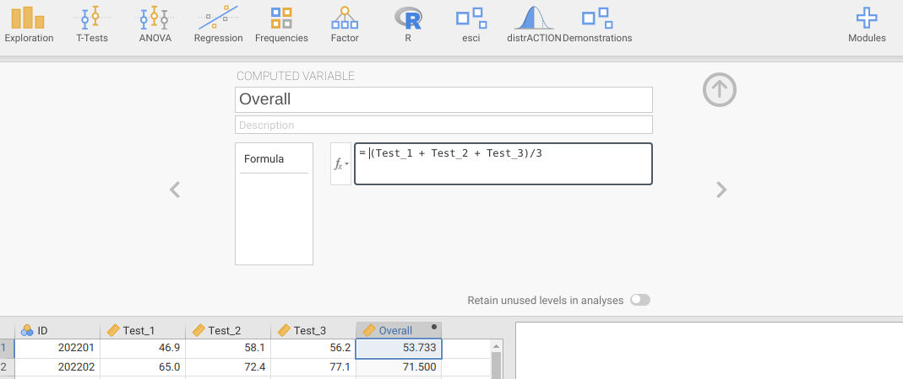
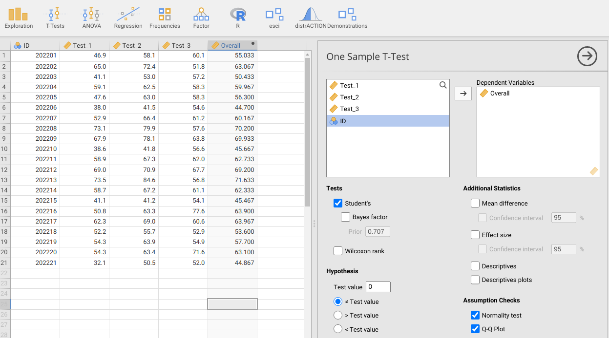
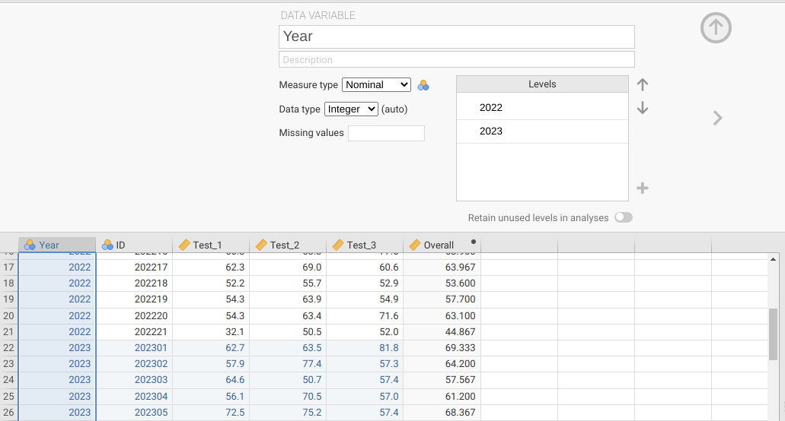
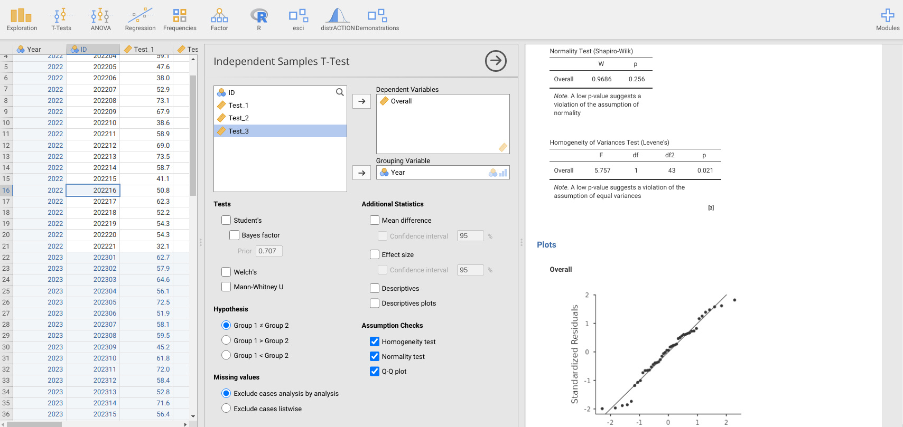
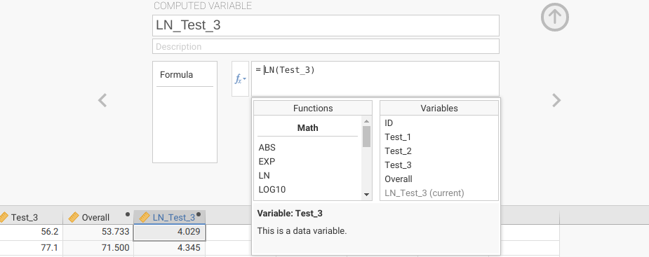

# (PART) Hypothesis testing {-}

# Week 6 Overview {-#Week6}

|                 |                                   |
|-----------------|-----------------------------------|
| **Dates**       | 27 February 2023 - 03 MAR 2023 |
| **Reading**     | **Required:**  SCIU4T4 Workbook chapters 20 and 21  |
|                 | **Recommended:** @Navarro2022 [Chapter 11](https://davidfoxcroft.github.io/lsj-book/11-Comparing-two-means.html)    |
|                 | **Suggested:** None     |
|                 | **Advanced:** @Johnson1995 ([Download](https://www.jstor.org/stable/pdf/1940733.pdf?casa_token=ly4fpXKZzCkAAAAA:-bgUBEe9rv_HT1IstfrbzwDlhSaUFH6nTCSxCrJqXxQa6FS2hb2sGmc38RUQaTEaPT_NnKqgxyaEnZdisEhz2sddHOEonjLWqptny7_N54qrlgZSaeES)) |
| **Lectures**    | 6.1: What is hypothesis testing? (11:18 min; [Video](https://stirling.cloud.panopto.eu/Panopto/Pages/Viewer.aspx?id=b02e8347-81a2-4d9d-b6bd-af8200d91a80&start=0)) |
|                 | 6.2: Making and using hypotheses (10:32 min; [Video](https://stirling.cloud.panopto.eu/Panopto/Pages/Viewer.aspx?id=15f4982c-4d27-47c7-ae3d-af8200d91ab1&start=0)) |
|                 | 6.3: The example of the right-handed European toad (16:43 min; [Video](https://stirling.cloud.panopto.eu/Panopto/Pages/Viewer.aspx?id=cfa342aa-3eba-4422-8d3e-af8200d91b0b&start=0)) |
|                 | 6.4: Errors, hypothesis testing and CI intervals (16:43 min; [Video](https://stirling.cloud.panopto.eu/Panopto/Pages/Viewer.aspx?id=23cd8516-ffe3-459e-bb4d-af8200d91b2e&start=0)) |
|                 | 6.5: Student's t-distribution and 1 sample t-test (13:31 min; [Video](https://stirling.cloud.panopto.eu/Panopto/Pages/Viewer.aspx?id=87136c7a-4015-4fac-89ac-af8200d91b83&start=0)) |
|                 | 6.6: Independent and paired samples t-tests (18:21 min; [Video](https://stirling.cloud.panopto.eu/Panopto/Pages/Viewer.aspx?id=bc465947-3a9b-4849-8701-afb300fcd568&start=0)) |
|                 | 6.7: Handling violations of assumptions (7:50 min; [Video](https://stirling.cloud.panopto.eu/Panopto/Pages/Viewer.aspx?id=a223e8fa-7e1f-4b02-9c32-af8200d91c5c&start=0)) |
|                 | 6.8: Non-parametric tests (13:30 min; [Video](https://stirling.cloud.panopto.eu/Panopto/Pages/Viewer.aspx?id=573964f9-e8df-4eab-b96f-afb300fe5ce0&start=0)) |
| **Practical**   | Hypothesis testing and t-tests ([Chapter 22](#Chapter_22))       |
|                 |   Room: Cottrell 2A17         |
|                 |   Group A: 01 MAR 2023 (WED) 13:05-15:55 |
|                 |   Group B: 02 MAR 2023 (THU) 09:05-11:55 |
| **Help hours**  | Martina Quaggiotto                       |
|                 |   Room: Cottrell 1A13           |
|                 |   03 MAR 2023 (FRI) 15:05-17:55 |
| **Assessments** | [Week 6 Practice quiz](https://canvas.stir.ac.uk/courses/13075/quizzes/30519) on Canvas  |


Week 6 introduces hypothesis testing, and how to use and interpret statistical tests that test whether or not the mean (or median) of a dataset is significantly different from some specific value, or whether two different groups in a dataset have the same mean (or median).

[Chapter 20](#Chapter_20) introduces hypothesis testing, and what it means in statistics. This chapter discusses the general idea of hypothesis testing, null and alternative hypotheses, and how to correctly interpret p-values.

[Chapter 21](#Chapter_21) introduces the t-test and its non-parametric alternatives. These tests include the one sample t-test, the independent samples t-test, the paired sample t-test, the Wilcoxon test, and the Mann-Whitney U test. The chapter also explains the assumptions underlying these different tests.  

[Chapter 22](#Chapter_22) guides you through the week 6 practical. The aim of this practical is to practice using and correctly interpreting the tests that are introduced in Chapter 21.

# What is hypothesis testing? {#Chapter_20}

Statistical hypotheses are different from scientific hypotheses.
In science, a hypothesis should make some kind of testable statement about the relationship between two or more different concepts or observations [@Bouma2000].
For example, we might hypothesise that in a particular population of sparrows, juveniles that have higher body mass will also have higher survival rates.
In contrast, statistical hypotheses compare a sample outcome to the outcome predicted given a relevant statistical distribution [@Sokal1995].
That is, we start with a hypothesis that our data are sampled from some distribution, then work out whether or not we should reject this hypothesis.
This concept is counter-intuitive, but it is **absolutely fundamental for understanding the logic underlying most modern statistical techniques** [@Sokal1995; @Mayo1996; @Greenland2016], including all subsequent chapters of this workbook, so we will focus on it here in-depth.
The most instructive way to explain the general idea is with the example of coin flips [@Mayo1996], as we looked at in [Chapter 14](#Chapter_14).

## How ridiculous is our hypothesis?

Imagine that a coin is flipped 100 times.
We are told that the coin is fair, meaning that there is an equal probability of it landing on heads or tails (i.e., the probability is 0.5 for both heads and tails in any given flip).
From [Chapter 14.4.1](#Chapter_14.html#binomial-distribution), recall that the number of times out of 100 that the coin flip comes up heads will be described by a binomial distribution.
The most probable outcome will be 50 heads and 50 tails, but frequencies that deviate from this perfect 50:50 ratio (e.g., 48 heads and 52 tails) are also expected to be fairly common (Figure 20.1).


```{r, echo = FALSE, fig.alt = "A barplot is shown with 101 bars, which correspond to the number of times a coin flip lands on heads; the distribution takes a humped shape.", fig.cap = "Probability distribution for the number of times that a flipped coin lands on heads in 100 trials. Note that some areas of parameter space on the x-axis are cut off because the pobabilities associated with this number of flips out of 100 being heads are so low."}
par(mar = c(5, 5, 1.5, 1.5));
pr_binom <- dbinom(x = 0:100, size = 100, prob = 0.5);
plot(x = 0, y = 0, xlim = c(31, 69), type = "n", ylim = c(0, 0.09), 
     xaxt = "n", ylab = "Probability", xlab = "Times a coin flip is heads", 
     cex.lab = 1.25, cex.axis = 1.25, yaxs = "i");
axis(side = 1, at = 1:101, labels = 0:100);
for(i in 1:101){
  yy <- seq(from = 0, to = pr_binom[i], length = 100);
  points(x = rep(i, times = 100), y = yy, type = "l", lwd = 6);  
}
```

The distribution in Figure 20.1 is what we expect to happen if the coin we are flipping 100 times is actually fair.
In other words, it is the predicted distribution of outcomes *if our hypothesis that the coin is fair is true* (more on that later).
Now, suppose that we actually run the experiment; we flip the coin in question 100 times.
Perhaps we observe heads 30 times out of the 100 total flips.
From the distribution in Figure 20.1, this result seems *very* unlikely if the coin is actually fair.
If we do the maths, the probability of observing 30 heads or fewer (i.e., getting anywhere between 0 and 30 heads total) is only $P = 0.0000392507$.
And the probability of getting this much of a deviation from 50 heads (i.e., either 20 less than or 20 more than 50) is $P = 0.0000785014$ (two times 0.0000392507, since the binomial distribution is symmetrical around 50).
This seems a bit ridiculous!
Do we *really* believe that the coin is fair if the probability of getting a result this extreme is so low?

Getting 30 head flips is maybe a bit extreme.
What if we flip the coin 100 times and get 45 heads?
In this case, if the coin is fair, then we would predict this number heads or fewer with a probability of about $P = 0.0967$ (i.e., about 9.67\% of the time, we would expect to get 45 or fewer heads).
And we would predict a deviation as extreme as 5 from the 50:50 ratio of heads to tails with a probability of about $P = 0.193$ (i.e., about 19.3\% of the time, we would get 45 heads or fewer, or 55 heads or more).
This does not sound nearly so unrealistic.
If a fair coin will give us this much of a deviation from the expected 50 heads and 50 tails about 20\% of the time, then perhaps our hypothesis is not so ridiculous, and we can conclude the coin is indeed fair.

How improbable does our result need to be to cause us to reject our hypothesis that the coin is fair?
There is no definitive answer to this question.
In the biological and environmental sciences, we traditionally use a probability of 0.05, but this threshold is completely arbitrary[^29].
All it means is that we are willing to reject our hypothesis (i.e., declare the coin to be unfair) when it is actually true (i.e., the coin really *is* fair) about 5\% of the time.
Note that we do need to decide on some finite threshold for rejecting our hypothesis because even extremely rare events, by definition, can sometimes happen.
In the case of 100 coin flips, there is always a small probability of getting *any* number of heads from a fair coin (although getting zero heads would be extraordinarily rare, $P \approx 7.89 \times 10^{-31}$, i.e., a decimal followed by 30 zeros, then a 7).
We can therefore never be *certain* about rejecting or not rejecting the hypothesis that we have a fair coin.

This was a very concrete example intended to provide an intuitive way of thinking about hypothesis testing in statistics.
In the next section, we will look more generally at what hypothesis testing means in statistics and the terminology associated with it.
But everything that follows basically relies on the same general logic as the coin-flipping example here; **if our hypothesis is true, then what is the probability of our result?**

[^29]: I have heard many apocryphal stories about how a probability of 0.05 was decided upon, but I have no idea which, if any, of these stories are actually true. 

## Statistical hypothesis testing

A statistical test is used to decide if we should reject the hypothesis that some observed value or calculated statistic was sampled from a particular distribution [@Sokal1995].
In the case of the coin example in the previous section, the observed value was the number of heads, and the distribution was the binomial distribution.
In other cases, we might, e.g., test the hypothesis that a value was sampled from a normal or t-distribution.
In all of these cases, the hypothesis that we are testing is the **null hypothesis**, which we abbreviate as $H_{0}$ (e.g., the coin is fair).
Typically, $H_{0}$ is associated with the lack of an interesting statistical pattern, such as when a coin is fair, when there is no difference between two groups of observations, or when two variables are not associated with each other.
This null hypothesis contrasts an **alternative hypothesis**, which we abbreviate as $H_{A}$ (e.g., the coin is not fair).
Alternative hypotheses are always defined by some relationship to $H_{0}$ [@Sokal1995].
Typically, $H_{A}$ is associated with something interesting happening, such as a biased coin, a difference between groups of observations, or an association between two variables.
Table 20.1 below presents some null and alternative hypotheses that might be relevant in the biological or environmental sciences.

| Null hypothesis $H_{0}$            | Alternative hypothesis $H_{A}$          |
|------------------------------------|-----------------------------------------|
| There is no difference between juvenile and adult sparrow mortality | Mortality differs between juvenile and adult sparrows |
| Amphibian body size does not change with increasing latitude | Amphibian body size increases with latitude |
| Soil nitrogen concentration does not differ between agricultural and non-agricultural fields | Soil nitrogen concentration is lower in non-agricultural fields |

Table: Hypothetical null and alternative hypotheses in the biological and environmental sciences.

Notice that alternative hypotheses can indicate direction (e.g., amphibian body size will increase, or nitrogen content will be lower in non-agricultural fields), or they can be non-directional (e.g., mortality will be different based on life-history stage).
When our alternative hypothesis indicates direction, we say that the hypothesis is **one-sided**.
This is because we are looking at one side of the null distribution.
In the case of our coin example, a one-sided $H_{A}$ might be that the probability of flipping heads is less than 0.5, meaning that we reject $H_{0}$ only given numbers on the left side of the distribution in Figure 20.1 (where the number of flips heads are fewer than 50).
A different one-sided $H_{A}$ would be that the probability of flipping heads is greater than 0.5, in which case we would reject $H_{0}$ only given numbers on the right side of the distribution.
In contrast, when our alternative hypothesis does not indicate direction, we say that the hypothesis is **two-sided**.
This is because we are looking at both sides of the null distribution.
In the case of our coin example, we might not care in which direction the coin is biased (towards heads or tails), just that the probability of flipping heads does not equal 0.5.
In this case, we reject $H_{0}$ at both extremes of the distribution of Figure 20.1.

## P-values, false positives, and power

In our hypothetical coin flipping example, we used $P$ to indicate the probability of getting a particular number of heads out of 100 total flips if our coin was fair.
This $P$ (sometimes denoted with a lower-case $p$) is what we call a 'p-value'.

> **A p-value is the probability of getting a result as or more extreme than the one observed assuming $H_{0}$ is true.[^30]**

This is separated and in bold because it is a very important concept in statistics, and it is one that is very, very easy to misinterpret[^31].
A p-value is *not* the probability that the null hypothesis is true (we actually have no way of knowing this probability).
It is also not the probability that an alternative hypothesis is false (we have no way of knowing this probability either).
A p-value specifically *assumes that the null hypothesis is true*, then asks what the probability of an observed result would be *conditional upon this assumption*.
In the case of our coin flipping example, we cannot really know the probability that the coin is fair or unfair (depending on your philosophy of statistics, this might not even make conceptual sense).
But we can say that **if** the coin **is** fair, then an observation of $\leq 45$ would occur with a probability of $P = 0.0967$.

Before actually calculating a p-value, we typically set a threshold level ($\alpha$) below which we will conclude that our p-value is **statistically significant**[^32].
As mentioned in [section 20.1](#how-ridiculous-is-our-hypothesis), we traditionally set $\alpha= 0.05$ in the biological and environmental sciences (although rarely $\alpha = 0.01$ is used).
This means that if $P \leq 0.05$, then we reject $H_{0}$ and conclude that our observation is statistically significant.
It also means that even when $H_{0}$ really is true (e.g., the coin is really fair), we will mistakenly reject $H_{0}$ with a probability of 0.05 (i.e., 5\% of the time).
This is called a **Type I error** (i.e., a false positive), and it typically means that we will infer a pattern of some kind (e.g., a difference between groups, or a relationship between variables) where none really exists.
This is obviously an error that we want to avoid, which is why we set $\alpha$ to a low value.

In contrast, we can also fail to reject $H_{0}$ when $H_{A}$ is actually true.
That is, we might mistakenly conclude that there is no evidence to reject the null hypothesis when the null hypothesis really is false.
This is called a **Type II error**.
The probability that we commit a Type II error, i.e., that we fail to reject the null hypothesis when it is false, is given the symbol $\beta$.
Since $\beta$ is the probability that we fail to reject $H_{0}$ when it is false, $1 - \beta$ is the probability that that we *do* reject $H_{0}$ when it is false.
This $1 - \beta$ is the **statistical power** of a statistical test.
Note that $\alpha$ and $\beta$ are not necessarily related to each other.
Our $\alpha$ is whatever we set it to be (e.g., $\alpha = 0.05$).
But statistical power will depend on the size of the effect that we are measuring (e.g., how much bias their is in a coin if we are testing whether or not it is fair), and on the size of our sample.
Increasing our sample size will always increase our statistical power, i.e., our ability to reject the null hypothesis when it is really false.
Table 20.2 below illustrates the relationship between whether or not $H_{0}$ is true, and whether or not we reject it.

|                  | Do not reject $H_{0}$   |  Reject $H_{0}$       |
|------------------|-------------------------|-----------------------|
| $H_{0}$ is true  | Correct decision        | Type I  error         |
| $H_{0}$ is false | Type II error           | Correct decision      |

Table: Summary of Type I and Type II errors in relation to a null hypothesis ($H_{0}$).

Note that we never *accept* a null hypothesis; we just fail to reject it.
Statistical tests are not really set up in a way that $H_{0}$ can be accepted[^33].
The reason for this is subtle, but we can see the logic if we again consider the case of the fair coin.
If $H_{0}$ is true, then the probability of flipping heads is $P(heads) = 0.5$ (i.e., $H_{0}: P(heads) = 0.5$).
But even if we fail to reject $H_{0}$, this does not mean that we can conclude with any real confidence that our null hypothesis $P(heads) = 0.5$ is true.
What if we instead tested the null hypothesis that our coin was *very slightly* biased, such that $H_{0}:\:P(heads) = 0.4999$?
If we failed to reject the null hypothesis that $P(heads) = 0.5$, then we would probably also fail to reject a $H_{0}$ that $P(heads) = 0.4999$.
There is no way to meaningfully distinguish between these two potential null hypotheses by just testing one of them.
We therefore cannot conclude that a $H_{0}$ is correct; we can only find evidence to reject it.
In contrast, we can reasonably accept an alternative hypothesis $H_{A}$ when we reject $H_{0}$.


[^30]: Technically, it also assumes that all of the assumptions of the model underlying the hypothesis test are true, but we will worry about this later.

[^31]: In fact, the p-value is so easy to mis-interpret and so widely mis-used, that some scientists have called for them to be abandoned entirely [@Wasserstein2016; but see @Stanton-Geddes2014; @Mayo2019].

[^32]: Like p-values, setting thresholds below which we consider $P$ to be significant is at least somewhat controversial [@McShane2019; @Mayo2021]. But the use of statistical significance thresholds is ubiquitous in the biological and environmental sciences, so we will use them throughout this lab workbook (it is important to understand them and interpret them).

[^33]: Note that we might, for non-statistical reasons conclude the absence of a particular phenomenon or relationship between observations. For example, following a statistical test, we might become convinced that a coin really is fair, or that there is no relationship between sparrow body mass and survival. But these are conclusions about scientific hypotheses, not statistical hypotheses.

# The t-test  {#Chapter_21}

A t-test is a simple and widely used statistical hypothesis test that relies on the t-distribution introduced in [Chapter 18](#Chapter_18).
In this chapter, we will look at 3 types of t-tests, (1) the one sample t-test, (2) the independent samples t-test, and (3) the paired samples t-test.
We will also look at non-parametric alternatives to t-tests (Wilcoxon and Mann-Whitney tests), which become relevant when the assumptions of t-tests are violated.
The use of all of these tests in Jamovi will be demonstrated in the lab practical in [Chapter 22](#Chapter_22).

## One sample t-test

Suppose that a biology teacher has created a new approach to teaching and wants to test whether or not their new approach results in student test scores that are higher than the reported national average of 60.
This teacher should first define their null and alternative hypotheses.

- $H_{0}$: Student test scores equal 60
- $H_{A}$: Student test scores are greater than 60

Note that this is a one-sided hypothesis.
The teacher is not interested in whether or not the mean test score of their students is below 60.
They just want to find out if the mean test scores are greater than 60.
Suppose the teacher has 10 students with the following test scores (out of 100).

```
49.3, 62.9, 73.7, 65.5, 69.6, 70.7, 61.5, 73.4, 61.1, 78.1
```

The teacher can use a one sample t-test to test $H_{0}$.
The one sample t-test will test whether the sample mean of test scores ($\bar{y} = 66.58$) is significantly greater than the reported national average, $\mu_{0} = 60$.
How does this work?
Recall from [Chapter 15](#Chapter_15) that, due to the central limit theorem, the distribution of sample means ($\bar{y}$) will be normally distributed around the true mean $\mu$ as sample size N increases.
At low N, when we need to estimate the true standard deviation ($\sigma$) from the sample standard deviation (s), we need to correct for a bias and use the t-distribution (see [Chapter 18](#Chapter_18)).
The logic here is to use the t-distribution as the null distribution for $\bar{y}$.
If we subtract $\mu_{0}$ from $\bar{y}$, then we can centre the mean of the null distribution at 0.
We can then divide by the standard error of test scores so that we can compare the deviation of $\bar{y}$ from $\mu_{0}$ in terms of the t-distribution.
This is the same idea as calculating a z-score from [Chapter 15.2](#probability-and-z-scores).
In fact, the equations look almost the same,

$$t_{\bar{y}} = \frac{\bar{y} - \mu_{0}}{SE(\bar{y})}$$

In the above equation, $SE(\bar{y})$ is the standard error of $\bar{y}$.

If the sample mean of test scores is really the same as the population mean $\mu_{0} = 60$, then $\bar{y}$ should have a t-distribution.
Consequently, very small or large values of $t_{\bar{y}}$ would suggest that the sample mean is improbable given the null distribution predicted if $H_{0}: \mu_{0} = \bar{y}$ is true.
We can calculate $t_{\bar{y}}$ for our above sample (note, $SE(\bar{y}) = s/\sqrt{N} = 8.334373 / \sqrt{10} = 2.63556$),

$$t_{\bar{y}} = \frac{66.58 - 60}{2.63556} = 2.496623.$$

Our t-statistic is therefore 2.496623 (note that a t-statistic can also be negative; this would just mean that our sample mean is less than $\mu_{0}$, instead of greater than $\mu_{0}$, but nothing about the t-test changes if this is the case). 
We can see where this value falls on the t-distribution with 9 degrees of freedom in Figure 21.1.

```{r, echo = FALSE, fig.alt = "A bell curve of the t-distribution is shown with an arrow pointing downward on the x-axis value about halfway between 2 and 3.", fig.cap = "A t-distribution is shown with a calculated t-statistic of 2.49556 indicated with a downard arrow."}
par(mar = c(5, 5, 1.5, 1.5));
xx       <- seq(from = -5, to = 5, by = 0.001);
xx_vals  <- 1:10001;
yy       <- dt(xx, df = 9);
plot(x = xx, y = yy, type = "l", ylim = c(0, 0.48), 
     ylab = "Probability",  xlab = "t-score", lwd = 2, xlim = c(-3, 3),
     cex.lab = 1.25, cex.axis = 1.25, yaxs = "i");
polygon(c(xx[xx_vals], xx[1], xx[10001]), 
        c(yy[xx_vals], 0, 0), col="grey80");
arrows(x0 = 2.496623, x1 = 2.496623, y0 = 0.1, y1 = 0.002, lwd = 3);
mbox <- function(x0, x1, y0, y1){
    xx <- seq(from=x0, to=x1, length.out = 100);
    yy <- seq(from=y0, to=y1, length.out = 100);
    xd <- c(rep(x0, 100), xx, rep(x1,100), rev(xx));
    yd <- c(yy, rep(y1,100), rev(yy), rep(y0, 100));
    return(list(x=xd, y=yd));
}
tbox <- mbox(x0 = 2.496623 - 0.15, 
             x1 = 2.496623 + 0.15, y0 = 5, y1 = 9);
polygon(x=tbox$x, y=tbox$y, lwd=3, border="black", col="white");
text(x = 2.496623, y = 0.125, cex = 2, 
     labels = expression(paste(italic(t[bar(y)]))));
```

The t-distribution in Figure 21.1 is the probability distribution if $H_{0}$ is true (i.e., the student test scores were sampled from a distribution with a mean of $\mu_{0} = 60$).
The arrow pointing to the calculated $t_{\bar{y}} = 2.496623$ indicates that if $H_{0}$ is true, then the sample mean of student test scores $\bar{y} = 66.58$ would be very unlikely.
This is because only a small proportion of the probability distribution in Figure 21.1 is greater than or equal to our t-statistic, $t_{\bar{y}} = 2.496623$.
In fact, the proportion of t-statistics greater than 2.496623 is only about P = `r round(pt(q = 2.496623, df = 9, lower.tail = FALSE), digits = 3)`.
Hence, if our null hypothesis is true, then the probability of getting a mean student test score of 66.58 or higher is P = `r round(pt(q = 2.496623, df = 9, lower.tail = FALSE), digits = 3)` (this is our p-value).

It is important to understand the relationship between the t-statistic and the p-value.
An [interactive application](https://bradduthie.shinyapps.io/t_score/) helps visualise the relationship between the t-statistic and p-values.

> [Click here](https://bradduthie.shinyapps.io/t_score/) for the shiny app of the t-distribution

Typically, we set a threshold level of $\alpha = 0.05$, below which we conclude that our p-value is statistically significant (see [Chapter 20](#Chapter_20)).
Consequently, because our p-value is less than 0.05, we reject our null hypothesis and conclude that student test scores are higher than the reported national average.


## Independent samples t-test

Perhaps the biology teacher is not actually interested in comparing their students' test results with those of the reported national average.
After all, there might be many reasons for why their students score differently from the national average that have nothing to do with their new approach to teaching.
To see if their new approach is working, the teacher might instead decide that a better hypothesis to test is whether or not the mean test score from the current year is higher than the mean test score from the class that they taught in the previous year.
We can use $\bar{y}_{1}$ to denote the mean of test scores from the current year, and $\bar{y}_{2}$ to denote the mean of test scores from the previous year.
The test scores of the current year ($y_{1}$) therefore remain the same as in the example of the one sample t-test from the previous section.

```
49.3, 62.9, 73.7, 65.5, 69.6, 70.7, 61.5, 73.4, 61.1, 78.1
```

Suppose that in the previous year, there were 9 students in the class (i.e., one fewer than the current year).
These 9 students received the following test scores ($y_{2}$).

```
57.4, 52.4, 70.5, 71.6, 46.1, 60.4, 70.0, 64.5, 58.8
```

The mean score from last year was $\bar{y}_{2} = 61.30$, which does appear to be lower than the mean score of the current year, $\bar{y}_{1} = 66.58$.
But is the difference between these two means statistically significant?
In other words, were the test scores from each year sampled from a population with the same mean, such that the population mean of the previous year ($\mu_{2}$) and the current year ($\mu_{1}$) are the same?
This is the null hypothesis, $H_{0}: \mu_{2} = \mu_{1}$.

The general idea for testing this null hypothesis is the same as it was in the one sample t-test.
In both cases, we want to calculate a t-statistic, then see where it falls along the t-distribution to decide whether or not to reject $H_{0}$.
In this case, our t-statistic ($t_{\bar{y}_{1} - \bar{y}_{2}}$) is calculated slightly differently,

$$t_{\bar{y}_{1} - \bar{y}_{2}} = \frac{\bar{y}_{1} - \bar{y}_{2}}{SE(\bar{y})}$$

The logic is the same as the one sample t-test. 
If $\mu_{2} = \mu_{1}$, then we also would expected $\bar{y}_{1} = \bar{y}_{2}$ (i.e., $\bar{y}_{1} - \bar{y}_{2} = 0$).
Differences between $\bar{y}_{1}$ and $\bar{y}_{2}$ cause the t-statistic to be either above or below 0, and we can map this deviation of $t_{\bar{y}_{1} - \bar{y}_{2}}$ from 0 to the probability density of the t-distribution after standardising by the standard error ($SE(\bar{y})$).

What is $SE(\bar{y})$ in this case?
After all, there are two different samples $y_{1}$ and $y_{2}$, so could the two samples not have *different* standard errors?
This could indeed be the case, and how we actually conduct the independent samples t-test depends on whether or not we are willing to assume that the two samples came from populations with the same variance (i.e., $\sigma_{1} = \sigma_{2}$).
If we are willing to make this assumption, then we can pool the variances ($s^{2}_{p}$) together to get a combined (more accurate) estimate of the standard error $SE(\bar{y})$ from both samples[^34]$^{,}$[^35].

If we are unwilling to assume that $y_{1}$ and $y_{2}$ have the same variance, then we need to use an alternative version of the independent samples t-test.
This alternative version is called the Welch's t-test [@Welch1938], also known as the unequal variances t-test [@Dytham2011; @Ruxton2006].
In contrast to the standard independent t-test (also called the 'Students independent t-test'), the Welch's t-test does not pool the variances of the samples together[^36].
While there are some mathematical differences between the Student's and Welch's independent samples t-tests, the general concept is the same.

This raises the question, when is it acceptable to assume that $y_{1}$ and $y_{2}$ have the same variance?
The sample variance of $s^{2}_{1} = 69.46$ and $s^{2}_{2} = 76.15$.
Is this close enough to treat them as the same?
Like a lot of choices in statistics, there is no clear right or wrong answer.
In theory, if both samples do come from a population with the same variance ($\sigma^{2}_{1} = \sigma^{2}_{2}$), then the pooled variance is better because it gives us a bit more statistical power; we can correctly reject the null hypothesis more often when it is actually false (i.e., it decreases the probability of a Type II error).
Nevertheless, the increase in statistical power is quite low, and the risk of pooling the variances when they actually are not the same increases the risk that we reject the null hypothesis when it is actually true (i.e., it increases the probability of a Type I error, which we definitely do not want!).
For this reason, some researchers advocate using the Welch's t-test by default, unless there is a very good reason to believe $y_{1}$ and $y_{2}$ are sampled from populations with the same variance [@Ruxton2006; @Delacre2017].

Here we will adopt the traditional approach of first testing the null hypothesis that $\sigma^{2}_{1} = \sigma^{2}_{2}$ using a homogeneity of variances test.
If we fail to reject this null hypothesis (i.e., $P > 0.05$), then we will use the Student's t-test, and if we reject it (i.e., $P \leq 0.05$), then we will use the Welch's t-test.
This approach is mostly used for pedagogical reasons; in practice, defaulting to the Welch's t-test is fine [@Ruxton2006; @Delacre2017].
Testing for homogeneity of variances is quite straightforward in most statistical programs, and we will save the conceptual and mathematical details of this for when we look at the F-distribution in [Chapter 23](#Chapter_23).
But the general idea is that if $\sigma^{2}_{1} = \sigma^{2}_{2}$, then the ratio of variances ($\sigma^{2}_{1}/\sigma^{2}_{2}$) has its own null distribution (like the normal distribution, or the t-distribution), and we can see the probability of getting a deviation of $\sigma^{2}_{1}/\sigma^{2}_{2}$ from 1 if $\sigma^{2}_{1} = \sigma^{2}_{2}$ is true.

In the case of the test scores from the two samples of students ($y_{1}$ and $y_{2}$), a homogeneity of variance test reveals that $s^{2}_{1} = 69.46$ and $s^{2}_{2} = 76.15$ are not significantly different (P = 0.834).
We can therefore use the pooled variance and the Student's independent samples t-test.
We can calculate $SE(\bar{y}) = 8.521033$ using the formula for $s_{p}$ (again, this is not something that ever actually needs to be done by hand), then find $t_{\bar{y}_{1} - \bar{y}_{2}}$,

$$t_{\bar{y}_{1} - \bar{y}_{2}} = \frac{\bar{y}_{1} - \bar{y}_{2}}{SE(\bar{y})} = \frac{66.58 - 61.3}{3.915144} = 1.348609.$$

As with the one-sample t-test, we can identify the position of $t_{\bar{y}_{1} - \bar{y}_{2}}$ on the t-distribution (Figure 21.2).

```{r, echo = FALSE, fig.alt = "A bell curve of the t-distribution is shown with an arrow pointing downward on the x-axis value around 1.3.", fig.cap = "A t-distribution is shown with a calculated t-statistic of 1.348609 indicated with a downward arrow."}
par(mar = c(5, 5, 1.5, 1.5));
xx       <- seq(from = -5, to = 5, by = 0.001);
xx_vals  <- 1:10001;
yy       <- dt(xx, df = 9);
plot(x = xx, y = yy, type = "l", ylim = c(0, 0.48), 
     ylab = "Probability",  xlab = "t-score", lwd = 2, xlim = c(-3, 3),
     cex.lab = 1.25, cex.axis = 1.25, yaxs = "i");
polygon(c(xx[xx_vals], xx[1], xx[10001]), 
        c(yy[xx_vals], 0, 0), col="grey80");
arrows(x0 = 1.348609, x1 = 1.348609, y0 = 0.1, y1 = 0.002, lwd = 3);
mbox <- function(x0, x1, y0, y1){
    xx <- seq(from=x0, to=x1, length.out = 100);
    yy <- seq(from=y0, to=y1, length.out = 100);
    xd <- c(rep(x0, 100), xx, rep(x1,100), rev(xx));
    yd <- c(yy, rep(y1,100), rev(yy), rep(y0, 100));
    return(list(x=xd, y=yd));
}
tbox <- mbox(x0 = 1.348609 - 0.15, 
             x1 = 1.348609 + 0.15, y0 = 5, y1 = 9);
polygon(x=tbox$x, y=tbox$y, lwd=3, border="black", col="white");
text(x = 1.348609, y = 0.125, cex = 2, 
     labels = expression(paste(italic(t[bar(y[1])-bar(y[2])]))));
```


The proportion of t-scores that are higher than $t_{\bar{y}_{1} - \bar{y}_{2}} = 1.348609$ is about 0.098.
In other words, given that the null hypothesis is true, the probability of getting a t-statistic this high is $P = 0.098$.
Because this p-value exceeds our critical value of $\alpha = 0.05$, we do not reject the null hypothesis.
We therefore should conclude that the mean of test scores from the current year ($\bar{y}_{1}$) is not significantly different from the mean of test scores in the previous year ($\bar{y}_{2}$).
The biology teacher in our example might therefore conclude that mean test results have not improved from the previous year.


[^34]: This is not a calculation that needs to be done by hand anymore. Statistical software such as Jamovi or R will calculate $s_{p}$ automatically from a dataset [@Jamovi2022; @Rproject]. For those interested, the formula that it uses to make this calculation is, $$s_{p} = \sqrt{\frac{\left(n_{1} - 1 \right) s^{2}_{y_{1}} + \left(n_{2} - 1 \right) s^{2}_{y_{2}}}{n_{1} + n_{2} - 2}}.$$ This looks like a lot, but really all the equation is doing is add the two variances ($s^{2}_{y_{1}}$ and $s^{2}_{y_{2}}$) together, but weighing them by their degrees of freedom ($n_{1} - 1$ and $n_{2} - 1$), so that the one with a higher sample size has more influence on the pooled standard deviation. To get $SE(\bar{y})$, we then need to multiply by the square root of $(n_{1} + n_{2})/(n_{1}n_{2})$, $$SE(\bar{y}) = s_{p}\sqrt{\frac{n_{1} + n_{2}}{n_{1}n_{2}}}.$$ It might be useful to try this once by hand, but only to convince yourself that it matches the t-statistic produced by Jamovi or R.


[^35]: Note that the degrees of freedom for the t-statistic is not straightforward when we pool variances. If the sample sizes $n_{1}$ and $n_{2}$ are the same, then $df = 2(n - 1)$. If $n_{1} \neq n_{2}$, then $df = n_{1} + n_{2} - 2$ [@Sokal1995]. The rationale here is that we lose an extra degree of freedom if we need to estimate the variance of each sample separately, which is necessary if we need to weigh each variance by its own degree of freedom (see footnote 34). Statistical software such as Jamovi and R handles all of this automatically [@Jamovi2022; @Rproject], so we will not dwell on it here.

[^36]: The equation for calculating the Welch's t-statistic is actually a bit simpler than the Student's t-test that uses the pooled estimate [@Ruxton2006]. Instead of using $s_{p}$ (defined in footnote 34), we define our t-statistic as, $$t_{s} = \frac{\bar{y}_{1} - \bar{y}_{2}}{ \sqrt{ \frac{s^{2}_{1}}{n_{1}} + \frac{s^{2}_{2}}{n_{2}}} }.$$ The degrees of freedom, however, is quite a bit messier than it is for the independent samples Student's t-test, $$v = \frac{\left(\frac{1}{n_{1}} + \frac{(s^{2}_{2} / s^{2}_{1})}{n_{2}} \right)^{2}}{\frac{1}{n^{2}_{1}\left(n_{1} - 1 \right)} + \frac{(s^{2}_{2} / s^{2}_{1})^{2}}{n^{2}_{2}\left(n_{2} - 1 \right)}}.$$ Of course, Jamovi and R will make these calculations for us, so it is not necessary to do it by hand.


## Paired sample t-test

There is one more type of t-test to consider.
The paired sample t-test is applied when the data points in one sample can be naturally paired with those in another sample.
In this case, data points between samples are not independent.
For example, we can consider the student test scores ($y_{1}$) yet again.

```
49.3, 62.9, 73.7, 65.5, 69.6, 70.7, 61.5, 73.4, 61.1, 78.1
```

Suppose that the teacher gave these same students (S1-S10) a second test and wanted to see if the mean student score changed from one test to the next (i.e., a two-sided hypothesis).

```{r, echo = FALSE, eval = TRUE}
t1 <- c(49.3, 62.9, 73.7, 65.5, 69.6, 70.7, 61.5, 73.4, 61.1, 78.1);
ch <- c(-2.7, -0.2, 0.1, -7.2, -2.8, -1.0, 3.0, -2.1, 3.4, 0.7);
t2 <- t1 + ch;
tt <- rbind(t1, t2, ch);
rownames(tt) <- c("Test 1", "Test 2", "Change");
colnames(tt) <- paste("S", 1:10, sep = "");
knitr::kable(tt, caption = "Test scores from 10 students (S1-S10) for 2 different tests in a hypothetical biology education example.");
```

In this case, what we are really interested in is the *change* in scores from Test 1 to Test 2.
We want to test the null hypothesis that this change is zero.
This is actually the same test as the one-sample t-test.
We are just substituting the mean difference in values (i.e., 'Change' in the table above) for $\bar{y}$ and setting $\mu_{0} = 0$.
We can calculate $\bar{y} = -0.88$ and $SE(\bar{y})=0.9760237$, then set up the t-test as before,

$$t_{\bar{y}} = \frac{-0.88 - 0}{0.9760237} = -0.9016175.$$

Again, we can find the location of our t-statistic $t_{\bar{y}} = -0.9016175$ on the t-distribution (Figure 21.3).


```{r, echo = FALSE, fig.alt = "A bell curve of the t-distribution is shown with an arrow pointing downward on the x-axis value around -0.9.", fig.cap = "A t-distribution is shown with a calculated t-statistic of -0.9016175 indicated with a downward arrow."}
par(mar = c(5, 5, 1.5, 1.5));
xx       <- seq(from = -5, to = 5, by = 0.001);
xx_vals  <- 1:10001;
yy       <- dt(xx, df = 9);
plot(x = xx, y = yy, type = "l", ylim = c(0, 0.48), 
     ylab = "Probability",  xlab = "t-score", lwd = 2, xlim = c(-3, 3),
     cex.lab = 1.25, cex.axis = 1.25, yaxs = "i");
polygon(c(xx[xx_vals], xx[1], xx[10001]), 
        c(yy[xx_vals], 0, 0), col="grey80");
arrows(x0 = -0.9016175, x1 = -0.9016175, y0 = 0.1, y1 = 0.002, lwd = 3);
mbox <- function(x0, x1, y0, y1){
    xx <- seq(from=x0, to=x1, length.out = 100);
    yy <- seq(from=y0, to=y1, length.out = 100);
    xd <- c(rep(x0, 100), xx, rep(x1,100), rev(xx));
    yd <- c(yy, rep(y1,100), rev(yy), rep(y0, 100));
    return(list(x=xd, y=yd));
}
tbox <- mbox(x0 = -0.9016175 - 0.15, 
             x1 = -0.9016175 + 0.15, y0 = 5, y1 = 9);
polygon(x=tbox$x, y=tbox$y, lwd=3, border="black", col="white");
text(x = -0.9016175, y = 0.125, cex = 2, 
     labels = expression(paste(italic(t[bar(y)]))));
```


Since this is a two-sided hypothesis, we want to know the probability of getting a t-statistic as extreme as -0.9016175 (i.e., either $\pm 0.9016175$) given that the null distribution is true.
In the above t-distribution, 95\% of the probability density lies between $t = -2.26$ and $t = 2.26$.
Consequently, our calculated $t_{\bar{y}} = -0.9016175$ is not sufficiently extreme to reject the null hypothesis.
The p-value associated with $t_{\bar{y}} = -0.9016175$ is $P = 0.391$.
We therefore fail to reject $H_{0}$ and conclude that there is no significant difference in student test scores from Test 1 to Test 2.

## Assumptions of t-tests

We make some potentially important assumptions when using t-tests.
A consequence of violating these assumptions is a potentially misleading Type I error rate.
That is, if our data do not fit the assumptions of our statistical test, then we might not actually be rejecting our null hypothesis at the $\alpha = 0.05$ level.
We might unknowingly be rejecting $H_{0}$ at a much higher $\alpha$ value, and therefore concluding that we have evidence supporting the alternative hypothesis $H_{A}$ when really do not.
It is therefore important to recognise the assumptions that we are making when using any statistical test (including t-tests).
If our assumptions are violated, we might need to use a different test, or perhaps apply some kind of transformation on the data.
Assumptions that we make when conducting a t-test are as follows:

- Data are continuous (i.e., not count or categorical data)
- Sample observations are a random sample from the population
- Sample means are normally distributed around the true mean

Note that if we are running a Student's independent samples t-test that pools sample variances (rather than a Welch's t-test), then we are also assuming that sample variances are the same (i.e., a homogeneity of variance).
The last bullet point concerning normally distributed sample means is frequently misunderstood to mean that the *sample* data themselves need to be normally distributed.
This is not the case [@Johnson1995; @Lumley2002].
Instead, what we are really concerned with is the distribution of sample means ($\bar{y}$) around the true mean ($\mu$).
And given a sufficiently large sample size, a normal distribution is assured due to the central limit theorem (see [Chapter 15](#Chapter_15)).

Moreover, while a normally distributed variable is not *necessary* for satisfying the assumptions of a t-test (or many other tests we will introduce in this book), it is *sufficient*.
In other words, if the variable being measured is normally distributed, then the sample means will also be normally distributed around the true mean (even at low sample size).
So when is a sample size large enough, or close enough to being normally distributed, for the assumption of normality to be satisfied?
There really is not a definitive answer to this question, and the truth is that most statisticians will prefer to use a histogram (or some other visualisation approach) and their best judgement to decide if the assumption of normality is likely to be violated.

In this book, we will take the traditional approach of running a statistical test called the Shapiro-Wilk test to test the null hypothesis that data are normally distributed.
If we reject the null hypothesis (when $P < 0.05$), then we will conclude that the assumption of normality is violated and the t-test is not appropriate.
The details of how the Shaprio-Wilk test work are not important for now, but the test can be easily run using Jamovi or R [@Jamovi2022; @Rproject].
If we reject the null hypothesis that the data are normally distributed, then we can use one of two methods to run our statistical test.

1. Transform the data in some way (e.g., take the log of all values) to improve normality.
2. Use a non-parameteric alternative test.

The word 'non-parameteric' in this context just means that there are no assumptions (or very few) about the shape of the distribution [@Dytham2011].
We will consider the non-parametric equivalents of the one-sample t-test (the Wilcoxon test) and independent sample t-test (Mann-Whitney U test) in the next section.
But first, we can show how transformations can be used to improve the fit of the data to model assumptions.

Often data will have a skewed distribution; this just means that the distribution will be asymmetrical.
For example, in Figure 21.4A below, we have a dataset (sample size $N = 200$) with a large positive skew (i.e., it is right skewed).
Most values are in the same general area, but with some values being especially high.

```{r, echo = FALSE, fig.alt = "A two paneled figure in which a histogram with a skewed distribution is shown to the left and a histogram with a normal distribution is shown to the right.", fig.cap = "A set of values with a high positive skew (A), which, when log-transformed (i.e., when we take the natural log of all values), have a normal distribution (A)."}
skewed_data <- exp(rnorm(n = 200));
log_tranfrm <- log(skewed_data);
par(mfrow = c(1, 2), mar = c(5, 5, 1, 1));
hist(x = skewed_data, main = "", xlab = "X", breaks = 10, xlim = c(0, 20),
     ylim = c(0, 160));
text(x = 15, y = 150, cex = 2, labels = "A");
hist(x = log_tranfrm, main = "", xlab = "LN(X)", breaks = 10, xlim = c(-4, 4),
     ylim = c(0, 50));
text(x = 2.7, y = 48, cex = 2, labels = "B");
```

Using a t-test on the variable X shown in Figure 21.4A is probably not the good idea.
But taking the natural log of all the values of X makes the dataset more normally distributed, thereby more convincingly satisfying the normality assumption required by the t-test.
This might seem a bit suspicious at first.
Is it really okay to just take the logarithm of all the data instead of the actual values that were measured?
Actually, there is no real scientific or statistical reason that we need to use the original scale [@Sokal1995].
Using the log or the square-root of a set of numbers is perfectly fine if it helps satisfy the assumptions of a statistical test.


## Non-parametric alternatives

If we find that the assumption of normality is not satisfied, and a transformation of the data cannot help, then we can consider using non-parametric alternatives to a t-test.
These alternatives include the Wilcoxon test and the Mann-Whitney U test.

### Wilcoxon test

The Wilcoxon test (also called the Wilcoxon signed-rank test) is the non-parametric alternative to a one sample t-test (or a paired t-test).
Instead of using the actual data, the Wilcoxon test ranks all of the values in the dataset, then sums up their signs (either positive or negative).
The general idea is that we can compare the sum of the *ranks* of the actual data with what would be predicted by the null hypothesis.
It tests the null hypothesis that the *median* ($M$) is significantly different from some given value[^37].
An example will make it easier to see how it works.
We can use the same hypothetical dataset on student test scores.

```
49.3, 62.9, 73.7, 65.5, 69.6, 70.7, 61.5, 73.4, 61.1, 78.1
```

The first step is to subtract the null hypothesis value ($M = 60$, if we again set $H_{0}$ to be that student test scores equal 60) from each value ($49.3 - 60 = -10.7$, $62.9 - 60 = 2.9$, etc.).

```
-10.7, 2.9, 13.7, 5.5, 9.6, 10.7, 1.5, 13.4, 1.1, 18.1
```

We need to note the sign of each value as negative ($-$) or positive ($+$).

```
-, +, +, +, +, +, +, +, +, +
```


Next, we need to compute the absolute values of the numbers (i.e., $|-10.7| = 10.7$, $|2.9| = 2.9$, $|13.7| = 13.7$, etc.).

```
10.7, 2.9, 13.7, 5.5, 9.6, 10.7, 1.5, 13.4, 1.1, 18.1
```

We then rank these values from lowest to highest and record the sign of each value.

```
6.5, 3.0, 9.0, 4.0, 5.0, 6.5, 2.0, 8.0, 1.0, 10.0
```

Note that both the first and sixth position had the same value (10.7), so instead of ranking them as 6 and 7, we split the difference and rank both as 6.5.
Now, we can calculate the sum of the negative ranks ($W^{-}$), and the positive ranks $W^{+}$.
In this case, the negative ranks are easy; there is only one value (the first one), so the sum is just 6.5,

$$W^{-} = 6.5$$

The positive ranks are in positions 2-10, and the rank values in these positions are 3, 9, 4, 5, 6.5, 2, 8, 1, and 10.
The sum of our positive ranks is therefore,

$$W^{+} = 3.0 + 9.0 + 4.0 + 5.0 + 6.5 + 2.0 + 8.0 + 1.0 + 10.0 = 48.5$$

Note that the sum of $W^{-}$ and $W^{+}$ (i.e., 6.5 + 48.5 = 55 in the example here) must always be equal for a given sample size $N$ (in this case, $N = 10$),

$$W = \frac{N \left(N + 1 \right)}{2}.$$


What the Wilcoxon test is doing is calculating the probability of getting a value of $W^{+}$ as or more extreme than would be the case if the null hypothesis is true.
Note that if, e.g., if there are an equal number of values above and below the median, then both $W^{-}$ and $W^{+}$ will be relatively low and about the same value.
This is because the ranks of the values below 0 (which we times by -1) and above 0 (which we times by 1) will be about the same.
But if there are a lot more values above the median than expected (as with the example above), then $W^{+}$ will be relatively high.
And if there are a lot more values below the median than expected, then $W^{+}$ will be relatively low.

To find the probability of $W^{+}$ being as low or high as it is given that the null hypothesis is true (i.e., a p-value), we need to compare the test statistic $W^{+}$ to its distribution under the null hypothesis (note that we can also conduct a one-tailed hypothesis, in which case we are testing if $W^{+}$ is either higher or lower than expected given $H_{0}$).
The old way of doing this is to compare the calculated $W^{+}$ threshold values to those from a [Wilcoxon Signed-Ranks Table](#wilcoxon-signed-rank-critical-values).
The critical value table is no longer necessary, and statistical software such as Jamovi and R will calculate a p-value for us.
For the example above, the p-value associated with $W^{+} = 48.6$ and $N = 10$ is $P = 0.037$.
Since this p-value is less than our threshold of $\alpha = 0.05$, we can reject the null hypothesis and conclude that the median of our dataset is significantly different from 60.

Note that we can also use a Wilcoxon signed rank test as a non-parametric equivalent to a paired t-test. 
In this case, instead of subtracting out the null hypothesis of our median value (e.g., $H_{0}: M = 60$ in the example above), we just need to subtract the paired values.
Consider again the example of the 2 different tests introduced for the [paired sample t-test](#paired-sample-t-test) above.

```{r, echo = FALSE, eval = TRUE}
t1 <- c(49.3, 62.9, 73.7, 65.5, 69.6, 70.7, 61.5, 73.4, 61.1, 78.1);
ch <- c(-2.7, -0.2, 0.1, -7.2, -2.8, -1.0, 3.0, -2.1, 3.4, 0.7);
t2 <- t1 + ch;
tt <- rbind(t1, t2, ch);
rownames(tt) <- c("Test 1", "Test 2", "Change");
colnames(tt) <- paste("S", 1:10, sep = "");
knitr::kable(tt, caption = "Test scores from 10 students (S1-S10) for 2 different tests in a hypothetical biology education example.");
```


If the 'Change' values were not normally distributed, then we could apply a Wilcoxon test to test the null hypothesis that the median value of $Test\:2 - Test\:1 = 0$ (note that a Shapiro-Wilk normality does not reject the null hypothesis that the difference between test scores is normally distributed, so the paired t-test would be preferred in this case).
To do this, we would first note the sign of each value as negative or positive. 

```
-, -, +, -, -, -, +, -, +, +
```

Next, we would rank the absolute values of the changes.

```
6, 2, 1, 10, 7, 4, 8, 5, 9, 3
```

If we then sum the ranks, we get $W^{-} = 6 + 2 + 10 + 7 + 4 + 5 = 34$ and $W^{+} = 1 + 8 + 9 + 3 = 21$.
The p-value associated with $W^{-} = 34$ and $N = 10$ in a two-tailed test is $P = 0.557$, so we do not reject the null hypothesis that Test 1 and Test 2 have the same median.


[^37]: Actually, the Wilcoxon signed-rank test technically tests the null hypothesis that two distributions are identical, not just that the medians are identical [@Johnson1995; @Lumley2002]. Note that if one distribution has a higher variance than another, or is differently skewed, it will also affect the ranks. In other words, if we want to compare medians, then we need to assume that the distributions have the same shape [@Lumley2002]. Because of this, and because the central limit theorem ensures that means will be normally distributed given a sufficiently high sample size (in which case, t-test assumptions are more likely to be satisfied), some researchers suggest that nonparametric statistics such as the Wilcoxon signed rank test should be used with caution [@Johnson1995].

### Mann-Whitney U test

A non-parametric alternative of the independent samples t-test is the Mann-Whitney U test.
That is, a Mann-Whitney test can be used if we want to know whether the median of two independent groups is significantly different.
Like the Wilcoxon test, the Mann-Whitney U test uses the ranks of values, rather than the values themselves.
In the Mann-Whitney U test, the general idea is rank all of the data across both groups, then see if the sum of the ranks is significantly different [@Sokal1995].
To demonstrate this, we can again consider the same hypothetical dataset used when demonstrating the [independent samples t-test](#independent-samples-t-test) above.
Test scores from the current year ($y_{1}$) are below.

```
49.3, 62.9, 73.7, 65.5, 69.6, 70.7, 61.5, 73.4, 61.1, 78.1
```

We want to know if the median of the above scores is significantly different from the median scores in the previous year ($y_{2}$) shown below.

```
57.4, 52.4, 70.5, 71.6, 46.1, 60.4, 70.0, 64.5, 58.8
```

There are 19 values in total, 10 values for $y_{1}$ and 9 values for $y_{2}$.
We therefore rank *all* of the above values from 1 to 19.
For $y_{1}$, the ranks are below.

```
2, 9, 18, 11, 12, 15, 8, 17, 7, 19
```

For $y_{2}$, the ranks are below.

```
4, 3, 14, 16, 1, 6, 13, 10, 5
```

This might be easier to see if we present it as a table showing the test Year ($y_{1}$ versus $y_{2}$), test Score, and test Rank.

```{r, echo = FALSE, eval = TRUE}
Score   <- c(49.3, 62.9, 73.7, 65.5, 69.6, 70.7, 61.5, 73.4, 61.1, 78.1,
             57.4, 52.4, 70.5, 71.6, 46.1, 60.4, 70.0, 64.5, 58.8);
Year    <- c(rep(1, 10), rep(2, 9));
Rank    <- rank(Score);
MWtable <- cbind(Year, Score, Rank);
knitr::kable(MWtable, caption = "Test scores from different students across 2 years, and the overall rank of each test score, in a hypothetical biology education example.");
```

What we need to do now is sum the ranks for $y_{1}$ and $y_{2}$.
If we add up the $y_{1}$ ranks, then we get a value of $R_{1}=$ `r sum(Rank[1:10])`.
If we add up the $y_{2}$ ranks, then we get a value of $R_{2}=$ `r sum(Rank[11:19])`.
We can then calculate a value $U_{1}$ from $R_{1}$ and the sample size of $y_{1}$ ($N_{1}$),

$$U_{1} = R_{1} - \frac{N_{1}\left(N_{1} + 1 \right)}{2}.$$

In the case of our example, $R_{1}=$ `r sum(Rank[1:10])` and $N_{1} = 10$, 
We therefore calculate $U_{1}$,

$$U_{1} = `r sum(Rank[1:10])` - \frac{10\left(10 + 1 \right)}{2} = 63.$$

We then calculate $U_{2}$ using the same general formula,

$$U_{2} = R_{2} - \frac{N_{2}\left(N_{2} + 1 \right)}{2}.$$

From the above example of test scores,

$$U_{2} = `r sum(Rank[11:19])` - \frac{9\left(9 + 1 \right)}{2} = 27.$$

Whichever of $U_{1}$ or $U_{2}$ is lower[^38] is set to $U$, so for our example, $U = 27$.
Note that if $y_{1}$ and $y_{2}$ have similar medians, then $U$ will be relatively low.
But if $y_{1}$ and $y_{2}$ have much different medians, then $U$ will be relatively high.
One way to think about this is that if $y_{1}$ and $y_{2}$ are very different, then one of the two samples should have very low ranks, and the other should have very high ranks [@Sokal1995].
But if $y_{1}$ and $y_{2}$ are very similar, then their summed ranks should be nearly the same.
Hence, if the deviation of $U$ is greater than what is predicted given the null hypothesis in which the distributions (and therefore the medians) of $y_{1}$ and $y_{2}$ are identical, the we can reject $H_{0}$.

As with the [Wilcoxon test](#wilcoxon-test), we could compare our $U$ test statistic to a critical value from a [table](#mann-whitney-u-critical-values), but statistical software such as Jamovi or R will also just give us the test statistic $U$ and associated p-value [@Jamovi2022; @Rproject].
In our example above, $U = 27$, $N_{1} = 10$, and $N_{2} = 9$ has a p-value of $P = 0.156$, so we do not reject the null hypothesis.
We therefore conclude that there is no evidence that there is a difference in the median test scores of the two years.

[^38]: Note that you could also take the higher of the two values [@Sokal1995], which is what R uses (Jamovi uses the lower of the two). The null distribution from which the p-value would be calculate would just be different in this case. 

## Summary

The main focus of this chapter was to provide a conceptual explanation of different statistical tests.
In practice, running these tests is relatively straightforward in statistical software such as Jamovi or R (this is good, as long as the tests are understood and interpreted correctly).
In general, the first step in approaching these tests is to determine if the data call for a one sample test, an independent samples test, or a paired samples test.
In a one sample test, the objective is to test the null hypothesis that the mean (or median) equals a specific value.
In an independent samples test, there are two different groups, and the objective is to test the null hypothesis that the groups have the same mean (or median).
In a paired samples test, there are two groups, but individual values are naturally paired between each group, and the objective is to test the null hypothesis that the difference between paired values is zero[^39].
If assumptions of the t-test are violated, then it might be necessary to use a data transformation or a non-parametric test such as the Wilcoxon test (in place of a one sample or paired sample t-test) or a Mann-Whitney U test (in place of an independent samples t-test).


[^39]: Note, you could also test the null hypothesis that the difference between paired values is some value other than zero, but this is quite rare in practice.

# _Practical_. Hypothesis testing and t-tests {#Chapter_22}

This lab focuses on applying the concepts about hypothesis testing from [Chapter 20](#Chapter_20) and the statistical tests from [Chapter 21](#Chapter_21) in Jamovi [@Jamovi2022].
There will be 5 exercises in total, which will focus on using t-tests and their non-parametric equivalents.
The data for this lab focus on an example of biology and environmental sciences education (Figure 22.1[^40]).
Similar to the example in [Chapter 21](#Chapter_21), it uses datasets of student test scores (note that these data are entirely fictional; we have not used scores from real students).

```{r, echo = FALSE, fig.alt = "Decorative image showing the word 'TEACH' spelled out in dried pine needles", fig.cap = "The practical this week focuses on an example relevant to education. This image is in the public domain.", out.width="100%"}
;
```

```{r, echo = FALSE}
student_scores_year_1 <- read.csv("data/student_scores_year_1.csv");
student_scores_year_2 <- read.csv("data/student_scores_year_2.csv");
```

We will use test data from 2022 ([student_scores_year_1.csv](https://raw.githubusercontent.com/bradduthie/statistical_techniques/main/data/student_scores_year_1.csv)) and 2023 ([student_scores_year_2.csv](https://raw.githubusercontent.com/bradduthie/statistical_techniques/main/data/student_scores_year_2.csv)).
To download these files, right click on the links and choose 'Save Link As...', then save it with the extension '.csv'.
Variables in these datasets include student IDs and scores from 3 different tests.

## Exercise on a simple one sample t-test

First we will consider test data from 2022 ([student_scores_year_1.csv](https://raw.githubusercontent.com/bradduthie/SCIU4T4/main/data/student_scores_year_1.csv)).
These data are shown below, but you should be able to download the file in the link above.

```{r, echo = FALSE}
knitr::kable(student_scores_year_1, caption = "Student test scores from 2022.",
             align = c("l", "l", "l", "l"));
```

Open this dataset in Jamovi. 
Before doing any analysis, compute a new column of data called 'Overall' that is each student's mean test score.
To do this, double click on the fifth column of data, then when a new panel opens up, choose 'NEW COMPUTED VARIABLE' from the list of available options.
Your input should like Figure 22.2.

```{r, echo = FALSE, fig.alt = "Jamovi interface is shown with a new computed variable and the formula for calculating the mean of test scores in the function box.", fig.cap = "The Jamovi interface for adding a new computed variable called 'Overall' and calculating the mean of the three tests.", out.width="100%"}
;
```

After calculating the overall grade for each student, find the sample size (N), overall sample mean ($\bar{x}$), and sample standard deviation ($s$).
Report these below.

N: __________________

$\bar{x}$: _______________

$s$: ___________________


Suppose that you have been told that the national average of overall student test scores in classes like yours is $\mu_{0} = 60.1$.
A concerned colleague approaches you and expresses concern that your test scores are lower than the national average.
You decide to test whether or not your students' scores really are lower than the national average, or if your colleague's concerns are unfounded.
What kind(s) of statistical test would be most appropriate to use in this case, and what is the null hypothesis ($H_{0}$) of the test?

Test to use: ___________________________

$H_{0}$: _______________________

What is the alternative hypothesis ($H_{A}$), and should you use a one or two-tailed test?

$H_{A}$: _______________________

One or two tailed? __________________________

To test if the mean of overall student scores in your class is significantly different from $\mu_{0} = 60.1$ (technically, that your student's scores were sampled from a population with a mean lower than 60.1), we might use a one-tailed, one sample t-test.
Recall from [Chapter 21.4](#assumptions-of-t-tests) the assumptions underlying a t-test:

- Data are continuous (i.e., not count or categorical data)
- Sample observations are a random sample from the population
- Sample means are normally distributed around the true mean

We will first focus on the first and third assumption.
First, the sample data are indeed continuous.
But are the sample means normally distributed around the true mean?
A sufficient condition to fulfil this assumption is that the sample data are normally distributed [@Johnson1995; @Lumley2002].
We can test whether or not the overall mean student scores are normally distributed.
In the Jamovi toolbar, find the button that says 'T-Tests' (second from the left), then choose 'One Sample T-test' from the pulldown menu. 
A new window will open up.
In a one sample t-test, there is only 1 dependent variable, which in this case is 'Overall'.
Move the variable 'Overall' to the Dependent Variables box with the right arrow.
Below the boxes, find the checkbox options under '**Assumption Checks**'. 
Check both 'Normality test' (this is a Shapiro-Wilk test of normality) and 'Q-Q Plot' (Figure 22.3).

```{r, echo = FALSE, fig.alt = "Jamovi interface is shown with a panel of 4 columns of data to the left and the interface for a One Sample T-Test to the right.", fig.cap = "The Jamovi interface for running a one sample t-test (right hand side). The variable 'Overall' has been brought in the Dependent Variables box, and two different options have been selected to check the assumption of normality (a normality hypothesis test and a Q-Q plot).", out.width="100%"}
;
```

After checking the box for 'Normality test' and 'Q-Q Plot', new output will appear in the panel on the right hand side. 
The first output is a table showing the results a Shapiro-Wilk test.
The Shapiro-Wilk test tests the null hypothesis that the dependent variable is normally distributed (note, this is *not* our t-test yet; we use the Shapiro-Wilk to see if the assumptions of the t-test are violated or not).
If we reject the null hypothesis, then we will conclude that the data are **not** normally distributed.
If we do not reject the null hypothesis, then we will will assume that the data **are** normally distributed.
From the Normality Test table, what is the p-value of the Shapiro-Wilk test?

P = _____________________

Based on this p-value, should we reject the null hypothesis? ______________

Now have a look at the Q-Q plot.
We will learn about the details of how this plot works later, but for now, you just need to know that this plot can be used to assess whether or not the data are normally distributed.
If the data are normally distributed, then the points in the Q-Q plot should fall roughly along the diagonal black line.
These plots take some practice to read and interpret, but for now, just have a look at the Q-Q plot and think about how it relates to the results of the Shapiro-Wilk test of normality.
It might be useful to plot a histogram of the overall scores too in order to judge whether or not they are normally distributed (most researchers will use both a visual inspection of the data and a normality test to evaluate whether or not the assumption of normality is satisfied)

Assuming that we have not rejected our null hypothesis, we can proceed with our one sample t-test. 
To do this, make sure the variable 'Overall' is still in the Dependent Variables box, then make sure the check box 'Student's' is checked below **Tests**.
Underneath **Hypothesis**, change the test value to 60.1 (because $\mu_{0} = 60.1$) and put the radio button to '< Test value'  to test the null hypothesis that the mean overall score of students is the same as $\mu_{0}$ against the alternative hypothesis that it is less than $\mu_{0}$.
On the right panel of Jamovi, you will see a table with the t-statistic, degrees of freedom, and p-value of the one sample t-test.
Write these values down below.

t-statistic: _________________

degrees of freedom: __________________

p-value: ____________________

Remember how the t-statistic, degrees of freedom, and p-value are all related.
For a reminder, use this [interactive application](https://bradduthie.shinyapps.io/t_score/).
Slide the value for 't' until it matches the t-statistic that your reported above, then input the correct degrees of freedom in the box to the lower right.
Look at the probability density in blue to confirm that it is approximately the same as your p-value (there might be a slight rounding error here).
Based on the p-value, should you reject the null hypothesis that your students' mean overall grade is the same as the national average? Why or why not?

```


```

Based on this test, how would you respond to your colleague who is concerned that your students are performing below the national average?


```


```

Consider again the three assumptions of the t-test listed above.
Is there an assumption that might be particularly suspect when comparing the scores of students in a single classroom with a national average? Why or why not?

```


```

We will now test whether students in this dataset improved their test scores from Test 1 to Test 2.


## Exercise on a paired t-test

Suppose we want to test whether or not students in this dataset improved their grades from Test 1 to Test 2.
In this case, we are interested in the variables 'Test_1' and 'Test_2', but we are not just interested in whether or not the means of the two test scores are the same.
Instead, we want to know if the scores of individual students increased or not.
The data are therefore naturally paired.
Each test score belongs to a unique student, and each student has a score for Test 1 and Test 2.
To test whether or not there has been an increase in test scores, go to the 'T-Tests' button in the Jamovi toolbar and select 'Paired Samples T-Test' from the pulldown menu.
Place 'Test_1' in the Paired Variables box first, followed by 'Test_2'.
Jamovi will interpret the first variable placed in the box as 'Measure 1', and the second variable placed in the box as 'Measure 2'.
Before looking at any test results, first check to see if the difference between Test 1 and Test 2 scores is normally distributed using the same **Assumption Checks** as in the previous exercise.
Is there any reason to believe that the data are not normally distributed?

```


```

We want to know if student grades have improved.
What is the null hypothesis ($H_{0}$) and alternative hypothesis ($H_{A}$) in this case?

$H_{0}$: _____________________

$H_{A}$: _____________________


To test the null hypothesis against the appropriate alternative hypothesis, select the radio button 'Measure 1 < Measure 2'.
As with the one sample t-test, on the right panel of Jamovi, you will see a table with the t-statistic, degrees of freedom, and p-value of the one sample t-test.
Write these values down below.

t-statistic: _________________

degrees of freedom: __________________

p-value: ____________________


Based on this p-value, should you reject or fail to reject your null hypothesis?
What can you then conclude about student test scores?

```


```

Note that this paired t-test is, mathematically, the exact same as a one sample t-test.
If you want to convince yourself of this, you can create a new computed variable that is $Test\:1 - Test\:2$, then run a one sample t-test.
You will see that the t-statistic, degrees of freedom, and p-value are all the exact same.
Next, we will consider a case in which the assumption of normality is violated.


## Wilcoxon test

Suppose that we want to test the null hypothesis that the scores from Test 3 of the dataset used in Exercises 1 and 2 ([student_scores_year_1.csv](https://raw.githubusercontent.com/bradduthie/statistical_techniques/main/data/student_scores_year_1.csv)) were sampled from a population with a mean of $\mu_{0} = 62$.
We are not interested in whether the scores are higher or lower than 62, just that they are different.
Consequently, what should our alternative hypothesis ($H_{A}$) be?

$H_{A}$: ___________________

Use the same procedure that you did in Exercise 1 to test this new hypothesis concerning Test 3 scores.
First, check the assumption that the Test 3 scores are normally distributed.
What is the p-value of the Shaprio-Wilk test this time?

P = ____________________

What inference can you make from the Q-Q plot?
Do the points fall along the diagonal line?

```


```


Based on the Shaprio-Wilk test and Q-Q plot, is it safe to assume that the Test 3 scores are normally distributed?

```


```


Since the Test 3 scores are not normally distributed (and an assumption of the t-test is therefore potentially violated), we can use the non-parametric Wilcoxon signed-rank test instead, as was introduced in [Chapter 21.5.1](#wilcoxon-test).
To apply the Wilcoxon test, check the box 'Wilcoxon rank' under the **Tests** option.
Next, make sure to set the 'Test value' to 62 under the **Hypothesis** option. 
What are the null and alternative hypotheses of this test?

$H_{0}$: _______________________

$H_{A}$: _______________________

The results of the Wilcoxon signed-rank test will appear in the 'One Sample T-Test' table in the right panel of Jamovi in a row called 'Wilcoxon W'.
What is the test statistic (not the p-value) for the Wilcoxon test?

Test statistic: __________________

Based on what you learned in [Chapter 21.5.1](#wilcoxon-test), what does this test statistic actually mean?

```


```

Now look at the p-value for the Wilcoxon test.
What is the p-value, and what should you conclude from it?

P: _______________


Conclusion: ___________________


Next, we will introduce a new dataset to test hypotheses concerning the means of two different groups.


## Independent samples t-test


In the first 3 exercises, we tested hypotheses using data from 2022 ([student_scores_year_1.csv](https://raw.githubusercontent.com/bradduthie/statistical_techniques/main/data/student_scores_year_1.csv)).
In this exercise, we will test the differences in mean test scores between students from 2022 and 2023.
To do this, first download the 2023 data (right click the link [student_scores_year_2.csv](https://raw.githubusercontent.com/bradduthie/statistical_techniques/main/data/student_scores_year_2.csv) and choose 'Save Link As...', then save as a file with the extension '.csv').
These data are shown below, but you should be able to download the file in the link above.

```{r, echo = FALSE}
knitr::kable(student_scores_year_2, caption = "Student test scores from 2023.",
             align = c("l", "l", "l", "l"));
```

As might be expected, the 2022 and 2023 datasets are stored in separate files.
What we need to do first is combine the data into a single tidy dataset.
To do this, open the [student_scores_year_2.csv](https://raw.githubusercontent.com/bradduthie/statistical_techniques/main/data/student_scores_year_2.csv) dataset in a spreadsheet and copy all of the data (but not the column names).
You can then paste these data directly into Jamovi in the next available row (row 22).
Next, add in a new column for 'Year', so that you can differentiate 2022 students from 2023 students in the same dataset.
To do this, you can right-click on the 'ID' column and choose 'Add Variable', then 'Insert'. 
A new column will appear to the left, which you can name 'Year'.
Input '2022' for rows 1-21, then '2023' for the remaining rows that you just pasted into Jamovi (see Figure 22.4).

```{r, echo = FALSE, fig.alt = "Jamovi interface is shown with a top panel in which a Data Variable called 'Year' is being inserted, below which data are shown, including the new column with 2022 and 2023 years", fig.cap = "The Jamovi interface for inserting a new variable called 'Year', and the value 2022 pasted into the first 21 rows. The value 2023 has been pasted into the remaining rows of the Year column.", out.width="100%"}
;
```

Note that Year does not necessarily need to be in the first column.
You could have added it in as the second column, or as the last (i.e., the location of the column will not affect any analyses).

With the new data now included in Jamovi, we can now compare student test scores between years.
Suppose that we first want to test the null hypothesis that the overall student scores have the same mean, $\mu_{2022} = \mu_{2023}$, with the alternative hypothesis that $\mu_{2022} \neq \mu_{2023}$.
Is this a one or a two tailed hypothesis?

One or two tailed? _________________

It is generally a good idea to plot and summarise your data before running any statistical tests.
If you have time, have a look at histograms of the Overall student scores from each year, and look at some summary statistics from the Descriptives output.
This will give you a sense of what to expect when running your test diagnostics (e.g., tests of normality) and might alert you to any problems before actually running the analysis (e.g., major outliers that do not make sense, such as a student having an overall score of over 1000 due to a data input error).

After you have had a look at the histograms and summary statistics, go to the Jamovi toolbar and navigate to 'T-Tests', then the 'Independent Samples T-Test' from the pulldown menu.
Remember that our objective here is to test whether the means of two groups (2022 versus 2023) are the same.
We can therefore place the 'Overall' variable in the Dependent Variables box, then 'Year' in the Grouping Variable box.
Before running the independent samples t-test, we again need to check our assumptions.
In addition to the assumption of normality that we checked for in the previous exercises, recall from [Chapter 21.2](#independent-samples-t-test) that the standard 'Student's' independent samples t-test also assumes that the variances of groups (i.e., the 2022 and 2023 scores) are the same, while the 'Welch's' t-test does not assume equal variances.
In addition to the **Assumption Checks** options 'Normality test' and 'Q-Q plot', there is also now a test called 'Homogeneity test', which will test the null hypothesis that groups have the same variances (Figure 22.5).
This is called a 'Levene's test', and we can interpret it in a similar way to the Shapiro-Wilk test of normality.

```{r, echo = FALSE, fig.alt = "Jamovi interface is shown with a left panel of data, a middle panel showing an independent samples t-test being set up to test for a difference in Overall score between Years, and output for test assumptions in the right panel.", fig.cap = "The Jamovi interface for running the assumptions of an Independent Samples T-Test. Here, we are testing if the Overall grades of students differ by Year (2022 versus 2023). Assumption Checks include a test for homogeneity of variances (Homogeneity test) and normal distribution of Overall grades (Normality test and Q-Q plot).", out.width="100%"}
;
```


If our p-value is sufficiently low (P < 0.05), then we reject the null hypothesis that the groups have the same variances.
Based on the **Assumption Checks** in Jamovi (and Figure 22.5), what can you conclude about the t-test assumptions?

```


```


What is the p-value for the Levene's test?

P: _________________


It appears from our test of assumptions that we do not reject the null hypothesis that the data are normally distributed, but we should reject the null hypothesis that the groups have equal variances.
Based on what you learned in [Chapter 21.2](#independent-samples-t-test), what is the appropriate test to run in this case?

Test: ____________________

Note that the appropriate test should be available as a check box underneath the **Tests** options.
Check the box for the correct test, then report the test statistic and p-value from the table that appears in the right panel.

Test statistic: ____________________

P = __________________


What can you conclude from this t-test?

```


```


Next, we will compare mean Test 3 scores between years 2022 and 2023.

## Mann-Whitney U Test

Suppose that we now want to use the data from the previous exercise to test whether or not Test 3 scores differ between years.
Consequently, in this exercise, Test 3 will be our Dependent Variable and Year will again be the Grouping Variable (also called the 'Independent variable').
Below, summarise the hypotheses for this new test.

$H_{0}:$ ________________

$H_{A}:$ ________________

Is this a one or two tailed test? _____________


Next, begin a new Independent Samples T-Test in Jamovi and check the assumptions underlying the t-test.
Do the variances appear to be the same for Test 3 scores in 2022 versus 2023?
How can you make this conclusion?

```


```


Next check to see if the data are normally distributed.
What is the p-value of the Shapiro-Wilk test?

P = ________________


Now, have a look at the Q-Q plot.
What can you infer from this plot about the normality of the data, and why?

```


```

Based on what you found from testing the model assumptions above, and the material in [Chapter 21](#Chapter_21), what test is the most appropriate one to use?

Test: ________________


Run the above test in Jamovi, then report the test statistic and p-value below.

Test statistic: ____________

p-value: ___________


Based on what you learned in [Chapter 21.5.2](#mann-whitney-u-test), what does this test statistic actually mean?

```


```

Finally, what conclusions can you make about Test 3 scores in 2022 versus 2023?

```


```


For the sake of time, we have not introduced an example in which a transformation (such as a log transformation) is applied to normalise a dataset, as explained in [Chapter 21.4](#assumptions-of-t-tests).
To do such a transformation, you could create a new computed variable in Jamovi and calculate it as the natural log (LN) of a variable (e.g., Test 3).
Figure 22.6 illustrates what this should look like.

```{r, echo = FALSE, fig.alt = "Jamovi interface is shown with a new computed variable being made and the natural log of Test 3 scores being inserted into the function box.", fig.cap = "The Jamovi interface for creating a new computed variable that is the natural logarithm of Test 3 data scores in a fictional dataset of student grades.", out.width="100%"}
;
```

Lastly, if you have time, suppose that you wanted to test whether students from 2023 improved their scores from Test 1 to Test 2 more than students from 2022 did?
Is there a way to do this with just the tools presented here and in [Chapter 21](#Chapter_21)?
Think about how the paired t-test works, and how you could apply that logic to test for the difference in the change between two independent samples (2022 versus 2023).
What could you do to test the null hypothesis that the change in scores from Test 1 to Test 2 is the same between years?

```


```

[^40]: This figure has been released into the [Public Domain](https://commons.wikimedia.org/wiki/File:Teach_in_pine_needles.jpg).


