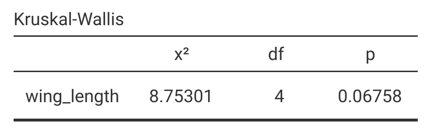
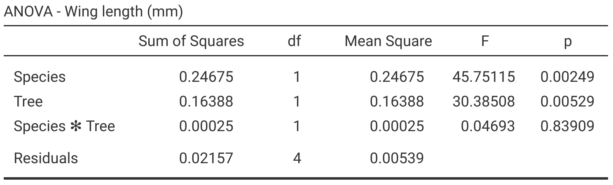
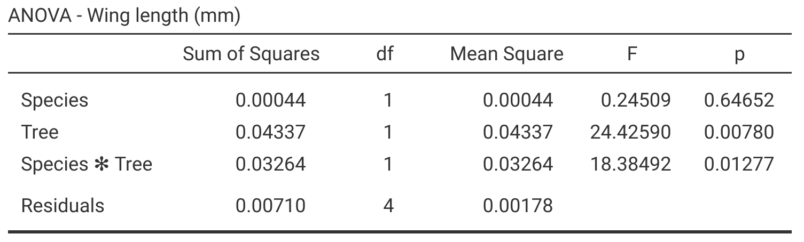
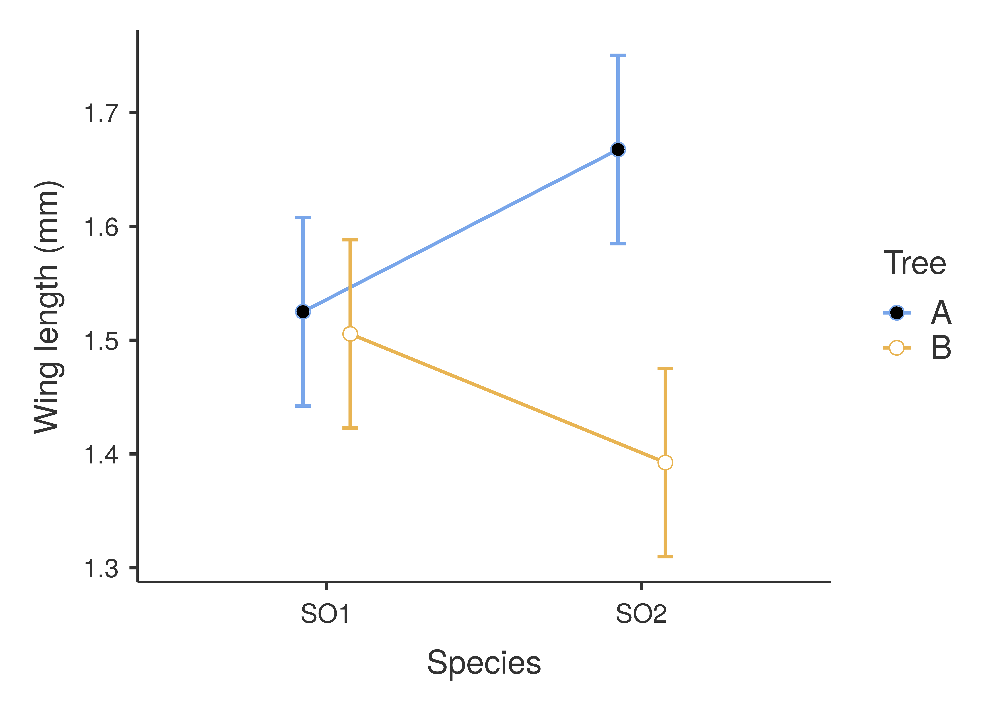

# (PART) Analysis of Variance (ANOVA) {-}

# Week 8 Overview {-#Week8}

|                 |                                   |
|-----------------|-----------------------------------|
| **Dates**       | 27 February 2023 - 03 MAR 2023 |
| **Reading**     | **Required:**  SCIU4T4 Workbook chapters 23-25 |
|                 | **Recommended:**        |
|                 | **Suggested:** None     |
|                 | **Advanced:**           |
| **Lectures**    | 6.1: What is hypothesis testing? (11:18 min; [Video](https://stirling.cloud.panopto.eu/Panopto/Pages/Viewer.aspx?id=b02e8347-81a2-4d9d-b6bd-af8200d91a80&start=0)) |
| **Practical**   | Hypothesis testing using ANOVA ([Chapter 26](#Chapter_26))       |
|                 |   Room: Cottrell 2A17         |
|                 |   Group A: 01 MAR 2023 (WED) 13:05-15:55 |
|                 |   Group B: 02 MAR 2023 (THU) 09:05-11:55 |
| **Help hours**  | Martina Quaggiotto                       |
|                 |   Room: Cottrell 1A13           |
|                 |   03 MAR 2023 (FRI) 15:05-17:55 |
| **Assessments** | [Week 7 Practice quiz]() on Canvas  |

# Analysis of variance overview {#Chapter_23}

An ANalysis Of VAriance (ANOVA) is, as the name implies, a method for analysing variances in a dataset.
This is confusing, at first, because the most common application of an ANOVA is to test for differences among group *means*.
That is, an ANOVA can be used to test the same null hypothesis as the independent samples student's t-test introduced [Chapter 21.2](#independent-samples-t-test); are 2 groups sampled from a population that has the same mean?
The t-test works fine when we have only 2 groups, but it does not work when there are 3 or more groups and we want two know if the groups all have the same mean.
An ANOVA can be used to test the null hypothesis that *all* groups in a dataset are sampled from a population with the same mean.
For example, we might want to know if mean wing length is the same for 5 species of fig wasps sampled from the same area [@Duthie2015b].
What follows is an explanation of why this can be done by looking at the variance within and between groups (note, 'groups' are also sometimes called 'factors' or 'levels').
Groups are categorical data (see [Chapter 5](#Chapter_5)).
In the case of the fig wasp example, the groups are the different species (Table 23.1).


```{r, echo = FALSE}
wing_lengths <- read.csv(file = "data/site_96_wing_lengths.csv");
knitr::kable(wing_lengths, format = "simple", table.envir = "table",
      caption = "Wing lengths (mm) measured for 5 unnamed species of non-pollinating fig wasps collected from fig trees in 2010 near La Paz in Baja, Mexico. Note, for readability, this table is not presented in a tidy format.");
```

Why is any of this necessary?
If we want to know if the 5 species of fig wasps in Table 23.1 have the same mean wing length, can we not just use t-tests to compare the means between each species?
There are a couple problems with this approach.
First, there are a lot of group combinations to compare (Het1 vs Het2, Het1 vs LO1, Het1 vs SO1, etc.).
For the 5 fig wasp species in Table 21.2, there are 10 pair-wise combinations that would need to be tested.
And the number of combinations grows exponentially[^41] with each new group added to the dataset (Table 23.2)


```{r, echo = FALSE}
Groups  <- 2:10;
Tests   <- c(1, 3, 6, 10, 15, 21, 28, 36, 45);
combins <- rbind(Groups, Tests);
knitr::kable(combins, format = "simple", table.envir = "table",
      caption = "The number of individual t-tests that would need to be run to compare the means given different numbers of groups (e.g., if a dataset had measurements from 2-10 species)");
```

Aside from the tedium of testing every possible combination of group means, there is a more serious problem having to do with the Type I error.
Recall from [Chapter 20.3](#p-values-false-positives-and-power) that a Type I error occurs when we reject the null hypothesis ($H_{0}$) and erroneously conclude that $H_{0}$ is false when it is actually true (i.e., a false positive).
If we reject $H_{0}$ at a threshold level of $\alpha = 0.05$ (i.e., reject $H_{0}$ when $P < 0.05$, as usual), then we will erroneously reject the null hypothesis about 5\% of the time that we run a statistical test and $H_{0}$ is true.
But if we run 10 separate t-tests to see if the fig wasp species in Table 23.1 have different mean wing lengths, then the probability of making an error increases considerably.
The probability of erroneously rejecting **at least 1** of the 10 null hypotheses increases from 0.05 to about 0.40.
In other words, about 40\% of the time, we would conclude that at least 2 species differ in their mean wing lengths[^42], even when all species *really do* have the same wing length.
This is not a mistake that we want to make, which is why we should first test if all of the means are equal:

- $H_{0}:$ All mean species wing lengths are the same
- $H_{A}:$ Mean species wing lengths are not all the same

We can use an ANOVA to test the null hypothesis above against the alternative hypothesis. 
If we reject $H_{0}$, then we can start comparing pairs of group means (more on this in [Chapter 25](#Chapter_25)).

How do we test the above $H_{0}$ by looking at *variances* instead of *means*?
Before getting into the details of how an ANOVA works, we will first look at the F-distribution. 
This is relevant because the test statistic calculated in an ANOVA is called an F-statistic, which is compared to an F-distribution in the same way that a t-statistic is compared to a t-distribution for a t-test (see [Chapter 21](#Chapter_21)).

[^41]: Technically polynomially, but the distinction really is not important for understanding the concept. In general, the number of possible comparisons between groups is described by a binomial coefficient, $$\binom{g}{2} = \frac{g!}{2\left(g - 2 \right)!}.$$ The number of combinations therefore increases with increasing group number (g).

[^42]: To get the 0.4, we can first calculate the probability that we (correctly) do not reject $H_{0}$ for all 10 pair-wise species combinations $(1 - 0.05)^{10} \approx 0.60$, then subtract from 1, $P(Do\:not\:reject\:H_{0}) = 1 - (1 - 0.05)^{10} \approx 0.4$. That is, we find the probability of there not being a Type I error in the first test (1 - 0.05), **and** the second test (1 - 0.05), and so forth, thereby multiplying (1 - 0.05) by itself 10 times. This gives the probability of not committing any Type I error across all 10 tests, so the probability that we commit at least 1 Type I error is 1 minus this probability.


## The F-distribution

If we want to test whether or not 2 variances are the same, then we need to know what the null distribution should be if 2 different samples came from a population with the same variance.
The general idea is the same as it was for the distributions introduced in [Chapter 14.4](#probability-distributions).
For example, if we wanted to test whether or not a coin is fair, then we could flip it 10 times and compare the number of times it comes up heads to probabilities predicted by the binomial distribution when $P(Heads) = 0.5$ and $N = 10$ (see [Chapter 14.4.1](#binomial-distribution) Figure 14.5).
To test variances, we will calculate the ratio of variances (F), then compare it to the F probability density function[^43].
For example, the ratio of the variances for samples 1 and 2 is [@Sokal1995],

$$F = \frac{Variance\:1}{Variance\:2}.$$

Note that if the variances of samples 1 and 2 are the exact same, then F = 1.
If the variances are very different, then F is either very low (if Variance 1 < Variance 2) or very high (if Variance 1 > Variance 2).
To test the null hypothesis that samples 1 and 2 have the same variance, we therefore need to map the calculated F to the probability density of the F distribution.
Again, the general idea is the same as comparing a t-score to the t-distribution in [Chapter 21.1](#one-sample-t-test).
Recall that the shape of the t-distribution is slightly different for different degrees of freedom (df).
As df increases, the t-distribution starts to resemble the normal distribution.
For the F-distribution, there are actually 2 degrees of freedom to consider. 
One degree of freedom is needed for Variance 1, and a second degree of freedom is needed for Variance 2.
Together, these 2 degrees of freedom will determine the shape of the F-distribution (Figure 23.1).


```{r, echo = FALSE, fig.alt = "A plot is shown with 3 different curve lines, which show 3 different F distributions with different degrees of freedom.", fig.cap = "Probability density functions for 3 different F distributions, each of which have different degrees of freedom for the variances in the numerator (df1) and denominator (df2)."}
df1 <- 4;
df2 <- 15;
xx  <- seq(from = 0, to = 10, by = 0.0001);
yy  <- df(x = xx, df1 = df1, df2 = df2);
par(mar = c(5, 5, 1, 1), lwd = 3);
mxy <- max(yy[2:length(xx)]);
ymx <- 1;
plot(x = xx, y = yy, type = "l", lwd = 4, cex.lab = 2, cex.lab = 2,
 cex.axis = 2, ylab = "Probability density", ylim = c(0, ymx),
 xlab = "F value", xlim = c(0, 4));
df1 <- 1;
df2 <- 25;
y2  <- df(x = xx, df1 = df1, df2 = df2);
points(x = xx, y = y2, type = "l", lwd = 4, lty = "dashed");
df1 <- 20;
df2 <- 20;
y3  <- df(x = xx, df1 = df1, df2 = df2);
points(x = xx, y = y3, type = "l", lwd = 4, lty = "dotted");
legend(x = 2, y = 1, cex = 1.35,
       legend = c("df1 = 4,   df2 = 15", "df1 = 1,   df2 = 25", "df1 = 20, df2 = 20"),
       lty = c("solid", "dashed", "dotted"));
the_ss <- function(x) sum((x - mean(x))^2);
```

Figure 23.1 shows an F distribution for 3 different combinations of degrees of freedom. 
The F distribution changes its shape considerably given different df values.
Visualising this is much, much easier using an [interactive application](https://bradduthie.shinyapps.io/f_distribution/).

> [Click here](https://bradduthie.shinyapps.io/f_distribution/) for an interactive application demonstrating how the F distribution changes with different degrees of freedom.

It is not necessary to memorise how the F distribution changes with different degrees of freedom.
The point is that the probability distribution changes given different degrees of freedom, and that the relationship between probability and the value on the x-axis (F) works like other distributions such as the normal or t-distribution.
The entire area under the curve must sum to 1, and we can calculate the area above and below any F value (rather, we can get statistical programs such as Jamovi and R to do this for us).
Consequently, we can use the F-distribution as the null distribution for the ratio of two variances.
If the null hypothesis that the 2 variances are the same is true (i.e., F = 1), then the F-distribution gives us the probability of the ratio of 2 variances being as or more extreme (i.e., further from 1) than a specific value.

[^43]: The F-distribution was originally discovered in the context of the ratio of random variables with chi-square distributions, with each variable being divided by its own degree of freedom [@Miller2004]. We will look at the Chi-square distribution in [Week 9](#Week9).

## One-way ANOVA

We can use the F-distribution to test the null hypothesis mentioned at the beginning of the chapter (that fig wasp species have the same mean wing length).
The general idea is to compare the mean variance among groups to the mean variance within groups, so our F value (i.e., "F statistic") is calculated,

$$F = \frac{Mean\:variance\:among\:\:groups}{Mean\:variance\:within\:\:groups}.$$

The rest of this section works through the details of how to calculate this F statistic.
It is easy to get lost in these details, but the calculations that follow do not need to be done by hand.
As usual, Jamovi or R will do all of this work for us [@Jamovi2022; @Rproject].
The reason for going through the ANOVA step-by-step is to show how the total variation in the dataset is being partitioned into the variance among versus within groups, and to provide some conceptual understanding of what the numbers in ANOVA output actually mean.

### ANOVA mean variance among groups

To get the mean variance among groups (i.e., mean squares; $MS_{among}$), we need to use the sum of squares (SS).
The SS was introduced to show how the variance is calculated in [Chapter 12.3](#the-variance),

$$SS = \sum_{i = 1}^{N}\left(x_{i} - \bar{x} \right)^{2}.$$

Instead of dividing SS by N - 1 (i.e., the total df), as we would do to get a sample variance, we will need to divide it by the df *among groups* ($df_{among}$) and df within groups ($df_{within}$).
We can then use these $SS_{among}/df_{among}$ and $SS_{within}/df_{within}$ values to calculate our F[^44].

This all sounds a bit abstract at first, so an example will be helpful.
We can again consider the wing length measurements from the 5 species of fig wasps shown in Table 23.1.
First, note that the **grand mean** (i.e., the mean across all species) is $\bar{\bar{x}} =$ `r mean(as.matrix(wing_lengths))`.
We can also get the sample mean values of each group, individually.
For example, for Het1,

$$\bar{x}_{Het1} = \frac{`r wing_lengths[1,1]` + `r wing_lengths[2,1]` + `r wing_lengths[3,1]` + `r wing_lengths[4,1]`}{`r dim(wing_lengths)[1]`} = `r mean(wing_lengths[,1])`$$
We can calculate the means for all 5 fig wasps (Table 23.3).

```{r, echo = FALSE}
grand_mean_wing_l  <- mean(as.matrix(wing_lengths));
wing_lengths_means <- apply(X = wing_lengths, MARGIN = 2, FUN = mean);
colnames(wing_lengths_means) <- NULL;
rownames(wing_lengths_means) <- NULL;
knitr::kable(t(wing_lengths_means), format = "simple", table.envir = "table",
      caption = "Mean wing lengths (mm) from 5 unnamed species of non-pollinating fig wasps collected from fig trees in 2010 near La Paz in Baja, Mexico. Each species mean was calculated from 4 wasps (N = 4).");
ms_among <- 4 * sum((wing_lengths_means - grand_mean_wing_l)^2);
```

To get the mean variance among groups, we need to calculate the sum of the squared deviations of each species wing length ($\bar{x}_{Het1} =$ `r wing_lengths_means[1]`, $\bar{x}_{Het2} =$ `r wing_lengths_means[2]`, etc.) from the grand mean ($\bar{\bar{x}} =$ `r mean(as.matrix(wing_lengths))`).
We also need to weigh the squared deviation of each species by the number of samples for each species[^45].
For example, for Het1, the squared deviation would be $4(`r wing_lengths_means[1]` - `r grand_mean_wing_l`)^{2}$ because there are 4 fig wasps, so we multiply the squared deviation from the mean by 4.
We can then calculate the sum of squared deviations of the species means from the grand mean,

$$SS_{among} = 4(`r wing_lengths_means[1]` - `r grand_mean_wing_l`)^{2} + 
               4(`r wing_lengths_means[2]` - `r grand_mean_wing_l`)^{2}\:+\: ... \:
               +\:4(`r wing_lengths_means[5]` - `r grand_mean_wing_l`)^{2}.$$


Calculating the above across the 5 species of wasps gives a value of $SS_{among} =$ `r ms_among`. 
To get our mean variance among groups, we now just need to divide by the appropriate degrees of freedom ($df_{among}$).
Because there are 5 total species ($N_{species} = 5$), $df_{among} = 5 - 1 = 4$.
The mean variance among groups is therefore $MS_{among} =$ `r ms_among`/4 = `r ms_among/4`.


[^45]: In this case, weighing by sample size is not so important because each species has the same number of samples. But when different groups have different numbers of samples, we need to multiply by sample number so that each group contributes proportionally to the SS.  

### ANOVA mean variance among groups

To get the mean variance within groups ($MS_{within}$), we need to calculate the sum of squared deviations of wing lengths from *species means*.
That is, we need to take the wing length of each wasp, subtract the mean species wing length, then square it.
For example, for Het1, we calculate,

$$SS_{Het1} = (`r wing_lengths[1, 1]` - `r wing_lengths_means[1]`)^{2} + 
              (`r wing_lengths[2, 1]` - `r wing_lengths_means[1]`)^{2} +
              (`r wing_lengths[3, 1]` - `r wing_lengths_means[1]`)^{2} +
              (`r wing_lengths[4, 1]` - `r wing_lengths_means[1]`)^{2}.$$

If we subtract the mean and square each term of the above,

$$SS_{Het1} = `r (wing_lengths[1, 1] - wing_lengths_means[1])^2` + 
              `r (wing_lengths[2, 1] - wing_lengths_means[1])^2` +
              `r (wing_lengths[3, 1] - wing_lengths_means[1])^2` +
              `r (wing_lengths[4, 1] - wing_lengths_means[1])^2` = `r the_ss(wing_lengths[,1])`.$$


Table 23.4 shows what happens after taking the wing lengths from Table 22.1, subtracting the means, then squaring.

```{r, echo = FALSE}
wing_lengths <- read.csv(file = "data/site_96_wing_lengths.csv");
wing_mns     <- rbind(wing_lengths_means, wing_lengths_means, 
                      wing_lengths_means, wing_lengths_means);
squared_wngs <- (wing_lengths - wing_mns)^2;
knitr::kable(squared_wngs, format = "simple", table.envir = "table",
      caption = "The squared deviations from species means for each wing length presented in Table 23.1");
```


If we sum each column (i.e., do what we did for $SS_{Het1}$ for each species), then we get the SS for each species (Table 23.5).

```{r, echo = FALSE}
SS_species   <- apply(X = squared_wngs, MARGIN = 2, FUN =sum);
knitr::kable(t(SS_species), format = "simple", table.envir = "table",
      caption = "The sum of squared deviations from species means for each wing length presented in Table 23.1");
```


If we sum the squared deviations in Table 23.5, we get a $SS_{within} =$ `r sum(SS_species)`.
Note that each species included 4 wing lengths.
We lose a degree of freedom for each of the 5 species (because we had to calculate the species mean), so our total df is 3 for each species, and $5 \times 3 = 15$ degrees of freedom within groups ($df_{within}$).
To get the mean variance within groups (denominator of F), we calculate $MS_{within} = SS_{within} / df_{within} =$ `r sum(SS_species)/15`.

[^44]: Note that the SS divided by the degrees of freedom (N - 1) is a variance. For technical reasons [@Sokal1995], we cannot simply calculate the mean variance of groups (i.e., the mean of $s^{2}_{Het1}$, $s^{2}_{Het2}$, etc.). We need to sum up all the squared deviations from group means *before* dividing by the relevant degrees of freedom (i.e., dfs for the among and within group variation). 


### ANOVA F statistic calculation

From [Chapter 23.2.1](#anova-mean-variance-among-groups), we have the mean variance among groups,

$$MS_{among} = `r ms_among/4`.$$

From [Chapter 23.2.2](#anova-mean-variance-among-groups), we have the mean variance within groups,

$$MS_{within} = `r sum(SS_species)/15`$$

To calculate F, we just need to divide $MS_{among}$ by $MS_{within}$,

$$F = \frac{`r ms_among/4`}{`r sum(SS_species)/15`} = `r (ms_among/4) / (sum(SS_species)/15)`.$$

Remember that if the mean variance among groups is the same as the mean variance within groups (i.e., $MS_{among} = MS_{within}$), then F = 1.
We can test the null hypothesis that $MS_{among} = MS_{within}$ against the alternative hypothesis that there is more variation among groups than within groups ($H_{A}: MS_{among} > MS_{within}$) using the F distribution (note that this is a one-tailed test).
In the example of 5 fig wasp species, $df_{among} = 4$ and $df_{within} = 15$,
so we need an F distribution with 4 degrees of freedom in the numerator and 15 degrees of freedom in the denominator[^46].
We can use the [interactive app](https://bradduthie.shinyapps.io/f_distribution/) to get the F-distribution and p-value (Figure 23.2).

```{r, echo = FALSE, fig.alt = "A plot is shown with an F probabilty density distribution and values on the x-axis from 0-4. The area under the curve where F > 3.244 is shaded in grey, and F = 3.244 is indicated with an arrow.", fig.cap = "F distribution with df = 4 for the numerator and df = 15 for the denominator. The arrow indicates an F value calculated from fig wasp species wing length measurements for 5 different species and 4 measurements per species. Fig wasp wing lengths were collected from a site near La Paz in Baja, Mexico 2010."}
wl    <- read.csv("data/site_96_wing_lengths_tidy.csv");
F_crit <- qf(p = 0.05, df1 = 4, df2 = 15, lower.tail = FALSE);
p_val  <- anova(lm(wl[,2]~wl[,1]))[["Pr(>F)"]];
mbox <- function(x0, x1, y0, y1){
    xx <- seq(from=x0, to=x1, length.out = 100);
    yy <- seq(from=y0, to=y1, length.out = 100);
    xd <- c(rep(x0, 100), xx, rep(x1,100), rev(xx));
    yd <- c(yy, rep(y1,100), rev(yy), rep(y0, 100));
    return(list(x=xd, y=yd));
}
v1  <- (ms_among/4);
v2  <- (sum(SS_species)/15);
df1 <- 4;
df2 <- 15;
zz  <- pf(q = v1/v2, df1 = df1, df2 = df2, lower.tail = FALSE)
xx  <- seq(from = 0, to = 10, by = 0.0001);
yy  <- df(x = xx, df1 = df1, df2 = df2);
o1  <- which(xx >= v1/v2);
b1  <- which(xx <= v1/v2);
par(mar = c(5, 5, 1, 1), lwd = 3);
ymx <- 0.9;
plot(x = xx, y = yy, type = "l", lwd = 4, cex.lab = 2, cex.lab = 2,
     cex.axis = 2, ylab = "Probability density", ylim = c(0, ymx),
     xlab = "F value", xlim = c(0, 4), yaxs = "i");
polygon(c(xx[o1], max(xx), rev(xx[o1])),
        c(yy[xx==max(xx)], yy[o1], rep(0, length(xx[o1]))),
        col="grey60", lwd = 4);
mxx <- which(xx == max(xx[b1]));
polygon(c(xx[b1], max(xx[b1]), rev(xx[b1])),
        c(yy[b1], yy[mxx], rep(0, length(b1))),
        col="white", lwd = 4);
arrows(x0 = v1/v2, x1 = v1/v2,
       y0 = 0.3, y1 = 0.06, lwd = 3);
mbox <- function(x0, x1, y0, y1){
    xx <- seq(from=x0, to=x1, length.out = 100);
    yy <- seq(from=y0, to=y1, length.out = 100);
    xd <- c(rep(x0, 100), xx, rep(x1,100), rev(xx));
    yd <- c(yy, rep(y1,100), rev(yy), rep(y0, 100));
    return(list(x=xd, y=yd));
}
tbox <- mbox(x0 = v1/v2 - 0.6, 
             x1 = v1/v2 + 0.6, y0 = 0.2, y1 = 0.4);
polygon(x=tbox$x, y=tbox$y, lwd=3, border="black", col="white");
feq <- paste("F = ", round(v1/v2, digits = 3), sep = "");
text(x = v1/v2, y = 0.3, cex = 2, labels = feq);
```

The area shaded in grey in Figure 23.2, where F > `r (ms_among/4) / (sum(SS_species)/15)`, is approximately $P =$ `r p_val[1]`.
This is our p-value.
Since $P < 0.05$, we can reject the null hypothesis that all mean species wing lengths are the same because the variance among species wing lengths is significantly higher than the variance within species wing lengths.
Note that the critical value of F (i.e., for which $P = 0.05$) is `r F_crit`, so for any F value above this (for df1 = 5 and df2 = 19), we would reject $H_{0}$.

When running an ANOVA in a statistical program, output include (at least) the calculated F statistic, degrees of freedom, and the p-value. 
Figure 23.3 shows the one-way ANOVA output of the test of fig wasp wing lengths.

```{r, echo = FALSE, fig.alt = "Jamovi output is shown with a table called 'One-Way ANOVA', which includes a single measurement for F, df1, df2, and p.", fig.cap = "Jamovi output for a one-way ANOVA of wing length measurements in 5 species of fig wasps collected in 2010 near La Paz in Baja, Mexico.", out.width="60%"}
knitr::include_graphics("img/jamovi_ANOVA_output.png");
```

Jamovi is quite minimalist for a one-way ANOVA [@Jamovi2022], but these 4 statistics (F, df1, df2, and p) are all that is really needed.
Most statistical programs will show ANOVA output that includes the SS and mean squares among ($MS_{among}$) and within ($MS_{within}$) groups.

```{r, echo = FALSE}
wl_anova <- anova(lm(wing_length~Species, data = wl));
print(wl_anova);
```

The above output, taken from R, includes the same information as Jamovi (F, df1, df2, and p), but also includes SS and mean variances.
Note that we can also get this information from Jamovi if we want it (see [Chapter 26](#Chapter_26)).

[^46]: Note that $df_{among} = 4$ and $df_{within} = 15$ sum to 19, which is the total df of the entire dataset ($N - 1 = 20 - 1 = 19$). This is always the case for the ANOVA; the overall df constrains the degrees of freedom among and within groups.


## Assumptions of ANOVA

As with the t-test (see [Chapter 21.4](#assumptions-of-t-tests)), there are some important assumptions we make when using an ANOVA.
Violating these assumptions will mean that our Type I error rate ($\alpha$) is, again, potentially misleading.
Assumptions of ANOVA include the following [@Box1978; @Sokal1995]:

1. Observations are sampled randomly
2. Observations are independent of one another
3. Groups have the same variance
4. Errors are normally distributed

Assumption 1 just means that observations are not biased in any particular way.
For example, if the fig wasps introduced at the start of this chapter were used because they were the largest wasps that were collected for each species, then this would violate the assumption that the wing lengths were sampled randomly from the population. 

Assumption 2 means that observations are not related to one another in some confounding way. 
For example, if all of the Het1 wasps came from one fig tree, and all of the Het2 wasps came from a different fig tree, then wing length measurements are not really independent within species.
In this case, we could not attribute differences in mean wing length to species.
The differences could instead be attributable to wasps being sampled from different trees (more on this in [Chapter 26](#Chapter_26)).

Assumption 3 is fairly self-explanatory. 
The ANOVA assumes that all of the groups in the dataset (e.g., species in the case of the fig wasp wing measurements) have the same variance.
That is, we assume homogeneity of variances (as opposed to heterogeneity of variances).
In general, ANOVA is reasonably robust to deviations from homogeneity, especially if groups have similar sample sizes [@Blanca2018]. 
This means that the Type I error rate is about what we want it to be (usually $\alpha = 0.05$), even when the assumption of homogeneity of variances is violated.
In other words, we are not rejecting the null hypothesis when it is true more frequently than we intend!
We can test the assumption that group variances are the same using a Levene's test in the same way that we did for the independent samples t-test in [Chapter 22](#independent-samples-t-test-1).
If we reject the null hypothesis that groups have the same variance, then we should potentially consider a non-parametric alternative test such as the Kruskall-Wallis H test (see [Chapter 25](#Chapter_25)).

Assumption 4 is the equivalent of the t-test assumption from [Chapter 21.4](#assumptions-of-t-tests) that sample means are normally distributed around the true mean.
What the assumption means is that if we were to repeatedly resample data from a population, the sample means that we calculate would be normally distributed.
For the fig wasp wing measurements, this means that if we were to go back out and repeatedly collect 4 fig wasps from each of the 5 species, then sample means of species wing length and overall wing length would be normally distributed around the true means.
Due to the central limit theorem (see [Chapter 15](#Chapter_15)), this becomes less problematic with increasing sample size.
We can test if the sample data are normally distributed using a Q-Q plot or Shapiro-Wilk test (the same procedure used for the t-test).
Fortunately, the ANOVA is quite robust to deviations from normality [@Schmider2010], but if data are not normally distributed, we should again consider a non-parametric alternative test such as the Kruskall-Wallis H test (see [Chapter 25](#Chapter_25)).


# Multiple comparisons {#Chapter_24}

In the [Chapter 23.2](#one-way-anova) ANOVA example, we rejected the null hypothesis that all fig wasp species have the same mean wing length.
We can therefore conclude that at least one species has a different mean wing length than the rest; can we determine which one(s)?
We can try to find this out using a post hoc comparison (*post hoc* is Latin for 'after the event').
That is, after we have reject the null hypothesis in the one-way ANOVA, we can start comparing individual groups (Het1 vs Het2, Het1 vs LO1, etc.).
Nevertheless, we need some way to correct for the Type I error problem explained at the beginning of [Chapter 23](#Chapter_23).
That is, if we run a large enough number of t-tests, then we are almost guaranteed that we will find a significant difference between means (P < 0.05) where none really exists.
A way to avoid this inflated Type I error rate is to set our significance threshold to be lower than the usual $\alpha = 0.05$.
We can, for example, divide our $\alpha$ value by the total number of pair-wise t-tests tests that we run.
This is called a Bonferonni correction [@Dytham2011], and it is an especially cautious approach to post hoc comparisons between groups [@Narum2006].
For the fig wasp wing lengths, recall that there are 10 possible pairwise comparisons between the 5 species.
This means that if we were to apply a Bonferonni correction and run 10 separate t-tests, then we would only conclude that species mean wing lengths were different when $P < 0.005$ instead of $P < 0.05$.

Another approach to correcting for multiple comparisons is a Tukey's honestly significant difference test (Tukey's HSD, or just a 'Tukey's test').
The general idea of a Tukey's test is the same as the Bonferonni.
Multiple t-tests are run in a way that controls the Type I error rate so that the probability of making a Type I error across the whole set of comparisons is fixed (e.g., at $\alpha = 0.05$).
The Tukey's test does this by using a modified t-test, with a t-distribution called the "studentised range distribution" that applies the range of mean group values (i.e., $max(\bar{x}) - min(\bar{x})$) and uses the sample variance across the groups with the highest and lowest sample means [@Tukey1949; @Box1978].

Multiple comparisons tests can be run automatically in statistical programs such as Jamovi and R.
Figure 24.1 shows a post-hoc comparisons table for all pair-wise combinations of fig wasp species wing length means.

```{r, echo = FALSE, fig.alt = "Jamovi output is shown with a large table called 'Post Hoc Comparisons', which reports statistics for 10 pair-wise combinations of 5 species.", fig.cap = "Jamovi output showing a table of 10 post hoc comparisons between species mean wing lengths for 5 different species of fig wasps. The last 3 columns show the uncorrected p-value (p), a p-value obtained from a Tukey's test, and a p-value obtained from a Bonferroni correction. Species wing length measurements were collected in 2010 near La Paz in Baja, Mexico.", out.width="100%"}
knitr::include_graphics("img/jamovi_multiple_comparisons.png");
```

The column 'p' in Figure 24.1 is the uncorrected p-value, i.e., the p-value that a t-test would produce without any correction for multiple comparisons.
The columns $p_{tukey}$ and $p_{bonferonni}$ show corrected p-values for the Tukey's test and Bonferroni corrected t-test, respectively.
We can interpret these p-values as usual, concluding that two species have different means if $P < 0.05$ (i.e., Jamovi does the correction for us; we do not need to divide $\alpha = 0.05$ to figure out what the significance threshold should be given the Bonferonni correction).

Note that from Figure 24.1, it appears that both the Tukey's test and the Bonferonni correction fail to find that any pair of species have significantly different means.
This does not mean that we have done the test incorrectly.
The multiple comparisons tests are asking a slightly different question than the one-way ANOVA.
The multiple comparisons tests are testing the null hypothesis that two *particular* species have the same mean wing lengths.
The one-way ANOVA tested the null hypothesis that all species have the same mean, and our result for the ANOVA was barely below the $\alpha = 0.05$ threshold (P = 0.042).
The ANOVA also has more statistical power because it makes use of all 20 measurements in the dataset, not just a subset of measurements between 2 of the 5 species.
It is therefore not particularly surprising or concerning that we rejected $H_{0}$ for the ANOVA, but the multiple comparisons tests failed to find any significant difference between group means.


# Kruskall-Wallis H test {#Chapter_25}

If the assumptions of the one-way ANOVA are violated, then we can consider using a Kruskall-Wallis test.
The Kruskall-Wallis test is essentially an extension of the Mann-Whitney U test from [Chapter 21.5.2](#mann-whitney-u-test) for samples with more than 2 groups [@Kruskal1952].
Like the Mann-Whitney U test, it uses the *ranks* of values instead of the actual values in the dataset.
The idea is to rank all values in the dataset, ignoring group, then calculate a test statistic (H) that increases as the difference among group ranks increases, relative to the difference within group ranks.
We can again use the example of the fig wasp wing lengths introduced in [Chapter 23](#Chapter_23).
For convenience, Table 23.1 is reproduced here as Table 25.1.

```{r, echo = FALSE}
wing_lengths <- read.csv(file = "data/site_96_wing_lengths.csv");
knitr::kable(wing_lengths, format = "simple", table.envir = "table",
      caption = "Reproduction of Table 23.1. Wing lengths (mm) measured for 5 unnamed species of non-pollinating fig wasps collected from fig trees in 2010 near La Paz in Baja, Mexico. Note, for readability, this table is not presented in a tidy format.");
```

Recall that in the one-way ANOVA from [Chapter 23.2](#one-way-anova), we reject the null hypothesis that all species had the same mean wing length (P = 0.042).
But we had not actually tested the assumptions of the one-way ANOVA before running the test!
If we had tested the ANOVA assumptions, we would not reject the null hypothesis that wing length is normally distributed (Shapiro-Wilk test P = 0.698).
But a Levene's test of homogeneity of variances convincingly rejects the null hypothesis that the group variances are equal (P = 0.008).
Consequently, we should probably have used the non-parametric Kruskall-Wallis H test instead.
To do this, we first need to rank all of the values in Table 25.1.
There are 20 total values, so we rank them from 1 to 20 (Table 25.2).

```{r, echo = FALSE}
the_ranks <- rank(as.matrix(wing_lengths));
rank_mat  <- matrix(data = the_ranks, nrow = 4, ncol = 5, byrow = FALSE);
colnames(rank_mat) <- names(wing_lengths);
knitr::kable(rank_mat, format = "simple", table.envir = "table",
      caption = "Ranks of wing lengths (mm) measured for 5 unnamed species of non-pollinating fig wasps collected from fig trees in 2010 near La Paz in Baja, Mexico.");
```

From these ranks, we calculate a test statistic H from the overall sample size (N), the sample size of each group ($N_{i}$), the mean of group ranks ($\bar{R}_{i}$), and the overall mean rank ($\bar{\bar R}$).
Of course, we do not need to do this by hand.
But the formula shows how a statistical program will do the calculation [@Kruskal1952a],

$$H = (N - 1) \frac{\sum_{i=1}^{g}N_{i}\left(\bar{R}_{i} - \bar{\bar R} \right)^2}{\sum_{i=1}^{g}\sum_{j=1}^{N_{i}} \left(R_{ij} - \bar{\bar R} \right)^{2}}.$$

For our purposes, the mathematical details are not important.
The equation is included here only to show the similarity between the calculation of H versus F from [Chapter 23.2](#one-way-anova).
In the numerator of the equation for H, we are calculating the squared deviation of mean group ranks from the overall mean rank $(\bar{R}_{i} - \bar{\bar R})^2$, as weighted by the group sample size $N_{i}$.
We are then dividing by the sum of squared deviations of all ranks ($R_{ij}$) from the overall mean rank $\bar{\bar R}$.
All of this gets multiplied by $N - 1$ to give the test statistic H.
We can then compare H to a suitable null distribution, which might be calculated precisely using a specific algorithm [e.g., @Choi2003].
But most statistical programs such as Jamovi and R compare H to a Chi-square distribution (see [Week 9](#Week9)), which is an effective approximation [@Miller2004].

The output of a Kruskall-Wallis H test is quite minimal and easy to read.
Jamovi and R report a Chi-square ($\chi^{2}$) test statistic, degrees of freedom, and p-value [@Jamovi2022; @Rproject].
Figure 25.1 shows the output of a Kruskall-Wallis H test on the fig wasp wing lengths data.

```{r, echo = FALSE, fig.alt = "Jamovi output is shown with a small table that includes 1 row and 3 statistics from a Kruskall-Wallis H test.", fig.cap = "Jamovi output table for a non-parametric Kruskall-Wallis H test, which tests the null hypothesis that species mean wing lengths are the same for 5 different species of fig wasps. Species wing length measurements were collected in 2010 near La Paz in Baja, Mexico.", out.width="60%"}
;
```

Given Kruskall-Wallis H test output (Figure 25.1), we should not reject the null hypothesis that species have different wing lengths because P > 0.05.
This is in contrast to our one-way ANOVA result, for which we did reject the same null hypothesis.
The Kruskall-Wallis H test does not assume that group variances are the same, unlike the one-way ANOVA.
Since we know that the homogeneity of variances assumption is violated for the fig wasp data, it is probably best to be cautious and conclude that mean wing length does not differ among species.


# Two-way ANOVA {#Chapter_26}

The one-way ANOVA tested the null hypothesis that all group means are the same.
But we might also have a dataset in which there is more than 1 type of group.
For example, suppose we know that the fig wasps used in Chapters 23-25 actually came from 2 different trees (Tree A and Tree B).
This would mean that there could be a confounding variable affecting wing length, violating assumption 2 from [Chapter 23.3](#assumptions-of-anova).
If, for whatever reason, fig wasps on different trees have different wing lengths, then we should include tree as an explanatory variable in the ANOVA.
Because we would then have 2 group types (species and tree), we would need a two-way ANOVA[^47].
Here, to illustrate the key concepts as clearly as possible, we will run an example of a two-way ANOVA with just 2 of the 5 species (Het1 and SO2).
Table 26.1 shows the fig wasp wing length dataset for the 2 species in a tidy format, which includes columns for 2 group types, species and tree.

```{r, echo = FALSE}
wing_lengths_tree <- read.csv("data/site_96_wing_lengths_Het_SO.csv");
knitr::kable(wing_lengths_tree, format = "simple", table.envir = "table",
      caption = "Wing lengths (mm) measured for 2 unnamed species of non-pollinating fig wasps collected from 2 fig trees in 2010 near La Paz in Baja, Mexico.");
```

We could run a one-way ANOVA (or t-test) to see if wing lengths differ between species, then run another one-way ANOVA to see if wing lengths differ between trees.
But by including both group types in the same model (species and tree), we can test how one group affects wing length in the context of the other group (e.g., how tree affects wing length, while also accounting for any effects of species on wing length).
We can also see if there is any synergistic effect between groups, which is called an **interaction effect**.
For example, if Het1 fig wasps had longer wing lengths than SO1 on Tree A, but shorter wing lengths than SO1 on Tree B, then we would say that there is an interaction between species and tree.
Given this kind of interaction effect, it would not make sense to say that Het1 fig wasps have longer or shorter wings than SO1 because this would depend on the tree!

This chapter will not delve into the mathematics of the two-way ANOVA[^48].
Working out a two-way ANOVA by hand requires similar, albeit more laborious, calculations of sum of squares and degrees of freedom than is needed for the one-way ANOVA in [Chapter 23.2](#one-way-anova).
But the general concept is the same.
The idea is to calculate the amount of the total variation attributable to different groups, or the interaction among group types.
Note that the assumptions for the two-way ANOVA are the same as for the one-way ANOVA.

Unlikely previous statistical tests in this book, we can actually test three separate null hypotheses with a two-way ANOVA.
The first test is the same as the one-way ANOVA in [Chapter 23](#Chapter_23), which focuses on mean species wing lengths:

- $H_{0}:$ Both mean species wing lengths are the same
- $H_{A}:$ Mean species wing lengths are not the same

The second test focuses on the other group type, Tree:

- $H_{0}:$ Wing lengths are the same in both trees
- $H_{A}:$ Wing lengths are not the same in both trees

These two hypotheses address the **main effects** of the independent variables (species and tree) on the dependent variable (wing length).
In other words, the mean effect of one group type (either species or tree) by itself, holding the other constant.
The third hypothesis addresses the interaction effect:

- $H_{0}:$ There is no interaction between species and tree
- $H_{A}:$ There is an interaction between species and tree

Interaction effects are difficult to understand at first, so we will look at two concrete examples of two-way ANOVAs.
The first will use the Table 26.1 data in which no interaction effect exists.
The second will use a different species pairing in which an interaction does exist.

In a two-way ANOVA, the output (Figure 26.1) appears similar to that of a one-way ANOVA (see [Chapter 23.2.3](#anova-f-statistic-calculation)), but there are 4 rows of output.
Rows 1 and 2 test the null hypotheses associated with the main effects of species and tree, respectively.
Row 3 tests the interaction effect.
And row 4 shows us the variation in the data that cannot be attributed to either the main effects or the interaction (i.e., the residual variation).
This is equivalent to the variation within groups in the one-way ANOVA.

```{r, echo = FALSE, fig.alt = "Jamovi output is shown with a small table that includes 4 rows and 5 two-way ANOVA.", fig.cap = "Jamovi output table for a two-way ANOVA, which tests for the effects of species (Het1 and SO2), tree, and their interaction on fig wasp wing lengths. Species wing length measurements were collected in 2010 near La Paz in Baja, Mexico.", out.width="100%"}
;
```

This is a lot more information than the one-way ANOVA, but it helps to think of each row separately as a test of a different null hypothesis.
From the first row, given the high F = 45.75 and the low P = 0.002, we can reject the null hypothesis that species mean wing lengths are the same.
Similarly, from the second row, we can reject the null hypothesis that wing lengths are the same in both trees (F = 30.39; P = 0.005).
In contrast, from the third row, we should not reject the null hypothesis that there is no interaction between species and trees (F = 0.05, P = 0.839).
Figure 26.2 shows the these results visually [@Jamovi2022].

```{r, echo = FALSE, fig.alt = "A plot is shown in Jamovi with species on the x-axis and two connected lines, one blue for Tree A and one orange for Tree B. The lines run in parallel at a downward angle.", fig.cap = "An interaction plot for a two-way ANOVA of fig wasp wing measurements as affected by species and tree. Points show mean values for the 4 species and tree combinations (e.g., Het1 from Tree A in the upper left). Error bars show standard errors around the means. Species wing length measurements were collected in 2010 near La Paz in Baja, Mexico.", out.width="100%"}
knitr::include_graphics("img/two-way_ANOVA_no_interaction.png");
```

In Figure 26.2, there is no interaction between species and tree.
How can we infer this from Figure 26.2?
Wing length is always significantly higher in Tree A than it is in Tree B, regardless of the species of wasp.
Similarly, wing length is always higher for Het1 than it is for SO2, regardless of tree.
Consequently, while wasp species is important for predicting wing length, as is the tree from which the wasp was collected, we do not need to consider one variable to know the effect of the other.
This is reflected in the orange and blue lines having a similar slope, or, more technically, slopes that are not significantly different from one another.
If the slopes of the two lines were significantly different, then this would be evidence for an interaction between species and tree.

What would Figure 26.2 look like if there was an interaction effect between species and tree?
We can run another two-way ANOVA, this time with a different pair of species, SO1 and SO2.
Table 26.2 shows the data.

```{r, echo = FALSE}
wing_lengths_tree <- read.csv("data/site_96_wing_lengths_SOs.csv");
knitr::kable(wing_lengths_tree, format = "simple", table.envir = "table",
      caption = "Wing lengths (mm) measured for 2 unnamed species of non-pollinating fig wasps collected from 2 fig trees in 2010 near La Paz in Baja, Mexico.");
```

If we run the two-way ANOVA in Jamovi, then we can see the ANOVA output table (Figure 26.3).


```{r, echo = FALSE, fig.alt = "Jamovi output is shown with a small table that includes 4 rows and 5 two-way ANOVA.", fig.cap = "Jamovi output table for a two-way ANOVA, which tests for the effects of species (SO1 and SO2), tree, and their interaction on fig wasp wing lengths. Species wing length measurements were collected in 2010 near La Paz in Baja, Mexico.", out.width="100%"}
;
```

Figure 26.3 shows that the effect of species is not significant (P > 0.05), but the effect of tree is significant (P < 0.05).
Consequently, in terms of the main effects, it appears that species does not affect wing length, but tree does affect wing length.
Unlike the example test between Het1 and SO2, the interaction between species and tree is significant in Figure 26.3.
This means that we cannot interpret the main effects in isolation because the effect of each on wing length will change in the presence of the other.
In other words, the effect of tree on wing length will depend on the species.
Figure 26.4 shows this interaction visually.

```{r, echo = FALSE, fig.alt = "A plot is shown in Jamovi with species on the x-axis and two connected lines, one blue for Tree A and one orange for Tree B. The lines run in parallel at a downward angle.", fig.cap = "An interaction plot for a two-way ANOVA of fig wasp wing measurements as affected by species and tree. Points show mean values for the 4 species and tree combinations (e.g., SO2 from Tree A in the upper left). Error bars show standard errors around the means. Species wing length measurements were collected in 2010 near La Paz in Baja, Mexico.", out.width="100%"}
;
```

Note that for SO1, wing length is basically the same for Tree A and B (the 2 left points in Figure 26.4).
In contrast, for SO2, tree has a very noticeable effect on wing length!
Fig wasps in species SO2 clearly have higher wing lengths on Tree A than they do on Tree B.
*Overall*, however, the mean wing length for SO2 appears to be about the same as it is for SO1 (i.e., the mid-way point between the blue and orange points for SO2 is at about the same wing length as it is for SO1, around 1.5 mm).
Species therefore does not really have an effect on wing length, at least not by itself.
But species *does* have a clear effect if you also take tree into account.
In other words, to predict how tree will affect wing length (not at all for SO1, or a lot for SO2), it is necessary to know what species of fig wasp is being considered.
This is how interactions work in ANOVA, and more generally in statistics.

There is one last point that is relevant to make for the two-way ANOVA.
Recall that we tested 3 null hypotheses simultaneously.
Should we not then apply some kind of correction for multiple comparisons, as we did in [Chapter 24](#Chapter_24)?
This is actually not necessary.
The reason is subtle.
With the multiple t-tests, we wanted to know if *any* of the pair-wise differences between groups were significant.
Each t-test was not really a separate question in this case.
We just tried all possible combinations in search of a pair of species with significantly different wing lengths.
With the two-way ANOVA, we are asking 3 separate questions, and accepting a Type I error rate of 0.05 for each of them, individually.

[^47]: Yes, it is possible to have a three-way or a four-way ANOVA, but having so many group types can get very messy very quickly, especially if we want to look at interactions between group types.

[^48]: For those interested, chapter 11 of @Sokal1995 works all of this out step by step. 


# _Practical_. ANOVA and associated tests {#Chapter_27}


## ANOVA Exercise 1

## ANOVA Exercise 2

## ANOVA Exercise 3

## ANOVA Exercise 4


