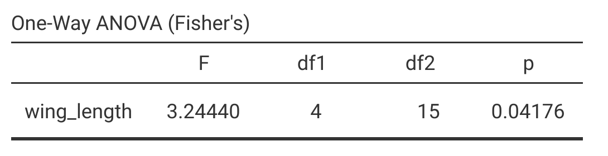
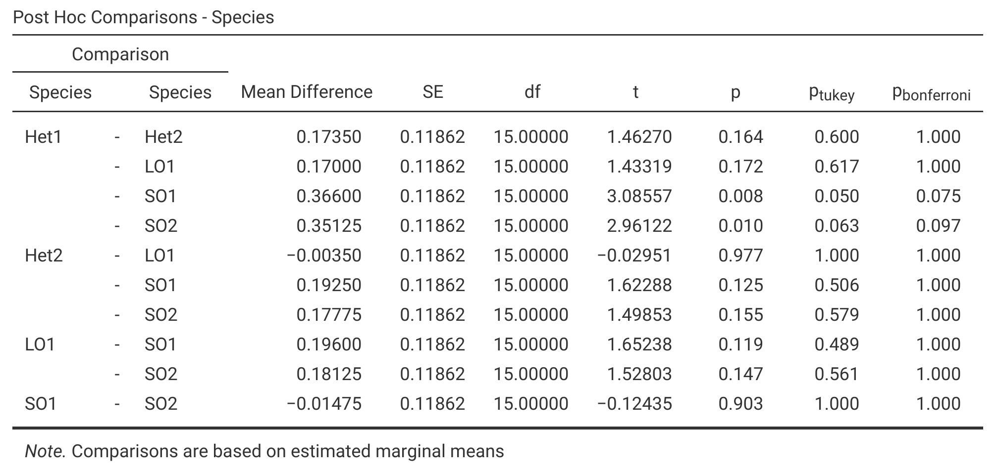
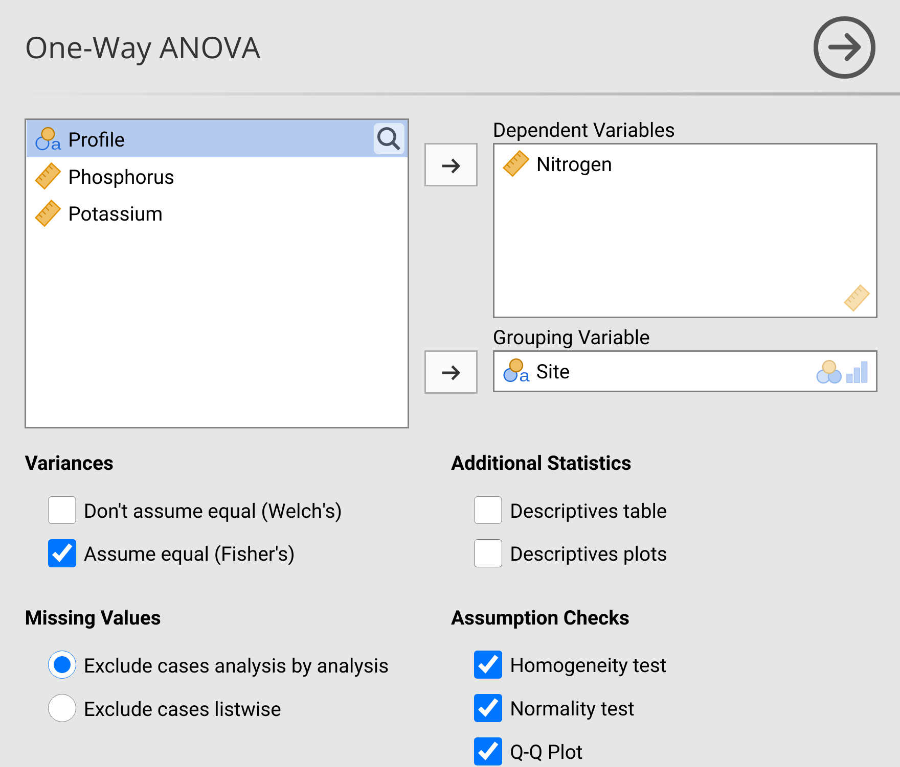

# (PART) Analysis of Variance (ANOVA) {-}

# Week 8 Overview {-#Week8}

|                 |                                   |
|-----------------|-----------------------------------|
| **Dates**       | 11 March 2024 - 15 MAR 2024 |
| **Reading**     | **Required:**  SCIU4T4 Workbook chapters 23-25 |
|                 | **Recommended:**  @Navarro2022 ([Chapter 13](https://davidfoxcroft.github.io/lsj-book/13-Comparing-several-means-one-way-ANOVA.html))   |
|                 | **Suggested:** @Rowntree2018 (Chapter 7)     |
|                 | **Advanced:**  @Head2015 ([Download](https://journals.plos.org/plosbiology/article?id=10.1371/journal.pbio.1002106))        |
| **Lectures**    | 8.1: What is ANOVA? (15:35 min; [Video](https://stirling.cloud.panopto.eu/Panopto/Pages/Viewer.aspx?id=766f4b54-0086-4179-8836-b0ed011afadd)) |
|                 | 8.2: One Way ANOVA (16:51 min; [Video](https://stirling.cloud.panopto.eu/Panopto/Pages/Viewer.aspx?id=d0dacab7-4085-4977-b761-b0ed011b1d23)) |
|                 | 8.3: Two Way ANOVA (17:02 min; [Video](https://stirling.cloud.panopto.eu/Panopto/Pages/Viewer.aspx?id=1da7e0d0-7e54-41c6-9232-b0ed011b4381)) |
|                 | 8.4: Kruskal-Wallis H Test (6:37 min; [Video](https://stirling.cloud.panopto.eu/Panopto/Pages/Viewer.aspx?id=0950c39a-d8b2-4f8c-ac5f-b0ed011b567b)) |
| **Practical**   | ANOVA and associated tests ([Chapter 27](#Chapter_27))       |
|                 |   Room: Cottrell 2A17         |
|                 |   Group A: 13 MAR 2024 (WED) 09:05-11:55 |
|                 |   Group B: 14 MAR 2024 (THU) 12:05-14:55 |
| **Help hours**  | Martina Quaggiotto                       |
|                 |   Room: Cottrell 2A21           |
|                 |   15 MAR 2024 (FRI) 15:05-17:55 |
| **Assessments** | [Week 8 Practice quiz](https://canvas.stir.ac.uk/courses/14932/quizzes/35449) on Canvas  |
|                 | [Test 1S](https://canvas.stir.ac.uk/courses/14932/quizzes/35456) on Canvas  |


Week 8 introduces ANalysis Of VAriance (ANOVA) and related methods, all of which focus on testing whether or not multiple groups in a dataset have the same mean.

[Chapter 23](#Chapter_23) introduces the general idea of the ANOVA, how it is calculated, and the F statistic that is used to test the null hypothesis that all groups have the same mean. 
This chapter also outlines the assumptions of ANOVA.

[Chapter 24](#Chapter_24) introduces multiple comparisons tests.
These tests can be used to find out which group means differ in a dataset when there are more than 2 groups.

[Chapter 25](#Chapter_25) introduces the Kruskall-Wallis H test.
This is the non-parametric equivalent of the one-way ANOVA, which can be used when assumptions of the ANOVA are violated.
The Kruskall-Wallis is an extension of the Mann-Whitney U test from [Chapter 21.5.2](#mann-whitney-u-test)

[Chapter 26](#Chapter_25) introduces the two-way ANOVA.
With the two-way ANOVA, it also introduces the ideas of testing multiple null hypotheses with a single test and the concept of statistical interactions.

[Chapter 27](#Chapter_25) guides you through the week 8 practical. The aim of this practical is to practice using and correctly interpreting the tests that are introduced in chapters 23-26.

# Analysis of variance {#Chapter_24}

An ANalysis Of VAriance (ANOVA) is, as the name implies, a method for analysing variances in a dataset.
This is confusing, at first, because the most common application of an ANOVA is to test for differences among group *means*.
That is, an ANOVA can be used to test the same null hypothesis as the independent samples Student's t-test introduced in [Section 22.2](#independent-samples-t-test); are two groups sampled from a population that has the same mean?
The t-test works fine when we have only two groups, but it does not work when there are three or more groups, and we want to know if the groups all have the same mean.
An ANOVA can be used to test the null hypothesis that *all* groups in a dataset are sampled from a population with the same mean.
For example, we might want to know if mean wing length is the same for five species of fig wasps sampled from the same area [@Duthie2015b].
What follows is an explanation of why this can be done by looking at the variance within and between groups (note, 'groups' are also sometimes called 'factors' or 'levels').
Groups are categorical data (see [Chapter 5](#Chapter_5)).
In the case of the fig wasp example, the groups are the different species (Table 24.1).


```{r, echo = FALSE}
wing_lengths <- read.csv(file = "data/site_96_wing_lengths.csv");
pander::pander(format(wing_lengths, nsmall = 3), format = "simple", table.envir = "table",
      caption = "**TABLE 24.1** Wing lengths (mm) measured for five unnamed species of non-pollinating fig wasps collected from fig trees in 2010 near La Paz in Baja, Mexico.");
```

Why is any of this necessary?
If we want to know if the five species of fig wasps in Table 24.1 have the same mean wing length, can we not just use t-tests to compare the means between each species?
There are a couple of problems with this approach.
First, there are a lot of group combinations to compare (Het1 vs Het2, Het1 vs LO1, Het1 vs SO1, etc.).
For the five fig wasp species in Table 24.1, there are 10 pair-wise combinations that would need to be tested.
And the number of combinations grows exponentially[^grows_exponentially] with each new group added to the dataset (Table 24.2).


```{r, echo = FALSE}
Groups  <- 2:10;
Tests   <- c(1, 3, 6, 10, 15, 21, 28, 36, 45);
combins <- rbind(Groups, Tests);
pander::pander(combins, format = "simple", table.envir = "table",
      caption = "**TABLE 24.2** Number of individual t-tests that would need to be run to compare the means given different numbers of groups (e.g., if a dataset had measurements from 2--10 species).");
```

Aside from the tedium of testing every possible combination of group means, there is a more serious problem having to do with the Type I error.
Recall from [Section 21.3](#p-values-false-positives-and-power) that a Type I error occurs when we rejected the null hypothesis ($H_{0}$) and erroneously conclude that $H_{0}$ is false when it is actually true (i.e., a false positive).
If we reject $H_{0}$ at a threshold level of $\alpha = 0.05$ (i.e., reject $H_{0}$ when $P < 0.05$, as usual), then we will erroneously reject the null hypothesis about 5\% of the time that we run a statistical test and $H_{0}$ is true.
But if we run 10 separate t-tests to see if the fig wasp species in Table 24.1 have different mean wing lengths, then the probability of making an error increases considerably.
The probability of erroneously rejecting **at least 1** of the 10 null hypotheses increases from 0.05 to about 0.40.
In other words, about 40\% of the time, we would conclude that at least two species differ in their mean wing lengths[^get_the_0pt4] even when all species *really do* have the same wing length.
This is not a mistake that we want to make, which is why we should first test if all of the means are equal:

- $H_{0}:$ Mean species wing lengths are all the same
- $H_{A}:$ Mean species wing lengths are not all the same

We can use an ANOVA to test the null hypothesis above against the alternative hypothesis. 
If we reject $H_{0}$, then we can start comparing pairs of group means (more on this in [Chapter 26](#Chapter_26)).

How do we test the above $H_{0}$ by looking at *variances* instead of *means*?
Before getting into the details of how an ANOVA works, we will first look at the F-distribution. 
This is relevant because the test statistic calculated in an ANOVA is called an F-statistic, which is compared to an F-distribution in the same way that a t-statistic is compared to a t-distribution for a t-test (see [Chapter 22](#Chapter_22)).

[^grows_exponentially]: Technically polynomially, but the distinction really is not important for understanding the concept. In general, the number of possible comparisons between groups is described by a binomial coefficient, $$\binom{g}{2} = \frac{g!}{2\left(g - 2 \right)!}.$$ The number of combinations therefore increases with increasing group number (g).

[^get_the_0pt4]: To get the 0.4, we can first calculate the probability that we (correctly) do not reject $H_{0}$ for all 10 pair-wise species combinations $(1 - 0.05)^{10} \approx 0.60$, then subtract from 1, $P(Reject\:H_{0}) = 1 - (1 - 0.05)^{10} \approx 0.4$. That is, we find the probability of there not being a Type I error in the first test $(1 - 0.05)$, **and** the second test $(1 - 0.05)$, and so forth, thereby multiplying $(1 - 0.05)$ by itself 10 times. This gives the probability of not committing any Type I error across all 10 tests, so the probability that we commit at least one Type I error is 1 minus this probability.


## F-distribution {#f-distribution}

If we want to test whether or not two variances are the same, then we need to know what the null distribution should be if two different samples came from a population with the same variance.
The general idea is the same as it was for the distributions introduced in [Section 15.4](#probability-distributions).
For example, if we wanted to test whether or not a coin is fair, then we could flip it 10 times and compare the number of times it comes up heads to probabilities predicted by the binomial distribution when $P(Heads) = 0.5$ and $N = 10$ (see [Section 15.4.1](#binomial-distribution) and Figure 15.5).
To test variances, we will calculate the ratio of variances ($F$), then compare it to the $F$ probability density function[^F_distr_discovery].
For example, the ratio of the variances for two samples, 1 and 2, is [@Sokal1995],

$$F = \frac{\mathrm{Variance}\:1}{\mathrm{Variance}\:2}.$$

Note that if the variances of samples 1 and 2 are the exact same, then $F = 1$.
If the variances are very different, then $F$ is either very low (if Variance 1 < Variance 2) or very high (if Variance 1 > Variance 2).
To test the null hypothesis that samples 1 and 2 have the same variance, we therefore need to map the calculated $F$ to the probability density of the F-distribution.
Again, the general idea is the same as comparing a t-score to the t-distribution in [Section 22.1](#one-sample-t-test).
Recall that the shape of the t-distribution is slightly different for different degrees of freedom ($df$).
As $df$ increases, the t-distribution starts to resemble the normal distribution.
For the F-distribution, there are actually two degrees of freedom to consider. 
One degree of freedom is needed for Variance 1, and a second degree of freedom is needed for Variance 2.
Together, these two degrees of freedom will determine the shape of the F-distribution (Figure 24.1).


```{r, echo = FALSE, fig.alt = "A plot is shown with 3 different curve lines, which show 3 different F-distributions with different degrees of freedom.", fig.cap = "Probability density functions for three different F-distributions, each of which has different degrees of freedom for the variances in the numerator (df1) and denominator (df2)."}
df1 <- 4;
df2 <- 15;
xx  <- seq(from = 0, to = 10, by = 0.0001);
yy  <- df(x = xx, df1 = df1, df2 = df2);
par(mar = c(5, 5, 1, 1), lwd = 3);
mxy <- max(yy[2:length(xx)]);
ymx <- 1;
plot(x = xx, y = yy, type = "l", lwd = 4, cex.lab = 2, cex.lab = 2,
 cex.axis = 2, ylab = "Probability density", ylim = c(0, ymx),
 xlab = "F value", xlim = c(0, 4));
df1 <- 1;
df2 <- 25;
y2  <- df(x = xx, df1 = df1, df2 = df2);
points(x = xx, y = y2, type = "l", lwd = 4, lty = "dashed");
df1 <- 20;
df2 <- 20;
y3  <- df(x = xx, df1 = df1, df2 = df2);
points(x = xx, y = y3, type = "l", lwd = 4, lty = "dotted");
legend(x = 2, y = 1, cex = 1.35,
       legend = c("df1 = 4,   df2 = 15", "df1 = 1,   df2 = 25", "df1 = 20, df2 = 20"),
       lty = c("solid", "dashed", "dotted"));
the_ss <- function(x) sum((x - mean(x))^2);
```

Figure 24.1 shows an F-distribution for three different combinations of degrees of freedom. 
The F-distribution changes its shape considerably given different df values (visualising this is easier with an interactive application[^shiny_f]).

It is not necessary to memorise how the F-distribution changes with different degrees of freedom.
The point is that the probability distribution changes given different degrees of freedom, and that the relationship between probability and the value on the x-axis ($F$) works like other distributions such as the normal or t-distribution.
The entire area under the curve must sum to 1, and we can calculate the area above and below any $F$ value (rather, we can get jamovi to do this for us).
Consequently, we can use the F-distribution as the null distribution for the ratio of two variances.
If the null hypothesis that the two variances are the same is true (i.e., $F = 1$), then the F-distribution gives us the probability of the ratio of two variances being as or more extreme (i.e., further from 1) than a specific value.

[^F_distr_discovery]: The F-distribution was originally discovered in the context of the ratio of random variables with Chi-square distributions, with each variable being divided by its own degree of freedom [@Miller2004]. We will look at the Chi-square distribution in [Chapter 29](#Chapter_29).

[^shiny_f]: https://bradduthie.github.io/stats/app/f_distribution/

## One-way ANOVA

We can use the F-distribution to test the null hypothesis mentioned at the beginning of the chapter (that fig wasp species have the same mean wing length).
The general idea is to compare the mean variance among groups to the mean variance within groups, so our F value (i.e., 'F-statistic') is calculated,

$$F = \frac{\mathrm{Mean\:variance\:among\:\:groups}}{\mathrm{Mean\:variance\:within\:\:groups}}.$$

The rest of this section works through the details of how to calculate this F-statistic.
It is easy to get lost in these details, but the calculations that follow do not need to be done by hand.
As usual, jamovi will do all of this work for us [@Jamovi2022].
The reason for going through the ANOVA step-by-step process is to show how the total variation in the dataset is being partitioned into the variance among versus within groups, and to provide some conceptual understanding of what the numbers in an ANOVA output actually mean.

### ANOVA mean variance among groups

To get the mean variance among groups (i.e., mean squares; $MS_{\mathrm{among}}$), we need to use the sum of squares ($SS$).
The $SS$ was introduced to show how the variance is calculated in [Section 12.3](#the-variance),

$$SS = \sum_{i = 1}^{N}\left(x_{i} - \bar{x} \right)^{2}.$$

Instead of dividing $SS$ by $N - 1$ (i.e., the total $df$), as we would do to get a sample variance, we will need to divide it by the $df$ *among groups* ($df_{\mathrm{among}}$) and $df$ within groups ($df_{\mathrm{within}}$).
We can then use these $SS_{\mathrm{among}}/df_{\mathrm{among}}$ and $SS_{\mathrm{within}}/df_{\mathrm{within}}$ values to calculate our F[^calculate_our_F].

This all sounds a bit abstract at first, so an example will be helpful.
We can again consider the wing length measurements from the five species of fig wasps shown in Table 24.1.
First, note that the **grand mean** (i.e., the mean across all species) is $\bar{\bar{x}} =$ `r mean(as.matrix(wing_lengths))`.
We can also get the sample mean values of each group, individually.
For example, for Het1,

$$\bar{x}_{\mathrm{Het1}} = \frac{`r wing_lengths[1,1]` + `r wing_lengths[2,1]` + `r wing_lengths[3,1]` + `r wing_lengths[4,1]`}{`r dim(wing_lengths)[1]`} = `r mean(wing_lengths[,1])`.$$

We can calculate the means for all five fig wasps (Table 24.3).

```{r, echo = FALSE}
grand_mean_wing_l  <- mean(as.matrix(wing_lengths));
wing_lengths_means <- apply(X = wing_lengths, MARGIN = 2, FUN = mean);
colnames(wing_lengths_means) <- NULL;
rownames(wing_lengths_means) <- NULL;
pander::pander(t(format(wing_lengths_means, nsmall = 5)), format = "simple", table.envir = "table",
      caption = "**TABLE 24.3** Mean wing lengths (mm) from five unnamed species of non-pollinating fig wasps collected from fig trees in 2010 near La Paz in Baja, Mexico. Each species mean was calculated from four wasps ($N = 4$).");
ms_among <- 4 * sum((wing_lengths_means - grand_mean_wing_l)^2);
```

To get the mean variance among groups, we need to calculate the sum of the squared deviations of each species wing length ($\bar{x}_{\mathrm{Het1}} =$ `r wing_lengths_means[1]`, $\bar{x}_{\mathrm{Het2}} =$ `r wing_lengths_means[2]`, etc.) from the grand mean ($\bar{\bar{x}} =$ `r mean(as.matrix(wing_lengths))`).
We also need to weigh the squared deviation of each species by the number of samples for each species[^weigh_by_N].
For example, for Het1, the squared deviation would be $4(`r wing_lengths_means[1]` - `r grand_mean_wing_l`)^{2}$ because there are four fig wasps, so we multiply the squared deviation from the mean by 4.
We can then calculate the sum of squared deviations of the species means from the grand mean,

$$SS_{\mathrm{among}} = 4(`r wing_lengths_means[1]` - `r grand_mean_wing_l`)^{2} + 
               4(`r wing_lengths_means[2]` - `r grand_mean_wing_l`)^{2}\:+\: ... \:
               +\:4(`r wing_lengths_means[5]` - `r grand_mean_wing_l`)^{2}.$$

Calculating the above across the five species of wasps gives a value of $SS_{\mathrm{among}} =$ `r ms_among`. 
To get our mean variance among groups, we now just need to divide by the appropriate degrees of freedom ($df_{\mathrm{among}}$).
Because there are five total species ($N_{\mathrm{species}} = 5$), $df_{\mathrm{among}} = 5 - 1 = 4$.
The mean variance among groups is therefore $MS_{\mathrm{among}} =$ `r ms_among`/4 = `r ms_among/4`.

[^calculate_our_F]: Note that the $SS$ divided by the degrees of freedom ($N - 1$) is a variance. For technical reasons [@Sokal1995], we cannot simply calculate the mean variance of groups (i.e., the mean of $s^{2}_{\mathrm{Het1}}$, $s^{2}_{\mathrm{Het2}}$, etc.). We need to sum up all the squared deviations from group means *before* dividing by the relevant degrees of freedom (i.e., dfs for the among and within group variation). 

[^weigh_by_N]: In this case, weighing by sample size is not so important because each species has the same number of samples. But when different groups have different numbers of samples, we need to multiply by sample number so that each group contributes proportionally to the SS.  

### ANOVA mean variance within groups

To get the mean variance within groups ($MS_{\mathrm{within}}$), we need to calculate the sum of squared deviations of wing lengths from *species means*.
That is, we need to take the wing length of each wasp, subtract the mean species wing length, then square it.
For example, for Het1, we calculate,

$$SS_{\mathrm{Het1}} = (`r wing_lengths[1, 1]` - `r wing_lengths_means[1]`)^{2} +
              (`r wing_lengths[3, 1]` - `r wing_lengths_means[1]`)^{2}
               \:+\: ... \:
               +\: 
              (`r wing_lengths[4, 1]` - `r wing_lengths_means[1]`)^{2}.$$

If we subtract the mean and square each term of the above,

$$SS_{\mathrm{Het1}} = `r (wing_lengths[1, 1] - wing_lengths_means[1])^2` + 
              `r (wing_lengths[2, 1] - wing_lengths_means[1])^2` +
              `r (wing_lengths[3, 1] - wing_lengths_means[1])^2` +
              `r (wing_lengths[4, 1] - wing_lengths_means[1])^2` = `r the_ss(wing_lengths[,1])`.$$


Table 24.4 shows what happens after taking the wing lengths from Table 24.1, subtracting the means, then squaring.

```{r, echo = FALSE}
wing_lengths <- read.csv(file = "data/site_96_wing_lengths.csv");
wing_mns     <- rbind(wing_lengths_means, wing_lengths_means, 
                      wing_lengths_means, wing_lengths_means);
squared_wngs <- (wing_lengths - wing_mns)^2;
pander::pander(format(squared_wngs, nsmall = 8), format = "simple", table.envir = "table",
      caption = "**TABLE 24.4** Squared deviations from species means for each wing length presented in Table 24.1.");
```


If we sum each column (i.e., do what we did for $SS_{\mathrm{Het1}}$ for each species), then we get the $SS$ for each species (Table 24.5).

```{r, echo = FALSE}
SS_species   <- apply(X = squared_wngs, MARGIN = 2, FUN =sum);
pander::pander(t(format(SS_species, nsmall = 8)), format = "simple", table.envir = "table",
      caption = "**TABLE 24.5** Sum of squared deviations from species means for each wing length presented in Table 24.1.");
```


If we sum the squared deviations in Table 24.5, we get $SS_{\mathrm{within}} =$ `r sum(SS_species)`.
Note that each species included four wing lengths.
We lose a degree of freedom for each of the five species (because we had to calculate the species mean), so our total $df$ is 3 for each species, and $5 \times 3 = 15$ degrees of freedom within groups ($df_{\mathrm{within}}$).
To get the mean variance within groups (denominator of $F$), we calculate $MS_{\mathrm{within}} = SS_{\mathrm{within}} / df_{\mathrm{within}} =$ `r sum(SS_species)/15`.


### ANOVA F-statistic calculation

From [Section 24.2.1](#anova-mean-variance-among-groups), we have the mean variance among groups,

$$MS_{\mathrm{among}} = `r ms_among/4`.$$

From [Section 24.2.2](#anova-mean-variance-among-groups), we have the mean variance within groups,

$$MS_{\mathrm{within}} = `r sum(SS_species)/15`.$$

To calculate $F$, we just need to divide $MS_{\mathrm{among}}$ by $MS_{\mathrm{within}}$,

$$F = \frac{`r ms_among/4`}{`r sum(SS_species)/15`} = `r (ms_among/4) / (sum(SS_species)/15)`.$$

Remember that if the mean variance among groups is the same as the mean variance within groups (i.e., $MS_{\mathrm{among}} = MS_{\mathrm{within}}$), then $F = 1$.
We can test the null hypothesis that $MS_{\mathrm{among}} = MS_{\mathrm{within}}$ against the alternative hypothesis that there is more variation among groups than within groups ($H_{A}: MS_{\mathrm{among}} > MS_{\mathrm{within}}$) using the F-distribution (note that this is a one-tailed test).
In the example of five fig wasp species, $df_{\mathrm{among}} = 4$ and $df_{\mathrm{within}} = 15$,
so we need an F-distribution with four degrees of freedom in the numerator and 15 degrees of freedom in the denominator[^ANOVA_DF].
We can use an interactive app (see [Section 24.1](#f-distribution)) to get the F-distribution and p-value (Figure 24.2).

```{r, echo = FALSE, fig.alt = "A plot is shown with an F probabilty density distribution and values on the x-axis from 0-4. The area under the curve where F > 3.244 is shaded in grey, and F = 3.244 is indicated with an arrow.", fig.cap = "F-distribution with $df = 4$ for the numerator and $df = 15$ for the denominator. The arrow indicates an $F$ value calculated from fig wasp species wing length measurements for five different species and four measurements per species. Fig wasp wing lengths were collected from a site near La Paz in Baja, Mexico 2010."}
wl    <- read.csv("data/site_96_wing_lengths_tidy.csv");
F_crit <- qf(p = 0.05, df1 = 4, df2 = 15, lower.tail = FALSE);
p_val  <- anova(lm(wl[,2]~wl[,1]))[["Pr(>F)"]];
mbox <- function(x0, x1, y0, y1){
    xx <- seq(from=x0, to=x1, length.out = 100);
    yy <- seq(from=y0, to=y1, length.out = 100);
    xd <- c(rep(x0, 100), xx, rep(x1,100), rev(xx));
    yd <- c(yy, rep(y1,100), rev(yy), rep(y0, 100));
    return(list(x=xd, y=yd));
}
v1  <- (ms_among/4);
v2  <- (sum(SS_species)/15);
df1 <- 4;
df2 <- 15;
zz  <- pf(q = v1/v2, df1 = df1, df2 = df2, lower.tail = FALSE)
xx  <- seq(from = 0, to = 10, by = 0.0001);
yy  <- df(x = xx, df1 = df1, df2 = df2);
o1  <- which(xx >= v1/v2);
b1  <- which(xx <= v1/v2);
par(mar = c(5, 5, 1, 1), lwd = 3);
ymx <- 0.9;
plot(x = xx, y = yy, type = "l", lwd = 4, cex.lab = 2, cex.lab = 2,
     cex.axis = 2, ylab = "Probability density", ylim = c(0, ymx),
     xlab = "F value", xlim = c(0, 4), yaxs = "i");
polygon(c(xx[o1], max(xx), rev(xx[o1])),
        c(yy[xx==max(xx)], yy[o1], rep(0, length(xx[o1]))),
        col="grey60", lwd = 4);
mxx <- which(xx == max(xx[b1]));
polygon(c(xx[b1], max(xx[b1]), rev(xx[b1])),
        c(yy[b1], yy[mxx], rep(0, length(b1))),
        col="white", lwd = 4);
arrows(x0 = v1/v2, x1 = v1/v2,
       y0 = 0.3, y1 = 0.06, lwd = 3);
mbox <- function(x0, x1, y0, y1){
    xx <- seq(from=x0, to=x1, length.out = 100);
    yy <- seq(from=y0, to=y1, length.out = 100);
    xd <- c(rep(x0, 100), xx, rep(x1,100), rev(xx));
    yd <- c(yy, rep(y1,100), rev(yy), rep(y0, 100));
    return(list(x=xd, y=yd));
}
tbox <- mbox(x0 = v1/v2 - 0.6, 
             x1 = v1/v2 + 0.6, y0 = 0.2, y1 = 0.4);
polygon(x=tbox$x, y=tbox$y, lwd=3, border="black", col="white");
feq <- paste("F = ", round(v1/v2, digits = 3), sep = "");
text(x = v1/v2, y = 0.3, cex = 2, labels = feq);
```

The area shaded in grey in Figure 24.2, where $F$ > `r (ms_among/4) / (sum(SS_species)/15)`, is approximately $P =$ `r p_val[1]`.
This is our p-value.
Since $P < 0.05$, we can reject the null hypothesis that all mean species wing lengths are the same, because the variance among species wing lengths is significantly higher than the variance within species wing lengths.
Note that the critical value of $F$ (i.e., for which $P = 0.05$) is `r F_crit`, so for any $F$ value above this (for $df1 = 5$ and $df2 = 19$), we would reject $H_{0}$.

When running an ANOVA in a statistical program, output includes (at least) the calculated F-statistic, degrees of freedom, and the p-value. 
Figure 24.3 shows the one-way ANOVA output of the test of fig wasp wing lengths in jamovi.

```{r, echo = FALSE, fig.alt = "Jamovi output is shown with a table called 'One-Way ANOVA', which includes a single measurement for F, df1, df2, and p.", fig.cap = "Jamovi output for a one-way ANOVA of wing length measurements in five species of fig wasps collected in 2010 near La Paz in Baja, Mexico.", out.width="100%"}
;
```

Jamovi is quite minimalist for a one-way ANOVA [@Jamovi2022], but these four statistics ($F$, $df1$, $df2$, and $p$) are all that is really needed.
Most statistical programs will show ANOVA output that includes the $SS$ and mean squares among ($MS_{\mathrm{among}}$) and within ($MS_{\mathrm{within}}$) groups.

```{r, echo = FALSE, comment = NA}
wl_anova <- anova(lm(wing_length~Species, data = wl));
print(wl_anova);
```

The above output, taken from R [@Rproject], includes the same information as jamovi ($F$, $df1$, $df2$, and $p$), but also includes $SS$ and mean variances.
We can also get this information from jamovi if we want it (see [Chapter 27](#Chapter_27)).

[^ANOVA_DF]: Note that $df_{\mathrm{among}} = 4$ and $df_{\mathrm{within}} = 15$ sum to 19, which is the total df of the entire dataset ($N - 1 = 20 - 1 = 19$). This is always the case for the ANOVA; the overall df constrains the degrees of freedom among and within groups.

## Assumptions of ANOVA

As with the t-test (see [Section 22.4](#assumptions-of-t-tests)), there are some important assumptions that we make when using an ANOVA.
Violating these assumptions will mean that our Type I error rate ($\alpha$) is, again, potentially misleading.
Assumptions of ANOVA include the following [@Box1978; @Sokal1995]:

1. Observations are sampled randomly
2. Observations are independent of one another
3. Groups have the same variance
4. Errors are normally distributed

Assumption 1 just means that observations are not biased in any particular way.
For example, if the fig wasps introduced at the start of this chapter were used because they were the largest wasps that were collected for each species, then this would violate the assumption that the wing lengths were sampled randomly from the population. 

Assumption 2 means that observations are not related to one another in some confounding way. 
For example, if all of the Het1 wasps came from one fig tree, and all of the Het2 wasps came from a different fig tree, then wing length measurements are not really independent within species.
In this case, we could not attribute differences in mean wing length to species.
The differences could instead be attributable to wasps being sampled from different trees (more on this in [Chapter 27](#Chapter_27)).

Assumption 3 is fairly self-explanatory. 
The ANOVA assumes that all of the groups in the dataset (e.g., species in the case of the fig wasp wing measurements) have the same variance, that is, we assume homogeneity of variances (as opposed to heterogeneity of variances).
In general, ANOVA is reasonably robust to deviations from homogeneity, especially if groups have similar sample sizes [@Blanca2018]. 
This means that the Type I error rate is about what we want it to be (usually $\alpha = 0.05$), even when the assumption of homogeneity of variances is violated.
In other words, we are not rejecting the null hypothesis when it is true more frequently than we intend!
We can test the assumption that group variances are the same using a Levene's test in the same way that we did for the independent samples t-test in [Chapter 23](#independent-samples-t-test-1).
If we reject the null hypothesis that groups have the same variance, then we should potentially consider a non-parametric alternative test such as the Kruskal-Wallis H test (see [Chapter 26](#Chapter_26)).

Assumption 4 is the equivalent of the t-test assumption from [Section 22.4](#assumptions-of-t-tests) that sample means are normally distributed around the true mean.
What the assumption means is that if we were to repeatedly resample data from a population, the sample means that we calculate would be normally distributed.
For the fig wasp wing measurements, this means that if we were to go back out and repeatedly collect four fig wasps from each of the five species, then sample means of species wing length and overall wing length would be normally distributed around the true means.
Due to the central limit theorem (see [Chapter 16](#Chapter_16)), this assumption becomes less problematic with increasing sample size.
We can test if the sample data are normally distributed using a Q-Q plot or Shapiro-Wilk test (the same procedure used for the t-test).
Fortunately, the ANOVA is quite robust to deviations from normality [@Schmider2010], but if data are not normally distributed, we should again consider a non-parametric alternative test such as the Kruskal-Wallis H test (see [Chapter 26](#Chapter_26)).


# Multiple comparisons {#Chapter_25}

In the [Section 24.2](#one-way-anova) ANOVA example, we rejected the null hypothesis that all fig wasp species have the same mean wing length.
We can therefore conclude that at least one species has a different mean wing length than the rest; can we determine which one(s)?
We can try to find this out using a post hoc comparison (*post hoc* is Latin for 'after the event').
That is, after we have rejected the null hypothesis in the one-way ANOVA, we can start comparing individual groups (Het1 vs Het2, Het1 vs LO1, etc.).
Nevertheless, we need some way to correct for the Type I error problem explained at the beginning of [Chapter 24](#Chapter_24).
That is, if we run a large enough number of t-tests, then we are almost guaranteed that we will find a significant difference between means ($P < 0.05$) where none really exists.
A way to avoid this inflated Type I error rate is to set our significance threshold to be lower than the usual $\alpha = 0.05$.
We can, for example, divide our $\alpha$ value by the total number of pair-wise t-tests that we run.
This is called a Bonferroni correction [@Dytham2011], and it is an especially cautious approach to post hoc comparisons between groups [@Narum2006].
For the fig wasp wing lengths, recall that there are 10 possible pairwise comparisons between the five species.
This means that if we were to apply a Bonferroni correction and run 10 separate t-tests, then we would only conclude that species mean wing lengths were different when $P < 0.005$ instead of $P < 0.05$.

Another approach to correcting for multiple comparisons is a Tukey's honestly significant difference test (Tukey's HSD, or just a 'Tukey test').
The general idea of a Tukey test is the same as the Bonferroni.
Multiple t-tests are run in a way that controls the Type I error rate so that the probability of making a Type I error across the whole set of comparisons is fixed (e.g., at $\alpha = 0.05$).
The Tukey test does this by using a modified t-test, with a t-distribution called the 'studentised range distribution' that applies the range of mean group values (i.e., $\max(\bar{x}) - \min(\bar{x})$) and uses the sample variance across the groups with the highest and lowest sample means [@Tukey1949; @Box1978].

Multiple comparisons tests can be run automatically in jamovi.
Figure 25.1 shows a post hoc comparisons table for all pair-wise combinations of fig wasp species wing length means.

```{r, echo = FALSE, fig.alt = "Jamovi output is shown with a large table called 'Post Hoc Comparisons', which reports statistics for 10 pair-wise combinations of five species.", fig.cap = "Jamovi output showing a table of 10 post hoc comparisons between species mean wing lengths for five different species of fig wasps. The last three columns show the uncorrected p-value (p), a p-value obtained from a Tukey test, and a p-value obtained from a Bonferroni correction. Species wing length measurements were collected in 2010 near La Paz in Baja, Mexico.", out.width="100%"}
;
```

The column 'p' in Figure 25.1 is the uncorrected p-value, i.e., the p-value that a t-test would produce without any correction for multiple comparisons.
The columns $p_{\mathrm{tukey}}$ and $p_{\mathrm{bonferroni}}$ show corrected p-values for the Tukey test and Bonferroni corrected t-test, respectively.
We can interpret these p-values as usual, concluding that two species have different means if $P < 0.05$ (i.e., jamovi does the correction for us; we do not need to divide $\alpha = 0.05$ to figure out what the significance threshold should be, given the Bonferroni correction).

Note that from Figure 25.1, it appears that both the Tukey test and the Bonferroni correction fail to find that any pair of species have significantly different means.
This does not mean that we have done the test incorrectly.
The multiple comparisons tests are asking a slightly different question than the one-way ANOVA.
The multiple comparisons tests are testing the null hypothesis that two *particular* species have the same mean wing lengths.
The one-way ANOVA tested the null hypothesis that all species have the same mean, and our result for the ANOVA was barely below the $\alpha = 0.05$ threshold ($P = 0.042$).
The ANOVA also has more statistical power because it makes use of all 20 measurements in the dataset, not just a subset of measurements between two of the five species.
It is therefore not particularly surprising or concerning that we rejected $H_{0}$ for the ANOVA, but the multiple comparisons tests failed to find any significant difference between group means.


# Kruskal-Wallis H test {#Chapter_26}

If the assumptions of the one-way ANOVA are violated, then we can consider using a Kruskal-Wallis test.
The Kruskal-Wallis test is essentially an extension of the Mann-Whitney U test from [Section 22.5.2](#mann-whitney-u-test) for samples with more than two groups [@Kruskal1952].
Like the Mann-Whitney U test, it uses the *ranks* of values instead of the actual values in the dataset.
The idea is to rank all values in the dataset, ignoring group, then calculate a test statistic ($H$) that increases as the difference among group ranks increases, relative to the difference within group ranks.
We can again use the example of the fig wasp wing lengths introduced in [Chapter 24](#Chapter_24).
For convenience, Table 24.1 is reproduced here as Table 26.1.

```{r, echo = FALSE}
wing_lengths <- read.csv(file = "data/site_96_wing_lengths.csv");
pander::pander(format(wing_lengths, nsmall = 3), format = "simple", table.envir = "table",
      caption = "**TABLE 26.1** Reproduction of Table 24.1. Wing lengths (mm) measured for five unnamed species of non-pollinating fig wasps collected from fig trees in 2010 near La Paz in Baja, Mexico. Note, for readability, this table is not presented in a tidy format.");
```

Recall that in the one-way ANOVA from [Section 24.2](#one-way-anova), we reject the null hypothesis that all species had the same mean wing length ($P = 0.042$).
But we had not actually tested the assumptions of the one-way ANOVA before running the test!
If we had tested the ANOVA assumptions, we would not reject the null hypothesis that wing length is normally distributed (Shapiro-Wilk test $P = 0.698$).
But a Levene's test of homogeneity of variances convincingly rejects the null hypothesis that the group variances are equal ($P = 0.008$).
Consequently, we should probably have considered the non-parametric Kruskal-Wallis H test instead.
To do this, we first need to rank all of the values in Table 26.1.
There are 20 total values, so we rank them from 1 to 20 (Table 26.2).

```{r, echo = FALSE}
the_ranks <- rank(as.matrix(wing_lengths));
rank_mat  <- matrix(data = the_ranks, nrow = 4, ncol = 5, byrow = FALSE);
colnames(rank_mat) <- names(wing_lengths);
pander::pander(rank_mat, format = "simple", table.envir = "table",
      caption = "**TABLE 26.2** Ranks of wing lengths (mm) measured for five unnamed species of non-pollinating fig wasps collected from fig trees in 2010 near La Paz in Baja, Mexico.");
```

From these ranks, we calculate a test statistic $H$ from the overall sample size (N), the sample size ($N_{i}$) of each of the groups ($g$), the mean of group ranks ($\bar{R}_{i}$), and the overall mean rank ($\bar{\bar R}$).
Of course, we do not need to do this by hand.
But the formula shows how a statistical program will do the calculation [@Kruskal1952a],

$$H = (N - 1) \frac{\sum_{i=1}^{g}N_{i}\left(\bar{R}_{i} - \bar{\bar R} \right)^2}{\sum_{i=1}^{g}\sum_{j=1}^{N_{i}} \left(R_{ij} - \bar{\bar R} \right)^{2}}.$$

For our purposes, the mathematical details are not important.
The equation is included here only to show the similarity between the calculation of $H$ versus $F$ from [Section 24.2](#one-way-anova).
In the numerator of the equation for $H$, we are calculating the squared deviation of mean group ranks from the overall mean rank $(\bar{R}_{i} - \bar{\bar R})^2$, as weighted by the group sample size $N_{i}$.
We are then dividing by the sum of squared deviations of all ranks ($R_{ij}$) from the overall mean rank $\bar{\bar R}$.
All of this gets multiplied by $N - 1$ to give the test statistic $H$.
We can then compare $H$ to a suitable null distribution, which might be calculated precisely using a specific algorithm [e.g., @Choi2003].
But most statistical programs such as jamovi compare $H$ to a Chi-square distribution (see [Chapter 29](#Chapter_29)), which is an effective approximation [@Miller2004].

The output of a Kruskal-Wallis H test is quite minimal and easy to read.
Jamovi reports a Chi-square ($\chi^{2}$) test statistic, degrees of freedom, and p-value [@Jamovi2022].
Figure 26.1 shows the output of a Kruskal-Wallis H test on the fig wasp wing lengths data.

```{r, echo = FALSE, fig.alt = "Jamovi output is shown with a small table that includes 1 row and 3 statistics from a Kruskal-Wallis H test.", fig.cap = "Jamovi output table for a non-parametric Kruskal-Wallis H test, which tests the null hypothesis that species mean wing lengths are the same for five different species of fig wasps. Species wing length measurements were collected in 2010 near La Paz in Baja, Mexico.", out.width="100%"}
knitr::include_graphics("img/jamovi_kruskall-wallis_test.png");
```

Given the Kruskal-Wallis H test output (Figure 26.1), we should not reject the null hypothesis that species have different wing lengths because $P > 0.05$.
This is in contrast to our one-way ANOVA result, for which we did reject the same null hypothesis.
The Kruskal-Wallis H test does not assume that group variances are the same, unlike the one-way ANOVA.
Since we know that the homogeneity of variances assumption is violated for the fig wasp data, it is probably best to be cautious and conclude that there is no evidence that mean wing lengths differ among species.


# Two-way ANOVA {#Chapter_27}

The one-way ANOVA tested the null hypothesis that all group means are the same.
But, we might also have a dataset in which there is more than one type of group.
For example, suppose we know that the fig wasps used in Chapters 24--26 actually came from two different trees (Tree A and Tree B).
This would mean that there could be a confounding variable affecting wing length, violating assumption 2 from [Section 24.3](#assumptions-of-anova).
If, for whatever reason, fig wasps on different trees have different wing lengths, then we should include tree as an explanatory variable in the ANOVA.
Because we would then have two group types (species and tree), we would need a two-way ANOVA[^three_way_ANOVA].
Here, to illustrate the key concepts as clearly as possible, we will run an example of a two-way ANOVA with just two of the five species (Het1 and SO2).
Table 27.1 shows the fig wasp wing length dataset for the two species in a tidy format, which includes columns for two group types: species and tree.

```{r, echo = FALSE}
wing_lengths_tree <- read.csv("data/site_96_wing_lengths_Het_SO.csv");
wing_lengths_tab  <- data.frame(wing_lengths_tree[["Species"]],
                                wing_lengths_tree[["Tree"]],
                                format(wing_lengths_tree[["wing_length"]],
                                       nsmall = 3));
colnames(wing_lengths_tab) <- c("Species", "Tree", "Wing Length");
pander::pander(wing_lengths_tab, format = "simple", table.envir = "table",
      caption = "**TABLE 27.1** Wing lengths (mm) measured for two unnamed species of non-pollinating fig wasps collected from two fig trees in 2010 near La Paz in Baja, Mexico.");
```

We could run a one-way ANOVA (or t-test) to see if wing lengths differ between species, then run another one-way ANOVA to see if wing lengths differ between trees.
But by including both group types in the same model (species and tree), we can test how one group affects wing length in the context of the other group (e.g., how tree affects wing length, while also accounting for any effects of species on wing length).
We can also see if there is any synergistic effect between groups, which is called an **interaction effect**.
For example, if Het1 fig wasps had longer wing lengths than SO2 on Tree A, but shorter wing lengths than SO2 on Tree B, then we would say that there is an interaction between species and tree.
Given this kind of interaction effect, it would not make sense to say that Het1 fig wasps have longer or shorter wings than SO2 because this would depend on the tree!

This chapter will not delve into the mathematics of the two-way ANOVA[^two_way_step_by_step].
Working out a two-way ANOVA by hand requires similar, albeit more laborious, calculations of sum of squares and degrees of freedom than is needed for the one-way ANOVA in [Section 24.2](#one-way-anova).
But the general concept is the same.
The idea is to calculate the amount of the total variation attributable to different groups, or the interaction among group types.
Note that the assumptions for the two-way ANOVA are the same as for the one-way ANOVA.

Unlike previous statistical tests in this book, we can actually test three separate null hypotheses with a two-way ANOVA.
The first test is the same as the one-way ANOVA in [Chapter 24](#Chapter_24), which focuses on mean species wing lengths:

- $H_{0}:$ Mean wing lengths are the same for both species
- $H_{A}:$ Mean wing lengths are not the same for both species

The second test focuses on the other group type, Tree:

- $H_{0}:$ Mean wing lengths are the same in both trees
- $H_{A}:$ Mean wing lengths are not the same in both trees

These two hypotheses address the **main effects** of the independent variables (species and tree) on the dependent variable (wing length).
In other words, the mean effect of one group type (either species or tree) by itself, holding the other constant.
The third hypothesis addresses the interaction effect:

- $H_{0}:$ There is no interaction between species and tree
- $H_{A}:$ There is an interaction between species and tree

Interaction effects are difficult to understand at first, so we will look at two concrete examples of two-way ANOVAs.
The first will use the Table 27.1 data in which no interaction effect exists.
The second will use a different species pairing in which an interaction does exist.

In a two-way ANOVA, the jamovi output (Figure 27.1) appears similar to that of a one-way ANOVA (see [Section 24.2.3](#anova-f-statistic-calculation)), but there are four rows of output.
Rows 1 and 2 test the null hypotheses associated with the main effects of species and tree, respectively.
Row 3 tests the interaction effect.
And row 4 shows us the variation in the data that cannot be attributed to either the main effects or the interaction (i.e., residual variation).
This is equivalent to the variation within groups in the one-way ANOVA.

```{r, echo = FALSE, fig.alt = "Jamovi output is shown with a small table that includes 4 rows and 5 columns from a two-way ANOVA.", fig.cap = "Jamovi output table for a two-way ANOVA, which tests for the effects of species (Het1 and SO2), tree, and their interaction on fig wasp wing lengths. Species wing length measurements were collected in 2010 near La Paz in Baja, Mexico.", out.width="100%"}
knitr::include_graphics("img/jamovi_two-way_ANOVA_no_interaction.png");
```

This is a lot more information than the one-way ANOVA, but it helps to think of each row separately as a test of a different null hypothesis.
From the first row, given the high $F = 45.75$ and the low $P = 0.002$, we can reject the null hypothesis that species mean wing lengths are the same.
Similarly, from the second row, we can reject the null hypothesis that wing lengths are the same in both trees ($F = 30.39$; $P = 0.005$).
In contrast, from the third row, we should not reject the null hypothesis that there is no interaction between species and tree ($F = 0.05$; $P = 0.839$).
Figure 27.2 shows these results visually [@Jamovi2022].

```{r, echo = FALSE, fig.alt = "A plot is shown in jamovi with species on the x-axis and two connected lines, one blue for Tree A and one orange for Tree B. The lines run in parallel at a downward angle.", fig.cap = "Interaction plot for a two-way ANOVA of fig wasp wing measurements as affected by species and tree. Points show mean values for the four species and tree combinations (e.g., Het1 from Tree A in the upper left). Error bars show standard errors around the means. Species wing length measurements were collected in 2010 near La Paz in Baja, Mexico.", out.width="100%"}
knitr::include_graphics("img/two-way_ANOVA_no_interaction.png");
```

In Figure 27.2, there is no interaction between species and tree.
How can we infer this from Figure 27.2?
Wing length is always consistently higher in Tree A than it is in Tree B, regardless of the species of wasp.
Similarly, wing length is consistently higher for Het1 than it is for SO2, regardless of tree.
Consequently, while wasp species is important for predicting wing length, as is the tree from which the wasp was collected, we do not need to consider one variable to know the effect of the other.
This is reflected in the lines having a similar slope, or, more technically, slopes that are not significantly different from one another.
If the slopes of the two lines were significantly different, then this would be evidence for an interaction between species and tree.

What would Figure 27.2 look like if there was an interaction effect between species and tree?
We can run another two-way ANOVA, this time with a different pair of species: SO1 and SO2.
Table 27.2 shows the data.

```{r, echo = FALSE}
wing_lengths_tree <- read.csv("data/site_96_wing_lengths_SOs.csv");
wing_lengths_tab  <- data.frame(wing_lengths_tree[["Species"]],
                                wing_lengths_tree[["Tree"]],
                                format(wing_lengths_tree[["wing_length"]],
                                       nsmall = 3));
colnames(wing_lengths_tab) <- c("Species", "Tree", "Wing Length");
pander::pander(wing_lengths_tab, format = "simple", table.envir = "table",
      caption = "**TABLE 27.2** Wing lengths (mm) measured for two unnamed species of non-pollinating fig wasps collected from two fig trees in 2010 near La Paz in Baja, Mexico.");
```

If we run the two-way ANOVA in jamovi, then we can see the ANOVA output table (Figure 27.3). \clearpage


```{r, echo = FALSE, fig.alt = "Jamovi output is shown with a small table that includes 4 rows and 5 columns from a two-way ANOVA.", fig.cap = "Jamovi output table for a two-way ANOVA, which tests for the effects of species (SO1 and SO2), tree, and their interaction on fig wasp wing lengths. Species wing length measurements were collected in 2010 near La Paz in Baja, Mexico.", out.width="100%"}
knitr::include_graphics("img/jamovi_two-way_ANOVA_with_interaction.png");
```

Figure 27.3 shows that the effect of species is not significant ($P > 0.05$), but the effect of tree is significant ($P < 0.05$).
Consequently, in terms of the main effects, it appears that species does not affect wing length, but tree does affect wing length.
Unlike the example test between Het1 and SO2, the interaction between species and tree is significant ($P < 0.05$) in Figure 27.3.
This means that we cannot interpret the main effects in isolation because the effect of each on wing length will change in the presence of the other.
In other words, the effect of tree on wing length will depend on the species.
Figure 27.4 shows this interaction visually.

```{r, echo = FALSE, fig.alt = "A plot is shown in jamovi with species on the x-axis and two connected lines, one blue for Tree A and one orange for Tree B. The lines have different angles, one increasing from SO1 to SO2 (blue), and the other decreasing (orange).", fig.cap = "An interaction plot for a two-way ANOVA of fig wasp wing measurements as affected by species and tree. Points show mean values for the four species and tree combinations (e.g., SO2 from Tree A in the upper right). Error bars show standard errors around the means. Species wing length measurements were collected in 2010 near La Paz in Baja, Mexico.", out.width="100%"}
knitr::include_graphics("img/two-way_ANOVA_with_interaction.png");
```

Note that for SO1, wing length is basically the same for Trees A and B (the two left points in Figure 27.4).
In contrast, for SO2, tree has a very noticeable effect on wing length!
Fig wasps in species SO2 clearly have higher wing lengths on Tree A than they do on Tree B.
*Overall*, however, the mean wing length for SO2 appears to be about the same as it is for SO1 (i.e., the middle of the two points for SO2 is at about the same wing length as it is for SO1, around 1.5 mm).
Species therefore does not really have an effect on wing length, at least not by itself.
But species *does* have a clear effect if you also take tree into account.
In other words, to predict how tree will affect wing length (not at all for SO1, or a lot for SO2), it is necessary to know what species of fig wasp is being considered.
This is how interactions work in ANOVA, and more generally in statistics.

There is one last point that is relevant to make for the two-way ANOVA.
Recall that we tested three null hypotheses simultaneously.
Should we not then apply some kind of correction for multiple comparisons, as we did in [Chapter 25](#Chapter_25)?
This is actually not necessary.
The reason is subtle.
With the multiple t-tests, we wanted to know if *any* of the pair-wise differences between groups were significant.
Each t-test was not really a separate question in this case.
We just tried all possible combinations in search of a pair of species with significantly different wing lengths.
With the two-way ANOVA, we are asking three separate questions, and accepting a Type I error rate of 0.05 for each of them, individually.

[^three_way_ANOVA]: Yes, it is possible to have a three-way or a four-way ANOVA, but having so many group types can get very messy very quickly, especially if we want to look at interactions between group types.

[^two_way_step_by_step]: For those interested, chapter 11 of @Sokal1995 works all of this out step by step. 


# _Practical_. ANOVA and associated tests {#Chapter_28}

This chapter focuses on applying the concepts from Chapters 24-27 in jamovi [@Jamovi2022].
The focus will be on ANOVA and associated tests, with five exercises in total.
The data for this chapter are inspired by the work of Dr Lidia de Sousa Teixeira at the University of Stirling [@Teixeira2022].
This doctoral work included a nutrient analysis of agricultural soil in different regions of Angola.
Measuring soil nutrient concentrations is essential for assessing soil quality, and these data include measurements of Nitrogen (N), Phosphorus (P), and Potassium (K) concentrations.
Here we will focus on testing whether or not the concentrations of N, P, and K differ among two different sites and three soil profiles (upper, middle, and lower).
This chapter uses the Angola soils dataset[^Angola_soils].
All concentrations of Nitrogen, Phosphorus, and Potassium are given in parts per million (ppm).

[^Angola_soils]: [https://bradduthie.github.io/stats/data/Angola_soils.csv](https://bradduthie.github.io/stats/data/Angola_soils.csv)

## One-way ANOVA (site)

Suppose that we first want to test whether or not mean Nitrogen concentration is the same in different sites. 
Notice that there are only two sites in the dataset: Funda and Bailundo.
We could therefore also use an Independent samples t-test.
We will do this first, then compare the t-test output to the ANOVA output.
What are the null ($H_{0}$) and alternative ($H_{A}$) hypotheses for the t-test?

$H_{0}:$ ____________________

$H_{A}:$ ____________________

Before running a t-test, remember that we need to check the assumptions of a t-test to see if any of them are violated ([see Section 22.4](#assumptions-of-t-tests)).
Use the **Assumption Checks** in jamovi as we did in [Section 23.4](#independent-samples-t-test-1) to test for normality and homogeneity of variances in Nitrogen concentration.
What can you conclude from these two tests?

Normality conclusion: ___________________________

Homogeneity of variances conclusion: ______________

Given the conclusions from the checks of normality and homogeneity of variances above, what kind of test should you use to see if the mean Nitrogen concentration is significantly different in Funda versus Bailundo?

Test: __________________


Run the test above in jamovi.
What is the p-value of the test, and what conclusion do you make about Nitrogen concentration at the two sites?

$P =$ _________________

Conclusion: ____________________


Now we will use an ANOVA to test if the mean Nitrogen concentration differs between sites.
Remember from [Chapter 24](#Chapter_24) that the ANOVA compares the variance among groups to the variance within groups, calculating an F-statistic and finding where it is in the null F-distribution.
To run an ANOVA, navigate to the 'Analyses' tab in jamovi, then select the 'ANOVA' button in the toolbar.
From the ANOVA pull-down, select 'One-Way ANOVA'.
After selecting the one-way ANOVA, a familiar interface will open up.
Place 'Nitrogen' in the Dependent Variables box and 'Site' in the Grouping Variable box.
Although we have already checked the assumptions of normality and homogeneity of variances when we ran the t-test, check these boxes under **Assumption Checks** too (Figure 28.1).

```{r, echo = FALSE, fig.alt = "Jamovi interface is shown for running a one-way ANOVA, with a dependent variable of Nitrogen selected split by site. Check boxes indicate an assumption of equal variances between groups and assumption checks of homogeneity of variances and normality.", fig.cap = "Jamovi interface for running a one-way ANOVA to test if Nitrogen concentration (ppm) differs among sites in the soils of Angola. Data for this test were inspired by the doctoral thesis of Dr Lidia de Sousa Teixeira.", out.width="100%"}

```


Confirm that the Shapiro-Wilk test of normality and Levene's test of homogeneity of variances are consistent with what you concluded when testing the assumptions of the t-test above.
Since there is no reason to reject the null hypothesis that group variances are equal, we can use Fisher's One-Way ANOVA by checking 'Assume equal (Fisher's)' under **Variances**.
A table called 'One-Way ANOVA' will appear in the panel on the right.
Write down the test statistic ($F$), degrees of freedom, and p-value from this table below.

$F =$ _______________

$df1 =$ _______________

$df2 =$ _______________

$P =$ _______________


Remember from [Chapter 24](#Chapter_24) that the ANOVA calculates an F-statistic (mean variance among groups divided by mean variance withing groups).
This F-statistic is then compared to the null F-distribution with the correct degrees of freedom to calculate the p-value.
You can use the interactive app to visualise this from the above jamovi output[^shiny_F2].
To do this, move the 'Variance 1' slider in the app until it is approximately equal to $F$, then change $df1$ and $df2$ to the values above.
From the interactive app, what is the approximate area under the curve (i.e., orange area) where the $F$ value on the x-axis is greater than your calculated $F$?

$P =$ _________________


Slide the 'Variance 1' to the left now until you find the $F$ value where the probability density in the tail (orange) is about $P = 0.05$. 
Approximately, what is this threshold $F$ value above which we will reject the null hypothesis?

Approximate threshold $F$: __________________

What should you conclude regarding the null hypothesis that sites have the same mean?

Conclusion: _________________


Look again at the p-value from the one-way ANOVA output and the Student's t-test output.
Are the two values the same, or different?
Why might this be?

```


```

Next, we will run a one-way ANOVA to test the null hypothesis that all profiles have the same mean Nitrogen concentration.

[^shiny_F2]: https://bradduthie.github.io/stats/app/f_distribution/

## One-way ANOVA (profile)

We will now run an ANOVA to see if Nitrogen concentration differs among profiles.
In this dataset, there are lower, middle, and upper profiles, which refer to the location along a slope from which soil samples were obtained.
Using the same approach as the previous Exercise 28.1, we will run a one-way ANOVA with profile as the independent variable instead of site.
Again, navigate to the 'Analyses' tab in jamovi, then select the 'ANOVA' button in the toolbar.
From the ANOVA pull-down menu, select 'One-Way ANOVA'.
First check the assumptions of normality and homogeneity of variances.
What can you conclude?

Normality conclusion: ___________________________

Homogeneity of variances conclusion: ______________

It appears that the assumptions of normality and homogeneity of variances are met.
We can therefore proceed with the one-way ANOVA.
Run the one-way ANOVA with the assumption of equal variances (i.e., Fisher's test).
What are the output statistics in the One-Way ANOVA table?

$F =$ _______________

$df1 =$ _______________

$df2 =$ _______________

$P =$ _______________


From these statistics, what do you conclude about the difference in Nitrogen concentration among profiles?

Conclusion: _____________________

In the previous Exercise 28.1, we used an [interactive app](https://bradduthie.github.io/stats/app/f_distribution/) to visualise the relationship between the F-statistic and the p-value.
We can do the same thing with the distrACTION module in jamovi. 
To do this, go to the distrACTION option in the jamovi toolbar and select 'F-Distribution' from the pull-down menu.
Place the $df1$ and $df2$ from the One-Way ANOVA table into the df1 and df2 boxes under **Parameters** (ignore $\lambda$).
Under **Function**, select 'Compute probability', then place the $F$ value from the One-Way ANOVA table in the box for x1.
We want the upper tail of the $F$ probability distribution, so choose $P(X \geq x1)$ from the radio buttons below.
Write down the 'Probability' value from the Results table in the panel to the right.

Probability: _________________

Note that this is the same value (perhaps with a rounding error) as the p-value from the One-Way ANOVA table above.
We can also find the threshold value of $F$, above which we will reject the null hypothesis.
To do this, check the 'Compute quantile' box and set p = 0.95 in the box below.
From the Results table, what is the critical $F$ value ('Quantile'), above which we would reject the null hypothesis that all groups have the same mean?

Critical $F$ value: ________________

Note that the objective of working this out in the distrACTION module (and with the interactive app) is to help explain what these different values in the One-Way ANOVA table actually mean.
To actually test the null hypothesis, the One-Way ANOVA output table is all that we really need.

Finally, note that in the ANOVA pull-down menu from the jamovi toolbar, the option 'ANOVA' is just below the 'One-way ANOVA' that we used in this exercise and Exercise 28.1.
This is just a more general tool for running an ANOVA, which includes the two-way ANOVA that we will use in Exercise 28.5 below.
For now, give this a try by selecting 'ANOVA' from the pull-down menu.
In the ANOVA interface, place 'Nitrogen' into the 'Dependent Variable' box and 'Profile' in the 'Fixed Factors' box (Figure 28.2).

```{r, echo = FALSE, fig.alt = "Jamovi interface is shown for running an ANOVA, with a dependent variable of Nitrogen and profile as a fixed factor.", fig.cap = "Jamovi interface for running an ANOVA to test if Nitrogen concentration (ppm) differs among soil profiles in Angola. Data for this test were inspired by the doctoral thesis of Dr Lidia de Sousa Teixeira.", out.width="100%"}
knitr::include_graphics("img/jamovi_ANOVA_input.png")
anova_table <- array(data = " ", dim = c(2, 5));
anova_table[1, 1] <- 16888.18606;
anova_table[2, 1] <- 118092.02927;
anova_table[1, 3] <- 8444.09303
anova_table[2, 3] <- 2460.25061;
rownames(anova_table) <- c("Profile", "Residuals");
colnames(anova_table) <- c("Sum of Squares", "df", "Mean Square", "F", "p");
```

The output in the right panel shows an ANOVA table.
It includes the sum of squares of the among-group (Profile) and within-group (Residuals) sum of squares and mean square.
This is often how ANOVA results are presented in the literature.
Fill in the table below (Table 28.1) with the information for degrees of freedom, $F$, and $p$.

```{r, echo = FALSE}
pander::pander(anova_table, format = "simple", table.envir = "table",
      caption = "**TABLE 28.1** ANOVA output testing the null hypothesis that mean Nitrogen concentration is the same across three different soil profiles in Angola. Data for this test were inspired by the doctoral thesis of Dr Lidia de Sousa Teixeira.");
```

Now that we have established from the one-way ANOVA that mean Nitrogen concentration is not the same across all soil profiles, we can use a test of multiple comparisons to test which profile(s) are significantly different from one another.

## Multiple comparisons

In this exercise, we will pick up where we left off in the ANOVA of Exercise 28.2. 
We have established that not all soil profiles have the same mean.
Next, we will run a post hoc multiple comparisons test to evaluate which, if any, soil profiles have different means.
In the ANOVA input panel, scroll down to the pull-down option called 'Post Hoc Tests'.
Move 'Profile' to the box to the right, then select the 'Tukey' checkbox under **Correction**.
Doing this will run Tukeys honestly significant difference (HSD) test introduced in [Chapter 25](#Chapter_25).
The output will appear in the panel on the right in a table called 'Post Hoc Tests'.
Note that these post hoc tests use the t-distribution to test for significance.
Find the p-values associated with Tukey's HSD ($p_{\mathrm{tukey}}$) for each profile pairing.
Report these below.

Tukey's HSD Lower - Middle: $P =$ _____________

Tukey's HSD Lower - Upper:  $P =$ _____________

Tukey's HSD Middle - Upper: $P =$ _____________


From this output, what can we conclude about the difference among soil profiles?

```


```

Next, instead of running Tukey's HSD test, we will use a series of t-tests with a Bonferroni correction.
Check the box for 'Bonferroni' in the ANOVA Post Hoc Tests input panel, then find the p-values for the Bonferroni correction ($p_{\mathrm{bonferroni}}$).
Note that we do not need to change the $\alpha$ threshold ourselves (i.e., we do not need to see if $P$ is less than $\alpha = 0.05/3 = 0.016667$ instead of $\alpha = 0.05$).
Jamovi modifies the p-values appropriately for the Bonferroni correction (we can see the difference by clicking the checkbox for 'No correction' in the Post Hoc Tests input panel).
Report the p-values for the Bonferroni correction below.

Bonferroni Lower - Middle: $P =$ _____________

Bonferroni Lower - Upper:  $P =$ _____________

Bonferroni Middle - Upper: $P =$ _____________

In general, how are the p-values different between Tukey's HSD and the Bonferroni correction?
Are they about the same, higher, or lower?

```


```

What does this difference mean in terms of making a Type I error?
In other words, based on this output, are we more likely to make a Type I error with Tukey's HSD test or the Bonferroni test?

```


```

Note that we ran Tukey's HSD test and the Bonferroni test separately. 
This is because, when doing a post hoc test, we should choose which test to use in advance.
This will avoid biasing our results to get the conclusion that we *want* rather than the conclusion that is *accurate*.
If, for example, we first decided to use a Bonferroni correction, but then found that none of our p-values were below 0.05, it would not be okay to try a Tukey's HSD test instead in hopes of changing this result.
This kind of practice is colloquially called 'p-hacking' (or 'data dredging'), and it causes an elevated risk of Type I error and a potential for bias in scientific results.
Put more simply, trying to game the system to get results in which $P < 0.05$ can lead to mistakes in science [@Head2015].
Specifically, p-hacking can lead us to believe that there are patterns in nature where none really exist, which is definitely something that we want to avoid!


## Kruskal-Wallis H test

In this exercise, we will apply the non-parametric equivalent of the one-way ANOVA: the Kruskal-Wallis H test.
Suppose that we now want to know if Potassium concentration differs among soil profiles.
We therefore want to test the null hypothesis that the mean Potassium concentration is the same for all soil profiles.
Before opening the ANOVA input panel, have a look at a histogram of Potassium concentration.
How would you describe the distribution?
Do the data appear to be normally distributed?

```


```

We can test the assumption of normality using a Shapiro-Wilk test.
This can be done in the Descriptives panel of jamovi, or we can do it in the One-Way ANOVA panel.
To do it in the one-way ANOVA panel, first select 'ANOVA' from the pull-down menu as we did at the end of Exercise 28.2.
In the ANOVA interface, place 'Potassium' into the 'Dependent Variable' box and 'Profile' in the 'Fixed Factors' box.
Next, scroll down to the 'Assumption Checks' pull-down menu and select all three options.
From Levene's test, the Shapiro-Wilk test, and the Q-Q plot, what assumptions of ANOVA might be violated?

```


```

Given the violation of ANOVA assumptions, we should consider a non-parametric option.
As introduced in [Chapter 26](#Chapter_26), the Kruskal-Wallis H test is a non-parametric alternative to a one-way ANOVA.
Like other non-parametric tests introduced in this book, the Kruskal-Wallis H test uses the ranks of a dataset instead of the actual values.
To run a Kruskal-Wallis H test, select the Analyses tab, then the 'ANOVA' button from the jamovi toolbar.
In the pull-down ANOVA menu, choose 'One-Way ANOVA: Kruskal-Wallis'.

The Kruskal-Wallis input is basically the same as the one-way ANOVA input.
We just need to put 'Potassium' in the dependent variable list and 'Profile' in the Grouping Variable box.
The output table includes the test statistic (jamovi uses a $\chi^{2}$ value as a test statistic, which I will introduce in [Chapter 29](#Chapter_29)), degrees of freedom, and p-value.
Report these values below.

$\chi^{2} =$ _____________

$df =$ _____________

$P =$ ____________

From the above output, should we reject or not reject our null hypothesis?

$H_{0}:$ _____________________

Note that the Kruskal-Wallis test in jamovi also includes a type of multiple comparisons test (DSCF pairwise comparisons checkbox). 
We will not use the Dwass-Steel-Critchlow-Fligner pairwise comparisons, but the general idea is the same as Tukey's HSD test for post hoc multiple comparisons in the ANOVA.


## Two-way ANOVA

Since we have two types of categorical variables (site and profile), we might want to know if either has a significant effect on the concentration of an element, and if there is any interaction between site and profile.
The two-way ANOVA was introduced in [Chapter 27](#Chapter_27) with an example of fig wasp wing lengths.
Here we will test the effects of site, profile, and their interaction on Nitrogen concentration.
Recall from [Chapter 27](#Chapter_27) that a two-way ANOVA actually tests three separate null hypotheses. 
Write these null hypotheses down below (the order does not matter).

First $H_{0}$: ___________________________________

Second $H_{0}$: ___________________________________

Third $H_{0}$: ___________________________________

To test these null hypotheses again, select 'ANOVA' from the pull-down menu as we did at the end of Exercise 28.2.
In the ANOVA interface, place 'Nitrogen' into the 'Dependent Variable' box and both 'Site' and 'Profile' in the 'Fixed Factors' box.
Next, scroll down to the 'Assumption Checks' pull-down menu and select all three options.
From the assumption checks output tables, is there any reason to be concerned about using the two-way ANOVA?

```


```

In the two-way ANOVA output, we see the same ANOVA table as in Exercise 28.2 (Table 28.1).
This time, however, there are four rows in total.
The first two rows correspond with tests of the main effects of Site and Profile, and the third row tests the interaction between these two variables.
Fill in Table 28.2 with the relevant information from the two-way ANOVA output.


```{r, echo = FALSE}
anova2_table <- array(data = " ", dim = c(4, 5));
anova2_table[1, 1] <- 21522.18384;
anova2_table[2, 1] <- 22811.13680;
anova2_table[3, 1] <- 16209.13035;
anova2_table[4, 1] <- 80497.68348;
anova2_table[1, 3] <- 21522.18384;
anova2_table[2, 3] <- 11405.56840;
anova2_table[3, 3] <- 8104.56517;
anova2_table[4, 3] <- 1788.83741;
rownames(anova2_table) <- c("Site", "Profile", "Site * Profile", "Residuals");
colnames(anova2_table) <- c("Sum of Squares", "df", "Mean Square", "F", "p");
pander::pander(anova2_table, format = "simple", table.envir = "table",
      caption = "**TABLE 28.2** Two-way ANOVA output testing the effects of two sites and three different soil profiles on soil Nitrogen concentration in Angola. Data for this test were inspired by the doctoral thesis of Dr Lidia de Sousa Teixeira.");
```

From this output table, should you reject or not reject your null hypotheses?

First $H_{0}$: ___________________________________

Second $H_{0}$: ___________________________________

Third $H_{0}$: ___________________________________


In non-technical language, what should you conclude from this two-way ANOVA?

```


```


Lastly, we can look at the interaction effect between Site and Profile visually.
To do this, scroll down to the 'Estimated Marginal Means' pull-down option.
Move 'Site' and 'Profile' from the box on the left to the 'Marginal Means' box on the right (Figure 28.3).


```{r, echo = FALSE, fig.alt = "Jamovi interface is shown with an ANOVA test being run and a pull-down menu for Estimated Marginal Means.", fig.cap = "Jamovi two-way ANOVA test with the pull-down menu for Estimated Marginal Means, which will produce a plot showing the interaction effect of the two-way ANOVA.", out.width="100%"}
knitr::include_graphics("img/jamovi_marginal_means.png")
```


In the panel on the right-hand side, a plot will appear under the heading 'Estimated Marginal Means'.
Based on what you learnt in [Chapter 27](#Chapter_27) about interaction effects, what can you say about the interaction between Site and Profile?
Does one Profile, in particular, appear to be causing the interaction to be significant?
How can you infer this from the Estimated Marginal Means plot?

```


```


Try running a two-way ANOVA to test the effects of Site and Profile on Phosphorus concentration.
Based on the ANOVA output, what can you conclude?

```


```


