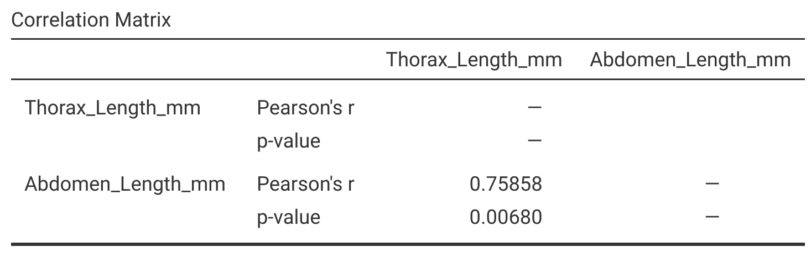

# (PART) Counts and Correlation {.unnumbered}

# Week 9 Overview {#Week9 .unnumbered}

|                 |                                                        |
|-----------------|--------------------------------------------------------|
| **Dates**       | 20 March 2023 - 24 MAR 2023                            |
| **Reading**     | **Required:** SCIU4T4 Workbook chapters 28 and 29      |
|                 | **Recommended:**  @Navarro2022 ([Chapter 12.1 and 12.2](https://davidfoxcroft.github.io/lsj-book/12-Correlation-and-linear-regression.html))                                     |
|                 | **Suggested:**  @Rowntree2018 (Chapter 8)              |
|                 | **Advanced:**   @Rodgers1988 ([Download](https://www.stat.berkeley.edu/~rabbee/correlation.pdf))                                    |
| **Lectures**    | 9.1: Frequency and count data (13:19 min; [Video](https://stirling.cloud.panopto.eu/Panopto/Pages/Viewer.aspx?id=bcf001a6-0964-44f4-9515-af8200d91e20&start=0))     |
|                 | 9.2: Chi-squared goodness of fit test (16:34 min; [Video](https://stirling.cloud.panopto.eu/Panopto/Pages/Viewer.aspx?id=0176758a-498e-48e5-9011-af8200d91e56&start=0))                      |
|                 | 9.3: Chi-squared test of association (16:03 min; [Video](https://stirling.cloud.panopto.eu/Panopto/Pages/Viewer.aspx?id=d95ff0d1-e3b7-4899-afec-af8200d91e71&start=0))     |
|                 | 9.4: Correlation key concepts (7:02 min; [Video](https://stirling.cloud.panopto.eu/Panopto/Pages/Viewer.aspx?id=f55424c3-384e-4e7c-920e-af8200d91ecc))     |
|                 | 9.5: Correlation underlying mathematics (12:06 min; [Video](https://stirling.cloud.panopto.eu/Panopto/Pages/Viewer.aspx?id=390375a9-9bb5-4a3b-a466-af8200d91ee8))                        |
|                 | 9.6: Correlation hypothesis testing (27:28 min; [Video](https://stirling.cloud.panopto.eu/Panopto/Pages/Viewer.aspx?id=9cd2493c-9665-47e4-b603-afca0120c2e4))                        |
| **Practical**   | Analysis of counts and correlations ([Chapter 30](#Chapter_30)) |
|                 | Room: Cottrell 2A17                                    |
|                 | Group A: 22 MAR 2023 (WED) 13:05-15:55                 |
|                 | Group B: 23 MAR 2023 (THU) 09:05-11:55                 |
| **Help hours**  | Martina Quaggiotto and Brad Duthie                     |
|                 | Room: Cottrell 1A13                                    |
|                 | 24 MAR 2023 (FRI) 15:05-17:55                          |
| **Assessments** | [Week 9 Practice quiz](https://canvas.stir.ac.uk/courses/13075/quizzes/30819) on Canvas                     |

# Frequency and count data {#Chapter_28}

In this book, we have introduced hypothesis testing as a tool to determine if variables were sampled from a population with a specific mean (one sample t-test in [Chapter 21.1](#one-sample-t-test)), or if different groups of variables were sampled from a population with the same mean (the independent samples t-test in [Chapter 21.2](#independent-samples-t-test) and ANOVA in [Chapter 23](#Chapter_23)). 
In these tests, the variables for which we calculated the means were always continuous (e.g., fig wasp wing lengths, nitrogen concentration in parts per million). 
That is, the variables of the t-test and ANOVA could always, at least in theory, take any real value (i.e., any decimal). 
And the comparison was always between the means of categorical groups (e.g., fig wasp species or study sites). 
But not every variable that we measure will be continuous. 
For example, in [Chapter 5](#Chapter_5), we also introduced discrete variables, which can only take discrete counts (1, 2, 3, 4, and so forth). 
Examples of such **count data** might include the number of species of birds in a forest or the number of days in the year for which an extreme temperature is recorded. 
[Chapter 14](#Chapter_14) included some examples of count data when introducing probability distributions (e.g., counts of heads or tails in coin flips, or the number of people testing positive for Covid-19). 
Count data are discrete because they can only take integer values. 
For example, there cannot be 14.24 bird species in a forest; it needs to be a whole number.

In the biological and environmental sciences, we often want to test whether or not observed counts are significantly different from some expectation. 
For example, we might hypothesise that the probability of flowers being red versus blue in a particular field is the same. 
In other words, $Pr(flower = red) = 0.5$ and $Pr(flower = Blue) = 0.5$. 
By this logic, if we were to collect 100 flowers at random from the field, we would expect 50 to be red and 50 to be blue. 
If we actually went out and collected 100 flowers at random, but found 46 to be red and 54 to be blue, would this be sufficiently different from our expectation to reject the null hypothesis that the probability of sampling a red versus blue flower is the same? 
We could test this null hypothesis using a Chi-square goodness of fit test ([Chapter 28.1](#the-chi-square-distribution)). 
Similarly, we might want to test if 2 different count variables (e.g., flower colour and flower species) are associated with one another (e.g., if blue flowers are more common in one species than another species). 
We could test this kind of hypothesis using a Chi-squared test of association ([Chapter 30]()).

Before introducing the Chi-square goodness of fit test or the Chi-square test of association, it makes sense to first introduce the Chi-square ($\chi^{2}$) distribution. 
The general motivation for introducing the Chi-square distribution is the same as it was for the t-distribution ([Chapter 18](#Chapter_18)) or F-distribution ([Chapter 23.1](#the-f-distribution)). 
We need some probability density distribution that is our null distribution, which is what we predict if our null hypothesis is true. 
We then compare this null distribution of our test statistic to find the probability of sampling a test statistic as or more extreme if the null hypothesis is really true (i.e., a p-value).

## The Chi-square distribution

The Chi-square ($\chi^{2}$) distribution is a continuous distribution in which values of $\chi^{2}$ can be any real number greater than or equal to 0. We can generate a $\chi^{2}$ distribution by adding up squared values that are sampled from a standard normal distribution [@Sokal1995], hence the 'square' in 'Chi-square'. 
There is a lot to unpack in the previous sentence, so we can go through it step by step. 
First, we can take another look at the standard normal distribution from [Chapter 14.4.4](#normal-distribution) (Figure 28.1).

```{r, echo = FALSE, fig.alt = "A plot of a bell curve, shaded in grey and centered at the x-axis on a value of zero is shown. The x axis is labelled 'x'.", fig.cap = "Recreation of Figure 14.9, a standard normal probability distribution"}
par(mar = c(5, 5, 1.5, 1.5));
xx       <- seq(from = -5, to = 5, by = 0.001);
pr_norm  <- dnorm(x = xx, mean = 0, sd = 1);
plot(x = xx, y = pr_norm, type = "l", ylim = c(0, 0.48), 
     ylab = "Probability",  xlab = "x", lwd = 3, xlim = c(-3, 3),
     cex.lab = 1.25, cex.axis = 1.25, yaxs = "i");
polygon(c(xx, max(xx)), c(pr_norm, 0), col="grey");
```

Suppose that we randomly sampled 4 values from the standard normal distribution shown in Figure 28.1.

-   $x_{1} = -1.244$
-   $x_{2} = 0.162$
-   $x_{3} = -2.214$
-   $x_{4} = 2.071$

We can square all of these values, then add up the squares,

$$\chi^{2} = (-1.244)^{2} + (0.162)^{2} + (-2.214)^{2} + (2.071)^{2}.$$

Note that $\chi^{2}$ cannot be negative because when we square a number that is either positive or negative, we always end up with a positive value (e.g., $-2^{2} = 4$, see [Chapter 1.1](#numbers-and-operations)). 
The final value is $\chi^{2} = 10.76462$. 
Of course, this $\chi^{2}$ value would have been different if our $x_{i}$ values ($x_{1}$, $x_{2}$, $x_{3}$, and $x_{4}$) had been different. 
And if we are sampling randomly from the normal distribution, we should not expect to get the same $\chi^{2}$ value from 4 random standard normal deviates. 
We can therefore ask, if we were to keep sampling 4 standard normal deviates and calculating new $\chi^{2}$ values, what would be the distribution of these $\chi^{2}$ values? 
The answer is shown in Figure 28.2.

```{r, echo = FALSE, fig.alt = "Plot of a curved distribution that rapidly increases to a maximum at around 2 then slowly decreases.", fig.cap = "A Chi-square distribution, which is the expected sum of 4 squared standard normal deviates, i.e., the sum of 4 values sampled from a standard normal distribution and squared."}
par(mar = c(5, 5, 1.5, 1.5));
xx        <- seq(from = 0, to = 20, by = 0.001);
pr_chisq  <- dchisq(x = xx, df = 4);
plot(x = xx, y = pr_chisq, type = "l", ylim = c(0, 0.22), 
     ylab = "Probability",  xlab = "Chi-square value", lwd = 3, xlim = c(0, 20),
     cex.lab = 1.25, cex.axis = 1.25, yaxs = "i");
polygon(c(xx, max(xx)), c(pr_chisq, 0), col="grey");
```

Looking at the shape of Figure 28.2, we can see that most of the time, the sum of deviations from the mean of $\mu = 0$ will be about 2. 
But sometimes we will get a much lower or higher value of $\chi^{2}$ by chance, if we sample particularly low or high values of $x_{i}$.

If we summed a different number of squared $x_{i}$ values, then we would expect the distribution of $\chi^{2}$ to change. 
Had we sampled fewer than 4 $x_{i}$ values, the expected $\chi^{2}$ would be lower just because we are adding up fewer numbers. 
Similarly, had we sampled more than 4 $x_{i}$ values, the expected $\chi^{2}$ would be higher just because we are adding up more numbers. 
The shape of the $\chi^{2}$ distribution[^49] is therefore determined by the number of values sampled ($N$), or more specifically the degrees of freedom (df, or sometimes $v$), which in a sample is $df = N - 1$. 
This is the same idea as the t-distribution from [Chapter 18](#Chapter_18), which also changed shape depending on the degrees of freedom. 
Figure 28.3 shows the different $\chi^{2}$ probability density distributions for different degrees of freedom.

[^49]: A random variable $X$ has a $\chi^{2}$ distribution if and only if its probability density function is defined by [@Miller2004], $$f(x) = \left\{\begin{array}{ll}\frac{1}{2^{\frac{2}{v}}\Gamma\left(\frac{v}{2}\right)}x^{\frac{v-2}{2}}e^{-\frac{x}{2}} & \quad for\:x > 0 \\ 0 & \quad elsewhere \end{array}\right.$$ In this equation, $v$ is the degrees of freedom of the distribution.

```{r, echo = FALSE, fig.alt = "A plot is shown with 3 different curve lines, which show 3 different Chi-square distributions with different degrees of freedom.", fig.cap = "Probability density functions for 3 different Chi-square distributions, each of which have different degrees of freedom (df)."}
df   <- 4;
xx  <- seq(from = 0, to = 8, by = 0.0001);
yy  <- dchisq(x = xx, df = df);
par(mar = c(5, 5, 1, 1), lwd = 3);
mxy <- max(yy[2:length(xx)]);
ymx <- 0.38;
plot(x = xx, y = yy, type = "l", lwd = 4, cex.lab = 2, cex.lab = 2,
 cex.axis = 2, ylab = "Probability density", ylim = c(0, ymx),
 xlab = "Chi-square value", xlim = c(0, 8));
df  <- 1;
y2  <- dchisq(x = xx, df = df);
points(x = xx, y = y2, type = "l", lwd = 4, lty = "dashed");
df  <- 8;
y3  <- dchisq(x = xx, df = df);
points(x = xx, y = y3, type = "l", lwd = 4, lty = "dotted");
legend(x = 5, y = 0.38, cex = 1.75,
       legend = c("df = 4", "df = 1", "df = 8"),
       lty = c("solid", "dashed", "dotted"));
```

As with the F distribution from [Chapter 23.1](#the-f-distribution), visualising the $\chi^{2}$ distribution is much, much easier using an [interactive application](https://bradduthie.shinyapps.io/chi-square/).

> [Click here](https://bradduthie.shinyapps.io/chi-square/) for an interactive application demonstrating how the Chi-square distribution changes with different degrees of freedom.

And as with the F distribution, it is not necessary to memorise how the $\chi^{2}$ distribution changes with different degrees of freedom. 
The important point is that the distribution changes with different degrees of freedom, and we can map probabilities to the $\chi^{2}$ value on the x-axis in the same way as any other distribution.

What does any of this have to do with count data? It actually is a bit messy. 
The $\chi^{2}$ distribution is not a perfect tool for comparing observed and expected counts [@Sokal1995]. 
After all, counts are integer values, and the $\chi^{2}$ distribution is clearly continuous (unlike, e.g., the binomial or Poisson distributions from [Chapter 14.4](##probability-distributions)). 
The $\chi^{2}$ distribution is in fact a useful approximation for testing counts, and one that becomes less accurate when sample size [@Slakter1968] or expected count size [@Tate1973] is small. 
Nevertheless, we can use the $\chi^{2}$ distribution as a tool for testing whether observed counts are significantly different from expected counts. 
The first test that we will look at is the goodness of fit test.

## Chi-squared goodness of fit

The first kind of test that we will consider for count data is the goodness of fit test. 
In this test, we have some number of counts that we expect to observe (e.g., expected counts of red versus blue flowers), then compare this expectation to the counts that we actually observe. 
If the expected and observed counts differ by a lot, then we will get a large test statistic and reject the null hypothesis. 
A simple concrete example will make this a bit more clear.

Recall the practical in [Chapter 16](#Chapter_16), in which players of the mobile app game [Power Up!](https://play.google.com/store/apps/details?id=com.hyperluminal.stirlinguniversity.sustainabledevelopmentgame) chose a small, medium, or large dam at the start of the game. 
Suppose that we are interested in the size of dam that policy-makers choose to build when playing the game, so we find 60 such people in Scotland and ask them to play the game. 
Perhaps we do not think that the policy-makers will have any preference for a particular dam size (and therefore just pick 1 of the 3 dam sizes at random). 
We would therefore expect an equal number of small, medium, and large dams to be selected among the 60 players. 
That is, for our expected counts of each dam size ($E_{size}$), we expect 20 small ($E_{small} = 20$), 20 medium ($E_{medium} = 20$), and 20 large ($E_{large} = 20$) dams in total (because $60/3 = 20$).

Of course, even if our players have no preference for a particular dam size, the number of small, medium, and large dams will not always be *exactly* the same. 
The expected counts might still be a bit different from the observed counts of each dam size ($O_{size}$). 
Suppose, for example, we find that out of our total 60 policy-makers, we observe 18 small ($O_{small} = 18$), 24 medium ($O_{medium} = 24$), and 18 large ($O_{large} = 18$), dams were actually chosen by game players.
What we want to test is the null hypothesis that there is no significant difference between expected and observed counts.

- $H_{0}$: There is no significant difference between expected and observed counts.
- $H_{A}$: There is a significant difference between expected and observed counts.

To get our test statistic[^50], we now just need to take each observed count, subtract the expected count, square this difference, divide by the expected count, then add everything up,

$$\chi^{2} = \frac{(18 - 20)^{2}}{20} + \frac{(24 - 20)^{2}}{20} + \frac{(18 - 20)^{2}}{20}.$$

We can calculate the values in the numerator. 
Note that all of these numbers must be positive (e.g., $18 - 20 = -2$, but $-2^{2} = 4$),

$$\chi^{2} = \frac{4}{20} + \frac{16}{20} + \frac{4}{20}.$$

When we sum the 3 terms, we get a value of $\chi^{2} = 1.2$.
Note that if all of our observed values had been the same as the expected values (i.e., 20 small, medium, and large dams actually chosen), then we would get a $\chi^{2}$ value of 0.
The more the observed values differ from the expectation of 20, the higher the $\chi^{2}$ will be.
We can now check to see if the test statistic $\chi^{2} = 1.2$ is sufficiently large to reject the null hypothesis that our policy-makers have no preference for small, medium, or large dams.
There are $N = 3$ categories of counts (small, medium, and large), meaning that there are $df = 3 - 1 = 2$ degrees of freedom.
The [interactive application](https://bradduthie.shinyapps.io/chi-square/), can be used to compare our test statistic with the null distribution by setting df = 2 and the Chi-square value to 1.2.
As it turns out, if the null hypothesis is true, then the probability of observing a value of $\chi^{2} = 1.2$ or higher (i.e., the p-value) is $P = 0.5488$.
Figure 28.4 shows the appropriate $\chi^{2}$ distribution plotted, with the area above the test statistic $\chi^{2} = 1.2$ shaded in grey.

```{r, echo = FALSE, fig.alt = "Plot of curved distribution that starts around 0.5 and decreases, asymptoting toward 0.", fig.cap = "A Chi-square distribution, which is the expected sum of 4 squared standard normal deviates, i.e., the sum of 4 values sampled from a standard normal distribution and squared."}
chis  <- 1.2
p_val <- 0.5488;
mbox <- function(x0, x1, y0, y1){
    xx <- seq(from=x0, to=x1, length.out = 100);
    yy <- seq(from=y0, to=y1, length.out = 100);
    xd <- c(rep(x0, 100), xx, rep(x1,100), rev(xx));
    yd <- c(yy, rep(y1,100), rev(yy), rep(y0, 100));
    return(list(x=xd, y=yd));
}
df  <- 2;
zz  <- pchisq(q = chis, df = df);
xx  <- seq(from = 0, to = 10, by = 0.0001);
yy  <- dchisq(x = xx, df = df);
o1  <- which(xx >= chis);
b1  <- which(xx <= chis);
par(mar = c(5, 5, 1, 1), lwd = 3);
ymx <- 0.58;
plot(x = xx, y = yy, type = "l", lwd = 4, cex.lab = 2, cex.lab = 2,
     cex.axis = 2, ylab = "Probability density", ylim = c(0, ymx),
     xlab = "Chi-square value", xlim = c(0, 10), yaxs = "i");
polygon(c(xx[o1], max(xx), rev(xx[o1])),
        c(yy[xx==max(xx)], yy[o1], rep(0, length(xx[o1]))),
        col="grey60", lwd = 4);
mxx <- which(xx == max(xx[b1]));
polygon(c(xx[b1], max(xx[b1]), rev(xx[b1])),
        c(yy[b1], yy[mxx], rep(0, length(b1))),
        col="white", lwd = 4);
arrows(x0 = 2, x1 = chis,
       y0 = 0.4, y1 = 0.285, lwd = 3);
tbox <- mbox(x0 = 3 - 1.4, 
             x1 = 3 + 1.4, y0 = 0.4, y1 = 0.5);
polygon(x=tbox$x, y=tbox$y, lwd=3, border="black", col="white");
feq <- expression(chi^2 == 1.2);
text(x = 3, y = 0.45, cex = 2, labels = feq);
```


Because $P > 0.05$, we do not reject the null hypothesis that there is no significant difference between expected and observed counts of chosen dam sizes.

Note that this was a simple example.
For a goodness of fit test, we can have any number of different count categories (at least, any number greater than 2).
The expectations also do not need to be integers.
For example, if we only managed to find 59 policy makers instead of 60, then our expected counts would have been $59/3 = 19.33$ instead of $60/3 = 20$.
The expectations also do not *need* to be the same.
For example, we could have tested the null hypothesis that twice as many policy-makers would choose large dams (i.e., $E_{large} = 40$, $E_{medium} = 10$, and $E_{small} = 10$).
For $n$ categories, the more general equation for the $\chi^{2}$ statistic is,

$$\chi^{2} = \sum_{i = 1}^{n} \frac{\left(O_{i} - E_{i}\right)^{2}}{E_{i}}.$$


We can therefore use this general equation to calculate a $\chi^{2}$ for any number of categories ($n$).
Next, we will look at testing associations between counts in different types of categories.


[^50]: A lot of statisticians will use $X^{2}$ to represent the test statistic here instead of $\chi^{2}$ [@Sokal1995]. The difference is the upper case 'X' versus the Greek letter Chi, '$\chi$'. The X is used since the test statistic we calculate here is not *technically* from the $\chi^{2}$ distribution, just an approximation. We will not worry about the distinction here, and to avoid confusion, we will just go with $\chi^{2}$. 

## Chi-squared test of association

The second kind of test that we will consider for count data is the Chi-square test of association.
While the goodness of fit test focused on a single categorical variable (dam sizes in the example above), the Chi-square test of association focuses on 2 different categorical variables.
What we want to know is whether or not the 2 categorical variables are independent of one another [@Box1978].
In other words, does knowing something about one variable tell us anything about the other variable?
A concrete example will make it easier to explain.
We can again make use of the [Chapter 16](#Chapter_16) game [Power Up!](https://play.google.com/store/apps/details?id=com.hyperluminal.stirlinguniversity.sustainabledevelopmentgame).
As mentioned in the [previous section](#chi-squared-goodness-of-fit), game players choose a small, medium, or large dam at the start of the game.
Players can play the game on either an Android or MacOS mobile device.
We therefore have 2 categorical variables, dam size and OS type.
We might want to know, do Android users choose the same dam sizes as MacOS users?
In other words, are dam size and OS type associated?
We can state this as a null and alternative hypothesis.

- $H_{0}$: There is no association between OS and dam size choice.
- $H_{A}$: There is an association between OS and dam size choice.

Consider the data in Table 28.1, which show counts of Android versus MacOS users and their dam choices.

```{r, echo = FALSE}
power_table <- matrix(data = c(8, 10, 16, 8, 6, 12), nrow = 2, byrow = FALSE);
rownames(power_table) <- c("Android", "MacOS");
colnames(power_table) <- c("Small", "Medium", "Large");
knitr::kable(power_table, format = "simple", table.envir = "table",
      caption = "Counts (N = 60) from a mobile game called 'Power Up!', in which players are confronted with trade-offs between energy output, energy justice, and biodiversity. Players can use 1 of 2 types of Operating System (Android or MacOS) and build one of 3 types of dam in the game (Small, Medium, or Large).");
```

Just looking at the counts in Table 28.1, it appears that there might be an association between the 2 variables.
For example, Android users appear to be more likely to choose a medium dam than MacOS users.
Medium dams are the most popular choice for Android users, but they are the least popular choice for MacOS users.
Nevertheless, could this just be due to chance?
If it were due to chance, then how unlikely are the counts in Table 28.1?
In other words, if Android and MacOS users in the whole population really do choose dam sizes at the same frequencies, then what is the probability of getting a sample of 60 players in which the choices are as or more unbalanced as this?
This is what we want to answer with our Chi-squared test of association.

The general idea is the same as with the Chi-squared goodness of fit test.
We have our observed values (Table 28.1).
We now need to find the expected values to calculate a $\chi^{2}$ value.
But the expected values are now a bit more complicated.
With the goodness of fit test in [Chapter 28.2](#chi-squared-goodness-of-fit), we just assumed that all categories were equally likely (i.e., the probability of choosing each size dam was the same). 
There were 60 players and 3 dam sizes, so the expected frequency of each dam choice was 60/3 = 20.
Now it is different.
We are not testing if dam sizes or OS choices are the same.
We want to know of they are *associated* with one another.
That is, regardless of the popularity of Android versus MacOS, or the frequency with which small, medium and large dams are selected, do Android users choose different dam sizes than MacOS users?
If dam size is not associated with OS, then we would predict that the relative frequency of small, medium, and large dams would be the same for both Android and MacOS.

To find the expected counts of each variable combination (e.g., Android and Small, or MacOS and Large), we need to get the probability that each category is selected independently.
For example, what is the probability of a player selecting a large dam, regardless of the OS that they are using?
Table 28.2 shows these probabilities as additional rows and columns added onto Table 28.1

```{r, echo = FALSE}
power_table2 <- matrix(data = c(8, 10, 0.3, 16, 8, 0.4, 6, 12, 0.3, 0.5, 0.5, "--"), 
                       nrow = 3, byrow = FALSE);
rownames(power_table2) <- c("Android", "MacOS", "**Probability**");
colnames(power_table2) <- c("Small", "Medium", "Large", "**Probability**");
knitr::kable(power_table2, format = "simple", table.envir = "table",
      caption = "Counts (N = 60) from a mobile game called 'Power Up!', in which players are confronted with trade-offs between energy output, energy justice, and biodiversity. Players can use 1 of 2 types of Operating System (Android or MacOS) and build one of 3 types of dam in the game (Small, Medium, or Large). Outer rows and columns show the probabilities of categories being selected");
```


Since there are 30 total Android users ($8 + 16 + 6 = 30$) and 30 total MacOS users ($10 + 8 + 12 = 30$), the probability of a player having an Android OS is $30/60 = 0.5$, and the probability of a player having a MacOS is also $30 / 60 =  0.5$.
Similarly, there are 18 small, 24 medium, and 18 large dam choices in total.
Hence, the probability of a player choosing a small dam is $18/60 = 0.3$, medium is $24/60 = 0.4$, and large is $18/60 = 0.3$.
If these probabilities combine independently[^51], then we can multiply them to find the probability of a particular combination of categories.
For example, the probability of a player using Android is 0.5 and choosing a small dam is 0.3, so the probability of a player having both Android **and** a small dam is $0.5 \times 0.3 = 0.15$ (see [Chapter 15](#Chapter_15) for an introduction to probability models).
The probability of a player using Android **and** choosing a medium dam is $0.5 \times 0.4 = 0.2$.
We can fill in all of these joint probabilities in a new Table 28.3.

```{r, echo = FALSE}
power_table2 <- matrix(data = c(0.15, 0.15, 0.3, 0.2, 0.2, 0.4, 0.15, 0.15, 0.3, 0.5, 0.5, "--"),
                       nrow = 3, byrow = FALSE);
rownames(power_table2) <- c("Android", "MacOS", "**Probability**");
colnames(power_table2) <- c("Small", "Medium", "Large", "**Probability**");
knitr::kable(power_table2, format = "simple", table.envir = "table",
      caption = "Probabilities for each combination of categorical variables from a dataset in which players on either an Android or MacOS choose a dam size in the mobile app game 'Power Up!', assuming that variables are independent of one another.");
```


From Table 28.3, we now have the probability of each combination of variables.
Note that all of these probabilities sum to 1.

$$0.15 + 0.2 + 0.15 + 0.15 + 0.2 + 0.15 = 1.$$

To get the expected count of each combination, we just need to multiply the probability by the sample size, i.e., the total number of players (N = 60).
For example, the expected count of players who use Android and choose a small dam will be $0.15 \times 60 = 9$.
Table 28.4 fills in all of the expected counts.
Note that the sum of all the counts equals our sample size of 60.


```{r, echo = FALSE}
power_table3 <- matrix(data = c(9, 9, 18, 12, 12, 24, 9, 9, 18, 30, 30, "--"),
                       nrow = 3, byrow = FALSE);
rownames(power_table3) <- c("Android", "MacOS", "**Sum**");
colnames(power_table3) <- c("Small", "Medium", "Large", "**Sum**");
knitr::kable(power_table3, format = "simple", table.envir = "table",
      caption = "Expected counts for each combination of categorical variables from a dataset in which players on either an Android or MacOS choose a dam size in the mobile app game 'Power Up!', assuming that variables are independent of one another.");
```

We now have both the observed (Table 28.2) and expected (Table 28.4) counts (remember that the expected counts do not *need* to be integers).
To get our $\chi^{2}$ test statistic, we use the same formula as in [Chapter 28.2](#chi-squared-goodness-of-fit),

$$\chi^{2} = \sum_{i = 1}^{n} \frac{\left(O_{i} - E_{i}\right)^{2}}{E_{i}}.$$

There are 9 total combinations of OS and dam size, so there are $n = 9$ values to sum up,

$$\chi^{2} = \frac{(8-9)^2}{9} + \frac{(16 - 12)^{2}}{12} + ... + \frac{(16 - 12)^{2}}{12} + \frac{(8-9)^2}{9}.$$

If we sum all of the 9 terms, we get a value of $\chi^{2} = 4.889$.
We can compare this to the null $\chi^{2}$ distribution as we did in the [Chapter 28.2](#chi-squared-goodness-of-fit) goodness of fit test, but we need to know the correct degrees of freedom.
The correct degrees of freedom[^52] is the number of categories in variable 1 ($n_{1}$) minus 1, times the number of categories in variable 2 ($n_{2}$) minus 1,

$$df = (n_{1} - 1) \times (n_{2} - 1).$$

In our example, the degrees of freedom equals the number of dam types minus 1 ($n_{dam} = 3 - 1)$ times the number of operating systems minus 1 ($n_{OS} = 2 - 1$).
The correct degrees of freedom is therefore $df = 2 \times 1 = 2$.
We now just need to find the p-value for a Chi-square distribution with 2 degrees of freedom and a test statistic of $\chi^{2} = 4.889$.
From the [interactive app](https://bradduthie.shinyapps.io/chi-square/) (set df to 2 and slide the Chi-square value to 4.9), we get a value of about $P = 0.0868$.
In other words, if $H_{0}$ is true, then the probability of getting a $\chi^{2}$ of 4.889 or higher is $P = 0.0868$.
Consequently, because $P > 0.05$, we would not reject the null hypothesis.
We should therefore conclude that there is no evidence for an association between OS and dam size choice.

Statistical programs such as R and Jamovi will calculate the $\chi^{2}$ value and get the p-value for the appropriate degrees of freedom [@Jamovi2022; @Rproject].
To do this in Jamovi, it is necessary to input the categorical data (e.g., Android, MacOS) in a tidy format, which will be a focus of the practical [Chapter 30](#Chapter_30).

There is one final point regarding expected and observed values of the Chi-square test of association.
There is another way of getting these expected values that is a bit faster (and more widely taught), but does not demonstrate the logic of expected counts as clearly. 
If we wanted to, we could sum the rows and columns of our original observations.
Table 28.5 shows the original observations with the sum of each row and column.

```{r, echo = FALSE}
power_table4 <- matrix(data = c(8, 10, 18, 16, 8, 24, 6, 12, 18, 30, 30, "--"),
                       nrow = 3, byrow = FALSE);
rownames(power_table4) <- c("Android", "MacOS", "**Sum**");
colnames(power_table4) <- c("Small", "Medium", "Large", "**Sum**");
knitr::kable(power_table4, format = "simple", table.envir = "table",
      caption = "Observed counts for each combination of categorical variables from a dataset in which players on either an Android or MacOS choose a dam size in the mobile app game 'Power Up!'. The last row and column shows the sum of observed dam sizes and OS users, respectively.");
```

We can get the expected counts from Table 28.5 if we multiply each row sum by each column sum, then divide by the total sample size ($N = 60$).
For example, to get the expected counts of Android users who choose a small dam, we can multiply $(18 \times 30)/60 = 9$.
To get the expected counts of MacOS users who choose a medium dam, we can multiply $(30 \times 24)/60 = 12$.
This works for all of combinations of rows and columns, so we could do it to find all of the expected counts from Table 28.4.


[^51]: We can call these the 'marginal probabilities'.

[^52]: This formula works due to a bit of a mathematical trick [@Sokal1995]. The actual logic of the degrees of freedom is a bit more involved. From our total of $k = 6$ different combinations, we actually need to subtract 1 degree of freedom for the total sample size ($N = 60$), then a degree of freedom for each variable probability estimated (i.e., subtract $n_{1} - 1$ and $n_{2} - 1$ because we need this many degrees of freedom to get the $n_{1}$ and $n_{2}$ probabilities, respectively; if we have all but 1 probability, then we know the last probability because the probabilities must sum to 1). Since we lose $n_{1} - 1$ and $n_{2} - 1$ degrees of freedom, and 1 for the sample size, this results in $df = k - (n_{1} - 1) - (n_{2} - 1) - 1$. In the case of the "Power Up!" example, we get $df = 6 - (3 - 1) - (2 - 1) - 1 = 2$. The $df = (n_{1} - 1) \times (n_{2} - 1)$ formulation is possible because $k = n_{1} \times n_{2}$ [@Sokal1995].


# Correlation {#Chapter_29}

This chapter focuses on the association between [types of variables](#Chapter_5) that are quantitative (i.e., represented by numbers).
It is similar to the [Chi-squared test of association](#chi-squared-test-of-association) from [Chapter 28](#Chapter_28) in the sense that it is about how variables are associated.
The focus of the [Chi-squared test of association](#chi-squared-test-of-association) was on the association when data were categorical (e.g., 'Android' or 'MacOS' operating system).
Here we focus instead on the association when data are numeric.
But the concept is generally the same; are variables independent, or does knowing something about one variable tell us something about the other variable?
For example, does knowing something about the latitude of a location tell us something about its average yearly temperature?

## Scatterplots

The easiest way to visualise the concept of a correlation is by using a scatterplot. 
Scatterplots are useful for visualising the association between 2 quantitative variables.
In a scatterplot the values of one variable are plotted on the x-axis, and the values of a second variable are plotted on the y-axis.
Consider two fig wasp species of the genus *Heterandrium* (Figure 29.1).

```{r, echo = FALSE, fig.alt = "Two small black iridescent wasps are shown side by side with wings facing upwards.", fig.cap = "Fig wasps from 2 different species are shown. Wasps were collected from Baja, Mexico.", out.width="100%"}
;
```

Both fig wasp species in Figure 29.1 are unnamed.
We can call the species in Figure 29.1A 'Het1' and the species in Figure 29.1B 'Het2'.
We might want to collect morphological measurements of fig wasp head, thorax, and abdomen lengths in these 2 species [@Duthie2015b].
Table 29.1 shows these measurements for 11 wasps.

```{r, echo = FALSE}
wing_loadings          <- read.csv("data/wing_loadings.csv");
heterandrium           <- wing_loadings[1:11, c(1:2, 4, 6)];
colnames(heterandrium) <- c("Species", "Head", "Thorax", "Abdomen");
knitr::kable(heterandrium, format = "simple", table.envir = "table",
      caption = "Body segment length measurements (mm) from fig wasps of 2 species. Data were collected from Baja, Mexico.");
m_thorax  <- round(mean(heterandrium[["Thorax"]]), digits = 3);
m_abdomen <- round(mean(heterandrium[["Abdomen"]]), digits = 3);
s_thorax  <- round(sd(heterandrium[["Thorax"]]), digits = 3);
s_abdomen <- round(sd(heterandrium[["Abdomen"]]), digits = 3);
the_cov   <- round(cov(heterandrium[["Thorax"]], heterandrium[["Abdomen"]]), digits = 3);
```

Intuitively, we might expect most of these measurements to be associated with one another.
For example, if a fig wasp has a relatively long thorax, then it probably also has a relatively long abdomen (i.e., it could just be a big wasp).
We can check this visually by plotting one variable on the x-axis and the other on the y-axis.
Figure 29.2 does this for wasp thorax length (x-axis) and abdomen length (y-axis).

```{r, echo = FALSE, fig.alt = "A plot is shown with 11 points, such that points that are higher on the x-axis are generally higher on the y-axis.", fig.cap = "An example of a scatterplot in which fig wasp thorax length (x-axis) is plotted against fig wasp abdomen length (y-axis). Each point is a different fig wasp. Wasps were collected in 2010 in Baja, Mexico."}
par(mar = c(5, 5, 1.5, 1.5));
plot(x = heterandrium[["Thorax"]], y = heterandrium[["Abdomen"]], cex.axis = 1.25,
     cex.lab = 1.25, pch = 20, cex = 1.5, xlab = "Thorax length (mm)",
     ylab = "Abdomen length (mm)", xlim = c(0.58, 0.88), ylim = c(0.95, 1.45));
```

In Figure 29.2, each point is a different wasp from Table 29.1.
For example, in the last row of Table 29.1, there is a wasp with a particularly low thorax length (0.621 mm) and abdomen length (1.034 mm).
In the scatterplot, we can see this wasp represented by the point that is lowest and furthest to the left (Figure 29.2).

There is a clear association between thorax length and abdomen length in Figure 29.2.
Fig wasps that have low thorax lengths also tend to have low abdomen lengths, and wasps that high thorax lengths also tend to have high abdomen lengths.
In this sense, the 2 variables are associated.
More specifically, they are positively correlated.
As thorax length increases, so does abdomen length.


## The correlation coefficient

The **correlation coefficient** formalises the association described in the previous section.
It gives us a single number that defines how 2 variables are correlated.
We represent this number with the letter '$r$', which can range from values of -1 to 1[^53].
Positive values indicate that 2 variables are positively correlated, such that a higher value of one variable is associated with higher values of the other variable (as was the case with fig wasp thorax and abdomen measurements).
Negative values indicate that 2 variables are negatively correlated, such that a higher values of one variable are associated with lower values of the other variable.
Values of zero (or not significantly different from zero, more on this later) indicate that 2 variables are uncorrelated (i.e., independent of one another).
Figure 29.3 shows scatterplots for 4 different correlation coefficients between values of $x$ and $y$.

```{r, echo = FALSE, fig.alt = "Four scatter plots are shown in a 2 by 2 grid with different correlations between x and y variables.", fig.cap = "Examples of scatterplots with different correlation coefficients (r) between 2 variables (x and y).", fig.height = 5, fig.width = 5}
cor_vals <- read.csv(file = "data/cor_vals.csv");
par(mar = c(0, 0, 0, 0), mfrow = c(2, 2), oma = c(4, 4, 1, 1));
plot(xaxt = "n", yaxt = "n", x = cor_vals$X1, y = cor_vals$Y1, pch = 20,
     ylab = "", xlab = "", cex = 1.5, xlim = c(-3, 3), ylim = c(-3, 3));
text(x = -3, y = 2.75, labels = "r = 0.00", cex = 1.5, pos = 4);
plot(xaxt = "n", yaxt = "n", x = cor_vals$X2, y = cor_vals$Y2, pch = 20,
     ylab = "", xlab = "", cex = 1.5, xlim = c(-3, 3), ylim = c(-3, 3));
text(x = -3, y = 2.75, labels = "r = -0.25", cex = 1.5, pos = 4);
plot(xaxt = "n", yaxt = "n", x = cor_vals$X3, y = cor_vals$Y3, pch = 20,
     ylab = "", xlab = "", cex = 1.5, xlim = c(-3, 3), ylim = c(-3, 3));
text(x = -3, y = 2.75, labels = "r = 0.50", cex = 1.5, pos = 4);
plot(xaxt = "n", yaxt = "n", x = cor_vals$X4, y = cor_vals$Y4, pch = 20,
     ylab = "", xlab = "", cex = 1.5, xlim = c(-3, 3), ylim = c(-3, 3));
text(x = -3, y = 2.75, labels = "r = 1.00", cex = 1.5, pos = 4);
mtext("x value", side = 1, cex = 1.75, outer = TRUE, line = 1.5);
mtext("y value", side = 2, cex = 1.75, outer = TRUE, line = 1.5);
```


We will look at 2 types of correlation coefficient, the Pearson product moment correlation coefficient and the Spearman rank correlation coefficient.
The 2 are basically the same; the Spearman rank correlation coefficient is just a correlation of the ranks of values instead of the actual values.

### Pearson product moment correlation coefficient

To understand the correlation coefficient, we need to first understand covariance.
[Chapter 12.3](#the-variance) introduced the variance ($s^{2}$) as a measure of spread in some variable $x$,

$$s^{2} = \frac{1}{N - 1}\sum_{i = 1}^{N}\left(x_{i} - \bar{x} \right)^{2}.$$

The variance is actually just a special case of a covariance.
The variance describes how a variable $x$ covaries with itself.
The covariance ($cov_{x,y}$) describes how a variable $x$ covaries with another variable $y$,

$$cov_{x, y} = \frac{1}{N - 1} \sum_{i = 1}^{N}\left(x_{i} - \bar{x} \right) \left(y_{i} - \bar{y} \right).$$

The $\bar{x}$ and $\bar{y}$ are the means of $x$ and $y$, respectively.
Note that if $x_{i} = y_{i}$, then the equation for $cov_{x,y}$ is identical to the equation for $s^{2}$ because $\left(x_{i} - \bar{x} \right) \left(x_{i} - \bar{x} \right) = \left(x_{i} - \bar{x} \right)^{2}$.

What the equation for $cov_{x,y}$ is describing is how the variation in $x$ relates to variation in $y$.
If a value of $x_{i}$ is much higher than the mean $\bar{x}$, and a value of $y_{i}$ is much higher than the mean $\bar{y}$, then the product of $\left(x_{i} - \bar{x} \right)$ and $\left(y_{i} - \bar{y} \right)$ will be especially high because we will be multiplying 2 large positive numbers together.
If a value of $x_{i}$ is much higher than the mean $\bar{x}$, but the corresponding $y_{i}$ is much lower than the mean $\bar{y}$, then the product of $\left(x_{i} - \bar{x} \right)$ and $\left(y_{i} - \bar{y} \right)$ will be especially low because we will be multiplying a large positive number and a large negative number.
Consequently, when $x_{i}$ and $y_{i}$ tend to deviate from their means $\bar{x}$ and $\bar{y}$ in a consistent way, we get either high or low values of $cov_{x,y}$.
If there is no such relationship between $x$ and $y$, then we will get $cov_{x,y}$ values closer to zero.

The covariance can, at least in theory, be any real number.
How low or high it is will depend on the magnitudes of $x$ and $y$, just like [the variance](#the-variance).
To get the Pearson product moment correlation coefficient[^54]: ($r$), we need to standardise the covariance so that the minimum possible value of $r$ is -1 and the maximum possible value of $r$ is 1.
We can do this by dividing $cov_{x,y}$ by the product of the standard deviation of $x$ ($s_{x}$) and the standard deviation of $y$ ($s_{y}$),

$$r = \frac{cov_{x,y}}{s_{x} \times s_{y}}.$$

This works because $s_{x} \times s_{y}$ describes the total variation between the 2 variables, so the absolute value of $cov_{x,y}$ cannot be larger $s_{x} \times s_{y}$.
We can again think about the special case in which $x = y$.
Since the covariance between $x$ and itself is just the variance of $x$ ($s_{x}^{2}$), and $s_{x} \times s_{x} = s^{2}_{x}$, we end up with the same value on the top and bottom and $r = 1$.

We can expand $cov_{x,y}$, $s_{x}$, and $s_{y}$ to see the details of the equation for $r$,

$$r = \frac{\frac{1}{N - 1} \sum_{i = 1}^{N}\left(x_{i} - \bar{x} \right) \left(y_{i} - \bar{y} \right)}{\sqrt{\frac{1}{N - 1}\sum_{i = 1}^{N}\left(x_{i} - \bar{x} \right)^{2}} \sqrt{\frac{1}{N - 1}\sum_{i = 1}^{N}\left(y_{i} - \bar{y} \right)^{2}}}.$$

This looks like a lot, but we can clean the equation up a bit because the $1 / (N-1)$ expressions cancel on the top and bottom of the equation,

$$r = \frac{\sum_{i = 1}^{N}\left(x_{i} - \bar{x} \right) \left(y_{i} - \bar{y} \right)}{\sqrt{\sum_{i = 1}^{N}\left(x_{i} - \bar{x} \right)^{2}} \sqrt{\sum_{i = 1}^{N}\left(y_{i} - \bar{y} \right)^{2}}}.$$

As with other statistics defined in this book, it is almost never necessary to calculate $r$ by hand.
Statistical programs such as Jamovi and R will make these calculations for us [@Jamovi2022; @Rproject].
The reason for working through all of these equations is to help make the conceptual link between $r$ and the variance of the variables of interest [@Rodgers1988].
To make this link a bit more clear, we can calculate the correlation coefficient of thorax and abdomen length from Table 29.1.
We can set thorax to be the $x$ variable and abdomen to be the $y$ variable.
Mean thorax length is $\bar{x} = 0.770$, and mean abdomen length is $\bar{y} = 1.210$.
The standard deviation of thorax length is $s_{x} = 0.064$, and the standard deviation of abdomen length is $s_{y} = 0.123$.
This gives us the numbers that we need to calculate the bottom of the fraction for $r$, which is $s_{x} \times s_{y} = 0.007872$.
We now need to calculate the covariance on the top.
To get the covariance, we first need to calculate $\left(x_{i} - \bar{x} \right) \left(y_{i} - \bar{y} \right)$ for each row ($i$) in Table 29.1.
For example, for row 1, $\left(0.767 - 0.770\right) \left(1.288 - 1.210\right) = -0.000234.$
For row 2, $\left(0.784 - 0.770\right) \left(1.059 - 1.210\right) = -0.002114.$
We continue this for all rows.
Table 29.2 shows the thorax length ($x_{i}$), abdomen length ($y_{i}$), and $\left(x_{i} - \bar{x} \right) \left(y_{i} - \bar{y} \right)$ for rows $i = 1$ to $i = 11$.

```{r, echo = FALSE}
het_cov_show            <- wing_loadings[1:11, c(1, 4, 6)];
Row                     <- 1:11;
Thorax                  <- heterandrium[["Thorax"]];
Abdomen                 <- heterandrium[["Abdomen"]];
Squared_Deviation       <- (Thorax - m_thorax) * (Abdomen - m_abdomen);
squared_table           <- data.frame(Row, Thorax, Abdomen, Squared_Deviation);
colnames(squared_table) <- c("Row (i)", "Thorax", "Abdomen", "Squared Deviation");
knitr::kable(squared_table, format = "simple", table.envir = "table",
      caption = "Measurements of 11 fig wasp thorax and abdomen lengths (mm). The fourth column shows the product of the deviations of each measurement from the mean, where mean thorax length is 0.770 and mean abdomen length is 1.210.");
```

If we sum up all of the values in the column "Squared Deviation" from Table 29.2, we get a value of 0.059487. 
We can multiply this value by $1 / (N - 1)$ to get the top of the equation for $r$, $(1 / (11-1)) \times 0.059487 = 0.0059487$.
We now have all of the values we need to calculate $r$ between fig wasp thorax and abdomen length,

$$r_{x,y} = \frac{0.0059487}{0.064 \times 0.123}.$$

Our final value is $r_{x, y} = 0.7556784$.
As suggested by the scatterplot in Figure 29.2, thorax and abdomen lengths are highly correlated.
We will test whether or not this value of $r$ is statistically significant in [Chapter 23.3](#correlation-hypothesis-testing) below, but first we will introduce the Spearman's rank correlation coefficient.

[^53]: Note that $r$ is the sample correlation coefficient, which is an estimate of the population correlation coefficient. The population correlation coefficient is represented by the Greek letter '$\rho$' ('rho'), and sometimes the sample correlation coefficient is represented as $\hat{\rho}$.

[^54]: We can usually just call this the 'correlation coefficient'.

### Spearman rank correlation coefficient

Throughout this book, we have seen how the *ranks* of data can be substituted in place of the actual values.
This has been useful when data violate the assumptions of a statistical test, and we need a nonparametric test instead (e.g., the [Wilcoxon signed rank test](#wilcoxon-test-1), the [Mann-Whitney U test](#mann-whitney-u-test-1), or the [Kruskall-Wallis H test](#Chapter_25)).
We can use the same trick for the correlation coefficient.
The Spearman rank correlation coefficient is calculated the exact same way as the Pearson product moment correlation coefficient, except on the ranks of values.
To calculate the Spearman rank correlation coefficient for the fig wasp example in [the previous section](#pearson-product-moment-correlation-coefficient), we just need to rank the thorax and abdomen lengths from 1 to 11, then calculate $r$ using the rank values instead of the actual measurements of length.
Figure 29.3 shows the same 11 fig wasp measurements as Figures 29.1 and 29.2, but with columns added to show the ranks of thorax and abdomen lengths.

```{r, echo = FALSE}
Thorax_rank             <- rank(Thorax);
Abdomen_rank            <- rank(Abdomen);
rank_table              <- data.frame(Row, Thorax, Thorax_rank, Abdomen,
                                      Abdomen_rank);
colnames(rank_table)    <- c("Wasp (i)", "Thorax", "Thorax rank", "Abdomen", 
                             "Abdomen rank");
knitr::kable(rank_table, format = "simple", table.envir = "table",
      caption = "Measurements of 11 fig wasp thorax and abdomen lengths (mm) and their ranks.");
```

Note from Table 29.3 that the lowest value of Thorax is 0.621, so it gets a rank of 1.
The highest value of Thorax is 0.852, so it gets a rank of 11. 
We do the same for abdomen ranks.
To get the Spearman rank correlation coefficient, we just calculate $r$ using the ranks.
The ranks number from 1 to 11 for both variables, so the mean rank is 6 and the standard deviation is 3.317 for both thorax and abdomen ranks.
We can then go through each row and calculate $\left(x_{i} - \bar{x} \right) \times \left(y_{i} - \bar{y} \right)$ using the ranks.
For the first row, this gives us $\left(4 - 6 \right) \left(9 - 6 \right) = -6$.
If we do this same calculation for each row and sum them up, then multiply by 1/(N-1), we get a value of 6.4.
To calculate $r$,

$$r_{rank(x),rank(y)} = \frac{6.4}{3.317 \times 3.317}$$

Our Spearman rank correlation coefficient is therefore $r = 0.582$, which is a bit lower than our Pearson product moment correlation was.
The key point here is that the definition of the correlation coefficient has not changed; we are just using the ranks of our measurements instead of the measurements themselves.
The reason why we might want to use the Spearman rank correlation coefficient instead of the Pearson product moment correlation coefficient is explained in the next section.


## Correlation hypothesis testing

We often want to test if 2 variables are correlated.
In other words, is $r$ significantly different from zero?
We therefore want to test the null hypothesis that $r$ is not significantly different from zero.

- $H_{0}:$ The population correlation coefficient is zero.
- $H_{A}:$ The correlation coefficient is significantly different from zero.

Note that $H_{A}$ above is for a two-tailed test, in which we do not care about direction.
We could also use a one-tailed test if our $H_{A}$ is that the correlation coefficient is greater than (or less than) zero.

How do we actually test the null hypothesis?
As it turns out, the sample correlation coefficient ($r$) will be approximately t-distributed around a true mean ($\rho$) with a t-score defined by $r - \rho$ divided by its standard error ($SE(r)$)[^55],

$$t = \frac{r - \rho}{SE(r)}.$$

Since our null hypothesis is that variables are uncorrelated, $\rho = 0$.
Statistical programs such as Jamovi or R will use this equation to test whether or not the correlation coefficient is significantly different from zero [@Jamovi2022; @Rproject].
The reason for presenting it here is to show the conceptual link to other hypothesis tests in earlier chapters.
In [Chapter 21.1](#one-sample-t-test), we saw that the one sample t-test defined $t$ as the deviation of the sample mean from the true mean, divided by the standard error.
Here we are doing the same for the correlation coefficient.
One consequence of this is that, like the one sample t-test, the test of the correlation coefficient assumes that $r$ will be normally distributed around the true mean $\rho$.
If this is not the case, and the assumption of normality is violated, then the test might have a misleading Type I error rate.

To be cautious, we should check whether or not the variables that we are correlating are normally distributed (especially if the sample size is small).
If they are normally distributed, then we can use the Pearson's product moment correlation to test the null hypothesis.
If the assumption of normality is violated, then we might consider using the nonparametric Spearman rank correlation coefficient instead.
The fig wasp thorax and abdomen lengths from Table 29.1 are normally distributed, so we can use the Pearson product moment correlation coefficient to test whether or not the correlation between these two variables is significant.
In Jamovi, the t-score is not even reported as output when using a correlation test. 
We only see $r$ and the p-value (Figure 29.4).

```{r, echo = FALSE, fig.alt = "A table called 'Correlation Matrix' is shown, which is mostly empty except for two values in the lower left of a 2 by 2 matrix.", fig.cap = "Jamovi output for a test of the null hypothesis that thorax length and abdomen length are not significantly correlated in a sample of fig wasps collected in 2010 from Baja, Mexico.", out.width="100%"}
;
```

From Figure 29.4, we can see that the sample $r = 0.75858$, and the p-value is $P = 0.00680$.
Since our p-value is less than 0.05, we can reject the null hypothesis that fig wasp thorax and abdomen lengths are not correlated.
To get a more intuitive sense of how the correlation coefficient works, we can use an [interactive application](https://bradduthie.shinyapps.io/corr_click/).

> [Click here](https://bradduthie.shinyapps.io/corr_click/) for an interactive application showing the relationship between a scatterplot, a correlation coefficient, and statistical significance.

Points can be added to the [interactive application](https://bradduthie.shinyapps.io/corr_click/) by clicking anywhere within the plot.
A table of $x$ and $y$ points is shown to the right, and the correlation coefficient and p-value can be shown or hidden using the buttons on the top.


[^55]: We can calculate the standard error of r as [@Rahman1968], $$SE(r) = \sqrt{\frac{1 - r^{2}}{N - 2}}.$$ But this is not necessary to ever do by hand. Note that we lose 2 degrees of freedom (N - 2), one for calculating each variable mean.


# *Practical*. Analysis of counts and correlations {#Chapter_30}

This lab focuses on applying the concepts from [Chapter 28](#Chapter_28) and [Chapter 29](#Chapter_29) in Jamovi [@Jamovi2022].
Exercises in this practical will use the [Chi-squared goodness of fit](#chi-squared-goodness-of-fit) test, the [Chi-squared test of association](#chi-squared-test-of-association),
and the [correlation coefficient](#correlation-hypothesis-testing).
For the chi-square tests, this practical will use a dataset inspired by the doctoral work of Dr Jessica Burrows [@Burrows2022].
This experimental work tested the effects of radiation on bumblebee nectar consumption, carbon dioxide output, and body mass in different bee colonies (Figure 30.1)[^56].

```{r, echo = FALSE, fig.alt = "Close up of a bumblebee", fig.cap = "This lab practical focuses on the effects of radiation on bumblebees.", out.width="60%"}
;
```

The practical will use the [bumblebee.csv](https://raw.githubusercontent.com/bradduthie/SCIU4T4/main/data/bumblebee.csv) dataset (right click and Save Link As, then save it with the extension .csv).
This dataset includes variables for the radiation level experienced by the bee (radiation), the colony from which the bee came (colony), whether or not the bee survived to the end of the 30 day experiment (survived), the mass of the bee in grams at the beginning of the experiment (mass), the output of carbon dioxide put out by the bee (CO_2) in micromoles per minute, and the daily volume of nector consumed by the be in ml (nectar).


## Survival goodness of fit

Suppose that we want to run a simple goodness of fit test to determine whether or not bees are equally likely to survive versus die in the experiment.
If this is the case, then we would expect to see the same number of living and dead bees in the dataset.
We can use a Chi-square goodness of fit test to answer this question.
What are the null and alternative hypotheses for this $\chi^{2}$ goodness of fit test?

- $H_{0}$: _________________

- $H_{A}$: _________________


What is the sample size (N) of the dataset?

N: __________________

Based on this sample size, what are the expected counts for bees that survived and died?

Survived ($E_{surv}$): _________________

Died ($E_{died}$): ______________


Next, we can find the observed counts of bees that survived and died.
To do this, we need to use the Frequency tables option in Jamovi.
We did this once in [Chapter 16](#Chapter_16) for calculating probabilities.
As a reminder, to find the counts of bumblebees that survived (Yes) or did not survive (No), we need to go to the Exploration toolbar in Jamovi, then choose 'Descriptives'.
Place 'Survival' in the Variables box, then check the box for 'Frequency tables' below.
A Frequencies table will appear in the panel on the right. 
Write down the observed counts of bees that survived and died.

Survived ($O_{surv}$): _________________

Died ($O_{died}$): ______________


Try to use the formula in [Chapter 28.2](#chi-squared-goodness-of-fit) to calculate the $\chi^{2}$ test statistic.
Here is what it should look like for the two counts in this dataset,

$$\chi^{2} = \frac{(O_{surv} - E_{surv})^{2}}{E_{surv}} + \frac{(O_{died} - E_{died})^{2}}{E_{died}}.$$
What is the $\chi^{2}$ value?

$\chi^{2}:$ _____________

There are 2 categories for the survival category (Yes and No).
How many degrees of freedom are there?

df: ________________

Using the $\chi^{2}$ and df values, find the approximate p-value using this [interactive application](https://bradduthie.shinyapps.io/chi-square/).

P: _______________


Now we can try to use Jamovi to replicate the analysis above.
In Jamovi Analyses tab, select 'Frequencies' from the toolbar, then select 'N outcomes'.
A new window will open up (Figure 30.2).

```{r, echo = FALSE, fig.alt = "Jamovi toolbar is shown with a button called 'Frequencies' selected and 'N Outcomes' chosen from the pulldown menu.", fig.cap = "Jamovi toolbar showing the location of the Frequencies options, with the Chi-square goodness of fit test available under a choice called 'N Outcomes' in the pulldown menu.", out.width="100%"}
;
```

After selecting the option 'N Outcomes: $\chi^{2}$ Goodness of fit', a new window will appear called 'Proportion Test (N Outcomes)'. 
To run a $\chi^{2}$ goodness of fit test on bee survival, move the 'survived' variable in to the 'Variable' box. 
Leave the Counts box empty (Figure 30.3).

```{r, echo = FALSE, fig.alt = "Jamovi interface is shown with boxes of variables to be used for a proportion test, and the 'survived' variable has been placed in the Variable box.", fig.cap = "Jamovi interface for running a Chi-square goodness of fit test on bumblebee survival in a dataset.", out.width="100%"}
;
```


The $\chi^{2}$ Goodness of Fit table will appear in the panel to the right.
From this table, we can see the $\chi^{2}$ test statistic, degrees of freedom (df), and the p-value (p).
Do these values match the values that you calculated by hand and with the [interactive application](https://bradduthie.shinyapps.io/chi-square/)? 

```


```

Next, we will try another goodness of fit test, but this time to test whether or not bees were taken from all colonies with the same probability.

## Colony goodness of fit

Next, suppose that we want to know if bees were sampled from the colonies with the same expected frequency.
What are the null and alternative hypotheses in this scenario?

- $H_{0}$: _________________

- $H_{A}$: _________________

How many colonies are there in this dataset?

Colonies: ________________

Run the $\chi^{2}$ goodness of fit test using the same procedure in Jamovi that you used in the previous exercise.
What is the output from the Goodness of Fit table?

$\chi^{2}$: ____________

df: _____________

p: ____________

From this output, what can you conclude about how bees were taken from the colonies?

```


```

Note that the distrACTION module in Jamovi includes a $\chi^{2}$ distribution (called 'x2-Distribution'), which you can use to compute probabilities and quantiles in the same way as we did for previous distributions in the module.
Next, we will move on to a $\chi^{2}$ test of association between 


## Chi-Square test of association

Suppose we want to know if there is an association between bee colony and bee survival.
We can use a $\chi^{2}$ test of association to investigate this question.
What are the null and alternative hypotheses for this test of association?

- $H_{0}$: _________________

- $H_{A}$: _________________


To run the $\chi^{2}$ test of association, choose 'Frequencies' from the Jamovi toolbar (Figure 30.2), but this time select 'Independent Samples: $\chi^{2}$ test of association' from the pulldown menu.
To test for an association between bee colony and survival, place 'colony' in the 'Rows' box and 'survived' in the 'Columns' box.
Leave the rest of the boxes blank (Figure 30.4).

```{r, echo = FALSE, fig.alt = "Jamovi interface is shown with boxes of variables to be used for test of association with colony in a 'Rows' box and survived in a 'columns' box.", fig.cap = "Jamovi interface for running a Chi-square test of association on bumblebee survival versus colony in a dataset.", out.width="100%"}
knitr::include_graphics("img/jamovi_test_of_association_interface.png");
```

There is a pulldown called 'Statistics' below the Contingency Tables input.
Make sure that that the $\chi^{2}$ checkbox is selected.
Output from the $\chi^{2}$ test of association will appear in the panel to the right.
Report the key statistics in the output table below.

$\chi^{2}$: ______________

df: _____________

p: _____________

From these statistics, should you reject or not reject the null hypothesis?

$H_{0}$: ______________

Note that scrolling down further in the left panel (Contingency Tables) reveals an option for plotting.
Have a look at this and create a barplot by checking 'Bar Plot' under **Plots**.
Note that there are various options for changing bar types (side by side or stacked), y-axis limits (counts versus percentages), and bar groupings (by rows or columns).

Now try running a $\chi^{2}$ test of association to see if there is an association between radiation and bee survival (hint, you just need to swap 'colony' for 'radiation' in the Rows box).
What can you conclude from this test?
Explain your conclusion as if were reporting the results of the test to someone who was unfamiliar with statistical hypothesis testing.

```


```


Lastly, did the order which you placed the two variables matter?
What if you switched Rows and Columns?
In other words, put 'survived' in the Rows box and 'radiation' in the columns box.
Does this give you the same answer?

```


```

Next, we will look at correlations between variables.

## Pearson product moment correlation test

Suppose that we want to test if bumblebee mass at the start of the experiment (mass) is associated with the amount of nectar consumed (nectar).
Specifically, we want to know if more massive bees also output less carbon dioxide ($CO_{2}$).
Before running any test, it is a good idea to plot the two variables using a scatterplot.
To do this, select the 'Exploration' button from the toolbar in Jamovi, but instead of choosing 'Descriptives' as usual from the pulldown menu, select 'Scatterplot'.
A new window will open up that allows you to build a scatterplot by selecting the variables that you place on the x-axis and the y-axis.
Put mass on the x-axis and nectar on the y-axis, as shown in Figure 30.5.

```{r, echo = FALSE, fig.alt = "Jamovi interface is shown with a variable called 'mass' placed in a box called 'X-Axis', and a variable called 'CO_2' placed in a box called 'Y-axis'.", fig.cap = "Jamovi interface for building a scatterplot with bumblebee mass on the x-axis and nectar consumption on the y-axis", out.width="100%"}
knitr::include_graphics("img/jamovi_simple_scatterplot.png");
```

Notice that the scatterplot appears in the panel on the right.
Each point in the scatterplot is a different bee (i.e., row).
Just looking at the scatterplot, does it appear as though bee mass and $CO_2$ output are correlated?
Why or why not?

```


```

Note that it is possible to separate points in the scatterplot by group.,
Try placing 'survived' in the box 'Group'.

Now we can test whether or not bee mass and $CO_{2}$ output are negatively correlated.
What are the null and alternative hypotheses of this test?

- $H_{0}$: _________________

- $H_{A}$: _________________

Before we test whether or not the correlation coefficient ($r$) is significant, we need to know which correlation coefficient to use.
Remember from [Chapter 29.3](#correlation-hypothesis-testing) that a test of the Pearson product moment correlation assumes that the sample $r$ is normally distributed around the true correlation coefficient.
If both of our variables (mass and $CO_{2}$) are normally distributed, then we can be confident that this assumption will not be violated.
But if one or both variables are not normally distributed, then we should consider using the Spearman rank correlation coefficient instead.
To test if mass and $CO_{2}$ are normally distributed, navigate to the Descriptives panel in Jamovi (where we usually find the summary statistics of variables).
Place mass and $CO_{2}$ in the 'Variables' box, then scroll down and notice that there is a checkbox under **Normality** for 'Shapiro-Wilk'.
Check this box, then find the p-values for the Shapiro-Wilk test of normality in the panel to the right.
Write these p-values down below.

Mass P: _____________

$CO_{2}$ P: ___________

Based on these p-values, which type of correlation coefficient should we use to test $H_{0}$, and why?

```


```

To run the correlation coefficient test, choose the button in the Jamovi toolbar called 'Regression', then select the first option 'Correlation Matrix' from the pulldown menu (Figure 30.6).

```{r, echo = FALSE, fig.alt = "Jamovi toolbar is shown with a button called 'Regression' selected and 'Correlation Matrix' chosen from the pulldown menu.", fig.cap = "Jamovi toolbar showing the location of the Regression options, with the Correlation Matrix option available in the pulldown menu.", out.width="100%"}
;
```

The Correlation Matrix option will pull up a new window in Jamovi (Figure 30.7).

```{r, echo = FALSE, fig.alt = "Jamovi interface is shown with a variables called 'mass' and CO_2 placed in a box to the right and a checkbox for 'Pearson' selected", fig.cap = "Jamovi interface for testing correlation coefficients.", out.width="100%"}
knitr::include_graphics("img/jamovi_correlation_interface.png");
```

Notice that the Pearson product moment correlation is selected in the checkbox of Figure 30.7 ('Pearson').
Immediatley below this checkbox is a box called 'Spearman', which would report the Spearman rank correlation coefficient test.
Below the **Correlation Coefficients** options, there are options for **Hypothesis**.
Remember that we are interested in the alternative hypothesis that mass and $CO_{2}$ are negatively correlated, so we should select the radio button 'Correlated negatively'.

The output of the correlation test appears in the panel on the right in the form of a table called 'Correlation Matrix'.
This table reports both the correlation coefficient (here called "Pearson's r") and the p-value.
Write these values below.

$r$: ______________

$P$: _____________

Based on this output what should we conclude about the association between bumblebee mass and carbon dioxide output?

```


```

Next, we will test the whether or not bee mass is associated with nectar consumption.


## Spearman rank correlation test

Next, we will test whether or not bee mass and nectar consumption are correlated.
What are the null and alternative hypotheses of this test?

- $H_{0}$: _________________

- $H_{A}$: _________________


Run a Shapiro-Wilk test of normality on each of the two variables, as was done in the previous exercise.
Based on the output of these tests, what kind of correlation coefficient should we use for testing the null hypothesis?

Correlation coefficient: _______________

Test whether or not bee mass and nectar consumption are correlated.
What is the correlation coefficient and p-value from this test?

$r$: ______________

$P$: _____________

Based on these results, do should we reject or not reject the null hypothesis?

$H_{0}$: ____________

Suppose that we had used the Pearson product moment correlation coefficient instead of the Spearman rank correlation coefficient.
Would we have made the same conclusion about the correlation (or lack thereof) between bee mass and $CO_{2}$ output?
Why or why not?

```


```


If you have sufficient time, move on to the final exercise, which will demonstrate an additional way to run Chi-square tests.

## Untidy goodness of fit

In Exercise 30.1, we ran a $\chi^{2}$ test using data in a tidy format, in which each row corresponded to a single observation and categorical data were listed over $N = 256$ rows.
For the 'survived' variable, this meant 256 rows of 'Yes' or 'No'.
But there is a shortcut in Jamovi if we do not have a full tidy dataset.
If you know that the dataset included 139 'Yes' counts and 117 'No' counts, you could set up the data as a table of counts (Table 30.1).

```{r, echo = FALSE}
Survived  <- c("No", "Yes");
Count     <- c(117, 139);
count_tab <- data.frame(Survived, Count);
knitr::kable(count_tab, format = "simple", table.envir = "table",
      caption = "Counts of bees that did not survive (No) or did survive (Yes) in an experiment involving radiation.");
```

Open a new data frame in Jamovi, then recreate the small dataset in Table 30.1.
Column names should be 'Survived' and 'Count', as shown in Figure 30.8.

```{r, echo = FALSE, fig.alt = "Jamovi spreadsheet show with just 2 rows and 2 columns showing 'Survived' and 'Count'.", fig.cap = "Jamovi data frame with a simple organisation of count data.", out.width="100%"}
knitr::include_graphics("img/jamovi_simple_counts.png");
```

Next, navigate to the 'Analyses' tab and choose 'N Outcomes' to do a goodness of fit test.
Place 'Survived' in the Variable box, then place 'Count' in the Counts (optional) box.
Notice that you will get the same $\chi^{2}$, df, and p values in the output table as you did in Exercise 30.1

We could do the same for a $\chi^{2}$ test of association, although it would be a bit more complicated.
To test for an association between radiation and survival, as we did at the end of Exercise 30.3, we would need 3 columns and 8 rows of data (Table 30.2).

```{r, echo = FALSE}
Survived  <- rep(c("No", "Yes"), times = 4);
Radiation <- rep(c("None", "Low", "Medium", "High"), times = 2);
Count     <- c(12, 52, 29, 35, 39, 25, 37, 27);
assoc_tab <- data.frame(Survived, Radiation, Count);
knitr::kable(assoc_tab, format = "simple", table.envir = "table",
      caption = "Counts of bees that did not survive (No) or did survive (Yes) for different levels of radiation.");
```

If we put Table 30.2 into Jamovi, we can run a $\chi^{2}$ test of association by navigating to the 'Frequencies' button in the Jamovi toolbar and selecting 'Independent Samples: $\chi^{2}$ test of assocation' from the pulldown.
In the Contingency Tables input panel, we can put 'Survived' in the Rows box, 'Radiation' in the Columns box, then place 'Count' in the Counts (optional) box.
The panel on the right will give us the output of the $\chi^{2}$ test of association.


[^56]: This figure was released into the public domain by [Marco Almbauer](https://commons.wikimedia.org/wiki/File:Erdhummel_im_Detail.jpg) on 4 May 2018. Please note that the data in this practical are for educational purposes only. They are not the data that were actually collected by @Burrows2022.


