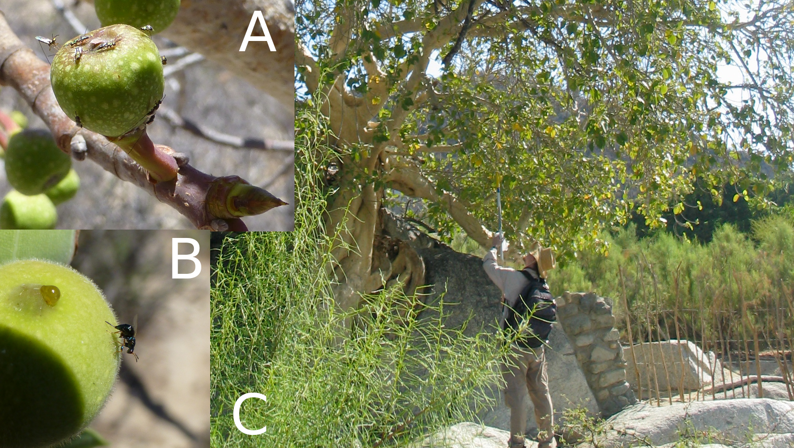
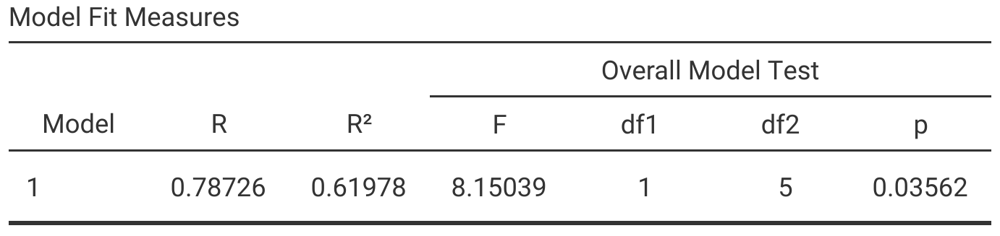
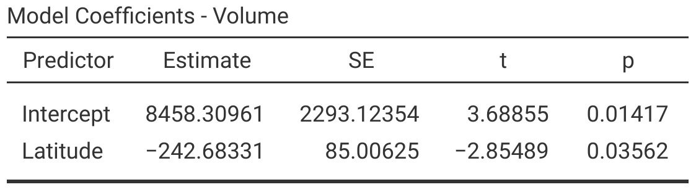
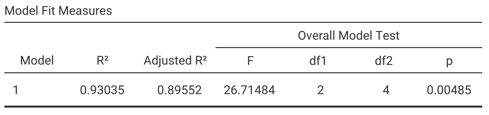
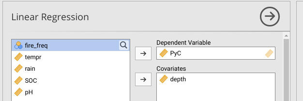
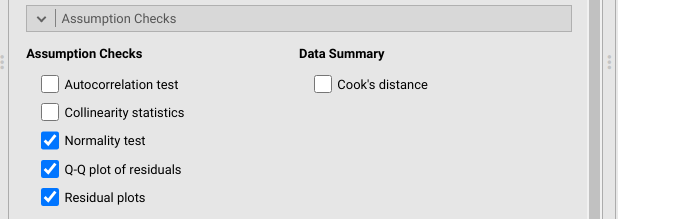
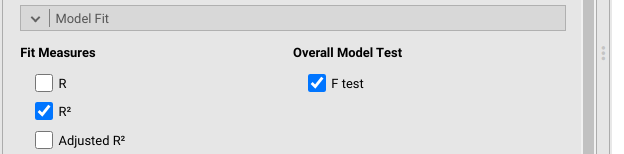
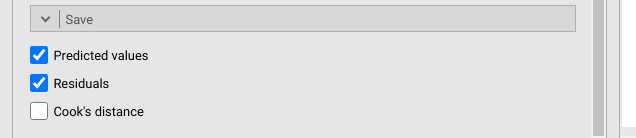

# (PART) Linear Regression {-}

# Week 10 Overview {-#Week10}

|                 |                                                        |
|-----------------|--------------------------------------------------------|
| **Dates**       | 27 March 2023 - 31 MAR 2023                            |
| **Reading**     | **Required:** SCIU4T4 Workbook chapters 31 and 32      |
|                 | **Recommended:**  @Navarro2022 ([Chapter 12.1 and 12.2](https://davidfoxcroft.github.io/lsj-book/12-Correlation-and-linear-regression.html))                                     |
|                 | **Suggested:**  @Spiegelhalter2019 (Chapter 5)              |
|                 | **Advanced:**   @Morrissey2018 ([Download](https://quod.lib.umich.edu/cgi/t/text/text-idx?cc=ptpbio;c=ptb;c=ptpbio;idno=16039257.0010.003;view=text;rgn=main;xc=1;g=ptpbiog))                                    |
| **Lectures**    | 10.1: Regression key concepts (15:00 min; [Video](https://stirling.cloud.panopto.eu/Panopto/Pages/Viewer.aspx?id=c59eb428-9334-4f02-bafc-af8200d91f79))     |
|                 | 10.2: Regression validity (14:30 min; [Video](https://stirling.cloud.panopto.eu/Panopto/Pages/Viewer.aspx?id=0f952b7f-6e22-4c1a-8edf-af8200d91fe6))                      |
|                 | 10.3: Introduction to multiple regression (14:59 min; [Video](https://stirling.cloud.panopto.eu/Panopto/Pages/Viewer.aspx?id=0f952b7f-6e22-4c1a-8edf-af8200d91fe6))                      |
|                 | 10.4: Regression in Jamovi (min; [Video](https://stirling.cloud.panopto.eu/Panopto/Pages/Viewer.aspx?id=0f952b7f-6e22-4c1a-8edf-af8200d91fe6))                      |
| **Practical**   | Using regression ([Chapter 33](#Chapter_33)) |
|                 | Room: Cottrell 2A17                                    |
|                 | Group A: 29 MAR 2023 (WED) 13:05-15:55                 |
|                 | Group B: 30 MAR 2023 (THU) 09:05-11:55                 |
| **Help hours**  |  Brad Duthie                                           |
|                 | Room: Cottrell 1A13                                    |
|                 | 31 MAR 2023 (FRI) 15:05-17:55                          |
| **Assessments** | [Week 10 Practice quiz](https://canvas.stir.ac.uk/courses/13075/quizzes/30870) on Canvas                     |


# Simple linear regression {#Chapter_31}

Linear regression focuses on the association between 2 or more quantitative variables.
In the case of simple linear regression, which is the focus of this chapter, there are only 2 variables to consider.
At first, this might sound similar to correlation, which was introduced in [Chapter 29](#Chapter_29).
Simple linear regression and correlation are indeed similar, both conceptually and mathematically, and the two are frequently confused.
Both methods focus on 2 quantitative variables, but the general aim of regression is different from correlation.
The aim of correlation is to describe how the variance of one variable is associated with the variance of another variable.
In other words, the correlation measures the intensity of covariance between variables [@Sokal1995].
But there is no attempt to predict what the value of one variable will be based on the other.

Linear regression, in contrast to correlation, focuses on prediction.
The aim is to predict the value of one quantitative variable Y given the value of another quantitative variable X.
In other words, regression focuses on an association of dependence in which the value of Y depends on the value of X [@Rahman1968].
The Y variable is therefore called the **dependent variable**; it is also sometimes called the response variable or the output variable [@Box1978; @Sokal1995].
The X variable is called the **independent variable**; it is also sometimes called the predictor variable or the regressor [@Box1978; @Sokal1995].
Unlike correlation, the distinction between the two variable types matters because the aim is to understand how a change in the independent variable will affect the dependent variable.
For example, if we increase X by 1, how much will Y change?


## Visual interpretation of regression

A visual example using a scatterplot can illustrate one way to think about regression.
Suppose that we have sampled fig fruits from various latitudes (Figure 31.1), and we want to use latitude to predict fruit volume [@Duthie2016].

```{r, echo = FALSE, fig.alt = "Two panels with green fig fruits are shown on branches with fig wasps on the surface of them, and a panel to the right shows a man on a rock reaching into the crown of a fig tree with a stick.", fig.cap = "Fruits of the Sonoran Desert Rock Fig in the desert of Baja, Mexico with different fig wasps on the surface (A and B). A full fig tree is shown to the right (C) with the author attempting to collect fig fruits from a branch of the tree.", out.width="100%"}
;
als <- read.csv("data/syconia_dimensions.csv");
lat <- als[["Latitude"]]
vol <- als[["Volume"]];
B0  <- round(as.numeric(lm(vol~lat)$coefficients[1]), digits = 1);
B1  <- round(as.numeric(lm(vol~lat)$coefficients[2]), digits = 2);
```

A sample of fig fruits from different latitudes is shown in Table 31.1.

```{r, echo = FALSE}
Latitude   <- lat;
Volume     <- vol;
fruit_tabl <- rbind(Latitude, Volume);
knitr::kable(fruit_tabl, format = "simple", table.envir = "table",
      caption = "Volumes of fig fruits collected from different latitudes from trees of the Sonoran Desert Rock Fig in Baja, Mexico.");
```

How much does fruit volume change with latitude?
To start answering this question, we can plot the relationship between the two variables.
We want to predict fruit volume from latitude, meaning that fruit volume *depends on* latitude.
Fruit volume is therefore the dependent variable, and we should plot it on the y-axis.
Latitude is our independent variable, and we should plot it on the x-axis (Figure 31.2).

```{r, echo = FALSE, fig.alt = "A scatter plot is shown with Latitude on the x-axis and Fruit volume on the y-axis, and there are 7 points on the plot with a line of best fit trending downwards; a thin dotted line is horizontal across the plot.", fig.cap = "Relationship between latitude and fruit volume for 7 fig fruits collected from Baja, Mexico in 2010. The solid black line shows the regression line of best fit, and the thin dotted line shows the mean of fruit volume."}
par(mar = c(5, 5, 1, 1));
plot(x = lat, y = vol, pch = 20, xlab = "Latitude", cex = 1.5, lwd = 2,
     xlim = c(23, 30), ylim = c(700, 3200), cex.lab = 1.25, cex.axis = 1.25,
     ylab = expression(Fruit~volume~(mm^3)), yaxs = "i", xaxs = "i");
abline(a = B0, b = B1, lwd = 2, col = "black");
abline(h = mean(vol), col = "black", lty = "dotted");
```

In Figure 31.2, each of the 7 points is a different fig fruit.
The x-axis shows the latitude from which the fruit was collected, and the y-axis shows the volume of the fruit in $mm^{2}$. 
The thin dotted line shows the mean fruit volume for the 7 fruits, $\bar{y} =$ `r round(mean(vol), digits = 1)`.
The thick black line trending downwards in Figure 31.2 is the regression line, also called the line of best fit.
How this line is calculated will be explained later, but for now there are two important concepts to takeaway from Figure 31.2.
First, the regression line gives us the best prediction of what fruit volume will be for any given latitude.
For example, if we wanted to predict what fruit volume would be for a fruit collected at 28 degrees north latitude, we could find the value 28 on the x-axis, then find what fruit value this corresponds to on the y-axis using the regression line.
At an x-axis value of 28, the regression line has a y-axis value of approximately 1660, so we would predict that a fig fruit collected at 28 degrees north latitude would have a volume of 1660 $mm^{2}$.
This leads to the second important concept to takeaway from Figure 31.2.
In the absence of any other information (including latitude), our best guess of what any given fruit's volume will be is just the mean ($\bar{y} =$ `r round(mean(vol), digits = 1)`).
A key aim of regression is to test if the regression line can do a significantly better job of predicting what fruit volume will be.
In other words, is the solid line of Figure 31.2 really doing that much better than the horizontal dotted line?
Before answering this question, a few new terms are needed.

## Intercepts, slopes, and residuals

Given the latitude of each fruit (i.e., each point in Figure 31.2), we can predict its volume from 3 numbers.
These 3 numbers are the intercept ($\beta_{0}$), the slope ($\beta_{1}$), and the residual ($\epsilon_{i}$).
The intercept is the point on the regression line where $x = 0$, i.e., where latitude is 0 in the example of fig fruit volumes.
This point is not actually visible in Figure 31.2 because the lowest latitude on the x-axis is 23.
At a latitude of 23, we can see that the regression line predicts a fruit volume of approximately 2900 $mm^{2}$. 
If we were to extend this regression line all the way back to a latitude of 0, then we would predict a fruit volume of `r round(B0, digits = 1)`.
This is our intercept[^57] in Figure 31.2.

The slope is the direction and steepness of the regression line.
It describes how much our dependent variable changes if we increase the independent variable by 1.
For example, how do we predict fruit volume to change if we increase latitude by 1 degree?
From the regression line in Figure 31.2, whenever latitude increases by 1, we predict a decrease in fruit volume of `r round(abs(B1), digits = 1)`.
Consequently, the slope is `r round(B1, digits = 1)`.
Since we are predicting using a straight line, this decrease is the same at every latitude.
This means that we can use the slope to predict how much our dependent variable will change given any amount of units of change in our independent variable.
For example, we can predict how fruit volume will change for any amount of change in degrees latitude.
If latitude increases by 2 degrees, then we would predict a 2 $\times$ `r round(B1, digits = 1)` $=$ `r 2*round(B1, digits = 1)` $mm^{2}$ change in fruit volume (i.e., a decrease of `r 2*round(abs(B1), digits = 1)`).
If latitude decreases by 3 degrees, then we would predict a -3 $\times$ `r round(B1, digits = 1)` $=$ `r -3*round(B1, digits = 1)` $mm^{2}$ change in fruit volume (i.e., an increase of `r 3*round(abs(B1), digits = 1)`).

We can describe the regression line using just the intercept and the slope.
For the example in Figure 31.2, this means that we can predict fruit volume for any given latitude with just these two numbers.
But prediction almost always comes with some degree of uncertainty.
For example, if we could perfectly predict fruit volume from latitude, then all of the points in Figure 31.2 would fall exactly on the regression line.
But this is not the case.
None of the 7 points in Figure 31.2 fall exactly on the line, so there is some unexplained variation (i.e., some error) in predicting fruit volume from latitude.
To map each fruit's latitude to its corresponding volume, we therefore need one more number.
This number is the **residual**, and it describes how far away a point is from the regression line (Figure 31.3).

```{r, echo = FALSE, fig.alt = "A scatter plot is shown with Latitude on the x-axis and Fruit volume on the y-axis, and there are 7 points on the plot with a line of best fit trending downwards; thin dashed vertical lines link points to the line of best fit.", fig.cap = "Relationship between latitude and fruit volume for 7 fig fruits collected from Baja, Mexico in 2010. The solid black line shows the regression line of best fit, and the vertical dashed lines show the residuals for each point."}
lat_vol_mod <- lm(vol~lat);
lvm_resids  <- round(as.numeric(residuals(lat_vol_mod)), digits = 1);
par(mar = c(5, 5, 1, 1));
plot(x = lat, y = vol, pch = 20, xlab = "Latitude", cex = 1.5, lwd = 2,
     xlim = c(23, 30), ylim = c(700, 3200), cex.lab = 1.25, cex.axis = 1.25,
     ylab = expression(Fruit~volume~(mm^3)), yaxs = "i", xaxs = "i");
abline(a = B0, b = B1, lwd = 2, col = "black");
for(i in 1:length(lat)){
  points(x = c(lat[i], lat[i]), y = c(vol[i], B0 + lat[i]*B1), type = "l",
         lty = "dashed");
}
r_fruit <- which(lat >= 24 & lat < 25)[1];
points(x = lat[r_fruit], y = vol[r_fruit], pch = 20, cex = 1.6, col = "red");
  points(x = c(lat[r_fruit], lat[r_fruit]), 
         y = c(vol[r_fruit], B0 + lat[r_fruit]*B1), type = "l",
         lty = "dashed", col = "red");
arrows(x0 = 24.6, x1 = lat[r_fruit] + 0.1, y0 = 2750, y1 = 2750, lwd = 2, 
       length = 0.1);
text(x = 24.62, y = 2750, pos = 4, labels = expression(residual~(epsilon[i])),
     cex = 1.5);
text(x = 25.5, y = B0 + 25.5*B1 - 160, cex = 1.5, srt = -25,
     labels = expression(slope~(beta[1])));
lowest_lat <- which(lat == min(lat));
lvm_resids[r_fruit] <- 307.84;
```

The residual of each of the 7 points is shown with a dashed line in Figure 31.3. 
Residual values are positive when they are higher than the value predicted by the regression line, and they are negative when they are lower than the value predicted by the regression line.
In the example of Figure 31.3, the residual in red indicated by the arrow, at a latitude of `r round(lat[r_fruit], digits = 2)`, is `r round(lvm_resids[r_fruit], digits = 1)` because the volume of the fig fruit collected from this latitude deviates from the predicted volume on the regression line by `r round(lvm_resids[r_fruit], digits = 1)`.
For the point just to the left where the latitude from which the fruit was sampled is `r round(lat[lowest_lat], digits = 2)` degrees, the residual is `r round(lvm_resids[lowest_lat], digits = 1)`.
For any fig fruit $i$, we can therefore find its volume using the intercept ($\beta_{0}$), the slope ($\beta_{1}$), and the residual value ($\epsilon_{i}$).
Next, we will show how these different values relate to one another mathematically.


[^57]: Biologically, a fruit volume of `r round(B0, digits = 1)` might be entirely unrealistic, which is why we need to be careful when extrapolating beyond the range of our independent variable (more on this later).

## Regression coefficients

Simple linear regression predicts the dependent variable ($y$) from the independent variable ($x$) using the intercept ($b_{0}$) and the slope ($b_{1}$),

$$y = b_{0} + b_{1}x.$$

The equation for $y$ mathematically describes the regression line in Figures 31.2 and 31.3.
This gives us the expected value of $y$ for any value of $x$
In other words, the equation tells us what $y$ will be *on average* for any given $x$.
Sometimes different letters are used to represent the same mathematical relationship, such as $y = a + bx$ or $y = mx + b$, but the symbols used are not really important[^58].
Here, $b_{0}$ and $b_{1}$ are used to make the transition to multiple regression in [Chapter 32](#Chapter_32) clearer.

For any specific value of $x_{i}$, the corresponding $y_{i}$ can be described more generally,

$$y_{i} = b_{0} + b_{1}x_{i} + \epsilon_{i}.$$

For example, for any fig fruit $i$, we can find its *exact* volume ($y_{i}$) from its latitude ($x_{i}$) using the intercept ($b_{0}$), the slope ($b_{1}$), and the residual ($\epsilon_{i}$).
We can do this for the residual shown in red and indicated by the arrow in Figure 31.3.
The latitude at which this fruit was sampled was $x_{i} =$ `r round(lat[r_fruit], digits = 2)`, its volume is $y_{i} =$ `r round(vol[r_fruit], digits = 1)`, and its residual value is `r round(lvm_resids[r_fruit], digits = 1)`.
From the previous section, we know that $b_{0} =$ `r round(B0, digits = 1)` and $b_{1} =$ `r round(B1, digits = 1)`.
If we substitute all of these values, 

$$`r vol[r_fruit]` = `r B0` - `r abs(B1)`(`r lat[r_fruit]`) + `r lvm_resids[r_fruit]`.$$

Note that if we remove the residual `r lvm_resids[r_fruit]`, then we get the expected volume for our fig fruit at `r lat[r_fruit]` degrees latitude,

$$`r B0 + B1*lat[r_fruit]` = `r B0` - `r abs(B1)`(`r lat[r_fruit]`).$$

Visually, this is where the red dotted line meets the solid black regression line in Figure 31.3.

This explains the relationship between the independent and dependent variables using the intercept, slope, and residuals.
But how do we actually define the line of best fit?
In other words, what makes the regression line in this example better than some other line that we might use instead?
The next section explains how the regression line is actually calculated.


[^58]: Another common way to represent the above is, $y = \hat{\beta}_{0} + \hat{\beta}_{1}x$, where $\hat{\beta}_{0}$ and $\hat{\beta}_{1}$ are sample estimates of the true parameters ${\beta}_{0}$ and ${\beta}_{1}$.


## Regression line calculation

The regression line is defined by its relationship to the residual values.
Figure 31.4 shows the same regression as in Figures 31.2 and 31.3, but with the values of the residuals written next to each point.

```{r, echo = FALSE, fig.alt = "A scatter plot is shown with Latitude on the x-axis and Fruit volume on the y-axis, and there are 7 points on the plot with a line of best fit trending downwards; thin dashed vertical lines link points to the line of best fit.", fig.cap = "Relationship between latitude and fruit volume for 7 fig fruits collected from Baja, Mexico in 2010. The solid black line shows the regression line of best fit, and the vertical dashed lines show the residuals for each point."}
lat_vol_mod <- lm(vol~lat);
lvm_resids  <- round(as.numeric(residuals(lat_vol_mod)), digits = 1);
par(mar = c(5, 5, 1, 1));
plot(x = lat, y = vol, pch = 20, xlab = "Latitude", cex = 1.5, lwd = 2,
     xlim = c(23, 30), ylim = c(700, 3200), cex.lab = 1.25, cex.axis = 1.25,
     ylab = expression(Fruit~volume~(mm^3)), yaxs = "i", xaxs = "i");
abline(a = B0, b = B1, lwd = 2, col = "black");
tval <- rep(NA, times = 7);
for(i in 1:length(lat)){
  points(x = c(lat[i], lat[i]), y = c(vol[i], B0 + lat[i]*B1), type = "l",
         lty = "dashed");
  tval[i] <- mean(c(vol[i], B0 + lat[i]*B1));
}
text(x = lat[1] - 0.75, y = tval[1], labels = lvm_resids[1], pos = 4);
text(x = lat[2], y = tval[2], labels = lvm_resids[2], pos = 4);
text(x = lat[3], y = tval[3], labels = lvm_resids[3], pos = 4);
text(x = lat[4] - 0.5, y = vol[4] - 100, labels = lvm_resids[4], pos = 4);
text(x = lat[5], y = tval[5], labels = lvm_resids[5], pos = 4);
text(x = lat[6] - 0.75, y = tval[6] - 120, labels = lvm_resids[6], pos = 4);
text(x = lat[7], y = vol[7], labels = lvm_resids[7], pos = 4);
```

Some of the values are positive, and some are negative.
An intuitive reason for why the line in Figure 31.4 is the line of best fit is because the positive and negative values exactly balance each other out.
In other words, the sum of all the residual values in Figure 31.4 is 0,

$$0 = -307.6 + 307.7 + 194 + 406.9 - 677.3 - 262.2 + 338.5.$$

If we were to move the regression line, then the sum of residuals would no longer be 0.
There is only 1 line that fits.

More technically, the line of best fit minimises the sum of squared residuals ($SS_{residual}$).
In other words, when we take all of the residual values, square them, then add up the squares, the sum should be lower than any other line we could draw,

$$SS_{residual} = (-307.6)^{2} + (307.7)^2 + ... + (338.5)^{2}.$$

For the regression in Figure 31.4, $SS_{residual} =$ `r format(sum(lvm_resids * lvm_resids), scientific = FALSE)`.
Any line other than the regression line shown in Figure 31.4 would result in a higher $SS_{residual}$.
To get a better intuition for how this works, we can use an [interactive application](https://bradduthie.shinyapps.io/regr_click/) in which a random set of points are placed on scatterplot and the intercept and slope are changed until the residual sum of squares is minimised.

> [Click here](https://bradduthie.shinyapps.io/regr_click/) for an interactive application that demonstrates how the line of best fit is determined for a simple linear regression.

We have seen how key terms in regression are defined, what regression coefficients are, and how the line of best fit is calculated.
The next section focuses on the coefficient of determination, which describes how well data points fit around the regression line.


## Coefficient of determination

We often want to know how well a regression line fits the data.
In other words, are most of the data near the regression line (indicating a good fit), or are most far away from the regression line?
How closely the data fit to the regression line is described by the **coefficient of determination** ($R^{2}$).
More formally, the $R^{2}$ tells us how much of the total variation in $y$ is explained by the regression equation[^60],

$$R^{2} = 1 - \frac{SS_{residual}}{SS_{total}}.$$

Mathematically, the coefficient of determination compares the sum of squared residuals from the linear model $SS_{residual}$ to what the sum of squared residuals would be had we just used the mean value of $y$ ($SS_{total}$).
If $SS_{residual}$ is very small compared to $SS_{total}$, then subtracting $SS_{residual}/SS_{total}$ from 1 will give a large $R^{2}$ value.
This large $R^{2}$ means that the model is doing a good job of explaining variation in the data.
Figure 31.5 shows some examples of scatterplots with different $R^{2}$ values.

```{r, echo = FALSE, fig.alt = "Four scatter plots are shown in a 2 by 2 grid with regression lines between x and y variables and a coefficient of variation shown in the upper corner.", fig.cap = "Examples of scatterplots with different coefficients of regression (R-squared).", fig.height = 5, fig.width = 5}
cor_vals <- read.csv(file = "data/Rsquared_vals.csv");
par(mar = c(0, 0, 0, 0), mfrow = c(2, 2), oma = c(4, 4, 1, 1));
plot(xaxt = "n", yaxt = "n", x = cor_vals$X1, y = cor_vals$Y1, pch = 20,
     ylab = "", xlab = "", cex = 1.5, xlim = c(-3.5, 3.5), ylim = c(-3.5, 3.5));
mR2_1  <- lm(Y1~X1, data = cor_vals);
B0_R1  <- as.numeric(mR2_1$coefficients[1]);
B1_R1  <- as.numeric(mR2_1$coefficients[2]);
abline(a = B0_R1, b = B1_R1, lwd = 2);
text(x = -3.5, y = 3, labels = expression(R^2==0.00), cex = 1.5, pos = 4);
plot(xaxt = "n", yaxt = "n", x = cor_vals$X2, y = cor_vals$Y2, pch = 20,
     ylab = "", xlab = "", cex = 1.5, xlim = c(-3.5, 3.5), ylim = c(-3.5, 3.5));
mR2_2  <- lm(Y2~X2, data = cor_vals);
B0_R2  <- as.numeric(mR2_2$coefficients[1]);
B1_R2  <- as.numeric(mR2_2$coefficients[2]);
abline(a = B0_R2, b = B1_R2, lwd = 2);
text(x = 0, y = 3, labels = expression(R^2==0.14), cex = 1.5, pos = 4);
plot(xaxt = "n", yaxt = "n", x = cor_vals$X3, y = cor_vals$Y3, pch = 20,
     ylab = "", xlab = "", cex = 1.5, xlim = c(-3.5, 3.5), ylim = c(-3.5, 3.5));
mR2_3  <- lm(Y3~X3, data = cor_vals);
B0_R3  <- as.numeric(mR2_3$coefficients[1]);
B1_R3  <- as.numeric(mR2_3$coefficients[2]);
abline(a = B0_R3, b = B1_R3, lwd = 2);
text(x = -3.5, y = 3, labels = expression(R^2==0.50), cex = 1.5, pos = 4);
plot(xaxt = "n", yaxt = "n", x = cor_vals$X4, y = cor_vals$Y4, pch = 20,
     ylab = "", xlab = "", cex = 1.5, xlim = c(-3.5, 3.5), ylim = c(-3.5, 3.5));
mR2_4  <- lm(Y4~X4, data = cor_vals);
B0_R4  <- as.numeric(mR2_4$coefficients[1]);
B1_R4  <- as.numeric(mR2_4$coefficients[2]);
abline(a = B0_R4, b = B1_R4, lwd = 2);
text(x = -3.5, y = 3, labels = expression(R^2==1.00), cex = 1.5, pos = 4);
mtext("x value", side = 1, cex = 1.75, outer = TRUE, line = 1.5);
mtext("y value", side = 2, cex = 1.75, outer = TRUE, line = 1.5);
```


We can calculate the $R^{2}$ value for our example of fig fruit volumes over a latitudinal gradient.
To do this, we need to calculate the sum of the squared residual values ($SS_{residual}$) and the total sum of squared deviations of $y_{i}$ from the mean $\bar{y}$ ($SS_{total}$).
From the previous section, we have already found that $SS_{residaul} = 1034567$.
Now, to get $SS_{total}$, we just need to get the sum of squares for fruit volume (see [Chapter 12.3](#the-variance)).
We can visualise this as the sum of squared deviations from the mean fruit volume of $\bar{y} =$ `r round(mean(vol), digits = 1)` instead of the value predicted by the regression line (Figure 31.6).


```{r, echo = FALSE, fig.alt = "A scatter plot is shown with Latitude on the x-axis and Fruit volume on the y-axis, and there are 7 points on the plot with a line of best fit trending downwards and a dotted line indicating the mean; thin dashed vertical lines link points to the line of best fit.", fig.cap = "Relationship between latitude and fruit volume for 7 fig fruits collected from Baja, Mexico in 2010. The solid black line shows the regression line of best fit, and the blue horizontal dotted line shows the mean of fruit volume. Vertical dashed lines show the model residuals (black dashed) and deviations from the mean (blue dotted)."}
lat_vol_mod <- lm(vol~lat);
lvm_resids  <- round(as.numeric(residuals(lat_vol_mod)), digits = 1);
par(mar = c(5, 5, 1, 1));
plot(x = lat, y = vol, pch = 20, xlab = "Latitude", cex = 1.5, lwd = 2,
     xlim = c(23, 30), ylim = c(700, 3200), cex.lab = 1.25, cex.axis = 1.25,
     ylab = expression(Fruit~volume~(mm^3)), yaxs = "i", xaxs = "i");
abline(a = B0, b = B1, lwd = 2, col = "black");
tval <- rep(NA, times = 7);
for(i in 1:length(lat)){
  points(x = c(lat[i] + 0.02, lat[i] + 0.02), 
         y = c(vol[i], B0 + lat[i]*B1), type = "l",
         lty = "dashed");
  tval[i] <- mean(c(vol[i], B0 + lat[i]*B1));
}
text(x = lat[1] - 0.75, y = tval[1], labels = lvm_resids[1], pos = 4);
text(x = lat[2], y = tval[2], labels = lvm_resids[2], pos = 4);
text(x = lat[3], y = tval[3], labels = lvm_resids[3], pos = 4);
text(x = lat[4] - 0.5, y = vol[4] - 100, labels = lvm_resids[4], pos = 4);
text(x = lat[5], y = tval[5], labels = lvm_resids[5], pos = 4);
text(x = lat[6], y = tval[6] - 120, labels = lvm_resids[6], pos = 4);
text(x = lat[7], y = vol[7], labels = lvm_resids[7], pos = 4);
abline(h = mean(vol), col = "blue", lty = "dotted");
vol_devs <- round(vol - mean(vol), digits = 1);
for(i in 1:length(lat)){
  points(x = c(lat[i] - 0.02, lat[i] - 0.02), y = c(vol[i], mean(vol)), 
         type = "l", lty = "dotted", col = "blue");
}
text(x = lat[1] - 0.75, y = 2100, labels = vol_devs[1], pos = 4, col = "blue");
text(x = lat[2], y = 2200, labels = vol_devs[2], pos = 4, col = "blue");
text(x = lat[3], y = tval[3] + 150, labels = vol_devs[3], pos = 4, 
     col = "blue");
text(x = lat[4] - 0.85, y = vol[4] - 200, labels = vol_devs[4], pos = 4, 
     col = "blue");
text(x = lat[5], y = 1800, labels = vol_devs[5], pos = 4, col = "blue");
text(x = lat[6] - 0.75, y = 1200, labels = vol_devs[6], pos = 4, col = "blue");
text(x = lat[7], y = 1800, labels = vol_devs[7], pos = 4, col = "blue");
text(x = 27.5, y = 3000, labels = expression(SS[residual]==1034567), pos = 4);
text(x = 27.5, y = 2800, labels = expression(SS[total]==2721718), pos = 4,
     col = "blue");
```


The black numbers in Figure 31.6 show the deviations of each point from the regression line, just like in Figure 31.4.
Blue numbers have been added to Figure 31.6 to show the deviation of each point from the mean fruit volume.
Summing the squared values of residuals from the regression line gives a value of 1034567.
Summing the squared deviations of values from the mean $\bar{y} =$ `r round(mean(vol), digits = 1)` gives a value of 2721718.
To calculate $R^{2}$,

$$R^{2} = 1 - \frac{1034567}{2721718}.$$

The above gives us a value of $R^{2} = 0.6198846$.
In other words, about 62 per cent of the variation in fruit volume is explained by latitude.


[^60]: Note that, mathematically, $R^{2}$ is in fact the square of the correlation coefficient. Intuitively this should make some sense; when 2 variables are more strongly correlated (i.e., r is near -1 or 1), data are also more tightly distributed around the regression line. But it is also important to understand $R^{2}$ conceptually in terms of variation explained by the regression model.


## Regression assumptions

It is important to be aware of the assumptions underlying linear regression.
There are 4 key assumptions underlying the simple linear regression models described in this chapter [@Sokal1995].

1. Measurement of the independent variable ($x$) is completely accurate. In other words, there is no measurement error for the independent variable. 
Of course, this assumption is almost certainly violated to some degree because every measurement has some associated error (see [Chapter 6.1](#accuracy) and [Chapter 7](#Chapter_7)).

2. The relationship between the independent and dependent variables is linear. 
In other words, we assume that the relationship between $x$ and $y$ can be defined by a straight line satisfying the equation $y = b_{0} + b_{1}$. 
If this is not the case (e.g., because the relationship between $x$ and $y$ is described by some sort of curved line), then a simple linear regression might not be appropriate.

3. For any value of $x_{i}$, $y_{i}$ values are independent and normally distributed. 
In other words, the *residual* values ($\epsilon_{i}$) should be normally distributed around the regression line, and they should not have any kind of pattern (such as, e.g., $\epsilon_{i}$ values being negative for low $x$ but positive for high $x$).
If we were to go out and resample the same values of $x_{i}$, the corresponding $y_{i}$ values should be normally distributed around the predicted $y$.

4. For all values of $x$, the variance of residuals is identical.
In other words, the variance of $y_{i}$ values around the predicted $y$ should not change over the range of $x$.
The term for this is homoscedasticity, meaning that the variance is constant.
This is in contrast to heteroscedasticity, which means that the variance is not constant.

Figure 31.7 shows a classic example of heteroscedasticity.
Notice that the variance of $y_{i}$ values around the regression line increases with increasing $x$.

```{r, echo = FALSE, fig.alt = "A scatterplot is shown in which data points increase in variance around a regression line as the x variable increases, forming a funnel shape with the narrow point on the left.", fig.cap = "A hypothetical dataset in which data show heteroscedasticity, thereby violating an assumption of simple linear regression."}
heteroscedasticity <- read.csv("data/heteroscedasticity.csv");
plot(x = heteroscedasticity[["XX_var"]], y = heteroscedasticity[["YY_var"]],
     pch = 20, cex = 1.25, cex.lab = 1.25, cex.axis = 1.25,
     xlab = "Independent variable (x)", ylab = "Dependente variable (y)");
mod_heteroscedasticity <- lm(YY_var~XX_var, data = heteroscedasticity);
B0_het <- as.numeric(mod_heteroscedasticity$coefficients[1]);
B1_het <- as.numeric(mod_heteroscedasticity$coefficients[2]);
abline(a = B0, b = B1, lwd = 2);
```


Note that even if our assumptions are not perfectly met, this does not completely invalidate the method of linear regression. 
In reality, linear regression is often robust to minor deviations from the above assumptions (as are other statistical tools), but large violations of one or more of these assumptions might indeed invalidate the use of linear regression. 


## Regression hypothesis testing

We typically want to know if our regression model is useful for predicting the dependent variable given the independent variable.
There are 3 specific null hypotheses that we can test, which tell us the significance of (1) the overall model, (2) the intercept, and (3) the slope.
We will go through each of these null hypotheses.

### Overall model significance

As mentioned in [Chapter 31.1](#visual-interpretation-of-regression), in the absence of any other information, the best prediction of our dependent variable is the mean.
For example, if we did not have any information about latitude in the previous sections, then the best prediction of fruit volume would just be the mean fruit volume, $\bar{y} =$ `r round(mean(vol), digits = 1)` (Figure 31.2).
Does including the independent variable latitude result in a significantly better prediction than just using the mean?
In other words, does a simple linear regression model with latitude as the independent variable explain significantly more variation in fruit volume than just the mean fruit volume?
We can state this more formally as null and alternative hypotheses.

- $H_{0}$: A model with no independent variables fits the data as well as the linear model.
- $H_{A}$: The linear model fits the data better than the model with no independent variables.

The null hypothesis can be tested using an F-test of overall significance.
This test makes use of the F-distribution (see [Chapter 23.1](#the-f-distribution)) to calculate a p-value that we can use to reject or not reject $H_{0}$.
Recall that the F-distribution describes the null distribution for a ratio of variances.
In this case, the F-distribution is used to test for the overall significance of a linear regression model by comparing the variation explained by the model to its residual (i.e., unexplained) variation[^59].
If the ratio of explained to unexplained variation is sufficiently high, then we will get a low p-value and reject the null hypothesis.

[^59]: For the fig fruit volume example, the total variation is the sum of squared deviations of fruit volume from the mean is $SS_{deviation} = 2721718$. The amount of variation explained by the model is $SS_{model} = 1687069$ with 1 degree of freedom. The remaining residual variation is $SS_{residual} = 1034649$ with 5 degrees of freedom. To get an F value, we can use the same approach as with the ANOVA in [Chapter 23](#Chapter_23). We calculate the mean squared errors as $MS_{model} = 1687069/1 = 1687069$ and $MS_{model} = 1034649/5 = 206929.8$, then take the ratio to get the value $F = 1687069 / 206929.8 = 8.152857$. 

### Significance of the intercept

Just like we test the significance of the overall linear model, we can test the significance of individual model coefficients, $b_{0}$ and $b_{1}$.
Recall that $b_{0}$ is the coefficient for the intercept.
We can test the null hypothesis that $b_{0} = 0$ against the alternative hypothesis that it is different from 0.

- $H_{0}$: The intercept equals 0.
- $H_{A}$: The intercept does not equal 0.

The estimate of $b_{0}$ is t-distributed (see [Chapter 18](#Chapter_18)) around the true parameter value $\beta_{0}$.
Statistical programs such as Jamovi and R will therefore report a t-value for the intercept, along with a p-value that we can use to reject or not reject $H_{0}$ [@Jamovi2022; @Rproject].

### Significance of the slope

Testing the significance of the slope ($b_{1}$) works in the same way as testing the significance of the intercept.
We can test the null hypothesis that $b_{1} = 0$ against the alternative hypothesis that it is different from 0.
Visually, this is testing whether the regression line shown in Figures 31.2-31.5 is flat, or if it is trending either upwards or downwards.

- $H_{0}$: The slope equals 0.
- $H_{A}$: The slope does not equal 0.

Like $b_{0}$, the estimate of $b_{1}$ is t-distributed (see [Chapter 18](#Chapter_18)) around the true parameter value $\beta_{1}$.
We can therefore use the t-distribution to calculate a p-value and either reject or not reject $H_{0}$.
Note that this is often the hypothesis that we are most interested in testing.
For example, we often do not care if the intercept of our model is significantly different from 0 (in the case of our fig fruit volumes, this would not even make sense; fig fruits obviously do not have zero volume at the equator).
But we often do care if our dependent variable is increasing or decreasing with an increase in the independent variable.

### Simple regression output

If we run the simple regression of fig fruit latitude against fruit volume, we can find output statistics $R^{2} = 0.6198$, and $P = 0.03562$ for the overall model.
This means that the model explains about 61.98 per cent of the total variation in fruit volume, and the overall model does a significantly better job of predicting fruit volume than the mean.
We therefore reject the null hypothesis and conclude that the model with no latitude as an independent variables fits the data significantly better than a model with just the mean of fruit volume (Figure 31.8).

```{r, echo = FALSE, fig.alt = "An output table is shown with a single row and columns for R squared, F, df1, df2, and p.", fig.cap = "Jamovi output table for a simple linear regression in which latitude is an indepdnent variable and fig fruit volume is a dependent variable.", out.width="100%"}
;
```

Figure 31.8 reports the $R^{2}$ value along with with $F$ statistic, degrees of freedom, and the resulting p-value for the overall model.
We can also see a table of model coefficients, the intercept ($b_{0}$) and slope ($b_{1}$) associated with latitude (Figure 31.9).

```{r, echo = FALSE, fig.alt = "An output table is shown with a 2 rows and columns for Predictor, Estimate, SE, t, and p.", fig.cap = "Jamovi output table for a simple linear regression showing model coefficients and their statistical significance.", out.width="100%"}
;
```

From the Jamovi output shown in Figure 31.9, we can see that the intercept is significant ($P < 0.05$), so we reject the null hypothesis that $b_{0} = 0$.
Fruit volume decreases with increasing latitude ($b_{1} = -242.68$), and this decrease is also significant ($P < 0.05$), so we reject the null hypothesis that $b_{1} = 0$.
We therefore conclude that fig fruit volume changes with latitude.

## Prediction with linear models

We can use our linear model to predict a given value of $y$ from $x$.
In other words, given a value for the independent variable, we can use the regression equation ($y = b_{0} + b_{1}x$) to predict the dependent variable.
This is possible because our model provides values for the coefficients $b_{0}$ and $b_{1}$.
For the example of predicting fruit volume from latitude, the linear model estimates $b_{0} = 8458.3$ and $b_{1} = -242.68$.
We could therefore write our regression equation,

$$Volume = 8458.3 - 242.68(Latitude).$$

Now, for any given latitude, we can predict fig fruit volume.
For example, Figure 31.2 shows that there is a gap in fruit collection between 24 and 27 degrees north latitude.
If we wanted to predict how large a fig fruit would be at a volume of 25, then we could set $Latitude = 25$ in our regression equation,

$$Volume = 8458.3 - 242.68(25).$$

Our predicted fig fruit volume at 25 degrees north latitude would be 2391.3 $mm^{3}$.
Note that this is a point on the regression line in Figure 31.2.
To find it visually in Figure 31.2, we just need to find 25 on the x-axis, then scan upwards until we see where this position on the x-axis hits the regression line.

There is an important caveat to consider when making a prediction using regression equations.
Predictions might not be valid outside the range of independent variable values on which the regression model was built.
In the case of the fig fruit example, the lowest latitude from which a fruit was sampled was 23.7, and the highest latitude was 29.3.
We should be very cautious about predicting what volume will be for fruits outside of this latitudinal range because we cannot be confident that the linear relationship between latitude and fruit volume will persist.
It is possible that at latitudes greater than 30, fruit volume will no longer increase.
It could even be that fruit volume starts to *increase* with increasing latitudes greater than 30.
Since we do not have any data for such latitudes, we cannot know with much confidence what will happen.
It is therefore best to avoid **extrapolation**, i.e., predicting outside of the range of values collected for the independent variable.
In contrast, **interpolation**, i.e., predicting within the range of values collected for the independent variable, is generally safe.


## Conclusion

There are several new concepts introduced in this chapter with simple linear regression.
It is important to understand the intercept, slope, and residuals both visually and in terms of the regression equation.
It is also important to be able to interpret the coefficient of determination ($R^{2}$), and to understand the hypotheses that simple linear regression can test and the assumptions underlying these tests.
In the next chapter, we move on to multiple regression, in which regression models include multiple independent variables.


# Multiple regression {#Chapter_32}

Multiple regression is an extension of the general idea of simple linear regression, with some important caveats.
In multiple regression, there is more than one independent variable ($x$), and each independent variable is associated with its own regression coefficient ($b$).
For example, if we have 2 independent variables, $x_{1}$ and $x_{2}$, then we can predict $y$ using the equation,

$$y = b_{0} + b_{1}x_{1} + b_{2}x_{2}.$$

More generally, for $k$ independent variables, 

$$y = b_{0} + b_{1}x_{1} + ... + b_{k}x_{k}.$$

Mathematically, this almost seems like a trivial extension of the simple linear regression model.
But conceptually, there is an additional consideration necessary to correctly interpret the regression coefficients (i.e., the $b$ values).
Values of $b_{i}$ now give us the predicted effects of $x_{i}$ *if all other independent variables were to be held constant* [@Sokal1995].
In other words, $b_{i}$ tells us what would happen if we were to increase $x_{i}$ by a value of 1 in the context of every other independent variable in the regression model.
We call these $b$ coefficients **partial regression coefficients**.
The word 'partial' is a general mathematical term meaning that we are only looking at the effect of a single independent variable [@Borowski2005].
Since multiple regression investigates the effect of each independent variable in the context of all other independent variables, we might sometimes expect regression coefficients to be different from what they would be given a simple linear regression [@Morrissey2018].
It is even possible for the sign of the coefficients to change (e.g., from negative to positive).

To illustrate a multiple regression, consider again the fig fruit volume example from [Chapter 31](#Chapter_31) [@Duthie2016].
Suppose that in addition to latitude, altitude was also measured in metres for each fruit (Table 32.1).

```{r, echo = FALSE}
als <- read.csv("data/syconia_dimensions.csv");
lat <- als[["Latitude"]]
vol <- als[["Volume"]];
alt <- als[["Altitude"]]
Latitude   <- lat;
Volume     <- vol;
Altitude   <- alt;
fruit_tabl <- rbind(Latitude, Altitude, Volume);
knitr::kable(fruit_tabl, format = "simple", table.envir = "table",
      caption = "Volumes of fig fruits collected from different latitudes and altitudes from trees of the Sonoran Desert Rock Fig in Baja, Mexico.");
```

We can use a scatterplot to visualise each independent variable on the x-axis against the dependent variable on the y-axis (Figure 32.1).

```{r, echo = FALSE, fig.alt = "Two scatter plots are shown, one with Latitude on the x-axis and Fruit volume on the y-axis, and another with Altitude on the x-axis and Fruit volume on the y-axis.", fig.cap = "Relationship between latitude and fruit volume for 7 fig fruits collected from Baja, Mexico in 2010, and the relationship between altitude and fruit volume for the same dataset. "}
par(mar = c(5, 5, 1, 0), mfrow = c(1, 2));
plot(x = lat, y = vol, pch = 20, xlab = "Latitude", cex = 1.5, lwd = 2,
     xlim = c(23, 30), ylim = c(700, 3200), cex.lab = 1.25, cex.axis = 1.25,
     ylab = expression(Fruit~volume~(mm^3)), yaxs = "i", xaxs = "i");
text(x = 28.5, y = 3000, labels = "A", cex = 1.75, pos = 4);
par(mar = c(5, 2, 1, 2));
plot(x = alt, y = vol, pch = 20, xlab = "Altitude (m)", cex = 1.5, lwd = 2,
     xlim = c(0, 950), ylim = c(700, 3200), cex.lab = 1.25, cex.axis = 1.25,
     ylab = "", yaxs = "i", xaxs = "i", yaxt = "n");
text(x = 800, y = 3000, labels = "B", cex = 1.75, pos = 4);
partial_mod     <- lm(Volume ~ Latitude + Altitude);
partial_mod_cof <- summary(partial_mod)$coefficients;
```

As with simple regression ([Chapter 31](#Chapter_31)), we can test whether or not the overall model that includes both latitude and altitude as independent variables produces a significantly better fit to the data than just the mean volume.
We can also find partial regression coefficients for latitude ($b_{1}$) and altitude ($b_{2}$), and test whether or not these coefficients are significantly different from 0.

In [Chapter 31](#Chapter_31), we found that a simple regression of latitude against fruit volume had an intercept of $b_{0} = 3592.36$ and a regression coefficient of $b_{1} = -242.68$,

$$Volume = 3592.36 - 242.68(Latitude).$$

The slope of the regression line ($b_{1}$) was not significantly different from zero ($P = 0.22287$).

A multiple regression can be used with latitude and altitude as independent variables to predict volume,

$$Volume = b_{0} + b_{1}(Latitude) + b_{2}(Altitude).$$

We have the values of volume, latitude, and altitude in Table 32.1.
We now need to run a multiple regression to find the intercept ($b_{0}$) and partial regression coefficients describing the partial effects of latitude ($b_{1}$) and altitude ($b_{2}$) on volume.
In Jamovi or R [@Jamovi2022; @Rproject], running a multiple regression is just a matter of including the additional independent variable (Altitude, in this case).
Table 32.2 shows an output table from R, which gives us estimates of $b_{0}$, $b_{1}$, and $b_{2}$ (column 'Estimate'), along with p-values for the intercept and each partial regression coefficient (column 'Pr(>|t|)').


```{r, echo = FALSE}
knitr::kable(partial_mod_cof, format = "simple", table.envir = "table",
      caption = "Output showing intercept and partial regression coefficients (Estimate), standard errors (Std. Error), t-scores (t value), and p-values (Pr(>|t|)) for a multiple regression model including Latitude and Altitude as independent variables and fig fruit volume as a dependent variable.");
```

There are a few things to point out from Table 32.2.
First, note that as with simple linear regression (see [Chapter 31.7](#regression-hypothesis-testing)), the significance of the intercept and regression coefficients is tested using the t-distribution.
This is because we assume that these sample coefficients ($b_{0}$, $b_{1}$, and $b_{2}$) will be normally distributed around the true population parameter values ($\beta_{0}$, $\beta_{1}$, and $\beta_{2}$).
In other words, if we were to go back out and repeatedly collect many new datasets (sampling volume, latitude, and altitude *ad infinitum*), then the distribution of $b$ sample coefficients calculated from these datasets would be normally distributed around the true $\beta$ population coefficients.
The t-distribution, which accounts for uncertainty that is attributable to a finite sample size (see [Chapter 18](#Chapter_18)), is therefore the correct one to use when testing the significance of coefficients.

Second, the intercept has changed from what it was in the simple linear regression model.
In the simple linear regression, it was 3592.36, but in the multiple regression it is $b_{0} = 2989.02$.
The p-value of the intercept has also changed.
In the simple linear model, the p-value was significant (P = 0.0142).
But in the multiple regression model, it is not significant (P = 0.1532).

Third, and perhaps most strikingly, the prediction and significance of latitude has changed completely.
In the simple linear regression model from [Chapter 31.7.4](#simple-regression-output), fruit volume decreased with latitude ($b_{1} = -242.68$), and this decrease was statistically significant ($P = 0.0356$).
Now the multiple regression output is telling us that, if anything, fruit volume appears to *increase* with latitude ($b_{1} = 5.59$), although this is not statistically significant ($P > 0.9415$).
What is going on here?
This result illustrates the context dependence of partial regression coefficients in the multiple regression model.
In other words, although fruit volume appeared to significantly decrease with increasing latitude in the simple regression model of [Chapter 31](#Chapter_31), this is no longer the case once we account for the altitude from which the fruit was collected.
Latitude, *by itself*, does not appear to affect fruit volume after all.
It only appeared to affect fruit volume because locations at high latitude also tend to be higher in altitude.
And each metre of altitude appears to decrease fruit volume by about -2.4 $mm^{3}$ (Table 32.2).
This partial effect of altitude on fruit volume is statistically significant (P < 0.05).
We therefore do not reject the null hypothesis that the intercept ($b_{0}$) and partial coefficient of latitude ($b_{1}$) is significantly different from 0.
But we do reject the null hypothesis that $b_{2} = 0$, and we can conclude that altitude has an effect on fig fruit volume.

We can also look at the overall multiple regression model.
Figure 32.2 shows what this model output looks like reported by Jamovi [@Jamovi2022]. 


```{r, echo = FALSE, fig.alt = "An output table is shown with a single row and columns for R squared, Adusted R squared, F, df1, df2, and p.", fig.cap = "Jamovi output table for a multiple linear regression in which latitude and altitude indepdnent variables and fig fruit volume is a dependent variable.", out.width="100%"}
;
```

As with the simple linear regression output from [Chapter 31.7.4](#simple-regression-output), the overall model test output table includes columns for $R^{2}$, F, degrees of freedom, and a p-value for the overall model.
There is one key difference between this output table and the overall model output for a simple linear regression, and that is the Adjusted $R^{2}$.
This is the adjusted coefficient of determination $R^{2}_{adj}$, which is necessary to compare regression models with different numbers of independent variables.

## Adjusted coefficient of determination

Recall from [Chapter 31.5](#coefficient-of-determination) that the coefficient of determination ($R^{2}$) tells us how much of the total variation in the dependent variable is explained by the regression model.
This was fine for a simple linear regression, but with the addition of new independent variables, the proportion of the variance in y explained by our model is expected to increase even if the new independent variables are not very good predictors. 
This is because the amount of variation explained by our model can only increase if we add new independent variables.
In other words, any new independent variable that we choose to add to the model cannot explain a negative amount of variation; that does not make any sense!
The absolute *worst* that an independent variable can do is explain zero variation.
And even if the independent variable is just a set of random numbers, it will likely explain *some* of the variation in the dependent variable just by chance.
Hence, even if newly added independent variables are bad predictors, they might still improve the goodness of fit of our model by chance. 
To help account for this spurious improvement of fit, we can use an adjusted R squared ($R^{2}_{adj}$).
The $R^{2}_{adj}$ takes into account the $R^{2}$, the sample size ($N$), and the number of independent variables ($k$),

$$R^{2}_{adj} = 1 - \left(1 - R^{2}\right)\left(\frac{N - 1}{N - k - 1}\right).$$

As $k$ increases, the fraction above $(N-1)/(N-k-1)$ gets bigger. 
And as this fraction gets bigger, we are subtracting a bigger value from 1, so $R^{2}$ decreases. 
Consequently, more independent variables (k) cause a decrease in the adjusted R-squared value.
This attempts to account for the inevitable tendency of $R^{2}$ to increase with $k$.

<!--- Maybe something about multiple regression assumptions? --->


# _Practical_. Using regression {#Chapter_33}

This lab focuses on practical exercises to apply the concepts in [Chapter 31](#Chapter_31) and [Chapter 32](#Chapter_32) in Jamovi [@Jamovi2022]. 
The 5 exercises in this practical will apply simple linear regression (Exercises 33.1, 33.2, and 33.5) or multiple regression (33.3 and 33.4).
The dataset used in this practical is inspired by the work of Dr Carmen Rosa Medina-Carmona, Dr Fran&#xE7;ois-Xavier Joly, and Prof Jens-Arne Subke[^61].
Their work focuses on carbon storage in Gabon (Figure 33.1).

```{r, echo = FALSE, fig.alt = "View of the African horizon.", fig.cap = "This practical is inspired by data collected on Carbon storage in Gabon.", out.width="100%"}
;
```

When biomass is burned, a large proportion of its stored carbon is emitted into the atmosphere in the form of carbon dioxide, but some of it remains sequestered in the soil due to incomplete combustion [@Santin2016].
This pyrogenic organic carbon can persist in the soil for long periods of time and has positive effects on soil properties [@Reisser2016].
In this practical, we will look at how environmental data might be used to test what factors affect the concentration of pyrogenic carbon in the soil.
We will use the [fire_carbon.csv](https://raw.githubusercontent.com/bradduthie/SCIU4T4/main/data/fire_carbon.csv) dataset (right click and “Save Link As…”, then save it with the extension ‘.csv’).
This dataset includes variables for soil depth (cm), fire frequency (total number of years in which a fire occurred during the past 20 years), mean yearly temperature (degrees Celsius), mean monthly rainfall (mm per squared meter per year, $mm\:m^{-2}\:yr^{-1}$), total soil organic carbon (SOC, as percentage of soil by weight), pyrogenic carbon (PyC, as percentage of soil organic carbon by weight), and soil pH.


## Predicting pyrogenic carbon from soil depth

In this first activity, we will fit a linear regression to predict pyrogenic carbon (PyC) from soil depth (depth).
Before doing this, what is the independent variable, and what is the dependent variable?

Independent variable: __________________

Dependent variable: ___________________

What is the sample size of this dataset?

N:________________

Before running any statistical test, it is always a good idea to plot the data.
Recall from [Chapter 30.4](#pearson-product-moment-correlation-test) how to build a scatterplot in Jamovi.
Navigate to the 'Exploration' button from the Jamovi toolbar, then choose the 'Scatterplot' option from the pulldown menu.
Place the independent variable that you identified above on the x-axis, and place the dependent variable on the y-axis.
To get the line of best fit, choose 'Linear' under the options below under **Regression line**.
Describe the scatterplot that is produced in the Jamovi panel to the right.

```


```

Recall the 4 assumptions of linear regression from [Chapter 31.6](#regression-assumptions).
We will now check 3 of these assumptions (we will just have to trust that depth has been measured accurately in the field because there is no way to check).
There are 2 assumptions that we can check using the scatterplot.
The first assumption is that the relationship between the independent and dependent variable is linear.
Is there any reason to be suspicious of this assumption?
In other words, does the scatterplot show any evidence of a curvilinear pattern in the data?

```


```

The second assumption that we can check with the scatterplot is the assumption of homoscedasticity.
In other words, does the variance change along the range of the independent variable (i.e., the x-axis)?

```


```

Assuming that these 2 assumptions are not violated, we can now check the last assumption that the residual values are normally distributed around the regression line.
To do this, we need to build the linear regression.
From the 'Analyses' tab of Jamovi, select the 'Regression' button, then choose 'Linear regression' from the pulldown menu.
A new panel called 'Linear regression' will open.
The dependent variable 'PyC' should go in the 'Dependent Variable' box to the right.
The independent variable 'depth' should go in the 'Covariates' box (Figure 33.2).

```{r, echo = FALSE, fig.alt = "Jamovi interface for a linear regression is shown with 'PyC' placed in a Dependent Variable box and 'depth' in a Covariates box. Other variables are included in a box to the left.", fig.cap = "Jamovi interface for running a linear regression model to predict pyrogenic carbon (PyC) from soil depth (depth).", out.width="100%"}
;
```

We can check the assumption that the residuals are normally distributed in multiple ways.
To do this, find the pulldown menu called 'Assumption Checks' in the left panel of Jamovi, and check boxes for 'Normality test', 'Q-Q plot of residuals', and 'Residual plots' (Figure 33.3).

```{r, echo = FALSE, fig.alt = "Jamovi interface choosing assumption checks with checkboxes selected for 'Normality test', 'Q-Q plot of residuals', and 'Residual plots'.", fig.cap = "Jamovi interface for specifying assumption checks on a simple linear regression.", out.width="100%"}
;
```


Output will appear in the Jamovi panel to the right.
The first assumption check will be a table providing the results of a Shapiro-Wilk test of normality on the *residuals* (see [Chapter 31.2](#intercepts-slopes-and-residuals)) of the linear regression model.
In your own words, what is this test doing?
That is, what are we actually testing is or is not normally distributed?
Drawing a picture might be helping to explain.

```


```

What is the p-value of the Shapiro-Wilk test of normality?

P: __________________


Based on the above p-value, is it safe to conclude that the residuals are normally distributed?

Conclusion: _____________________


The assumption checks output also includes a Q-Q plot.
Below the Q-Q plot, there is a residual plot that shows 'Fitted' on the x-axis and 'Residuals' on the y-axis.
What this tells us is the relationship between the PyC values that are predicted by the regression equation (x-axis, i.e., what our equation predicts PyC will be for a particular depth) and the actual PyC values in the data (y-axis).
Visually, this is the equivalent of taking the line of best fit from the first scatterplot that you made and moving it (and the points around it) so that it is horizontal at y = 0.
It is good to try to take a few moments to understand this because it will help reinforce the concept of residual values, but in practice we can base our conclusion about residual normality on the Shapiro-Wilk test as done above.

Having checked all of the assumptions of a linear regression model, we can finally test whether or not our model is statistically significant.
Find the pulldown called 'Model Fit' underneath the linear regression panel, then make sure that the boxes for $R^{2}$ and 'F test' are checked (Figure 33.4).

```{r, echo = FALSE, fig.alt = "Jamovi interface choosing model fit output with coefficient of determination and F test selected.", fig.cap = "Jamovi interface for specifying model fit output in a simple linear regression.", out.width="100%"}
;
```

A new table will open up in the right panel called 'Model Fit Measures'.
Write the output statistics from this table below:

$R^{2}$: ________________

F: ________________

df1: _______________

df2: _______________

P: ______________


Based on these statistics, what percentage of the variation in pyrogenic carbon is explained by the linear regression model?

```


```

What null hypothesis does the p-value above test? (hint, see [Chapter 31.7.1](#overall-model-significance))

$H_{0}$: __________________

Do we reject or fail to reject $H_{0}$?

```


```

Lastly, have a look at the output table called 'Model Coefficients - PyC'.
This is the same kind of table that was introduced in [Chapter 31.7.4](#simple-regression-output).
From this table, what are the coefficient estimates for the intercept and the slope (i.e., depth)?

Intercept: _______________

Slope: ________________


Find the p-values associated with the intercept and slope.
What null hypotheses are we testing when inspecting these p-values? (hint, see [Chapter 31.7.2](#significance-of-the-intercept) and [Chapter 31.7.3](#significance-of-the-slope))

Intercept $H_{0}$: _____________

Slope $H_{0}$: _____________


Finally, what can we conclude about the relationship between depth and pyrogenic carbon storage?

```


```


## Predicting pyrogenic carbon from fire frequency

Now, we can try to predict pyrogenic carbon (PyC) from fire frequency (fire_freq). 
This exercise will be a bit more self-guided than the previous exercise. 
To begin, make a scatterplot with fire frequency on the x-axis and pyrogenic carbon on the y-axis.
Add a linear regression line, then paste the plot or sketch it below (if sketching, no need for too much detail, just the trend line and 10-15 points is fine).

```


```


Next, check the linear regression assumptions of linearity, normality, and homoscedasticity, as we did in the previous exercise.
Do all these assumptions appear to be met?

Linearity: ______________

Normality: _____________

Homoscedasticity: ______________


Next, run the linear regression model.
To check for the assumption of normality, you should have already specified a regression model with fire frequency as the independent variable and PyC as the dependent variable.
Using the same protocol as the previous exercise, what percentage of the variation in PyC is explained by the regression model?

Variation explained: _________________

Is the overall model statistically significant?
How do you know?

Model significance: ____________________

Are the intercept and slope significantly different from zero?

Intercept: ______________

Slope: ____________

Write the intercept ($b_{0}$) and slope ($b_{1}$) of the regression below.

$b_{0}$: ____________

$b_{1}$: ____________

Using these values for the intercept and the slope, write the regression equation to predict pyrogenic carbon (PyC) from fire frequency (fire_freq).

```


```

Using this equation, what would be the predicted PyC for a location that had experienced 10 fires in the past 20 years (i.e., fire_freq = 10)?

```


```

One final note for this exercise.
In the Linear Regression panel of Jamovi, scroll all the way down to the last pulldown menu called 'Save'.
Check the boxes for 'Predicted values' and 'Residuals' (Figure 33.5).

```{r, echo = FALSE, fig.alt = "Jamovi interface saving output from a model regression with Predicted values and Residuals selected.", fig.cap = "Jamovi interface for saving values of model output for a regression.", out.width="100%"}
;
```

When you return to the 'Data' tab in Jamovi, you will see 2 new columns of data that Jamovi has inserted.
One column will be the predicted values for the model, i.e., the value that the model predicts for PyC given the fire frequency in the observation (i.e., row).
The other column will be the residual value of each observation.
Explain what these 2 columns of data represent in terms of the scatterplot you made at the start of this exercise.
In other words, where would the predicted and residual values be located on the scatterplot?

```


```


## Multiple regression dept and fire frequency

In this exercise, we will run a multiple regression to predict pyrogenic carbon (PyC) from fire frequency (fire_freq) and depth.
Write down what the independent and dependent variable(s) are for this regression.

Independent: ___________________

Dependent: _________________


To begin the multiple regression, select the 'Regression' button in the Analysis tab of Jamovi, then choose 'Linear regression' as you did in the first two exercises.
Place the dependent variable in the 'Dependent Variable' box and both independent variables in the 'Covariates' box.
As with the previous exercise, check the linear regression assumptions of linearity, normality, and homoscedasticity.
Do all these assumptions appear to be met?

Linearity: ______________

Normality: _____________

Homoscedasticity: ______________

Make sure to select $R^{2}$, Adjusted $R^{2}$, and F test under the Model Fit options.
Report these values from the Model Fit Measures output table below.

$R^{2}$: ________________________

Adjusted $R^{2}$: ___________________

F: _________________

P: _________________

Explain why the Adjusted $R^{2}$ is less than the $R^{2}$ value.
Which one is most appropriate to use for interpreting the multiple regression?

```


```

What is the null hypothesis of this tested with the F value and the P value shown in the Model Fit Measures table?

$H_{0}$: ____________________

Based on the Overall Model Test output, should you reject or not reject $H_{0}$?

```


```


Next, have a look at the Model Coefficients - PyC table.
What can you conclude about the significance of the Intercept, and the partial regression coefficients for fire frequency and depth?

```


```


Using the partial regression coefficient estimates, fill in the equation below,

$$PyC = (\:\:\:\:\:\:\:\:\:\:\:\:\:\:) + (\:\:\:\:\:\:\:\:\:\:\:\:\:\:)fire\_freq + (\:\:\:\:\:\:\:\:\:\:\:\:\:\:)depth.$$

Next, use this to predict the pyrogenic carbon for a fire frequency of 12 and a depth of 60 cm.

PyC = __________________


Contrast soil depth as a predictor of PyC in this multiple regression model versus the simple linear regression model in the first exercise.
Has the significance of soil depth as an independent variable changed?
Based on what you know about the difference between simple linear regression and multiple regression, why might this be the case?

```


```


## Large multiple regression

Suppose that as scientists that we hypothesise that soil depth, fire frequency, and soil pH will all affect pyrogenic carbon storage.
Run a multiple regression model with soil depth, fire frequency, and soil pH all as independent variables and pyrogenic carbon as a dependent variable.
Fill in the Model Coefficient output in Table 33.1.


```{r, echo = FALSE}
fire_carbon   <- read.csv("data/fire_carbon.csv");
ch_33_mod     <- lm(PyC ~ depth + fire_freq + pH, data = fire_carbon);
ch_33_sum     <- summary(ch_33_mod)$coefficients;
ch_33_tab     <- round(ch_33_sum, digits = 5);
ch_33_tab[,1] <- " ";
ch_33_tab[,4] <- " ";
knitr::kable(ch_33_tab, format = "simple", table.envir = "table",
      caption = "Model Coefficients output table for a multiple regression model predicting pyrogenic carbon from soil depth, fire frequency, and soil pH in Gabon.");
```


From the Model Fit Measures table, what is the $R^{2}$ and Adjusted $R^{2}$ of this model?

$R^{2}$: _______________

Adjusted $R^{2}$: ______________

Compare these value to the $R^{2}$ and Adjusted $R^{2}$ from the multiple regression in the previous exercise (i.e., the one without pH as an independent variable).
Is the $R^{2}$ value of this model higher or lower than the multiple regression model without pH?

```


```

Is the Adjusted $R^{2}$ value of this model higher or lower than the multiple regression model without pH?

```


```

Based on what you know from [Chapter 32.1](#adjusted-coefficient-of-determination), explain why the $R^{2}$ and Adjusted $R^{2}$ might have changed in different directions with the addition of a new independent variable.

```


```

Finally, use the equation of this new model to predict PyC for a soil sample at a depth of 0, fire frequency of 0, and pH of 6.

```


```


## Predicting temperature from fire frequencing

In this last brief exercise, suppose that we wanted to predict temperature (tempr) from fire frequency (fire_freq).
Run some checks of the assumptions underlying linear regression (see [Chapter 31.6](#regression-assumptions)).
What assumption(s) appear as though they might be violated for this simple regression?
Explain how you figured this out.

```


```


[^61]: Please note that the data in this practical are for educational purposes only. They are not the data that were actually collected by the researchers.


