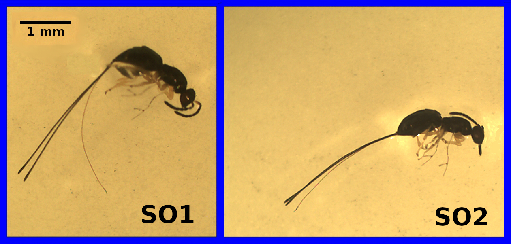

# (PART) Randomisation approaches {-}

# Week 11 Overview {-#Week11}

|                 |                                                        |
|-----------------|--------------------------------------------------------|
| **Dates**       | 3 April 2023 - 7 April 2023                            |
| **Reading**     | **Required:** SCIU4T4 Workbook chapter 34              |
|                 | **Recommended:**  None                                 |
|                 | **Suggested:**  None                                    |
|                 | **Advanced:**   @Ernst2004 ([Download](https://projecteuclid.org/journals/statistical-science/volume-19/issue-4/Permutation-Methods-A-Basis-for-Exact-Inference/10.1214/088342304000000396.full))                                    |
| **Lectures**    | 11.1: Introduction to randomisation (18:43 min; [Video](https://stirling.cloud.panopto.eu/Panopto/Pages/Viewer.aspx?id=4635224a-e5e1-4451-b084-af8200d92126))     |
|                 | 11.2: Assumptions of randomisation (11:03 min; [Video](https://stirling.cloud.panopto.eu/Panopto/Pages/Viewer.aspx?id=7d47453e-7a34-4396-a6f2-af8200d92180))                      |
|                 | 11.3: Bootstrapping (11:43 min; [Video](https://stirling.cloud.panopto.eu/Panopto/Pages/Viewer.aspx?id=c844d3be-a989-4eea-b07e-af8200d921aa))                      |
|                 | 11.4: Monte Carlo (min; [Video](https://stirling.cloud.panopto.eu/Panopto/Pages/Viewer.aspx?id=a2b242f4-c9f3-4b54-aff3-af8200d92237))                      |
| **Practical**   | Using R ([Chapter 35](#Chapter_35)) |
|                 | Room: Cottrell 2A17                                    |
|                 | Group A: 5 APR 2023 (WED) 13:05-15:55                 |
|                 | Group B: 6 APR 2023 (THU) 09:05-11:55                 |
| **Help hours**  |  Brad Duthie                                           |
|                 | Room: Cottrell 1A13                                    |
|                 | 31 MAR 2023 (FRI) 15:05-17:55                          |
| **Assessments** | [Week 10 Practice quiz](https://canvas.stir.ac.uk/courses/13075/quizzes/30911) on Canvas                     |


# Randomisation {#Chapter_34}

Since introducing statistical hypothesis testing in [Chapter 20](#Chapter_20), this book has steadily introduced statistical tests that can be run for different data types.
In all of these statistical tests, the general idea is the same.
We calculate some test statistic, then compare this test statistic to a pre-determined null distribution to find the probability (i.e., the p-value) of getting a test statistic as or more extreme than the one we calculated if the null hypothesis were true.
This chapter introduces a different approach.
Instead of using a pre-determined null distribution, we will build the null distribution using our data.
This approach is not one that it is often introduced in introductory statistics texts.
It is included here for 3 reasons.
First, randomisation presents a different way of thinking statistically without introducing an entirely different philosophical or methodological approach such as likelihood [@Edwards1972] or Bayesian statistics [@Lee1997].
Second, it helps reinforce the concept of what null hypothesis testing is and what p-values are.
Third, it introduces one of many motivations for learning a bit of coding in R (see [Chapter 35](#Chapter_35)).
Before explaining the randomisation approach, it is useful to summarise the parametric hypothesis tests introduced in earlier chapters.


## Summary of parametric hypothesis testing

For the parameteric tests introduced in previous chapters, null distributions included the t-distribution, F distribution, and $\chi^{2}$ distribution.
For the t-tests in [Chapter 21](#Chapter_21), the test statistic was the t-statistic, which we compared to a t-distribution. 
The [one-sample t-test](#one-sample-t-test) compared the mean of some variable ($\bar{x}$) to a specific number ($\mu_{0}$), the [independent samples t-test](#independent-samples-t-test) compared 2 group means, and the [paired sample t-test](#paired-sample-t-test) compared the mean difference between 2 paired groups.
All of these tests used the t-distribution and calculated some value of t.
Very low or high values of t at the extreme ends of the t-distribution are unlikely if the null hypothesis is true, so, in a two-tailed test, these are associated with low p-values that lead us to reject the null hypothesis.

For the analysis of variance (ANOVA) tests of [Chapter 23](#Chapter_23), the relevant test statistic was the F statistic, with the F-distribution being the null distribution expected if 2 variances are equal.
The [one-way ANOVA](#one-way-anova) used the within and among group variances of 2 or more groups to test the null hypothesis that all group means are equal.
The two-way ANOVA of [Chapter 26](#Chapter_26) extended the framework of the one-way ANOVA, allowing for a second variable of groups.
This made it possible to simultaneously test whether or not the means of 2 different group types were the same, and whether or not there was an interaction between group types. 
All of these ANOVA tests calculated some value of F and compared it to the F distribution with an appropriate degrees of freedom.
Sufficiently high F values were associated with a low p-value and therefore the rejection of the null hypothesis.

The Chi-square tests introduced in [Chapter 28](#Chapter_28) were used to test the frequencies of categorical observations and determine if they matched some expected frequencies ([Chi-square goodness of fit](#chi-squared-goodness-of-fit) test) or were associated in some way with the frequencies of another variable ([Chi-square test of association](#chi-squared-test-of-association)).
In these tests, the $\chi^{2}$ statistic was used and compared to a null $\chi^{2}$ distribution with an appropriate degrees of freedom.
High $\chi^{2}$ values were associated with low p-values and the rejection of the null hypothesis.

For testing the significance of correlation coefficients (see [Chapter 29](#Chapter_29)) and linear regression coefficients (see [Chapter 31](#Chapter_31)), a t-distribution was used.
And an F distribution was used to test for the overall significance of linear regression models.

For these tests, the approach to hypothesis testing was therefore always to use the t-distribution, F distribution, or $\chi^{2}$ distribution in some way.
These distributions are more formally defined in mathematical statistics [@Miller2004], a field of study that uses mathematics to derive the probability distributions that arise from an outcome of random events (e.g., the coin-flipping of [Chapter 14.1](#an-instructive-example)).
The reason that we use these distributions in statistical hypothesis testing is that they are often quite good at describing the outcomes that we expect when we collect a sample from a population.
But this is not always the case.
Recall that sometimes the assumptions of a particular statistical test were not met.
In this case, a non-parametric alternative was introduced.
The non-parameteric test used the ranks of data instead of the actual values (e.g., the [Wilcoxon](#wilcoxon-test), [Mann-Whitney U](#mann-whitney-u-test), [Kruskall-Wallis H](#Chapter_25), and [Spearman rank correlation coefficient](#spearman-rank-correlation-coefficient) tests).
Randomisation uses a different approach.


## Randomisation approach

Randomisation takes a different approach to null hypothesis testing. 
Instead of assuming a theoretical null distribution against which we compare our test statistic, we ask, 'if the ordering of the data we collected was actually random, then what is the probability of getting a test statistic as or more extreme than the one that we actually did'. 
Rather than using a null distribution derived from mathematical statistics, we will build the null distribution by randomising our data in some useful way [@Manly2007]. 
Conceptually, this is often easier to understand because randomisation approaches make it easier to see why the null distribution exists and what it is doing. 
Unfortunately, these methods are more challenging to implement in practice because using them requires knowing a bit of coding. 
The best way to get started is with an instructive example.


## Randomisation for hypothesis testing

As in several previous chapters, the data set used here is inspired by the many species of wasps that lay their eggs in the flowers of the Sonoran Desert rock fig (*Ficus petiolaris*). 
This tree is distributed throughout the Baja peninsula, and in parts of mainland Mexico. 
Fig trees and the wasps that develop inside of them have a fascinating ecology, but for now we will just focus on the morphologies of 2 closely related species as an example. 
The fig wasp below are 2 unnamed species of the genus *Idarnes*, which can refer to simply as 'Short-ovipositor 1' (SO1) and 'Short-ovipositor 2' (SO2). 

```{r, echo = FALSE, fig.alt = "A 2 panel figure is shown, with 2 black wasps under a microscope slide shown side by side, each of which has an ovipositor about twice its body length.", fig.cap = "Image of 2 fig wasp species, roughly 3 mm in length, labelled 'SO1' and 'SO2'", out.width="100%"}
;
```

The reason that these 2 species are called 'SO1' and 'SO2' is that there is actually another species that lays its eggs in *F. petiolaris* flowers, one with an ovipositor that is at least twice as long as the ones above. 

Suppose that we have some data on the lengths of the ovipositors from each species. 
We might want to know whether the mean ovipositor length differs between the 2 species. Below shows histograms of ovipositor lengths collected from 32 fig wasps, 17 of the species 'SO1', and 15 of the species 'SO2'.


```{r, echo = FALSE, fig.alt = "A 2 panel figure showing a histogram in each panel, the left with a histogram of SO1 ovipositor length and the right with another SO2 ovipositor length. Histograms are roughly normally distributed", fig.cap = "Ovipositor length distributions for two unnamed species of fig wasps SO1 (A) and SO2 (B) collected from Baja, Mexico."}
sp   <- c(rep("SO1", 17), rep("SO2", 15))
eg   <- c(3.256, 3.133, 3.071, 2.299, 2.995, 2.929, 3.291, 2.658, 3.406, 
          2.976, 2.817, 3.133, 3.000, 3.027, 3.178, 3.133, 3.210, 3.014, 
          2.790, 2.985, 2.911, 2.914, 2.724, 2.967, 2.745, 2.973, 2.560, 
          2.837, 2.883, 2.668, 3.063, 2.639);
wp   <- as.data.frame(cbind(sp, eg));
colnames(wp) <- c("Species", "Ovipositor length (mm)");
sp1 <- as.numeric(as.character(wp[wp[,1]=="SO1",2]));
sp2 <- as.numeric(as.character(wp[wp[,1]=="SO2",2]));
tmo <- t.test(sp1, sp2, var.equal = TRUE);
par(mfrow = c(1,2), mar = c(5, 5, 1, 1));
hist(x = sp1, col = "grey", xlim = c(2, 4), main = "", ylim = c(0, 8),
     breaks = seq(from = 2, to = 4, by = 0.2), xlab = "SO1 ovipositor length");
text(x = 3.7, y = 7.5, labels = "A", cex = 2);
hist(x = sp2, col = "grey", xlim = c(2, 4), main = "", ylim = c(0, 8),
     breaks = seq(from = 2, to = 4, by = 0.2), xlab = "SO2 ovipositor length");
text(x = 3.7, y = 7.5, labels = "B", cex = 2);
N1 <- 17;
N2 <- 15;
tt <- ((((N1 - 1)*var(sp1)) + ((N2 - 1)*var(sp2)))/(N1 + N2 - 2));
bb <- ((N1 + N2)/(N1*N2))
sp <- sqrt(tt * bb);
tv <- (mean(sp1) - mean(sp2))/sp;
```


To test whether or not mean ovipositor length is different between these 2 fig wasps, our standard approach would be to use an independent samples t-test (see [Chapter 21.2](#independent-samples-t-test)). 
The null hypothesis would be that the 2 means are the same, and the alternative (two-sided) hypothesis would be that the 2 means are not the same. 
We would need to check the assumption that the data are normally distributed, and that both samples have similar variances. 
Assuming that the assumption of normality is not violated (in which case we would need to consider a Mann Whitney test), and that both groups had similar variances (if not, we would use the Welch's t-test), we could proceed with calculating our t-statistic for pooled sample variance,

$$t_{\bar{y}_{SO1} - \bar{y}_{SO2}} = \frac{\bar{y}_{SO1} - \bar{y}_{SO2}}{s_{p}}.$$

The $s_{p}$ is just being used as a short-hand to indicate the pooled standard deviation.
For the 2 species of fig wasps, $\bar{y}_{SO1} =$ `r mean(sp1)`, $\bar{y}_{SO2} =$ `r mean(sp2)`, and $s_{p} =$ `r sp`.
We can therefore calculate $t_{\bar{y}_{SO1} - \bar{y}_{SO2}}$,

$$t_{\bar{y}_{SO1} - \bar{y}_{SO2}} = \frac{`r round(mean(sp1), digits = 3)` - `r round(mean(sp2), digits = 3)`}{`r round(sp, digits = 3)`}.$$

After we calculate our t-statistic as $t_{\bar{y}_{SO1} - \bar{y}_{SO2}} =$ `r round(tv, digits = 3)`, we would use the t-distribution to find the p-value (or, rather, get Jamovi to do this for us).
Figure 32.3 shows the t-distribution for 30 degrees of freedom with an arrow pointing at the value of $t_{\bar{y}_{SO1} - \bar{y}_{SO2}} =$ `r round(tv, digits = 3)`.

```{r, echo = FALSE, fig.alt = "A bell curve of the t-distribution is shown with an arrow pointing downward on the x-axis value around 2.419.", fig.cap = "A t-distribution is shown with a calculated t-statistic of 2.419 indicated with a downward arrow."}
par(mar = c(5, 5, 1.5, 1.5));
xx       <- seq(from = -5, to = 5, by = 0.001);
xx_vals  <- 1:10001;
yy       <- dt(xx, df = 9);
plot(x = xx, y = yy, type = "l", ylim = c(0, 0.48), 
     ylab = "Probability",  xlab = "t-score", lwd = 2, xlim = c(-3, 3),
     cex.lab = 1.25, cex.axis = 1.25, yaxs = "i");
polygon(c(xx[xx_vals], xx[1], xx[10001]), 
        c(yy[xx_vals], 0, 0), col="grey80");
arrows(x0 = 2.419, x1 = 2.419, y0 = 0.1, y1 = 0.002, lwd = 3);
mbox <- function(x0, x1, y0, y1){
    xx <- seq(from=x0, to=x1, length.out = 100);
    yy <- seq(from=y0, to=y1, length.out = 100);
    xd <- c(rep(x0, 100), xx, rep(x1,100), rev(xx));
    yd <- c(yy, rep(y1,100), rev(yy), rep(y0, 100));
    return(list(x=xd, y=yd));
}
tbox <- mbox(x0 = 2.419 - 0.15, 
             x1 = 2.419 + 0.15, y0 = 5, y1 = 9);
polygon(x=tbox$x, y=tbox$y, lwd=3, border="black", col="white");
text(x = 2.419, y = 0.125, cex = 2, 
     labels = expression(paste(italic(t[bar(y)[SO1] - bar(y)[SO2]]))));
```

If the null hypothesis is true, and $\bar{y}_{SO1}$ and $\bar{y}_{SO2}$ are actually sampled from a population with the same mean, then the probability of randomly sampling a value more extreme than `r round(tv, digits = 3)` (i.e., greater than `r round(tv, digits = 3)` or less than `r -1*round(tv, digits = 3)`) is $P =$ `r tmo$p.value`.
We therefore reject the null hypothesis because $P < 0.05$, and we conclude that the mean ovipositor lengths of each species are not the same.

Randomisation takes a different approach to the same problem.
Instead of using the t-distribution in Figure 34.3, we will build our own null distribution using the fig wasp ovipositor length data.
We do it by randomising group identity in the dataset.
The logic is that if there really is no difference between group means, then we should be able to randomly shuffle group identities (species) and get a difference between means that is not far off the one we actually get from the data. 
In other words, what would the difference between group means be if we just mixed up all of the species (so some SO1s become SO2s, some SO2s become SO1s, some stay the same), then calculated the difference between means of the mixed up groups? 
If we just do this once, then we cannot learn much. 
But if we randomly shuffle the groups many, many times (say at least 9999), then we could see what the difference between group means would look like just by chance; that is, if ovipositor length really was not different between SO1 and SO2. 
We could then compare our actual difference between mean ovipositor lengths to this null distribution, in which the difference between groups means really is random (it has to be, we randomised the groups ourselves!).

The idea is easiest to see using an [interactive application](https://bradduthie.shinyapps.io/randomisation/).

> [Click here](https://bradduthie.shinyapps.io/randomisation/) for an interactive application showing the process of a randomisation test that provides an equivalent test to an independent samples t-test.

The [interactive application](https://bradduthie.shinyapps.io/randomisation/) builds a null distribution of differences between the mean of SO1 and SO2 (click the 'Randomise' button to add a new random difference to the distribution).
This null distribution can be compared with the observed difference of $\bar{y}_{SO1} - \bar{y}_{SO2} =$ `r round(mean(sp1) - mean(sp2), digits = 3)`.

With modern computing power, we do not need to do this randomisation manually. 
A desktop computer can easily reshuffle the species identities and calculate a difference between means thousands of times in less than a second. 
The histogram below shows the distribution of the difference between species mean ovipositor length if we were to randomly reshuffle groups 99999 times. 

```{r, echo = FALSE, fig.alt = "A histogram with 120 narrow bars that form a bell shaped distribution around a mean of 0. An arrow points out a value of mean SO1 minus mean SO2", fig.cap = "A distribution of the difference between mean species ovipositor lengths in 2 different species of fig wasps when species identity is randomly shuffled. The true difference between sampled mean SO1 and SO2 ovipositor lengths is pointed out with the black arrow at 0.185. Ovipositor lengths were collected from wasps in Baja, Mexico in 2010."}
iter <- 99999;          
diff <- NULL; 
N    <- dim(wp)[1];
ovi  <- as.numeric(as.character(wp[,2]));
for(i in 1:iter){   
    samp    <- sample(x = wp[,1], size = N, replace = FALSE);
    smpm    <- as.numeric(tapply(X = ovi, INDEX = samp, FUN = mean))
    diff[i] <- smpm[1] - smpm[2];
}
par(mar = c(5, 5, 1, 1));
hist(x = diff, main = "", xlab = "Random difference between means (mm)", 
     cex.axis = 1.25,
     cex.lab = 1.25, col = "grey", breaks = 120);
df1 <- mean(sp1) - mean(sp2);
arrows(x0 = df1, x1 = df1 , y0 = 500, y1 = 10, 
               length = 0.15, lwd = 4, col = "black");
more_extr <- sum(abs(diff) > abs(mean(sp1)-mean(sp2)));
text(x = 0.155, y = 650, cex = 1.5, pos = 4,
     labels = expression(paste(italic(bar(y)[SO1]-bar(y)[SO2]))));
```

Given this distribution of random mean differences between species ovipositor lengths, the observed difference of `r round(mean(sp1)-mean(sp2), digits = 3)` appears to be fairly extreme. 
We can quantify how extreme by figuring out the proportion of mean differences in the above histogram that are more extreme than our observed difference (i.e., greater than `r round(mean(sp1)-mean(sp2), digits = 3)` or less than `r -1*round((mean(sp1)-mean(sp2)), digits = 3)`). 
It turns out that only `r more_extr` out of 99999 random mean differences between ovipositor lengths were as or more extreme than our observed difference of `r round(mean(sp1)-mean(sp2), digits = 3)`. 
To express this as a probability, we can simply take the number of differences as or more extreme than our observed difference (including the observed one itself), divided by the total number of differences (again, including the observed one),

$$P = \frac{`r more_extr` + 1}{`r format(iter, scientific = FALSE)` + 1}.$$

When we calculate the above, we get a value of `r (more_extr + 1)/(iter + 1)`. 
Notice that the calculated value is assigned with a 'P'. 
This is because the value **is a p-value** (technically, an unbiased estimate of a p-value). Consider how close it is to the value of $P =$ `r tmo$p.value` that we got from the traditional t-test. 
Conceptually, we are doing the same thing in both cases; we are comparing a test statistic to a null distribution to see how extreme the differences between groups really are.

## Randomisation assumptions

Recall from [Chapter 21.4](#assumptions-of-t-tests) the assumptions underlying t-tests, which include (1) data are continuous, (2) sample observations are a random sample from the population, and (3) sample means are normally distributed around the true mean.
With randomisation, we do not need to assume 2 or 3. 
The randomisation approach is still valid even if the data are not normally distributed.
Samples can have different variances.
The observations do not even need to be independent.
The validity of the randomisation approach even when standard assumptions do not apply can be quite useful.

The downside of the randomisation approach is that the statistical inferences that we make are limited to our sample, not the broader population (recall the difference between a sample and population from [Chapter 4](#Chapter_4)). 
Because the randomisation method does not assume that the data are a random sample from the population of interest (as is the case for the traditional t-test), we cannot formally make an inference about the difference between populations from which the sample was made. 
This is not necessarily a problem in practice.
It is only relevant in terms of the formal assumptions of the model. 
Once we run our randomisation test, it might be entirely reasonable to argue verbally that the results of our randomisation test can generalise to our population of interest.
In other words, we can argue that the difference between groups in the sample reflects a difference in the populations from which the sample came [@Ludbrook1998; @Ernst2004].

## Bootstrapping

We also can use randomisation to calculate confidence intervals for a variable of interest. Remember from [Chapter 17](#Chapter_17) the traditional way to calculate lower and upper confidence intervals using a normal distribution,

$$LCI = \bar{x} - (z \times SE),$$

$$UCI = \bar{x} + (z \times SE).$$

Recall from [Chapter 18](#Chapter_18) that a t-score is substituted for a z-score to account for a finite population size.
For review, intervals can be worked out using the [interactive application](https://bradduthie.shinyapps.io/t_score/) for the t-distribution.

Suppose we want to calculate 95 per cent confidence intervals for the ovipositor lengths of SO1 (Figure 34.2A).
There are `r length(sp1)` ovipositor lengths for SO1.

`r sp1`


To get the 95 per cent confidence interval using the method from [Chapter 17](#Chapter_17), we would calculate the mean $\bar{x}_{SO1} =$ `r round(mean(sp1), digits = 3)`, standard deviation $s_{SO1} =$ `r round(sd(sp1), digits = 3)`, and the t-score for $df = N - 1$ (where N = 17), which is $t = 2.120$.
Keeping in mind the formula for standard error $s/\sqrt{N}$, we can calculate,

$$LCI = `r round(mean(sp1), digits = 3)` - \left(2.120 \times \frac{`r round(sd(sp1), digits = 3)`}{\sqrt{17}}\right),$$

$$UCI = `r round(mean(sp1), digits = 3)` + \left(2.120 \times \frac{`r round(sd(sp1), digits = 3)`}{\sqrt{17}}\right).$$

Calculating the above gives us values of LCI = `r round(mean(sp1) - (2.120 * sd(sp1)/sqrt(17)), digits = 3)` and UCI = `r round(mean(sp1) + (2.120 * sd(sp1)/sqrt(17)), digits = 3)`.

Again, randomisation uses a different approach to get an estimate of the same confidence intervals.
Instead of calculating the standard error and multiplying it by a z score or t score to encompass a particular interval of probability density, we can instead resample the data we have with replacement many times, calculating the mean each time we resample. 
The general idea is that this process of resampling approximates what would happen if we were to go back and resample new data from our original population many times, thereby giving us the distribution of means from all of these hypothetical resampling events [@Manly2007]. 
To calculate our 95 per cent confidence intervals, we then only need to rank the calculated means and find the mean closest to the lowest 2.5 per cent and the highest 97.5 per cent. 

Remember from [Chapter 14.3](#sampling-with-and-without-replacement) that the phrase 'resampling with replacement' just means that we are going to randomly sampled some values, but not remove them from the pool of possible values after they are sampled. 
If we resample the numbers above with replacement, we might therefore sample some values 2 or more times by chance, and other values might not be sampled at all. 
The numbers below resample from the above with replacement.

```{r, echo = FALSE, comment = NA}
resamp1 <- sample(sp1, size = length(sp1), replace = TRUE);
```

`r resamp1`


Notice that some values appear more than once in the data above, while other values that were present in the original data set are no longer present after resampling with replacement. Consequently, this new resampled data has a different mean than the original. 
The mean of the original 17 SO1 ovipositor length values was `r round(mean(sp1), digits = 3)`, and the mean of the values resampled above is `r round(mean(resamp1), digits = 3)`. 
We can resample another set of numbers to get a new mean.

```{r, echo = FALSE, comment = NA}
resamp2 <- sample(sp1, size = length(sp1), replace = TRUE);
```

`r resamp2`


The mean of the above sample is `r round(mean(resamp2), digits = 3)`. 
We can continue doing this process until we have a high number of random samples and means. Figure 34.5 shows the distribution of means if we repeat this process of resampling with replacement and calculating the mean 10000 times.

```{r, echo = FALSE, fig.alt = "A histogram is shown with a mostly bell shape but skewing slightly to the left; x-axis values range from about 2.8 to 3.2.", fig.cap = "A distribution of bootstrapped values of ovipositor lengths from 17 measurements of a fig wasp species collected from Baja, Mexico. A total of 10000 bootstrapped means are shown, and arrows indicate the location of the 2.5 per cent (LCI) and 97.5 per cent (UCI) ranked boostrapped mean values."}
simpleboot <- function(freqs,repli=10000,alpha=0.05){                        
	vals  <- NULL;                                                           
	i     <- 0;                                                            
	while(i < repli){                                                          
		boot  <- sample(x=freqs,size=length(freqs),replace=TRUE);               
		strap <- mean(boot);                                                  
		vals  <- c(vals,strap);                                             
		i     <- i + 1;                                                       
	}                                                                      
	vals   <- sort(x=vals,decreasing=FALSE);                                 
	lowCI  <- vals[round((alpha*0.5)*repli)];                              
	highCI <- vals[round((1-(alpha*0.5))*repli)];                          
	CIs    <- c(lowCI,highCI);                                               
	return(list(vals, CIs));                                                             
} 
booteg <- simpleboot(freqs = sp1);
vals   <- booteg[[1]];
hist(x = vals, main = "", xlab = "Bootstrapped mean values", cex.axis = 1.25,
     cex.lab = 1.25, col = "grey", breaks = 20);
egLCI <- booteg[[2]][1];
egUCI <- booteg[[2]][2];
arrows(x0 = egLCI, x1 = egLCI , y0 = 500, y1 = 10, 
               length = 0.15, lwd = 4, col = "black");
arrows(x0 = egUCI, x1 = egUCI , y0 = 500, y1 = 10, 
               length = 0.15, lwd = 4, col = "black");
text(x = egLCI, y = 630, labels = "LCI", cex = 1.4);
text(x = egUCI, y = 630, labels = "UCI", cex = 1.4);
```

The arrows show the locations of the 2.5 per cent and 97.5 per cent ranked values of the bootstrapped means. 
Note that it does not matter if the above distribution is not normal (it appears a bit skewed). 
The bootstrap still works. 
The values using the randomisation approach are LCI = `r round(egLCI, digits = 3)` and UCI = `r round(egUCI, digits = 3)`.
These values are quite similar to those calculated with the traditional approach because we are doing the same thing, conceptually.
But instead of finding confidence intervals of the sample means around the true mean using the t-distribution, we are actually simulating the process of resampling from the population and calculating sample means many times.


## Monte Carlo

The previous examples of hypothesis testing and bootstrapping involved resampling from existing data sets to address a statistical question. 
But we can also use randomisation in cases in which it is impossible to derive the null distribution from the data. 
In this last example, the goal will be to test whether or not fig trees (Figure 34.6) are randomly distributed across a fixed sampling area.

```{r, echo = FALSE, fig.alt = "A fig tree is shown with a wide crown and a man in beige clothing is looking up from underneath it.", fig.cap = "A tree of the Sonoran Desert Rock Fig from Baja, Mexico.", out.width="100%"}
knitr::include_graphics("img/fig_tree.jpg");
```

Locations of these fig trees were collected over the course of many field seasons. 
In Baja, Mexico, a dataset of 59 trees was collected.
The first 6 rows of this dataset with tree locations are shown in Table 34.1.

```{r, echo = FALSE}
fpet <- read.csv("data/FpetTrees.csv");
```


```{r, echo = FALSE}
lat1 <-  28.289;
lat2 <-  28.2918;
lon1 <- -113.1145;
lon2 <- -113.1095;
knitr::kable(head(fpet), format = "simple", table.envir = "table",
      caption = "Latitudes, longitudes, and elevations of Sonoran Desert Rock Fig trees collected from a sample site in Baja, Mexico.");
```

We can plot the latitude and longitude of each of the `r dim(fpet)[1]` trees below. 
Figure 34.7 shows the study plot at the field site, which was set to be from latitude `r lat1` to `r lat2` and longitude `r lon1` to `r lon2` (Figure 34.7). 

```{r, echo = FALSE, fig.alt = "A brown area is shown with a collection of black dots on it; the x-axis and y-axis give longitude and latitude, respectively.", fig.cap = "Latitude and longitude locations of Sonoran Desert Rock Fig trees from Baja, Mexico.", out.width="100%"}
lat1 <-  28.289;
lat2 <-  28.2918;
lon1 <- -113.1145;
lon2 <- -113.1095;
plot(x = fpet[,4], y = fpet[,3], xlab = "Longitude", ylab = "Latitude",
     pch = 20, cex.lab = 1.25, cex.axis = 1.25, 
     xlim = c(lon1 - 0.001,  lon2 + 0.001), 
     ylim = c(lat1 - 0.0005, lat2 + 0.0005));
polygon(x = c(lon1, lon1, lon2, lon2),  y = c(lat1, lat2, lat2, lat1),
        col = "tan");
points(x = fpet[,4], y = fpet[,3], pch = 20);
```

The focal question is whether or not these trees are randomly distributed within the brown box. 
Alternatively, the trees might be more clustered together than we would expect by chance.
This is not a question that can be answered by randomising the latitude and longitude coordinates of trees. 
What we need to do instead is compare the distribution of the trees above with that of trees with randomly placed latitude and longitude coordinates within the box. 
This is a job for a Monte Carlo test, which compares an observed test statistic with that derived from a theoretical null model [@Manly2007]. 
In this case, the test statistic we will use is distance to the nearest neighbour (i.e., for a focal tree, how close the nearest member of the same species). 
The null model that we will assume is a set of randomly sampled latitude and longitude coordinates within the fixed study area.

More formally, our null hypothesis will be that the mean nearest neighour distance for a focal tree in the observed data will not differ significantly from the mean nearest neighour distance obtained from the same number of trees randomly distributed within the sampling area (brown box). 
To test this null hypothesis, we can randomly place `r dim(fpet)[1]` trees within the sampling area and calculate the mean nearest neighbour distance for the randomly placed trees. 
If we repeat this procedure a large number of times, then we can build a null distribution of nearest neighbour distances for trees that are randomly placed within the study area (i.e., random latitude and longitude coordinates). 

```{r, echo = FALSE}
get_mean_nearest_neighbour <- function(trees, lat = 3, lon = 4){
    N_trees  <- dim(trees)[1];
    tree_lat <- trees[,lat];
    tree_lon <- trees[,lon];
    nearests <- rep(x = NA, times = N_trees);
    for(i in 1:N_trees){
        nearest_neigh <- Inf;
        for(j in 1:N_trees){
            if(i != j){
                diff_lat <- tree_lat[i] - tree_lat[j];
                diff_lon <- tree_lat[i] - tree_lat[j];
                sq_lat   <- diff_lat * diff_lat;
                sq_lon   <- diff_lon * diff_lon;
                neigh_d  <- sqrt(sq_lat + sq_lon);
                if(neigh_d < nearest_neigh){
                    nearest_neigh <- neigh_d;
                }
            }
        }
    nearests[i] <- nearest_neigh;
    }
    return(mean(nearests));
}
```

Given the random placement of these trees, we can find the mean distance to the nearest neighbouring tree, calculated across all of the randomly placed trees. 
This mean nearest neighbour distance is then stored so that a null distribution can be built. 
We can see what these randomly placed trees look like by plotting some of the iterations in Figure 34.8.


```{r, echo = FALSE, fig.alt = "A 4 by 4 arrangement of 16 panels is shown with brown boxes; in each brown box, there are a large number of randomly scatter black points.", fig.cap = "Sixteen separate random allocations of latitude and longitude locations within a sampling  are of Sonoran Desert Rock Fig trees from Baja, Mexico. There are 59 total locations randomly allocated for each panel, each representing an individual fig tree.", out.width="100%"}
iteration    <- 16;
N_trees      <- dim(fpet)[1];
simulated_NN <- NULL;
par(mfrow = c(4, 4), mar = c(0, 0, 0, 0));
while(iteration > 0){
    rand_lat  <- runif(n = N_trees, min = lat1, max = lat2);
    rand_lon  <- runif(n = N_trees, min = lon1, max = lon2);
    fpet[,3]  <- rand_lat;
    fpet[,4]  <- rand_lon;
    mean_NN   <- get_mean_nearest_neighbour(fpet);
    simulated_NN[iteration] <- mean_NN;
    plot(x = fpet[,4], y = fpet[,3], xlab = "", ylab = "",
         pch = 20, cex.lab = 1.25, cex.axis = 1.25, xaxt = "n", yaxt = "n",
         xlim = c(lon1 - 0.001,  lon2 + 0.001), 
         ylim = c(lat1 - 0.0005, lat2 + 0.0005));
    polygon(x = c(lon1, lon1, lon2, lon2),  y = c(lat1, lat2, lat2, lat1),
            col = "tan");
    points(x = fpet[,4], y = fpet[,3], pch = 20);
    iteration <- iteration - 1;
}
```

In Figure 34.9, the distribution of mean distance to the nearest neighbour is plotted for the 9999 randomly generated tree study areas. 
The arrow shows the actual observed mean distance between nearest neighbours, as calculated form the original data set.


```{r, echo = FALSE, fig.alt = "A histogram showing a mostly normal distribution is shown with mean nearest neighbour distance on the x-axis, and an arrow pointing almost right down the middle of the distribution.", fig.cap = "The distribution of mean neareast neighbour distance from 9999 random simulations of 59 latitude and longitidue locations within a field site in Baja, Mexico. The black arrow indicates mean nearest neighbour distance for 59 observed trees from the field site.", out.width="100%"}
iteration    <- 9999;
N_trees      <- dim(fpet)[1];
simulated_NN <- NULL;
while(iteration > 0){
    rand_lat  <- runif(n = N_trees, min = lat1, max = lat2);
    rand_lon  <- runif(n = N_trees, min = lon1, max = lon2);
    fpet[,3]  <- rand_lat;
    fpet[,4]  <- rand_lon;
    mean_NN   <- get_mean_nearest_neighbour(fpet);
    simulated_NN[iteration] <- mean_NN;
    iteration <- iteration - 1;
}
par(mar = c(5, 5, 1, 1));
hist(simulated_NN, xlab = "Mean tree nearest neighbour distance", 
     col = "grey", main = "", cex.lab = 1.25, cex.axis = 1.5, breaks = 20);
fpet <- read.csv("data/FpetTrees.csv");
obs  <- get_mean_nearest_neighbour(fpet)
arrows(x0 = obs, x1 = obs, y0 = 300, y1 = 10, lwd = 3, length = 0.1);
```

It appears, from the position of the mean tree nearest neighbour distance in the observed data, that the *F. petiolaris* trees are no more or less spatially aggregated than would be expected by chance.


## Randomisation conclusions

The examples demonstrated in this chapter are just a small set of what is possible using randomisation approaches.
Randomisation, bootstrapping, and Monte Carlo tests are highly flexible tools that can be used in a variety of ways [@Manly2007].
They could be used as substitutes (or complements) to any of the hypothesis tests that we have used in this book.
For example, to use a randomisation approach for testing whether or not a correlation coefficient is significantly different from 0, we could randomly shuffle the values of one variable 9999 times.
After each shuffle, we would calculate the Pearson product moment correlation coefficient, then use the 9999 randomised correlations as a null distribution to compare against the observed correlation coefficient.
This would give us a plot like the one shown in Figure 34.4, but showing the null distribution of the correlation coefficient instead of the difference between group means.
Similar approaches could be used for ANOVA or linear regression [@Manly2007].


# _Practical_. Using R {#Chapter_35}

Throughout this book, we have used Jamovi for statistical analysis.
Jamovi is excellent software for running simple statistical analyses, but it has its limitations.
Jamovi is built upon the programming language R, which is much more powerful and versatile in comparison.
The R programming langauge is now widely used among scientists for data anslysis.
It can be used to analyse and plot data, run computer simulations, or even write slides, papers, or books (this book, including all interactive applications, were written using R). 
The R programming language is completely free and open source, as is the popular [Rstudio](https://posit.co/downloads/) software for using it. 
The R programming language specialises in statistical computing, which is part of the reason for its popularity among scientists.

Another reason for the popularity of R is its versatility, and the ease with which new techniques can be shared. 
Imagine that you develop a new method for analysing data. 
If you want other researchers to be able to use your method in their research, then you could write your own software from scratch for them to install and use. 
But doing this would be very time consuming, and a lot of that time would likely be spent writing the graphical user interface and making sure that your program worked across platforms (e.g., on Windows and Mac). 
Worse, once written, there would be no easy way to make your program work with other statistical software should you need to integrate different analyses or visualisation tools (e.g., plotting data). 
To avoid all of this, you could instead just present your new method for data analysis and let other researchers write their own code for implementing it. 
But not all researchers will have the time or expertise to write their own code.

Instead, R allows researchers to write new tools for data analysis using simple coding scripts. 
These scripts are organised into R packages, which can be uploaded by authors to the  [Comprehensive R Archive Network](https://cran.r-project.org/) (CRAN), then downloaded by users with a single command in R. 
This way, there is no need for completely different software to be used for different analyses; all analyses can be written and run in R.

The downside to all of this is that learning R can be a bit daunting at first. 
Running analyses is not done by pointing and clicking on icons as in Jamovi. 
You need to use code. 
This practical will start with the very basics and work up to some simple data analyses.
Rather than questions to answer, this practical has tasks for you to try to complete in R.

## Getting used to the R interface

There are two ways that you can use R. 
The first way is to download R and Rstudio on your own computer. 
Both R and Rstudio are free to download and use, and work on any major operating system (Windows, Mac, and Linux). 
To download R, go to [the Comprehensive R Archive Network](https://cran.rstudio.com/) and follow the instructions for your operating system (OS).
To download Rstudio, go to [this page on the Rstudio website](https://posit.co/download/rstudio-desktop/#download) and choose the appropriate download for your operating system.

If you cannot or do not want to download R and Rstudio on your own computer, then you can still use both by going to the [Rstudio Cloud](https://rstudio.cloud/) and running Rstudio from a browser such as Firefox or Chrome. 
You will need to click the green "Get Started" button and sign up for a free account. 
When you open Rstudio either on your own computer or the cloud, you will see several windows open, including a console. 
The console will look something like the below.

```
R version 4.2.2 Patched (2022-11-10 r83330) -- "Innocent and Trusting"
Copyright (C) 2022 The R Foundation for Statistical Computing
Platform: x86_64-pc-linux-gnu (64-bit)

R is free software and comes with ABSOLUTELY NO WARRANTY.
You are welcome to redistribute it under certain conditions.
Type 'license()' or 'licence()' for distribution details.

  Natural language support but running in an English locale

R is a collaborative project with many contributors.
Type 'contributors()' for more information and
'citation()' on how to cite R or R packages in publications.

Type 'demo()' for some demos, 'help()' for on-line help, or
'help.start()' for an HTML browser interface to help.
Type 'q()' to quit R.

> 
```

If you click to the right of the greater than sign `>`, you can start using R right in the console. 
You can use R as a standard calculator here to get a feel for the console. 
Try typing something like the below (semi-colons are not actually necessary).
For example, you could add 2 + 5.

```{r, echo = TRUE, comment = NA}
2 + 5;  
```

Try this yourself.

> **Task 1: Add 2 numbers together in R**

You can also multiply in R.

```{r, echo = TRUE, comment = NA}
4 * 4;  
```

The caret key `^` is used for exponents

```{r, echo = TRUE, comment = NA}
5^2;  
```

R will use the correct order of operations (see [Chapter 1.3](#order-of-operations)) when doing mathematical calculations.
For example, it will know to calculate the exponent before multiplying, and to multiply before adding.

```{r, echo = TRUE, comment = NA}
2 + 4 * 5^2;  
```

Following the correct order of operations, $5^{2} = 25$, which is then multiplied by 4 to get $4 \times 25 = 100$, and we add 2 to get $100 + 2 = 102$.
We can, however, use parentheses to specify a different order of operations.

```{r, echo = TRUE, comment = NA}
(2 + 4) * 5^2;  
```

Now R will calculate $2 + 4 = 6$ and multiply the 6 by 25 to get an answer of 150.
The R console very well as a calculator. 
Instead of punching buttons into a hand calculator or mobile phone, an entire equation can be written and placed into the console.
This makes mistakes less likely.
For example, in [Chapter 1.3](#order-of-operations), the following equation was presented,

$$x = 3^{2} + 2(1 + 3)^{2} - 6 \times 0.$$

To solve this in R, we just need to type the full equation in the console.

```{r, echo = TRUE, comment = NA}
3^2 + 2*(1 + 3)^2 - 6 * 0;
```

We get the correct answer of `r 3^2 + 2*(1 + 3)^2 - 6 * 0`. 
Note that there needed to be an asterisk (`*`) to indicate multiplication between the 2 and the left parentheses.
This is because parentheses specify specific functions in R.
We will introduce functions next, but first, try the following task.

> **Task 2: Use the console to calculate $x = \frac{2^2 + 1}{3^2 + 2}$ (hint, you need to put the top and bottom of the fraction in parentheses, e.g., `(2^2 + 1)` for the numerator, and use the forward slash `/` for division).**

You should get an answer of `(2^2 + 1)/(3^2 +2)`.

As previously mentioned, parentheses specify functions in R.
Functions have specific names such as `sqrt`, which calculates the square root of anything within the parentheses `sqrt()`.
If, for example, you wanted to find the square root of some number, you could use the `sqrt` function below.

```{r, echo = TRUE, comment = NA}
sqrt(256);
```

The console returns the correct answer `r sqrt(256)`. 
Similar functions exist for logarithms (`log`) and trigonometric functions (e.g., `sin`, `cos`). 
The parentheses after the word indicate that some function is being called in R. 
Try to use the square root function to solve for $x$ in another equation.

> **Task 3: Use the console to calculate $\sqrt{3 + 4^2}$.**

You should get an answer of `r sqrt(3 + 4^2)`.

If you type something into the console incorrectly, you do not need to retype it entirely.
You can use the up arrow to scroll through the history of console input.
Try doing that now.

> **Task 4: Use the up arrow to find your previous calculation for $\sqrt{3 + 4^2}$, then change this slightly to calculate $\sqrt{3 + 4^3}$.**

You should get an answer of `r sqrt(3 + 4^3)`.

Functions do not need to be mathematical like the `sqrt` function.
For example, the `getwd` function can be used to let you know what directory (i.e., folder) you are working in.

```{r, echo = TRUE, comment = NA}
getwd();
```

If we were to save or load a file within R, this is the location on the computer from which R would try to load. 
We could also use the `setwd` function to set a new working directory (type the working directory in quotes inside the parentheses: `setwd("folder/subfolder/etc")`). 
You can also set the working directory in Rstudio by going to the toolbar and clicking 'Session' and selecting 'Set Working Directory'.

## Assigning variables in the R console

In R, we can also assign values to variables using the characters `<-` to make an arrow. 
For example, we might want to set `var_1` equal 10.

```{r, echo = TRUE, comment = NA}
var_1 <- 10;
```

We can now use `var_1` in the console.
For example, since `var_1` now equals 10, if we multiply `var_1` by 5, R calculates $10 \times 5 = 50$.

```{r, echo = TRUE, comment = NA}
var_1 * 5; # Multiplying the variable by 5
```

The correct value of `r var_1 * 5` is returned because `var_1` equals `r var_1`. Also note the comment left after the `#` key. 
In R, anything that comes after `#` on a line is a comment that R ignores. 
Comments are ways of explaining in plain words what the code is doing, or drawing attention to important notes about the code.

> **Task 5: Assign a new variable to a value of 4 (call it anything you want), then multiply the new variable by itself.**

For Task 5, you should get an output of 16.

When we assign something to a variable like `var_1`, we are not limited to a single number.
Variables in R can be much more complex.
For example, we can assign a new variable `vector_1` to an ordered set of 6 different numbers using the `c` function.
The `c` function combines values together.

```{r, echo = TRUE, comment = NA}
vector_1 <- c(5, 1, 3, 5, 7, 11); # Six numbers
vector_1;      # Prints out the vector
```

Doing this makes it possible to calculate for all of the values in `vector_1` at the same time.
We might, for example, want to multiply all of the numbers by 10.

```{r, echo = TRUE, comment = NA}
vector_1 * 10
```

Variables also do not necessarily need to be numbers.
We might assign a new variable `phrase_1` to a string of letters.
When doing this, the letters need to be enclosed in quotation marks.

```{r, echo = TRUE, comment = NA}
phrase_1 <- "string of words";
phrase_1;
```

We can even combine numbers, vectors, and words into a single object as a list using the `list` function.

```{r, echo = TRUE, comment = NA}
object_1 <- list(var_1, vector_1, phrase_1);
object_1;
```

There are far too many possibilities to introduce everything about how R works.
The best way to get started is to play around and see what works and what does not.
You will not break anything.
Error messages are good because they can help you learn how R works.

> **Task 6: Use the R console until you find a new error message.**

Try something new in the R console.
Keep going until you get an error message that you have not yet seen, then move on to the next exercise.


## Some descriptive statistics

Now we can get started with some statistical analyses. 
In [Chapter 37](#Chapter_37) we will learn how to do some familiar analyses with R scripts and data uploaded from CSV files, but for now, we will just type our data directly into the console. 
We can use the data from [Chapter 34.4](#randomisation-for-hypothesis-testing) as an example.
The code below reads in 2 different variables, `SO1` and `SO2`.
The numbers are the same ovipositor lengths from the histograms in Figure 34.2 of [Chapter 34.4](#randomisation-for-hypothesis-testing).

```{r, echo = TRUE, comment = NA}
SO1 <- c(3.256, 3.133, 3.071, 2.299, 2.995, 2.929, 3.291, 2.658, 3.406, 
         2.976, 2.817, 3.133, 3.000, 3.027, 3.178, 3.133, 3.210);
SO2 <- c(3.014, 2.790, 2.985, 2.911, 2.914, 2.724, 2.967, 2.745, 2.973, 
         2.560, 2.837, 2.883, 2.668, 3.063, 2.639);
```

Copy and paste the code above into the R console.
You should now have 2 new variables, `SO1` and `SO2`

> **Task 7: Type `SO1` into the R console to print the ovipositor lengths for species SO1, then do the same for `SO2`**.

We can replicate the histogram from Figure 34.2A in [Chapter 34.4](#randomisation-for-hypothesis-testing) with the following code.

```{r, echo = TRUE, fig.alt = "A histogram SO1 ovipositor lengths that is roughly normally distributed", fig.cap = "Ovipositor length distributions for an unnamed species of fig wasps SO1."}
hist(x = SO1, xlab = "SO1 ovipositor length", main = "");
```

The bin widths are not the same as Figure 34.2A because there are other options within `hist` that have not been specified.
Within `hist` and other functions, these options such as `x`, `xlab`, and `main` are called *arguments*.
The word 'argument' in this case has nothing to do with a disagreement or logical reasoning.
In this case, it just refers to information that is passed in a function.

> **Task 8: Make a histogram of SO2 ovipositor lengths. Try using the argument `col = "blue"` in the `hist` function to make the histogram bars blue.**

No we can try collecting some summary statistics for SO1 and SO2.
In the lab practical from [Chapter 13](#Chapter_13), we used Jamovi to calculate summary statistics.
Table 35.1 below shows how those same summary statistics can be calculated using functions in R, and the output of each function for SO1.

```{r, echo = FALSE}
Statistic <- c("N", "Std. deviation", "Variance", "Minimum", "Maximum", "Range",
               "IQR", "Mean", "Median");
Function  <- c("`length(SO1)`", "`sd(SO1)`", "`var(SO1)`", "`min(SO1)`",
               "`max(SO1)`", "`range(SO1)`", "`IQR(SO1)`", "`mean(SO1)`",
               "`median(SO1)`");
Output    <- c(round(length(SO1), digits = 0), round(sd(SO1), digits = 6), 
               round(var(SO1), digits = 6), min(SO1), max(SO1), 
               paste(as.character(range(SO1)), collapse = ", "),
               IQR(SO1), round(mean(SO1), digits = 6), median(SO1));
R_table   <- data.frame(Statistic, Function, Output);
knitr::kable(R_table, format = "simple", table.envir = "table",
      caption = "R functions and output for summary statistics applied to a variable (SO1) of ovipositor lengths in an unnamed species of nonpollinating fig wasp.");

```

Notice that the `range` function gives the minimum and maximum of SO1, so we need to subtract the latter from the former to get the actual range.

> **Task 9: Calculate the summary statistics in Table 35.1 for SO2.**

There is no function for standard error in R.
We could write a custom function to calculate the standard error, but for now we can just use the formula from [Chapter 12.6](#the-standard-error) to calculate the standard error of SO1,

$$SE = \frac{s}{\sqrt{N}}.$$

Since we have the standard deviation ($s$) and sample size ($N$) from Table 35.1, we can calculate SE in R,

```{r, comment = NA}
sd(SO1) / sqrt( length(SO1) );
```


The code above calculates the standard deviation of SO1 (`sd(SO1)`), then divides (`/`) by the square root (`sqrt()`) of the length of SO1 (`length(SO1)`). 
This can be difficult to read because `length(SO1)` is enclosed in `sqrt()`.
But we can break this down step by step to make it easier to read by assigning each component to a new variable.

```{r, comment = NA}
SO1_SD <- sd(SO1);     # Assign the standard deviation
SO1_N  <- length(SO1); # Assign the N
SO1_SD / sqrt(SO1_N);  # Do the calculation for SE
```

We can do the same for SO2.

> **Task 10: Calculate the standard error of SO2 ovipositor lengths.**

With the standard error now calculated, we can also calculate 95 per cent confidence intervals using the formula from [Chapter 17](#Chapter_17), just as we did for SO1 in [Chapter 34.5](#bootstrapping),

$$LCI = `r round(mean(sp1), digits = 3)` - \left(2.120 \times \frac{`r round(sd(sp1), digits = 3)`}{\sqrt{17}}\right),$$

$$UCI = `r round(mean(sp1), digits = 3)` + \left(2.120 \times \frac{`r round(sd(sp1), digits = 3)`}{\sqrt{17}}\right).$$

Note that `r round(mean(sp1), digits = 3)` is the mean from Table 35.1, and $`r round(sd(sp1), digits = 3)`/\sqrt{17}$ is the standard error that we just calculated for SO1.
The value 2.120 is the t-score associated with df = 17 - 1, i.e., 16 degrees of freedom (see  [Chapter 34.5](#bootstrapping)).
As in [Chapter 34.5](#bootstrapping), we get values of LCI = `r round(mean(sp1) - (2.120 * sd(sp1)/sqrt(17)), digits = 3)` and UCI = `r round(mean(sp1) + (2.120 * sd(sp1)/sqrt(17)), digits = 3)`.

> **Task 10: Calculate 95 per cent confidence intervals for SO2 ovipositor lengths (hint: the appropriate t value for df = 14 is 2.145 instead of 2.120).**

In the last exercise, we will attempt to bootstrap these confidence intervals using the method introduced in [Chapter 34.5](#bootstrapping).


## Bootstrapping confidence intervals

Writing resampling and randomisation procedures in R requires some knowledge of coding.
For now, all that you need to do is copy a pre-defined function into R and use it like any other function.
The function is called `simpleboot`.

```{r}
simpleboot <- function(x, replicates = 1000, CIs = 0.95){
  alpha <- 1 - CIs;
	vals  <- NULL;                                                           
	i     <- 0;                                                            
	while(i < replicates){                                                          
		boot  <- sample(x = x, size = length(x), replace = TRUE);               
		strap <- mean(boot);                                                  
		vals  <- c(vals, strap);                                             
		i     <- i + 1;                                                       
	}                                                                      
	vals   <- sort(x = vals, decreasing = FALSE);                                 
	lowCI  <- vals[round((alpha*0.5)*replicates)];                              
	highCI <- vals[round((1-(alpha*0.5))*replicates)];                          
	confid <- c(lowCI, highCI);                                               
	return(list(vals, confid));                                                             
} 
```


The `simpleboot` function takes a variable (`x`) as an argument, bootstraps mean values `replicates` times, and produces confidence intervals at a level `CIs`.
To use it, highlight and copy the entire function, then put it into the R console.
Make sure that every line from `simpleboot` to the last `}` is copied.
Once it has been placed into the R console, it can be used just like any other function.
For example, we can run `simpleboot` and store the output for SO1 values.

```{r, comment = NA}
SO1_95s <- simpleboot(x = SO1, replicates = 1000, CIs = 0.95);
```

The output will include a list of 2 different objects.
The first object  `SO1_95s[[1]]` will be a list of 1000 bootstrapped mean values, sorted from lowest to highest.
The second object `SO1_95s[[2]]` will be the bootstrapped upper and lower confidence intervals.
First, we can take a look at a histogram of the bootstrapped mean values.

```{r, echo = TRUE, fig.alt = "A histogram bootstrapped mean SO1 values that appears to be roughly normally distributed", fig.cap = "Bootstrapped mean values for 17 ovipositor lengths in an unnamed species of fig wasp collected in Baja, Mexico."}
hist(x = SO1_95s[[1]], xlab = "Bootstrapped SO1 means", main = "");
```

We can then print out the lower and upper confidence intervals, which report the value of the 2.5 per cent rank and 97.5 rank bootstrapped means, respectively.

```{r, comment = NA}
print(SO1_95s[[2]]);
```

Note that these values are not too far off the values of LCI = `r round(mean(sp1) - (2.120 * sd(sp1)/sqrt(17)), digits = 3)` and UCI = `r round(mean(sp1) + (2.120 * sd(sp1)/sqrt(17)), digits = 3)` calculated in the usual way in the previous exercise.

> **Task 11: Use the `simpleboot` function to calculate 95 per cent confidence intervals for SO2 mean ovipositor lengths.**

The practical in [Chapter 37](#Chapter_37) will demonstrate how to read CSV files into R and run hypothesis tests, including t-tests, ANOVAs, chi-square tests, correlation tests, and linear regression.


