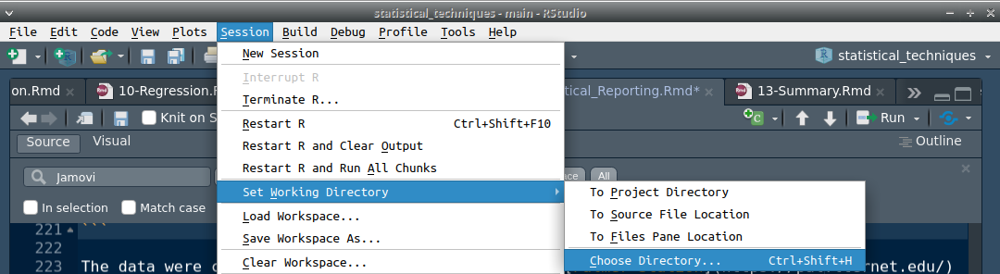

# (PART) Statistical Reporting {-}

# Week 12 Overview {-#Week12}

|                 |                                                        |
|-----------------|--------------------------------------------------------|
| **Dates**       | 3 April 2023 - 7 April 2023                            |
| **Reading**     | **Required:** SCIU4T4 Workbook chapter 34              |
|                 | **Recommended:**  None                                 |
|                 | **Suggested:**  None                                    |
|                 | **Advanced:**   @Ernst2004 ([Download](https://projecteuclid.org/journals/statistical-science/volume-19/issue-4/Permutation-Methods-A-Basis-for-Exact-Inference/10.1214/088342304000000396.full))                                    |
| **Lectures**    | 11.1: Introduction to randomisation (18:43 min; [Video](https://stirling.cloud.panopto.eu/Panopto/Pages/Viewer.aspx?id=4635224a-e5e1-4451-b084-af8200d92126))     |
|                 | 11.2: Assumptions of randomisation (11:03 min; [Video](https://stirling.cloud.panopto.eu/Panopto/Pages/Viewer.aspx?id=7d47453e-7a34-4396-a6f2-af8200d92180))                      |
|                 | 11.3: Bootstrapping (11:43 min; [Video](https://stirling.cloud.panopto.eu/Panopto/Pages/Viewer.aspx?id=c844d3be-a989-4eea-b07e-af8200d921aa))                      |
|                 | 11.4: Monte Carlo (min; [Video](https://stirling.cloud.panopto.eu/Panopto/Pages/Viewer.aspx?id=a2b242f4-c9f3-4b54-aff3-af8200d92237))                      |
| **Practical**   | Using R ([Chapter 35](#Chapter_35)) |
|                 | Room: Cottrell 2A17                                    |
|                 | Group A: 5 APR 2023 (WED) 13:05-15:55                 |
|                 | Group B: 6 APR 2023 (THU) 09:05-11:55                 |
| **Help hours**  |  Brad Duthie                                           |
|                 | Room: Cottrell 1A13                                    |
|                 | 31 MAR 2023 (FRI) 15:05-17:55                          |
| **Assessments** | [Week 10 Practice quiz](https://canvas.stir.ac.uk/courses/13075/quizzes/30911) on Canvas                     |

# Reporting statistics

In this book, we have focused on the analysis and visualisation of different kinds of data. 
This chapter focuses on how to report these analyses in scientific writing, which might include practical write-ups, reports, dissertations, or peer-reviewed manuscripts.
What follows are some general guidelines for the biological and environmental sciences.
These guidelines are not necessarily hard rules, but following them will improve the clarity with which statistical analyses are communicated.

## Before collecting data

When conducting a study that requires statistical analysis, it is important to plan ahead when setting up experiments or field observations and collecting data. 
Without proper planning, there is a risk that the collected data will be impossible to analyse or inappropriate for the scientific hypothesis of interest. 
Finding out an analysis will not work after spending a considerable amount of time on data collection can be frustrating and demoralising, especially when it could have been avoided by more careful planning.
Before collecting any data, it is therefore important to plan, or even simulate, what a dataset will look like in a tidy format.
This can be done by creating a spreadsheet with appropriate data columns prior to data collection.
It is important to think about what kinds of analyses will be performed and how large of a sample size might be needed.
It is often a good idea to conduct a power analysis before data collection [@Steidl1997].
A power analysis is a formal way of estimating how big of a sample size is necessary to reject the null hypothesis given a particular effect size [@Jones2003].
For example, suppose that we want test whether 2 species of fig wasps have different mean ovipositor lengths, as in the example from [Chapter 34.3](#randomisation-for-hypothesis-testing).
A power analysis might be used to determine how many fig wasps need to be collected and measured to detect that a given difference in mean ovipositor length (e.g., 1.0 mm) is statistically significant (i.e., P < 0.05).
In other words, if the difference in mean ovipositor length between two species is 1.0 mm, then how big of a sample size is needed to reliably reject the null hypothesis (P < 0.05) when running a t-test?
Ideally, such a power analysis could be informed by preliminary data.
This is not always possible, and an introduction to power analysis is beyond the scope of this book.
What is most important is that the statistical analysis is planned as much as possible *before* data are collected.
Failing to plan can result in a complete inability to run an effective statistical analysis. 
This happens when data are not collected in a way that satisfies the assumptions of statistical tests, or if a sample size is grossly insufficient.
Whenever in doubt, it is strongly recommended to consult with a statistician prior to data collection.

## Statistical reporting

Good scientific reporting requires a clear communication of how data were collected and analysed.
Guidelines for explaining data analysis can vary across different fields of study.
What follows are recommendations for communicating data analyses in the biological sciences, as might be applied to writing reports, dissertations, or scientific manuscripts.
Such documents are typically (though not always) divided into abstract, introduction, methods, results, and discussion sections.

### Abstract

The abstract is a brief summary of a scientific paper, and should be a self-contained paragraph of somewhere between 150-500 words that provide some relevant background and communicate the most important findings of the paper.
A brief explanation of the methodology is important, but there is usually no need to state what statistical tests were performed.
It is also not usually strictly necessary to present statistical output in the abstract, although doing so can often be useful [@Andrade2011].

### Introduction

The Introduction of a scientific report should provide enough background for the reader to understand the research question and its importance.
Introductions should start by broadly establishing the field of study and its importance, then provide a summary of relevant work that has been previously conducted, and finally explain the knowledge gap that the report will address [@Woodford1999; @Turbek2016].
In other words, the Introduction should ideally finish by explaining what is not yet known, but will be addressed by the scientific report.
No statistical methods or analyses need to be presented in the Introduction because the scientific question needs to be introduced before the methods or statistics will make sense [@Bouma2000].
Nevertheless, it is important to clearly state the scientific question so that readers will be able to appreciate why particular statistical techniques are being introduced in the Methods.

### Methods

The Methods section should explain how data were collected and analysed, including a justification of research design and analysis choice if appropriate [@Bouma2000].
Before explaining the statistical analyses used, it is important to explain what data were collected and how.
This includes details about biological species, field locations, chemicals and equipment used, experimental procedures, and ethics [@council2006scientific; @Woodford1999].
Units of measurement should also be provided for all variables [@Lang1997].
The Methods should include the name of any statistical tests used [@council2006scientific], and whether or not data conform to test assumptions (or, e.g., if data need to be transformed to fit the assumptions of statistical tests).
The statistical software used to analyse the data, such as Jamovi [@Jamovi2022] or R [@Rproject], should also be cited [@Lang1997; @council2006scientific].
For example:

> "Because stigmatic pollen counts were not normally distributed, they were analysed using non-parametric statistics (Mann-Whitney U test) for pairwise comparisons among four times of collection at the 0.05 level of significance. All data analysis was conducted in SPSS, version 17.0. All means are presented with standard errors ($\pm$ SE)" [@Xiong2013].

> "All statistical analyses were carried out using R 3.1.0 (R Core Team 2012). […] ANOVAs were carried out to test whether the three soil-conditioning treatments affected plant biomass and trait and soil N availability, and whether there was an effect of drought, with a two-way interaction term between soil conditioning and drought. Non-constancy of variances was evaluated using Levene’s test in the car package of R (Levene 1960), and normality was ascertained and corrected for where necessary using Box–Cox transformations in the MASS package (Box and Cox 1964)" [@Fry2018].

Often, this statistical analysis is reported in a separate subsection of the methods.
It is not necessary to state null hypotheses for statistical tests [@Lang1997].
Overall, the Methods should explain the design of the study, data collection, and statistical analysis in sufficient detail for readers to be able to evaluate and potentially repeat the study [@Woodford1999].
To avoid length Methods sections, methodological and statistical details can sometimes be placed in supplemental material (i.e., a separate document to accompany the main text).


### Results

The Results section should report the results of statistical tests, usually without any scientific interpretation.
In other words, the primary focus should be on the patterns observed in the data, not an explanation of their underlying biological or environmental cause.
This allows readers to evaluate results objectively, without interpretation from the author.

Results should report relevant statistics and their uncertainty.
Confidence intervals should be provided for key summary statistics [@Lang1997].
Key statistics from statistical tests can be reported in parentheses. 
For example, we might state, "an Independent Samples t-test found a significant difference between mean fig wasp ovipositor lengths (t = 2.419, df = 30, P = 0.022)".
Relevant statistics for specific tests are explained below in [section 36.4](#statistical-tests).
In general, it is good to report a p-value exactly, but if the value is less than 0.001, it is fine to report as $P < 0.001$ [@council2006scientific].
Direct measurements should be reported to the level of precision allowed by the measuring device used, and summary statistics such as means and standard deviations should be reported to just 1 significant figure higher than the raw measurements [@council2006scientific].
Note that this only applies to *reporting* statistics.
For the actual statistical analysis, all digits should be used [@Lang1997].

### Discussion

The Discussion section should present the main conclusions of the study, followed by any secondary conclusions [@Woodford1999].
It interprets the results and explains their importance in the broader context of the scientific literature [@Turbek2016].
The Discussion should also critically evaluate the strengths and weakness of the report and attempt to generalise its conclusions [@Turbek2016].
The open-ended nature of the Discussion section often makes it the most difficult section to write for many researchers.

## Figures and tables

Figures and tables should be used whenever possible to efficiently communicate results.
It is best to avoid presenting the same information in figures and tables, and there is no reason to duplicate information in the main text of a manuscript if it is presented clearly in a table or figure [@Lang1997].
All figures and tables should be referenced within the main text.
This is usually done parenthetically (see below for examples).
Figures and tables should always include an informative caption that is self-contained so that readers can understand the information being presented in the figure or table without referring back to the main text.

### Figures

Figures can be used to present data and statistical results visually.
Figure axes should always be clearly labelled with the appropriate units of measurement.
Captions should be placed below figures.
Colour should not be used unless it is necessary.
When using colour in figures, it is important to use accessible colour combinations and high contrast [@Jambor2021; @Painter2021]. 
For electronic documents, alt images should be provided whenever possible.

Different kinds of figures are appropriate for different kinds of data (see [Chapter 10](#Chapter_10) and [Chapter 29.1](#scatterplots)).
[Histograms](#histograms) and [box-whisker plots](#box-whisker-plots) are most effective for presenting the distribution of continuous data [@Lang1997; @Weissgerber2015].
[Barplots and pie charts](#barplots-and-pie-charts) present categorical data [@Lang1997; @Weissgerber2015].
[Scatterplots](#scatterplots) are used to compare quantitative variables.

When presenting a figure with multiple panels, it is important to distinguish between panels, usually with letters (e.g., A, B, C).
Examples of figures can be found throughout this book.

### Tables

Tables can be used in multiple ways within scientific reports, including to present data, provide descriptions of variables, and report statistical output.
Tables should include informative column headings, and units of measurement should be reported in headings or in the table caption.
Table captions should be placed above tables.
Some statistical analyses are usefully reported in the form of a table, such as counts in contingency tables (e.g., for a $\chi^{2}$ test of association), or the results of an ANOVA or linear regression.
Jamovi output tables are typically appropriate for reporting statistical tests, and these can be copied and pasted into documents [@Jamovi2022].

## Statistical tests

There is no universally accepted way to report the results of statistical tests, but some suggestions follow for reporting the output of t-tests, ANOVAs, Mann-Whitney tests, Wilcoxon signed-rank tests, correlation coefficients, and linear regression.

### Reporting t-tests

For t-tests, it is useful to report the test statistic (t-score), degrees of freedom (df), and the p-value. 
or example, for a test with a df = 14, t-statistic of 9.56, and p-value of 0.02, we might write that "two groups different significantly from each other ($t_{(14)} = 9.56$, $P = 0.02$).
Note that the subscript of t ($t_{(14)}$) is used to indicate the 14 degrees of freedom.

### Reporting ANOVA

For a one-way ANOVA, it is a good idea to report the F value, the p-value, and the degrees of freedom for the effect and error terms. 
For example, for an ANOVA with an F-value of 11.37, p-value of 0.0002, and with 2 degrees of freedom for the effect term (i.e., 3 groups) and 25 degrees of freedom for error term, we could write that "plant height differed significantly as a function of soil type ($F_{(2, 25)} = 11.37$, $P < 0.001$)". 
Note that because the actual p-value ($P = 0.0002$) is so low, we can simply write $P < 0.001$.

A two-way ANOVA reports the same values, but should include all of the main effects and interactions. An example might be, "the main effect of soil type was significant ($F_{(2, 24)}$, $P = 0.002$), as was the main effect of plant species ($F_{(3, 25)} = 12.70$, $P < 0.001$). The interaction of these two factors was not significant ($F_{6, 25} = 1.71$, $P = 0.160$)".
Note that this information might also be presented in the form of an ANOVA table, in which case it is not necessary to include all of these statistics in the main text.


### Reporting a Main-Whitney U test

When reporting the results of a Mann-Whitney test, the W statistic (sometimes indicated instead with a Z) and the p-value should be reported. 
For a test between two groups in which W = 1596.5 and the p-value = 0.002, an example would be, "the total length of sparrows differed significantly with the survival status of sparrows ($W = 1596.5$, $P = 0.002$)".

### Reporting a Wilcoxon signed-rank test

When reporting the results of a Wilcoxon signed-rank test, it is good to include the W statistic and p-value as with the Mann-Whitney test. 
An example would be, "photosynthetic rate significantly in plants before and after frost ($W = 14.01$, $P = 0.007$)".

### Reporting Chi-square tests

To report results from a $\chi^{2}$ goodness of fit test, it is best to include the $\chi^{2}$ test statistic, degrees of freedom, and the p-value.
For example, for a $\chi^{2}$ value of 1.2, degrees of freedom of 2, and p-value of 0.549, we could write, "there is no significant difference between expected and observed counts of chosen dam sizes ($\chi^{2}_{(2)} = 1.2$, $P = 0.549$)".

Reporting results from a $\chi^{2}$ test of association can be done similarly.
For example, we might observe a $\chi^{2}$ value of 4.89, 2 degrees of freedom for the first categorical variable and 1 for the second categorical variable, and a p-value of 0.549.
We could report this as, "there is no association between dam size and operating system ($\chi^{2}_{(2, 1)} = 4.89$, $P = 0.549$)" (see [Chapter 28](#Chapter_28)).

### Reporting correlation coefficients

To present the results of a test of the correlation coefficient (either the Pearson or Spearman Rank correlation coefficient), we can report the correlation coefficient and the corresponding p-value. 
An example of this is, "egg production was positively correlated with body mass ($r = 0.898$, $P = 0.038$)".

### Reporting regressions

When reporting the results of a regression, it is important to report the R-squared value, regression coefficients, and p-values of model or regression coefficients. 
It is also advised to report the equation of the linear regression [@Lang1997]. 
There are multiple ways of presenting this information clearly (in some cases, it might make sense to present the equation in a figure rather than the text). 
One example would be, "sparrow body mass (g) increased significantly with sparrow total length (mm; $R^{2} = 0.341$, $b_{1} = 0.242$, $P < 0.001$) according to the model, $mass = -13.07 + 0.242(length)$".
When reporting multiple regression coefficients, relevant subscripts can be added for each coefficient (e.g., $b_{1}$, $b_{2}$, or more explicitly $b_{mass}$, $b_{wing\:length}$).
For large multiple regressions with many coefficients, it might make sense to report results in the form of a table.


## Conclusions

This chapter has presented some suggestions for reporting data and statistical output.
These suggestions can be applied to scientific reports, dissertations, or scientific manuscripts.
The recommendations in this chapter should mostly be treated as guidelines.
There is no universally agreed upon way of reporting statistical output, but the guidelines of this chapter should be sufficient unless instructed otherwise.
@Lang1997 provides a more comprehensive guide to statistical reporting.


# _Practical_. Using R


This lab practical will demonstrate how to run statistical tests in R that have been introduced in Jamovi in previous practicals.
The practical will use the [PalmerPenguins](https://allisonhorst.github.io/palmerpenguins/articles/intro.html#package-citation-1) dataset [@GormanEtAl2014; @HorstEtAl2020]. 
These data include morphological measurements for 3 species of penguins that inhabit 3 islands in the Palmer Archipelago, Antarctica (Figure 37.1; artwork by [allison_horst](https://allisonhorst.com/), Creative Commons Attribution 4.0 International License). 

```{r, echo = FALSE, fig.alt = "Cartoon image of three penguins standing in a row, each highlighted by a background of a different colour.", fig.cap = "This practical uses data collected on the morphologies of 3 Antarctic penguin species.", out.width="100%"}
knitr::include_graphics("img/penguins.png");
```

The data were collected by Dr Kristen Gorman at the [Palmer Station](https://pal.lternet.edu/) Long Term Ecological Research program from 2007-2009. 
To complete this lab, download the [penguins.csv](https://raw.githubusercontent.com/bradduthie/SCIU4T4/main/data/penguins.csv) dataset (right click and "Save Link As...", then save it with the extension '.csv').
Data include measurements of bill length (mm), bill depth (mm), flipper length (mm), body mass (g), and sampling year for penguins of 3 species on 3 islands.


## Working with a data set

First, we need to open Rstudio.
You can do this on your own computer, or within a browser on the [posit cloud](https://posit.cloud/).
Although it is possible to use R in a different environment than Rstudio, Rstudio will make some tasks easier.
To get started, we need to make that we are working in the same directory (i.e., folder, see [Chapter 2.3](#managing-data-files) on managing data files) that we saved the [penguins.csv](https://raw.githubusercontent.com/bradduthie/SCIU4T4/main/data/penguins.csv).
We could use the `setwd()` function to do this (e.g., by typing something like  `setwd("C:\Users\MyName\Documents")` in the console on a Windows computer).
But the easiest way in Rstudio is to navigate to the toolbar and select 'Session', then 'Set Working Directory' from the pulldown, and then 'Choose Directory' (Figure 37.2).

```{r, echo = FALSE, fig.alt = "Rstudio menu is show with 'Session' selected from the toolbar, then 'Set Working Directory' from the pull down, which opens another pulldown with the highlighted option 'Choose Directory'.", fig.cap = "Rstudio option in the toolbar for setting a working directory.", out.width="100%"}
;
```

A new window will open that will allow you to navigate to the location in which [penguins.csv](https://raw.githubusercontent.com/bradduthie/SCIU4T4/main/data/penguins.csv) was saved.

In the practical from [Chapter 35](#Chapter_35), we worked entirely from the R console. 
This time, we will will introduce R scripts to make organising the code a bit easier.
To do this, navigate to the Rstudio toolbar and select 'File', then 'New File' followed by 'R Script' (Figure 37.3).

```{r, echo = FALSE, fig.alt = "Rstudio menu is show with 'File' selected from the toolbar, then 'New File' from the pull down, which opens another pulldown with the highlighted option 'R script'.", fig.cap = "Rstudio option in the toolbar for creating a new R script.", out.width="100%"}
;
```


You should then see an empty script called 'Untitled1' open up above the R console. 
This will be useful because it will allow us to save the R commands that we run.

> Task 1: Open a new R script by selecting 'File > New File > R script'.

Now we need to read in the penguins dataset.
Assuming that we are in the same working directory as the place we saved the file called 'penguins.csv', we can use the function `read.csv` to read in the CSV file.
Type (or copy-paste) the line below into the R script.

```{r, eval = FALSE}
penguins <- read.csv(file = "penguins.csv");
```

```{r, echo = FALSE}
penguins <- read.csv(file = "data/penguins.csv");
```

Put your cursor on the line that you typed (you can also highlight the whole line, but this is not necessary).
Next, find the 'Run' button in the toolbar and click it (Figure 37.4).
Rstudio will run whatever line of code your cursor is on, or whatever chunk of code is highlighted (including multiple lines at once; notice the line numbers in the left margin of the script).

```{r, echo = FALSE, fig.alt = "Rstudio toolbar is shown with multiple options, including one that says 'Run' in the upper right.", fig.cap = "An Rstudio toolbar with the 'Run' option in the upper right to run a line of code from the script to the console.", out.width="100%"}
;
```

If that did not work, then double-check to make sure that you are in the correct directory and have the file name correct.
Everything in R is case sensitive, meaning that capitalisation matters, so R will treat 'Penguins.csv' and 'penguins.csv' as completely different!
It is important to be precise.

Once you have read in the penguins dataset, have a look at the first 6 rows using the function `head`.

> Task 2: View the first 6 rows of the penguins dataset.

On the second line of your R script, type the code below, then run it.

```{r, comment = NA}
head(penguins);
```

You should see the first 6 rows of the dataset print out in the console.
Notice that the dataset is already in a tidy format.
Each row is an individual penguin, and each variable is a column.

Unlike Jamovi, we cannot change the data in penguins simply by clicking on values. 
Like everything else in R, we need to do this using code. 
If we wanted to change the value of row one column three to 40, for example (i.e., the first penguin's bill depth), then we would need to do the following.

```{r, eval = FALSE}
penguins[1, 3] <- 40
```

The square brackets can be used to indicate a specific row and column in the data (i.e., data[row_number, column_number]). 
A missing value in the square brackets will be interpreted by R as referring to all elements in the dataset. 
For example, if we wanted to have R just print off the fifth row of the penguins dataset, we could run the following.

```{r, eval = FALSE}
penguins[5, ]
```

The absence of any value above in `, ]` tells R to print all of the columns. We can do the same for the columns. 

> Task 3: Print just column 3 of the penguins dataset. What does the code look like?

Code to return column 3: ______________________________________

Notice that some of the values in the dataset are not numeric, but instead are given as `NA`. 
This is how missing data are indicated in R. 
An example of this is shown in the measurements for the penguin in the fourth row. 
These `NA` values can become a nuisance when we try to calculate summary statistics. 
Using the `mean` function introduced in the practical last week, try running the line of code below to get the mean of column 3.

```{r, eval = FALSE}
mean(x = penguins[,3])
```

We get a value of `NA` instead of the mean of the numbers that are not missing. 
This is because we need to tell R explicitly to remove values that are missing when calculating the mean. 
We can do this with the `na.rm` argument in the mean function.

```{r, eval = FALSE}
mean(x = penguins[,3], na.rm = TRUE)
```

Note that we can also access column three by using the `$` sign and the name of the relevant column (in this case `bill_length`). 
We could therefore get the same answer as above using the code below.

```{r, eval = FALSE}
mean(x = penguins$bill_length, na.rm = TRUE)
```

There is usually more than one way of doing the same thing in R (we could also use `penguins[["bill_length"]]`).

> Task 4: Find the mean bill length of penguins in mm (column 3)

Mean bill length (mm): _________________________________________________________

Now we can try 2 more functions. 
The function `sd` returns the standard deviation of numbers (note that while `na.rm` is not an argument for every R function, it can also be used as an argument in `sd`). 
The function `length` returns the length of an object. 
Try using these functions to calculate the 95 per cent confidence intervals for mean bill length (you can use a z-score of 1.96).

> Task 5: Calculate lower and upper confidence intervals (CIs) using the R functions `mean`, `sd`, and `length`.


Lower bill length CI: __________________________________________________________


Upper bill length CI: __________________________________________________________


Next, we can use the penguins dataset to run a one-way ANOVA, two-way ANOVA, $\chi^{2}$ tests, correlation test, and linear regression. 
This practical will walk you through the code so that you can focus on understanding the R output.


## Familiar statistical tests in R


In this exercise, we will use the penguins dataset to run some familiar statistical hypothesis tests. 
In R, there is typically more than one way to do something. 
We will focus on the simplest way to run a one-way ANOVA, two-way ANOVA, $\chi^{2}$ tests, correlation test, and linear regression.

### One-way ANOVA in R 

We can start by running a one-way ANOVA to test the null hypothesis that all species have the same mean bill length. 
Normally we would want to first check the assumptions of the ANOVA.
For now, we will assume that no assumptions are violated, but the Shapiro-Wilk test and Levene's test of equal variances will be demonstrated later.
To run a one-way ANOVA in R, we can use the code below.

```{r, eval = FALSE}
anova_model <- lm(formula = bill_length ~ species, data = penguins);
anova(anova_model);
```

The function `lm` runs a general linear model (we have not discussed it in this module, but  t-tests, ANOVA, and linear regression are all based on [the same mathematical framework](https://stirlingcodingclub.github.io/linear_modelling/); see [Chapter 38](#Chapter_38) for more explanation). 
We can use the column names `bill_length` and `species` directly if we specify that we are using the dataset in which these columns are found (`penguins`). 
Inside `lm`, you will notice the `~` symbol. This just separates our dependent variable (`bill_length` on the left) and independent variable (`species` on the right).

In the above, we are storing this model with a new variable named `anova_model` (note that we can use `<-` to store more than just lists of numbers; in this case, our object is the whole linear model!). 
The function `anova` then summarises this model. 

> Task 6: Use the code above to run an ANOVA to test the null hypothesis that species have the same bill length. Find the F value and p value from the output.

Note that R uses scientific notation to write very low values. For example `5.5e-4` would be interpreted as $5.5 \times 10^{-4}$, which is 0.00055.

F value: _______________________________________________________________________


p value: _______________________________________________________________________


### Two-way ANOVA in R

We can run a two-way ANOVA using the independent variables 'species' and 'year' with the code below.

```{r, eval = FALSE}
two_way_aov <- lm(formula =  bill_length ~ species + year + species:year, 
                  data = penguins);
anova(two_way_aov);
```


Note that the code above looks very similar to our one way ANOVA. 
Now we are just adding a new independent variable with the `+` sign, and adding an interaction between species and island, which is written as `species:year`. 

> Task 7: Use the code above to run a two way ANOVA. Determine whether or not the the main effects of the model (species and sex) are significant, and whether the interaction terms are significant.

Significance: Species? __________  Sex? _____________ Interaction? _____________


### Chi-square test in R

To run a $\chi^{2}$ goodness of fit test, we need to first put the data in a table form. 
Suppose that we wanted to test the null hypothesis that penguins were sampled from equal frequencies across all islands.
We can use the `table` function in R to first build a contingency table of counts of penguins observed on each island.

```{r, comment = NA}
island_table <- table(penguins$island);
print(island_table);
```

The contingency table generated using the `table` function reveals that there were `r as.numeric(island_table[1])` penguins observed on the island Biscoe, `r as.numeric(island_table[2])` penguins observed on the island Dream, and `r as.numeric(island_table[3])` penguins observed on the island Torgersen.
To run a $\chi^{2}$ goodness of fit test, we can use the `island_table` that we just created in the function `chisq.test`.

```{r, eval = FALSE}
chisq.test(island_table);
```


The output of `chisq.test` will include the $\chi^{2}$ statistic ('X-squared'), the degrees of freedom ('df'), and the p-value.

> Task 8: Use the code above to run a Chi-square goodness of fit test. Report the test statistic below.

$\chi^{2}$ test statistic: _____________________


A $\chi^{2}$ test of association also requires counts to be placed in the format of a contingency table.
This can be done by including 2 variables as arguments in `table`.
We can build a contingency table of penguin counts for each island.

```{r, comment = NA}
sp_island_table <- table(penguins$island, penguins$species);
print(sp_island_table);
```

The `chisq.test` function can then be run directly with this new table `sp_island_table` as an argument to run a $\chi^{2}$ test of association.

```{r, eval = FALSE}
chisq.test(sp_island_table);
```

> Task 9: Use the code above to run a Chi-square test of association between penguin species and island counts. Report the test statistic below.

$\chi^{2}$ test statistic: _____________________


**Correlation**. We can now look at how to find the correlation between two variables in R, and how to test whether or not they are significant. Suppose that we want to test whether or not bill length and flipper length are correlated in penguins.

Remember that we should use the Pearson correlation coefficent if both of our variables are normally distributed, and we should use the Spearman Rank correlation coefficient if either of our variables are not normally distributed. Hence, this is a good time to introduce tests of normality. Given the sample size (n > 30), we would typically recommend a Kolmogorov-Smirnov test of normality in this module. This is possible in R, but requires installing a new package (see the appendix below to do this and run the test). Instead, we can look at a Q-Q plot with the code below. First we can look at a Q-Q plot for bill depth.

```{r, eval = FALSE}
qqnorm(y = penguins$bill_depth) # This makes a plot for bill depth
qqline(y = penguins$bill_depth) # This adds a line for bill depth
```

Next, we can look at a Q-Q plot for flipper length.

```{r, eval = FALSE}
qqnorm(y = penguins$flipper_length) # This makes a plot for flipper length
qqline(y = penguins$flipper_length) # This adds a line for flipper length
```

> Task 3: Use the code above to make a Q-Q plot and decide whether or not the data for bill depth and flipper length are normally distributed.

Neither of these Q-Q plots look very encouraging. In both cases, the extreme values do not fit on the line very well, which suggests that our data do not match the theoretical expectations of the normal distribution. If we run a Shapiro-Wilk test of normality for each variable, we get a very low p-value, which is yet more evidence that we should reject the null hypothesis that our data are normally distributed.

```{r, eval = FALSE}
shapiro.test(x = penguins$bill_depth) # Shapiro test for bill depth
shapiro.test(x = penguins$flipper_length) # Shapiro test for flipper length
```

If we were to use the Kolmogorov-Smirnov test of normality (see the appendix below), this would also reject our null hypothesis that the data are normally distributed. We should therefore use a Spearman's Rank correlation coefficient to test our null hypothesis that the correlation coefficient between bill depth and flipper length is zero. But first, we should use a scatterplot to visualise the data.

```{r, eval = FALSE}
plot(x = penguins$bill_depth, y = penguins$flipper_length,
     xlab = "Bill depth (mm)", ylab = "Flipper length (mm)")
```

The arguments `xlab` and `ylab` above tell R what to label the x and y axes (if we leave them out, then R will just default to the variable names).

> Task 4: Make a scatterplot showing penguin bill depth versus flipper length in R. Is there anything notable about the scatterplot that might be cause for concern? If so, explain what you think might be happening.

```


```


Now we can run our test of the correlation coefficient using the R function `cor.test` in the code below. 

```{r, eval = FALSE}
cor.test(x = penguins$bill_depth, y = penguins$flipper_length, 
         method = "spearman")
```

Note in the above that we are specifying the method as `method = "spearman"`, which will tell R to use the Spearman Rank correlation coefficient instead of the default `method = "pearson"`. The R output might give a warning that it cannot compute an exact p-value with ties, but this is really only a concern if our p-value is marginal (i.e., near our threshold of 0.05). 

> Task 5: Test whether or not bill depth and flipper length are correlated using a Spearman's Rank correlation coefficient. Report the test statistic (called 'rho' in the output). Based just on this hypothesis test, what would you conclude?

Test statistic: ________________________________________________________________


Conclusion: ____________________________________________________________________


> Task 6: Based on your earlier plot from Task 4, do you trust the interpretation that bill depth and flipper length are negatively correlated? Why or why not?

```


```

**Simple linear regression**. Suppose we want to try to predict penguin body mass from bill length. How would we run a simple linear regression for this in R? The code is actually very similar to what we used for running an ANOVA (again, they actually are based on [the same mathematical framework](https://stirlingcodingclub.github.io/linear_modelling/)); we can again use the function `lm`. For simplicity, and because the goal here is just to show how to use the R functions, we will just assume that all of the relevant assumptions of regression are true. In this case, our linear model can be run using the code below.

```{r, eval = FALSE}
lin_mod <- lm(formula = mass ~ bill_length, data = penguins)
summary(lin_mod)
```

In the above code, the first line defines the model (`lin_mod`), and the second line summarises it for us with the output we need to make conclusions. Notice that the first line has the exact same structure as we used in the ANOVA. In the formula, the dependent variable `mass` is separated from the independent variable `bill_length` with the `~` character, and we specify the dataset for both variables (`penguins`). 

> Task 7: Examine the output of the simple regression of penguin body mass against bill depth from the code above. Find the R-squared value (called 'Multiple R-squared'), intercept, slope, and p-value for the overall model.

R-squared: _____________________________________________________________________

Intercept: _____________________________________________________________________

Slope: _________________________________________________________________________

Model p-value: _________________________________________________________________


Note that the p-value for the model is in the very bottom right of the output.


**Multiple regression**. Now we can add to the complexity of our model by including another independent variable. Suppose we want to predict body mass from both bill length and flipper length. Again, assume that all of the assumptions of regression are met; the goal is just to show the R functions at work. For multiple regression, the code again looks suspiciously similar to what it does for a two-way ANOVA (note, we should really also consider an interaction between our independent variables in multiple regression too, but for now we will just assume that none exists).


```{r}
mult_regr <- lm(formula = mass ~ bill_length + bill_depth, 
                data = penguins)
summary(mult_regr)
```

The output above looks similar to that of our simple linear model, but we now have a coefficient and p-value for an additional independent variable (bill depth).

> Task 8: Examine the output of the multiple regression from the code above. Find the adjusted R-squared value, and write down the equation of the model.

Adjusted R-squared: ____________________________________________________________

Model equation: ________________________________________________________________


> Task 9: Notice that the regression coefficient for bill length has changed in the multiple regression model from what it was in the simple linear regression. Why would this be?


```


```

For some help, it might be good to review Lecture 12 on multiple regression (see the first video 'introduction_to_multiple_regression' at around the 2:43 minute mark).


## Reading and writing data in R


This last exercise is focused on reading data into R and writing it to an external file. Like everything in R, there are many ways to do this, so we will focus on the simple case of reading in and out a simple Comma-Separated Values (CSV) file. A CSV file is a plain text file that, as the name implies, uses commas to separate values. To upload a file to the Rstudio Cloud, find the 'Files' tab in the lower right and click the button underneath named 'Upload'. A box should pop up so that you can select a file to upload from your computer.


We can now upload a file to the Rstudio Cloud

> Task 1: Download the file 'Bumpus_data.csv' from Canvas to your computer, then upload the file to the Rstudio Cloud. 

We now need to read the file into R so that we can work with it in the R console. In either the R console or your R script, we can use the code below to read the CSV file into R.

```{r, eval = FALSE}
bumpus <- read.csv(file = "Bumpus_data.csv", header = TRUE)
```

The quotations around "Bumpus_data.csv" are important; if we do not include them, then R will try to look for an object of the same name (which probably does not exist; remove the quotations and re-run the code to see the error message).

> Task 2: Read the Bumpus_data.csv data file into Rstudio.

We can get a sense of what the data look like using the `head` function in R, which will show us the first six rows of the dataset.

```{r, eval = FALSE}
head(bumpus)
```

Suppose that the total length (`totlen`) of the sparrow in the second row was written down incorrectly. We can use R to change the value (for a reminder, see Task 2 in Exercise 1).

> Task 3: Change the `totlen` of the sparrow in row 2 from 160 to 155.

Now, we can save the data set in R using the `write.csv` function using the code below.

```{r, eval = FALSE}
write.csv(x = bumpus, file = "Bumpus_data_new.csv", row.names = FALSE)
```

By default `row.names = TRUE`, which would add a column of row numbers to our data file that we really do not want. 

> Task 4: Write a new CSV file with the corrected total length of sparrow number two.

A new file will now appear in the 'Files' tab of Rstudio. We can download this file and open it in Excel (or any text editor), and use it in SPSS by selecting 'File > Import Data > CSV Data...'.


## Appendix


**Levene's test of equal variances.** To run a Levene's test, we need to first install and load the 'car' package in R.

```{r, eval =  FALSE}
install.packages("car")
library("car")
```

With the 'car' package installed, we can run a Levene's test to test for homogeneity of variances among species using the function `leveneTest` as below.

```{r, eval = FALSE}
leveneTest(bill_length ~ species, data = penguins)
```


**Kolmogorov-Smirnov test of normality**. To run a Kolmogorov-Smirnov test of normality, we need to first install and load the 'nortest' package in R.

```{r, eval =  FALSE}
install.packages("nortest")
library("nortest")
```


With the 'nortest' package installed, we can run a Kolmogorov-Smirnov test of normality using the function `lillie.test` as below (recall that column 3 of the `penguins` dataset is `bill_length`).

```{r, eval = FALSE}
lillie.test(penguins$bill_length); 
```


**Code used in the practical**. A summary of the code used in the practical is below.

```{r, eval = FALSE}
# Exercise 1
install.packages("palmerpenguins")
library("palmerpenguins")
penguins
penguins[, 3]
mean(x = penguins[,3])
mean(x = penguins[,3], na.rm = TRUE)
mean(x = penguins$bill_length, na.rm = TRUE)
mean_bill_length <- mean(penguins$bill_length, na.rm = TRUE)
sd_bill_length   <- sd(penguins$bill_length, na.rm = TRUE)
N_bill_length    <- length(penguins$bill_length)
mean_bill_length - 1.96 * (sd_bill_length / sqrt(N_bill_length))
mean_bill_length + 1.96 * (sd_bill_length / sqrt(N_bill_length))

# Exercise 2
anova_model <- lm(formula = bill_length ~ species, data = penguins)
anova(anova_model)

two_way_aov <- lm(formula =  bill_length ~ species + sex + species:sex, 
                  data = penguins)
anova(two_way_aov)

qqnorm(y = penguins$bill_depth) # This makes a plot for bill depth
qqline(y = penguins$bill_depth) # This adds a line for bill depth
qqnorm(y = penguins$flipper_length) # This makes a plot for flipper length
qqline(y = penguins$flipper_length) # This adds a line for flipper length
shapiro.test(x = penguins$bill_depth) # Shapiro test for bill depth
shapiro.test(x = penguins$flipper_length) # Shapiro test for flipper length
plot(x = penguins$bill_depth, y = penguins$flipper_length,
     xlab = "Bill depth (mm)", ylab = "Flipper length (mm)")
cor.test(x = penguins$bill_depth, y = penguins$flipper_length, 
         method = "spearman")

lin_mod <- lm(formula = mass ~ bill_length, data = penguins)
summary(lin_mod)

mult_regr <- lm(formula = mass ~ bill_length + bill_depth, 
                data = penguins)
summary(mult_regr)

# Exercise 3
bumpus <- read.csv(file = "Bumpus_data.csv", header = TRUE)
head(bumpus)
bumpus[2, 3] < 155
write.csv(x = bumpus, file = "Bumpus_data_new.csv", row.names = FALSE)
```


